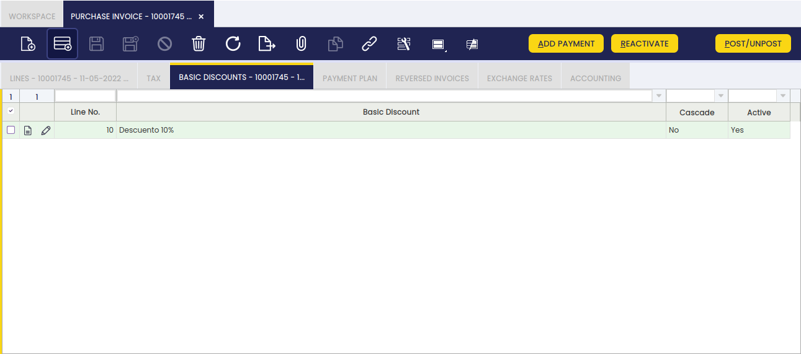
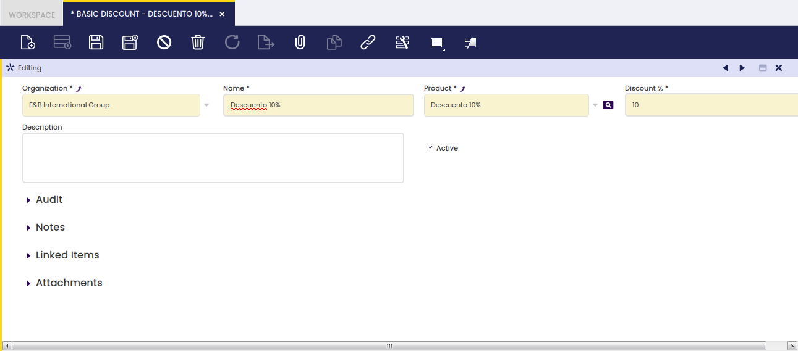

## Descuentos { #basic-discount }

:material-menu: `Aplicación` > `Gestión de Datos Maestros` > `Configuración de terceros` > `Descuentos`

Un **Descuento** es una deducción del importe total de un pedido o de una factura.

### Visión general { #overview }

Los descuentos de este tipo implican una suma de los importes totales de descuento del pedido/factura, excluyendo los impuestos para cada tipo impositivo.

La solapa **Descuento** se puede encontrar en las ventanas de Pedido/Factura de compra y venta y permite al usuario añadir descuentos manualmente o revisar los aplicados automáticamente por Etendo en base a la configuración de la solapa Descuento del tercero.

Descuento

- Cuando un pedido o una factura está en estado _Borrador_, los importes totales son los importes totales incluyendo impuestos, pero excluyendo descuentos.
- Una vez que el pedido/factura está _Procesado_, Etendo calcula el valor monetario de los descuentos correspondientes y los muestra como nuevas líneas del pedido/factura.
  - Las líneas de descuento no tienen producto ni cuenta, sino el producto de descuento (ver más abajo).
  - Además, Etendo crea tantas nuevas líneas de factura como descuentos incluidos en la factura, así como tipos impositivos (%).
  - Las líneas de descuento tienen una cantidad pedida igual a "1" y un **Precio unitario** igual al importe de descuento calculado con signo opuesto al importe de la factura (normalmente negativo) para reducirlo.
- Por último, los descuentos pueden calcularse en cascada.
  - El cálculo en cascada implica que el primer descuento se aplica sobre el importe neto total y el segundo descuento se aplica sobre el importe neto total ya disminuido por el importe del primer descuento, y así sucesivamente. Se configura en la solapa Descuento del tercero.

**Ejemplo 1. Factura de compra que contiene un único tipo impositivo:**

- Imaginemos una factura de compra que contiene dos líneas de factura con un importe neto de línea de _1,000.00_ cada una.
- Se aplica un tipo impositivo del _18%_ a ambas líneas del pedido de compra.
- Hay un **Descuento** del _10%_ asignado al proveedor, por lo tanto ese descuento se muestra en la solapa **Descuento**.
- Una vez contabilizada la factura de compra anterior:
  - Etendo muestra solo una nueva línea con la siguiente información:
    - **Producto** denominado _Discount 10%_, que es el creado y vinculado al descuento.
    - **Cant.facturada** igual a _1_.
    - **Precio unitario** igual al importe de descuento aplicable, que en nuestro ejemplo es _\-200_ (10% del importe neto total _2,000.00_).

**Ejemplo 2. Factura de compra que contiene dos tipos impositivos diferentes:**

- Imaginemos una factura de compra que contiene dos líneas de factura con un importe neto de línea de _1,000.00_ cada una.
- Se aplica un tipo impositivo del _18%_ a la primera línea de la factura de compra, y un tipo impositivo del _8%_ a la segunda.
- Hay un **Descuento** del _5%_ asignado al proveedor, por lo tanto ese descuento se muestra en la solapa **Descuento**.
- Una vez contabilizada la factura de compra anterior:
  - Etendo muestra dos nuevas líneas, cada una de ellas con la siguiente información:
    - **Producto** denominado _Discount 5%_, que es el creado y vinculado al "Descuento".
    - **Cant.facturada** igual a _1_.
    - **Precio unitario** es igual al importe de descuento aplicable, que en nuestro ejemplo es _\-50_ (_5%_ del importe neto total para un tipo impositivo determinado _1,000.00_).

### Descuentos { #basic-discount_1 }

Se puede crear y configurar un descuento total introduciendo un nombre de descuento, un producto de descuento y un % de descuento.

Campos a tener en cuenta:

- **Producto** creado previamente, al que puede asignar el mismo nombre que el nombre del descuento. Ese producto es el que se debe informar en las nuevas líneas de pedido/factura para gestionar este tipo de descuentos (ver más arriba).
