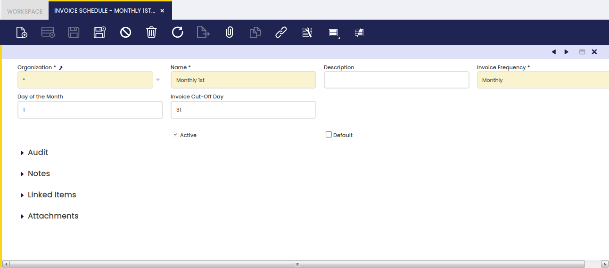

## Calendario de facturación { #invoice-schedule }

:material-menu: `Aplicación` > `Gestión de Datos Maestros` > `Configuración de terceros` > `Calendario de facturación`

### Visión general { #overview }

La ventana Calendario de facturación permite al usuario definir y configurar con qué frecuencia y hasta qué fecha una organización puede emitir facturas para enviarlas a los clientes.

### Calendario de facturación { #invoice-schedule_1 }

Una organización puede acordar y, por lo tanto, definir calendarios específicos para la emisión de facturas, calendarios que luego deberán vincularse a los clientes correspondientes.

Tal y como se muestra en la pantalla anterior, un calendario de facturación puede crearse fácilmente introduciendo los siguientes datos:

- un **Nombre** para el calendario de facturación
- una **Descripción** si es necesario
- la **Periodicidad** que define con qué frecuencia se van a emitir las facturas de venta. Los valores permitidos son:
  - **Diaria** - un calendario de facturación diario no requiere ninguna configuración adicional, ya que implica una generación diaria de facturas de venta.
  - **Mensual** o **Dos veces al mes** - un calendario de facturación mensual o dos veces al mes requiere introducir datos adicionales como:
    - **Día del mes** - este es el día en el que se genera la factura, por ejemplo: 1 de febrero.
    - **Día límite de facturación** - este es el último día para incluir los pedidos a facturar, por ejemplo: 31 de enero.
  - **Semanal** - un calendario de facturación semanal requiere introducir datos adicionales como:
    - **Día semanal de facturación** - cuándo se va a generar la factura, por ejemplo: sábado.
    - **Día límite semanal de facturación** - este es el último día de la semana para incluir los pedidos a facturar, por ejemplo: viernes.

El proceso "**Facturar**" tiene en cuenta ambos:

- la "**Facturación**",  
  para obtener más información sobre "Facturación", visite "Gestión de Datos Maestros // Tercero // solapa Cliente".
- así como el **"Calendario de facturación"**

acordado y, por lo tanto, asignado a cada cliente.

Para obtener más información sobre este proceso, visite "Gestión de Ventas // Transacciones".
