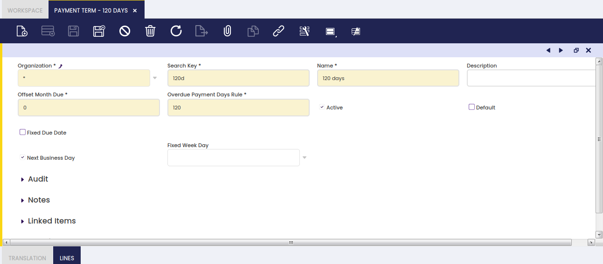
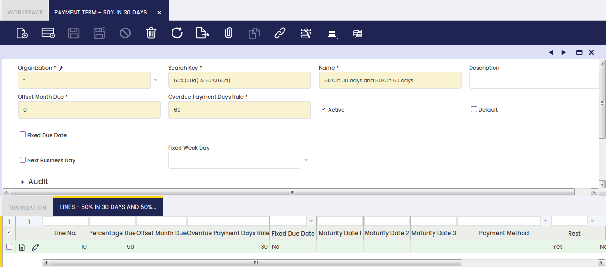

## Condiciones de pago { #payment-term }

:material-menu: `Aplicación` > `Gestión de Datos Maestros` > `Configuración de terceros` > `Condiciones de pago`

### Visión general { #overview }

Una condición de pago especifica el periodo permitido para pagar un importe adeudado.

Un proveedor o un cliente puede exigir un periodo de pago aplazado de 30 días o incluso puede exigir pagar parcialmente sus deudas o cobrar en dos o más periodos aplazados.

Por lo tanto, las "Condiciones de pago" generarán una lista de pago/s programado/s contra una factura; cada pago/s tendrá una fecha de vencimiento y un importe vencido o esperado a pagar.

En otras palabras, cada línea y/o cabecera de la condición de pago es un pago programado diferente contra una factura.

El funcionamiento es el siguiente:

1.  Las condiciones de pago deben crearse y configurarse correctamente en primer lugar, tal y como se describe en esta sección.
2.  A continuación, las condiciones de pago deben vincularse a cada tercero, tal y como se describe en la sección "Gestión de Datos Maestros // Tercero".
3.  Por último, cada vez que se contabilice una factura para ese tercero, se aplicará por defecto la configuración de condiciones de pago y, por tanto, se utilizará para la creación del correspondiente "Plan de pagos de entrada/salida" de la factura.  
    Un plan de pagos de entrada/salida lista tantos pagos programados contra una factura como fechas de vencimiento configuradas en la condición de pago asociada a esa factura.

### Cabecera { #header }

La ventana Condiciones de pago permite al usuario crear y configurar las condiciones de pago que se vincularán a los terceros.

Tal y como se muestra en la pantalla anterior, una condición de pago que solo tiene un periodo aplazado, como "100% en 120 días", puede crearse introduciendo los siguientes datos en la ventana de cabecera de la condición de pago:

- un **"Meses de plazo"** que es la duración del periodo de pago acordado en meses, por ejemplo "4" como cuatro meses.
- o una **"Días de plazo"** que también es la duración del periodo de pago acordado, pero en días, por ejemplo "120" como ciento veinte días.
- El indicador **F.fija pago** le permite introducir una fecha de vencimiento fija, como el día 20 de cada mes, por ejemplo.
- El indicador **En día laboral** le permite establecer como fecha de pago no exactamente la fecha de vencimiento correspondiente, sino el siguiente día laborable; esto ayuda a evitar el cálculo de vencimientos durante el fin de semana.
- **Regla de días de pago vencido** le permite introducir un día de pago fijo.

Es importante remarcar que, en el caso de definir una condición de pago dividida en más de un periodo aplazado, como "50% en 30 días y 50% en 60 días", el segundo (o el último, en caso de más de 2 periodos aplazados) debe configurarse en la cabecera y no en las líneas, tal y como se muestra en la imagen siguiente:

### Traducción { #translation }

Las Condiciones de pago pueden traducirse al idioma requerido.

La forma de hacerlo es tan sencilla como:

- seleccionar primero el idioma requerido
- y después introducir el nombre de la condición de pago traducido a ese idioma.

### Líneas { #lines }

Es posible dividir las condiciones de pago en más de una línea de condición de pago.

La información que puede introducir para cada línea de condición de pago es:

- **Porcentaje** - o el porcentaje del importe vencido a pagar cada vez o para cada línea de condición de pago.
  - Etendo muestra primero un "100.00 %". Ese valor siempre puede modificarse según sea necesario para las líneas.
  - Etendo suma el porcentaje introducido para cada línea de condición de pago
  - por lo tanto, el % restante hasta "100.00%" es el que se aplicará a la última condición de pago configurada en la cabecera.
- **Meses de plazo** - o la duración del periodo aplazado en meses
- **Días de plazo** - o la duración del periodo aplazado en días
- **F.fija pago** - permite introducir una fecha de vencimiento fija, como el día 20 de cada mes.
- **Método de pago** - puede hacer que una línea de condición de pago utilice un método de pago específico, que sobrescribirá el método general utilizado a nivel de factura.
- **Resto** - este indicador implica que el importe vencido calculado no es el importe total de la factura, sino el importe total de la factura disminuido por el importe vencido anterior
  - por lo tanto, el último importe vencido será únicamente el importe restante.
- **Excluir impuestos** - si una línea de condición de pago está marcada como "excluir impuestos", el pago programado correspondiente no incluirá impuestos.
  - en ese caso, el importe vencido es el \[importe total neto vencido \* porcentaje\]
  - esos impuestos se tendrán en cuenta en el último pago junto con el importe vencido restante, incluyendo impuestos.
- **Día de la semana** - puede seleccionarse un día fijo de la semana para que las fechas de vencimiento calculadas coincidan exactamente con ese día de la semana.
- **En día laboral** - permite establecer como fecha de pago no exactamente la fecha de vencimiento, sino el siguiente día laborable.
