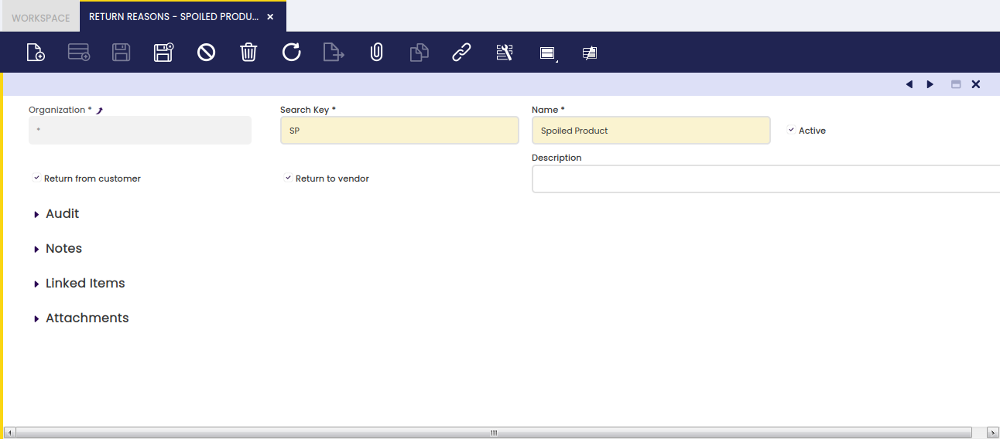

## Motivos de devolución { #return-reasons }

:material-menu: `Aplicación` > `Gestión de Datos Maestros` > `Configuración de terceros` > `Motivos de devolución`

### Visión general { #overview }

En esta ventana puede configurar diferentes motivos por los que usted devuelve mercancía o el cliente devuelve mercancía. Por este motivo, estos valores se utilizan en las ventanas Devolución a proveedor y Devolución de cliente.

### Motivos de devolución { #return-reasons_1 }

Esta ventana se encuentra en Aplicación||Gestión de Datos Maestros||Configuración de terceros||Motivos de devolución

Campos:

- **Devolución de cliente**: Cuando este indicador está marcado, el valor estará disponible en la ventana Devolución de cliente
- **Devolución a proveedor**: Cuando este indicador está marcado, el valor estará disponible en la ventana Devolución a proveedor
