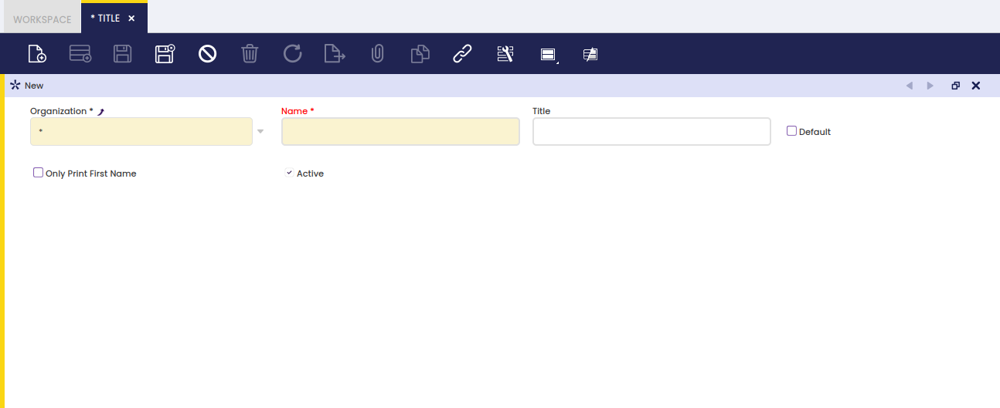

## Tratamientos { #title }

:material-menu: `Aplicación` > `Gestión de Datos Maestros` > `Configuración de terceros` > `Tratamientos`

### Visión general { #overview }

La ventana **Tratamientos** permite al usuario configurar tratamientos de terceros como Sr. o Sra. para utilizarlos al contactar con terceros.

Lo mismo aplica a cualquier tipo de **"Personas de contacto"** introducidas en Etendo.

Esta es una **"Características avanzadas"**. Debe revisarse, ya que no se observa dónde pueden asignarse los tratamientos a terceros y personas de contacto.

### Tratamientos { #title_1 }

Existen muchos tratamientos para utilizar al contactar con terceros de cualquier tipo, así como con personas de contacto.

Una vez que los tratamientos requeridos se hayan introducido y configurado correctamente, puede vincularlos a la correspondiente **"Personas de contacto"** del tercero en la ventana de Terceros.

### Traducción { #translation }

Los tratamientos de terceros pueden traducirse a cualquier idioma requerido.

La forma de hacerlo es tan sencilla como:

- seleccione primero el idioma requerido
- y luego introduzca el nombre del tratamiento traducido a ese idioma.
