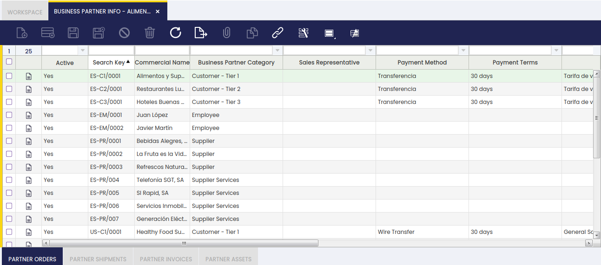
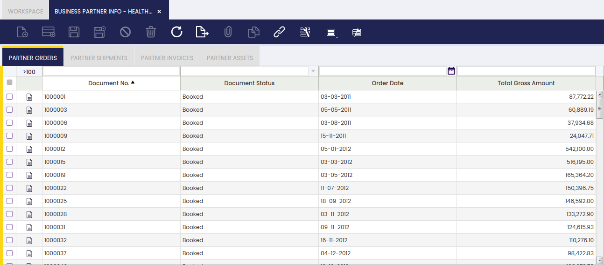
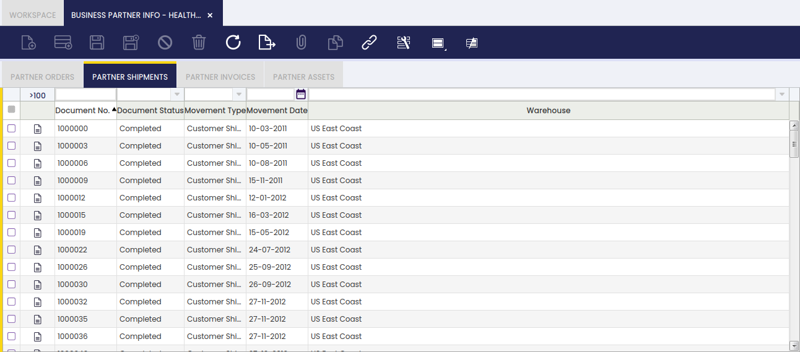
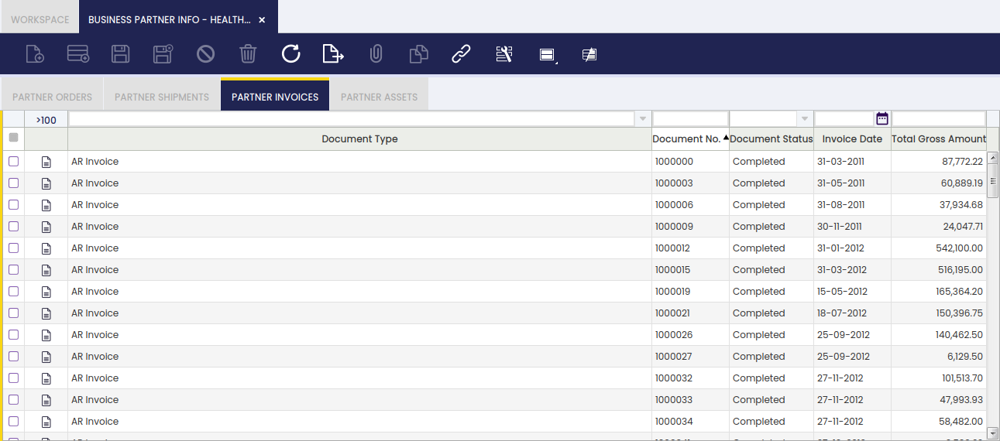
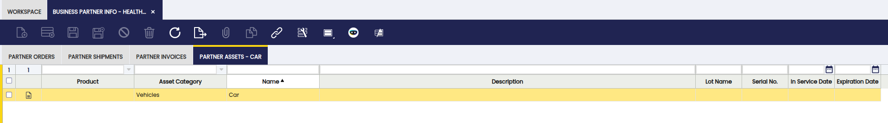

# Información de terceros { #business-partner-info }

:material-menu: `Application` > `Master Data Management` > `Business Partner Info`

## Descripción general { #overview }

La ventana Información de terceros es una vista consolidada de solo lectura de toda la actividad de transacciones registrada para un [tercero](./business-partner.md) determinado. Centraliza cuatro tipos de información en un único lugar: pedidos, albaranes y recepciones, facturas y activos. Los equipos de ventas, compras y contabilidad utilizan esta ventana para obtener un resumen rápido de la actividad de un tercero sin necesidad de navegar a cada ventana de transacción individual. No es posible introducir datos aquí; la ventana está destinada estrictamente a la consulta y revisión.

## Selección de tercero { #business-partner-selection }

Seleccione un tercero de la lista para cargar sus datos de transacciones en las solapas inferiores.

Campos a tener en cuenta:

- **Activo**: indica si el tercero está actualmente activo.
- **Identificador**: identificador corto utilizado para buscar el tercero.
- **Nombre comercial**: el nombre comercial del tercero.
- **Grupos de terceros**: clasifica al tercero, por ejemplo Cliente - Nivel 1, Proveedor o Empleado.
- **Agente comercial**: el representante de ventas asignado al tercero, si existe.
- **Método de pago**: el método de pago predeterminado para el tercero, por ejemplo Transferencia.
- **Condiciones de pago**: las condiciones de pago acordadas, por ejemplo 30 días.

Una vez seleccionado un registro, las solapas **Pedidos tercero**, **Albaranes tercero**, **Facturas tercero** y **Activos tercero** en la parte inferior de la pantalla se rellenan con los datos de transacciones correspondientes.

## Pedidos tercero { #partner-orders }

Esta solapa muestra todos los pedidos asociados al tercero seleccionado, tanto [pedidos de venta](../../sales-management/transactions.md#sales-order) como [pedidos de compra](../../procurement-management/transactions.md#purchase-order).

Campos a tener en cuenta:

- **Nº documento**: el número de documento del pedido.
- **Estado doc.**: el estado actual del pedido, por ejemplo Registrado.
- **Fecha de pedido**: la fecha en que se realizó el pedido.
- **Importe total**: el importe bruto total del pedido.

## Albaranes tercero { #partner-shipments }

Esta solapa muestra todos los [albaranes](../../sales-management/transactions.md#goods-shipment) y [recepciones](../../procurement-management/transactions.md#goods-receipts) asociados al tercero seleccionado.

Campos a tener en cuenta:

- **Nº documento**: el número de documento del albarán.
- **Estado doc.**: el estado actual, por ejemplo Completado.
- **Tipo de movimiento**: el tipo de movimiento, por ejemplo Albarán cliente.
- **Fecha del movimiento**: la fecha en que se produjo el movimiento.
- **Almacén**: el almacén desde el que se expidió el albarán.

## Facturas tercero { #partner-invoices }

Esta solapa muestra todas las facturas asociadas al tercero seleccionado, tanto [facturas de venta (AR)](../../sales-management/transactions.md#sales-invoice) como [facturas de compra (AP)](../../procurement-management/transactions.md#purchase-invoice).

Campos a tener en cuenta:

- **Tipo de documento**: el tipo de documento de factura, por ejemplo AR factura.
- **Nº documento**: el número de documento de la factura.
- **Estado doc.**: el estado actual, por ejemplo Completado.
- **Fecha factura**: la fecha en que se emitió la factura.
- **Importe total**: el importe bruto total de la factura.

## Activos tercero { #partner-assets }

Esta solapa muestra todos los [activos](../../financial-management/assets/assets.md) asociados al tercero seleccionado, como equipos o propiedades que la organización registra en relación con ese tercero.

Campos a tener en cuenta:

- **Producto**: el producto vinculado al activo.
- **Categoría de activo**: la categoría a la que pertenece el activo, por ejemplo Vehículos.
- **Nombre**: el nombre que identifica el activo, por ejemplo Coche.
- **Descripción**: información adicional sobre el activo, si existe.
- **Nombre de lote**: el número de lote asociado al activo, si corresponde.
- **Nº de serie**: el número de serie del activo, si corresponde.
- **Fecha de puesta en servicio**: la fecha en que el activo fue puesto en servicio.
- **Fecha de vencimiento**: la fecha en que el activo vence o se da de baja, si corresponde.

---

This work is a derivative of [Master Data Management](https://wiki.openbravo.com/wiki/Master_Data_Management){target="\_blank"} by [Openbravo Wiki](http://wiki.openbravo.com/wiki/Welcome_to_Openbravo){target="\_blank"}, used under [CC BY-SA 2.5 ES](https://creativecommons.org/licenses/by-sa/2.5/es/){target="\_blank"}. This work is licensed under [CC BY-SA 2.5](https://creativecommons.org/licenses/by-sa/2.5/){target="\_blank"} by [Etendo](https://etendo.software){target="\_blank"}.
