# Terceros { #business-partner }

:material-menu: `Aplicación` > `Gestión de Datos Maestros` > `Terceros`

## Descripción general { #overview }

Un Tercero es cualquier entidad con la que su empresa hace negocios: clientes que compran sus productos o servicios, proveedores y suministradores a los que compra, y empleados. Use la ventana Terceros para crear y gestionar todos los registros de terceros en un único lugar. Cada tipo dispone de una solapa dedicada — **Cliente**, **Proveedor** y **Operario** — con campos de configuración específicos para ese rol. Un único Tercero puede pertenecer a más de un tipo al mismo tiempo.

## Cabecera { #header }

La cabecera contiene la información principal del tercero — nombre, categoría, límite de crédito y otros datos que aplican independientemente de si el tercero es un cliente, proveedor o empleado.

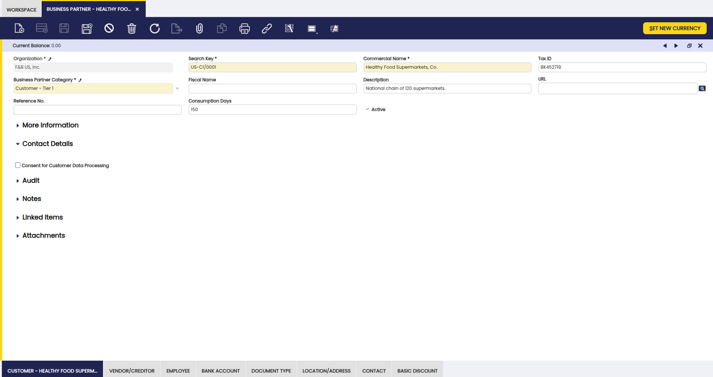

Campos a tener en cuenta:

- **[Grupos de Terceros](../business-partner-setup/business-partner-category.md)**: Campo clave. Seleccione una categoría a la que va a pertenecer el tercero, bajo los siguientes tipos:

    - Clientes
    - Proveedores
    - Operarios

- **Identificador**: un código corto o abreviatura que asigna al tercero para facilitar su búsqueda. Por ejemplo, "ACME" para Acme Corporation.
- **Nombre comercial**
- **Nombre fiscal**: si se conoce. Si se conoce, es el que se utiliza en documentos oficiales como facturas e informes fiscales; en caso contrario, se utilizará el nombre comercial.
- **Descripción**: se utiliza para describir el tercero, si es necesario.
- **URL**: la URL del tercero, si se conoce.
- **Nº de referencia**: que puede utilizarse como una forma adicional de identificar un tercero.
- **Días consumo**: define cuántos días hacia atrás desde la fecha actual buscará el proceso Copiar líneas para mostrar líneas de pedidos o facturas disponibles para copiar. Por ejemplo, introducir 150 significa que el proceso mostrará líneas de pedidos y facturas creados en los últimos 150 días.

    !!! info
        Para más información, visite [Pedido de venta](../../sales-management/transactions.md#sales-order) y [Pedido de compra](../../procurement-management/transactions.md#purchase-order).

- **Crédito límite**: cuando el total de los pagos pendientes de un cliente supera este importe, Etendo muestra una advertencia. Puede completar igualmente la factura — esto es una alerta, no un bloqueo.
- **Consentimiento para el Procesamiento de Datos del Cliente**: casilla de verificación en el modelo de datos de terceros, para reflejar si un contacto determinado consiente o no que sus datos puedan ser utilizados por la organización.

## Botones { #buttons }

### Establecer nueva moneda { #set-new-currency }

La moneda del tercero se completa automáticamente con la moneda de la **Tarifa** asignada al tercero. Una vez completada, puede cambiarse, si es necesario, utilizando el botón **Establecer nueva moneda**.

!!! note
    Normalmente, la moneda del tercero es la misma que la moneda de la tarifa asignada. Sin embargo, puede ocurrir que un tercero que tenga asignada, por ejemplo, una tarifa en EUR, tenga USD como moneda por defecto. En ese caso, todas las transacciones contabilizadas en EUR para ese tercero se convertirán a USD; por lo tanto, el saldo del tercero se calcula en USD.

El proceso **Establecer nueva moneda** permite definir:

- una nueva moneda para el tercero
- así como el tipo de cambio de moneda que se utilizará para convertir el saldo del cliente a la nueva moneda.

    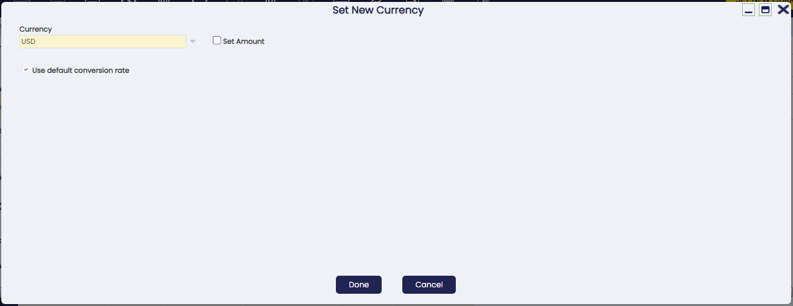

Campos a tener en cuenta:

- **Moneda**: aquí puede introducirse la nueva moneda del tercero, por ejemplo *EUR*. Al principio, la moneda mostrada en la ventana **Establecer nueva moneda** es la moneda de la tarifa del tercero; en nuestro ejemplo, *USD*.

- **Establecer importe**: casilla de verificación. Si se selecciona, Etendo actualizará el saldo del tercero con el importe introducido en el campo **Importe en moneda extranjera**, para que sea coherente con la nueva moneda.

- **Importe en moneda extranjera**: solo se muestra si se selecciona la casilla **Establecer importe**. Utilice este campo para introducir manualmente el importe equivalente en la nueva moneda que sustituirá o actualizará el saldo del tercero.

- **Usar tipo de cambio por defecto**: casilla de verificación. Utiliza el tipo de cambio definido en la ventana [Rangos de conversión](../../general-setup/application/conversion-rates.md) para recalcular el saldo del tercero de USD a EUR, en nuestro caso. Si esta casilla no está seleccionada, se muestra un nuevo campo *Índice* para permitir introducir un tipo de cambio específico.

El crédito disponible es el dinero que el tercero ya ha pagado o ha pagado en exceso y que aún no se ha aplicado a una factura; puede utilizarse para compensar cargos futuros.

Adicionalmente, un tercero puede tener **crédito disponible en una moneda determinada**. Si ese es el caso, Etendo informa al usuario porque el crédito disponible del tercero deberá convertirse a la nueva moneda; por lo tanto, podrá consumirse en la nueva moneda.

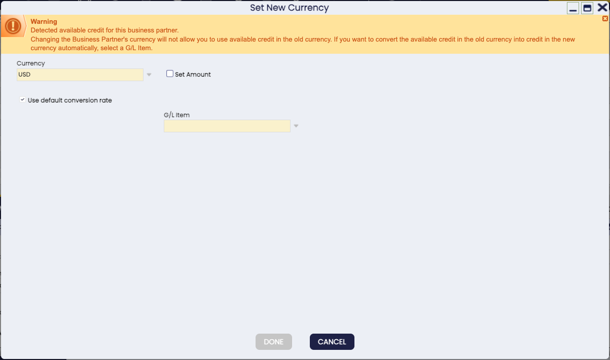

Para mantener sus registros coherentes, Etendo realiza automáticamente tres ajustes internos en segundo plano cuando existe crédito disponible — no es necesario que haga nada:

- uno que elimina el crédito disponible en la moneda antigua.
- uno que registra el crédito equivalente en la nueva moneda.
- uno que pone a cero el saldo en la moneda original.

Su equipo de contabilidad verá estos asientos publicados automáticamente — no es necesario crearlos manualmente.

!!! Example
  
    Tomemos como **ejemplo** un tercero que tiene una tarifa en EUR

    - Moneda de la tarifa: EUR
    - Saldo actual: 306.00 EUR
    - Crédito disponible: 100.00 EUR

    Como el crédito reduce el saldo, el saldo neto es 206.00 EUR (306.00 – 100.00).

    **Ejecutar Establecer nueva moneda**

    La empresa decide que este tercero debe operar ahora en USD, por lo que el usuario ejecuta el proceso **Establecer nueva moneda** y selecciona USD como nueva moneda.

    Etendo detecta que el tercero todavía tiene crédito disponible en EUR.
    Ese crédito debe convertirse a la nueva moneda, por lo que el sistema aplica el tipo de cambio 1 EUR = 1.19 USD.

    **Lo que Etendo hace automáticamente**

    Una vez finaliza el proceso:

    - La moneda del tercero cambia de EUR a USD.
    - El saldo actual pasa a ser 245.14 USD, calculado como 206.00 EUR × 1.19 = 245.14 USD
    - Etendo también crea tres pagos automáticos para mover correctamente el crédito disponible de EUR a USD, manteniendo la coherencia contable.

    **Transacciones futuras**

    Ahora que la moneda del tercero es USD, veamos qué ocurre con las nuevas facturas:

    - Usted crea una nueva factura de venta en EUR (porque la tarifa sigue estando en EUR).

        - Total de la factura: 41.50 EUR
        - Etendo la convierte a USD: 41.50 × 1.19 = 49.38 USD

    - El nuevo saldo del tercero pasa a ser: 245.14 + 49.38 = 294.52 USD

    - Más adelante, usted crea otra factura de venta en USD por 100.00 USD. Al completarla, Etendo muestra que el tercero tiene crédito disponible en USD, convertido desde el crédito anterior en EUR: 100 EUR × 1.19 = 119.00 USD

    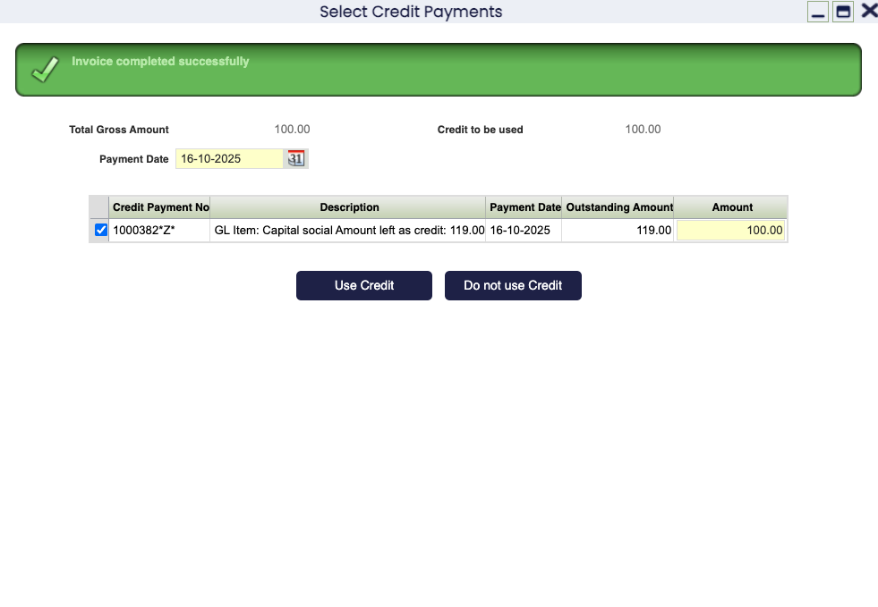

    En resumen, el proceso **Establecer nueva moneda** actualiza la moneda del tercero y convierte saldos y créditos a la nueva moneda utilizando el tipo elegido; los saldos existentes y el crédito disponible se recalculan para que todo coincida con la nueva moneda y las transacciones futuras, incluso si se crean en la moneda anterior (EUR), seguirán convirtiéndose correctamente y reflejándose en la nueva moneda del tercero (USD).

## Solapas y subsolapas { #tabs-and-subtabs }

Clientes, proveedores y empleados requieren información diferente. La ventana Terceros proporciona una solapa separada para cada tipo para que pueda configurar únicamente los campos que aplican:

- **Cliente**
    - Contabilidad cliente
- **Proveedor**
    - Contabilidad proveedor
- **Operario**
    - Contabilidad empleado

Las solapas y subsolapas mencionadas anteriormente se describen en los siguientes capítulos de esta sección.

!!! Important
    
    Podría haber otros tipos de terceros que requieran ser dados de alta como terceros en esta ventana; terceros que no tienen nada que ver ni con un cliente, ni con un proveedor/acreedor ni con un operario.

    Ese es el caso de los bancos. Los bancos deben crearse en la cabecera de la ventana de terceros introduciendo únicamente la información básica de cabecera y sin datos en ninguna de las solapas de la ventana de terceros, salvo Direcciones y Personas de contacto. La razón de esto es que los terceros de tipo *Banco* son necesarios en el flujo financiero de [Remesas](../../financial-management/receivables-and-payables/transactions/remittance.md).

    Para más información sobre este flujo, visite [Cuenta financiera](../../financial-management/receivables-and-payables/transactions/financial-account.md).

### Cliente { #customer }

!!! note
    Los datos relacionados con el cliente se pueden introducir y configurar una vez que se habilita la casilla **Cliente**.

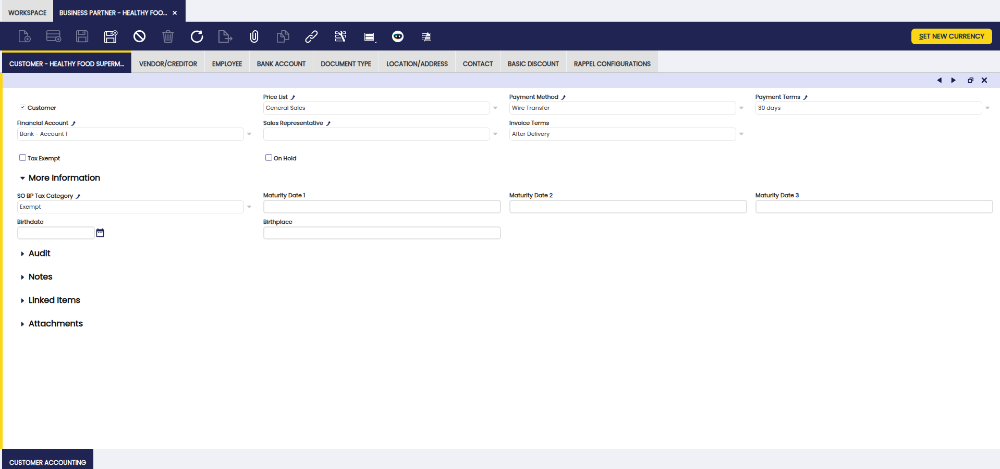

Como se muestra arriba, existe una lista de datos relevantes que deben introducirse para los clientes junto con la información del saldo actual del cliente. Puede seleccionar cualquier dato, como por ejemplo la **Tarifa**, desde una lista de valores creada previamente o, si es necesario, crearlo navegando a la ventana correspondiente y, a continuación, seleccionarlo.

Campos a tener en cuenta:

- **Tarifa**: la seleccionada será la que se aplique al crear documentos de venta como pedidos de venta o facturas (Cliente) para ese cliente.

    !!! info
        Para más información, visite [Tarifa](../pricing/price-list.md).

    Las tarifas se definen en una moneda determinada, que puede ser la misma que la moneda del cliente o no.
    En caso de que no lo sea, el saldo del cliente se calculará teniendo en cuenta el tipo de conversión definido en la ventana [Rangos de conversión](../../general-setup/application/conversion-rates.md) o el introducido en el proceso **Establecer nueva moneda**, que se puede ejecutar para cambiar la moneda de un tercero.

- **Método de pago**: el seleccionado será el que se aplique al crear y gestionar los cobros recibidos de ese cliente.
    Si una **Cuenta financiera** está vinculada al cliente, el método de pago a seleccionar aquí será uno de los métodos de pago vinculados a la cuenta financiera.

    !!! info
        Para más información, visite [Método de pago](../../financial-management/receivables-and-payables/setup/payment-method.md).

- **Condiciones de pago**: la seleccionada será la que se utilice al gestionar el plan de pagos de las facturas (Cliente).

    !!! info
        Para más información, visite [Condiciones de pago](../business-partner-setup/payment-term.md).

- **Cuenta financiera**: la seleccionada será la que se utilice al cobrar y conciliar los pagos realizados por ese cliente.

    !!! info
        Para más información, visite [Cuenta financiera](../../financial-management/receivables-and-payables/transactions/financial-account.md).

- **Facturación**: controla cuándo se genera una factura de venta para este cliente. Seleccione una de las siguientes opciones:

    !!! info
        Para más información, visite [Facturar](../../sales-management/transactions.md#generate-invoices).

    - **Pedido completamente entregado**: la factura podría generarse automáticamente una vez que se hayan enviado todos los bienes del pedido de venta.
    - **Después de entregado**: los bienes del pedido de venta se facturarán automáticamente a medida que se envíen, incluso si hay envíos parciales.
    - **No facturar**: no se generará ninguna factura automáticamente.
    - **Inmediato**: la factura se generará en la siguiente ejecución del proceso **Facturar**.
    - **Periódico después de entregado**: la factura se generará de acuerdo con el calendario acordado con el cliente y una vez que se hayan enviado los bienes pedidos. Si esta es la opción seleccionada, se muestra automáticamente un nuevo campo denominado *Calendario de facturación* para que seleccione el *Calendario de facturación* o calendario correspondiente.

        !!! info
            Para más información, visite [Calendario de facturación](../business-partner-setup/invoice-schedule.md).

- **Crédito límite**: si la suma de todos los pagos pendientes supera el límite de crédito especificado para un cliente, el sistema le avisará indicando que este cliente ha alcanzado el límite de crédito cada vez que se seleccione este tercero en un documento de venta (pedido, albarán o factura).

- **Exento de impuestos**: marque esta opción si el cliente está legalmente exento de impuestos. Cuando está habilitado, Etendo solo aplicará las tasas de impuestos marcadas explícitamente como exentas, por lo que no se añadirá ningún impuesto estándar a sus facturas.

- **Agente comercial**: seleccione un agente comercial del cliente. Un agente comercial es un empleado configurado como tal.

- **Bloqueo de proveedor**: esta casilla permite bloquear un cliente, por lo que algunos documentos específicos no se pueden completar para él. Si está marcada, se muestra la sección de bloqueo con la siguiente configuración, que obviamente se puede cambiar según sea necesario:
    - **Pedido de venta:** Bloqueado
    - **Albarán (Cliente):** Bloqueado
    - **Factura (Cliente):** Bloqueado
    - **[Cobros](../../financial-management/receivables-and-payables/transactions/payment-in.md):** No bloqueado

    La configuración predeterminada anterior significa que no es posible completar un pedido de venta, un albarán (Cliente) o una factura (Cliente) para el cliente; solo es posible recibir un cobro.

#### Más información { #more-information }

- **Categoría Fiscal del Tercero en Pedido de Venta (SO BP Tax Category)**: este campo se puede encontrar en la sección *Más información*.
    Use este campo para restringir los tipos impositivos disponibles en los documentos de venta de este cliente a únicamente los pertenecientes a la categoría de impuestos seleccionada.

    !!! info
        Para más información, visite [Categoría de Impuestos de Terceros](../../financial-management/accounting/setup/business-partner-tax-category.md).

- **Día de vencimiento**: indica el día del mes, el primer vencimiento, en el que vencen las facturas.

- **2ndo día de vencimiento**: indica el día del mes, el segundo vencimiento, en el que vencen las facturas.

- **3er día de vencimiento**: indica el día del mes, el tercer vencimiento, en el que vencen las facturas.

- **Cumpleaños**: datos sobre el cliente.

- **Lugar de Nacimiento**: datos sobre el cliente.

#### Contabilidad cliente { #customer-accounting }

Use la solapa Contabilidad cliente para configurar las cuentas contables que se utilizarán al contabilizar transacciones relacionadas con el cliente, como los cobros de clientes y los anticipos de clientes, en el libro mayor.

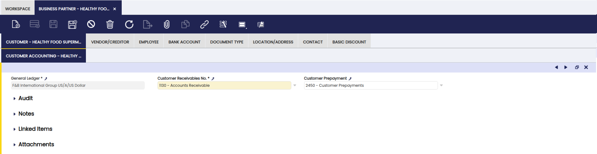

Como se muestra arriba, puede configurar, para cada cliente y libro mayor, las cuentas que se utilizarán en:

- las transacciones de **Cuentas a cobrar de clientes**, como la contabilización de facturas (Cliente).

    !!! info
        Para más información, visite [Factura (Cliente)](../../sales-management/transactions.md#sales-invoice).

- las transacciones de **Prepago del cliente**, como aquellos casos en los que la empresa que envía los bienes requiere que el cliente adelante una parte o la totalidad del importe de la deuda.

Inicialmente, estas cuentas se heredan de las cuentas predeterminadas del libro mayor de la organización para el que se está creando el tercero. Siempre pueden cambiarse.

!!! important
    Si su equipo de contabilidad necesita generar automáticamente una cuenta de libro mayor dedicada para cada nuevo tercero, esto puede configurarse en la ventana [Organización](../../general-setup/enterprise-model/organization.md). Se trata de una configuración avanzada — contacte con su administrador del sistema si no está seguro de si aplica.

### Proveedor/Acreedor { #vendorcreditor }

!!! note
    Los datos relacionados con el proveedor o acreedor se pueden introducir y configurar una vez que se habilita la casilla **Proveedor**.

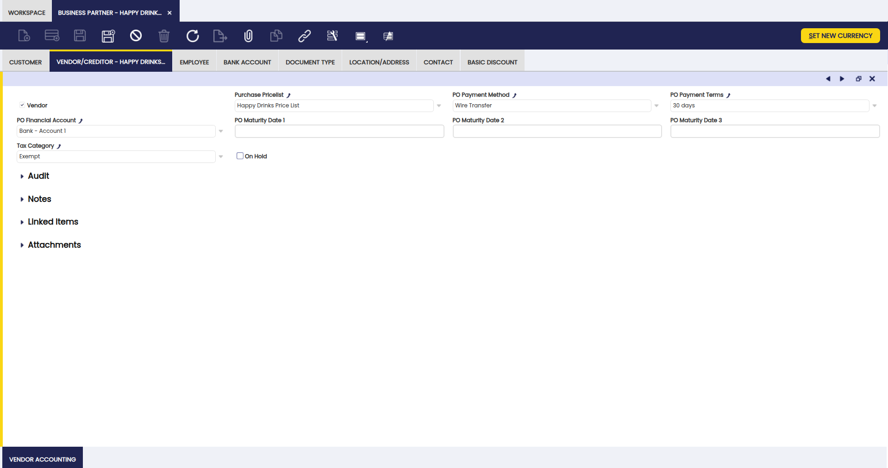

Como se muestra en la imagen anterior, existe una lista de datos relevantes que deben introducirse para proveedores o acreedores, también conocidos como proveedores:

- **Tarifa de compra**: la seleccionada será la que se aplique al crear documentos de compra como pedidos de compra o facturas para ese proveedor.
    Si un Tercero ya ha generado Crédito, no será posible seleccionar una Tarifa en una Moneda diferente de la del Crédito generado. En ese caso, es posible convertir el Crédito a una Moneda diferente.

    !!! info
        Para más información, visite [Tarifa](../pricing/price-list.md).

- **Método de pago**: el seleccionado será el que se aplique al crear y gestionar los pagos realizados a ese proveedor.
    Si una cuenta financiera está vinculada al proveedor, el método de pago a seleccionar será un método de pago vinculado a esa cuenta financiera.

    !!! info
        Para más información, visite [Método de pago](../../financial-management/receivables-and-payables/setup/payment-method.md).

- **Condiciones de pago**: la seleccionada será la que se utilice al gestionar los planes de pago de facturas de proveedor.

    !!! info
        Para más información, visite [Condiciones de pago](../business-partner-setup/payment-term.md).

- **Fecha de Vencimiento de OC 1 (PO Maturity Date 1)**: ajusta la fecha de vencimiento del pago para que caiga en un día específico del mes. Para que esto funcione, las condiciones de pago asignadas al proveedor deben tener activada la opción Fecha de vencimiento fija y desactivada la opción Día laborable siguiente — configuraciones que su equipo de contabilidad establece en la ventana [Condiciones de pago](../business-partner-setup/payment-term.md). La fecha de vencimiento final se calcula a partir de las condiciones de pago y luego se desplaza al día de vencimiento.

    !!! example
        Por ejemplo, la condición de pago definida es de 30 días y el Día de vencimiento se establece en 10. Si la fecha de la factura es el día 1 del mes, en base a la condición de pago de 30 días, la fecha de vencimiento del pago es el día 1 del mes siguiente, pero como el Día de vencimiento está establecido en 10, la fecha de vencimiento del pago resultante es el día 10 del mes siguiente.

- **2ndo día de vencimiento**: se puede establecer un segundo Día de vencimiento de la OC para combinarlo con las condiciones de pago y el primer Día de vencimiento de la OC.

    !!! example
        Por ejemplo, la condición de pago es de 30 días, el valor del Día de vencimiento es 10 y el Día de vencimiento 2 es 20. El ejemplo indicado en Día de vencimiento permanecerá igual. Sin embargo, si la fecha de la factura es el día 11 del mes, la fecha de vencimiento del pago será el día 20 del mes siguiente: se tienen en cuenta los 30 días de las condiciones de pago y, dado que ya se ha superado el día 10 del mes, se tiene en cuenta el segundo vencimiento del día 20.

- **3er día de vencimiento**: se puede establecer un tercer Día de vencimiento de la OC para combinarlo con las condiciones de pago y el primer y segundo Día de vencimiento de la OC.

- **Cuenta financiera**: la seleccionada será la que se utilice al retirar y conciliar los pagos realizados a un proveedor.

    !!! info
        Para más información, visite [Cuenta financiera](../../financial-management/receivables-and-payables/transactions/financial-account.md).

- **Categoría de Impuesto**: use este campo para restringir los tipos impositivos disponibles en los documentos de compra de este proveedor a únicamente los pertenecientes a la categoría de impuestos seleccionada.

    !!! info
        Para más información, visite [Categoría de Impuesto](../../financial-management/accounting/setup/tax-category.md).

- **Bloqueo de proveedor**: esta casilla permite bloquear un proveedor, por lo que algunos documentos específicos no podrán completarse para él. Si está marcada, se muestra la sección Bloqueo de proveedor con la siguiente configuración, que puede modificarse según sea necesario:

    - **Pedido de compra:** Bloqueado
    - **Albarán (Proveedor):** No bloqueado
    - **Factura (Proveedor):** Bloqueado
    - **Pago:** Bloqueado

    La configuración predeterminada anterior significa que no es posible completar ni un pedido de compra, ni una factura de proveedor, ni realizar un pago, pero sí recibir mercancía enviada por el proveedor.

    Como ya se ha mencionado, si un tercero de cualquier tipo está bloqueado, no es posible Completar (o contabilizar) algunos tipos de documento. Sin embargo, siempre es posible Anularlos. Etendo muestra un mensaje de error indicando que no es posible completar un documento para un tercero establecido como **bloqueado**.

#### Contabilidad proveedor { #vendor-accounting }

Use la solapa Contabilidad proveedor para configurar las cuentas contables que se utilizarán al contabilizar transacciones relacionadas con el proveedor, como pasivos del proveedor y pagos por adelantado del proveedor, en el libro mayor.

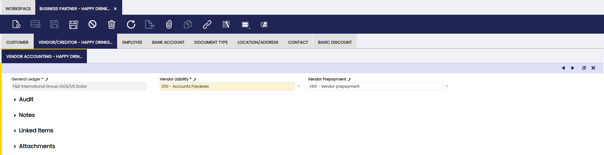

Configure para cada proveedor o acreedor y para cada libro mayor que utilice su organización las cuentas contables que se utilizarán en:

- las transacciones de **Pasivo del proveedor**, como la contabilización de facturas de compra.

    !!! info
        Para más información, visite [Factura (Proveedor)](../../procurement-management/transactions.md#purchase-invoice).

- las transacciones de **Pagos por adelantado del proveedor**, como aquellos casos en los que el proveedor de los bienes requiere que la empresa pague por adelantado una parte o la totalidad del importe de la deuda.

    !!! info
        Para más información, visite [Pagos por adelantado del proveedor](../../financial-management/receivables-and-payables/transactions/payment-out.md).

Inicialmente, estas cuentas se heredan de las cuentas predeterminadas del libro mayor asignado a la Organización para la que se está creando el tercero. Siempre pueden cambiarse.

!!! important
    Si su equipo de contabilidad necesita generar automáticamente una cuenta de libro mayor dedicada para cada nuevo tercero, esto puede configurarse en la ventana [Organización](../../general-setup/enterprise-model/organization.md). Se trata de una configuración avanzada — contacte con su administrador del sistema si no está seguro de si aplica.

### Operario { #employee }

!!! note
    Un tercero puede configurarse como operario una vez que se habilita la casilla de verificación **Operarios**.

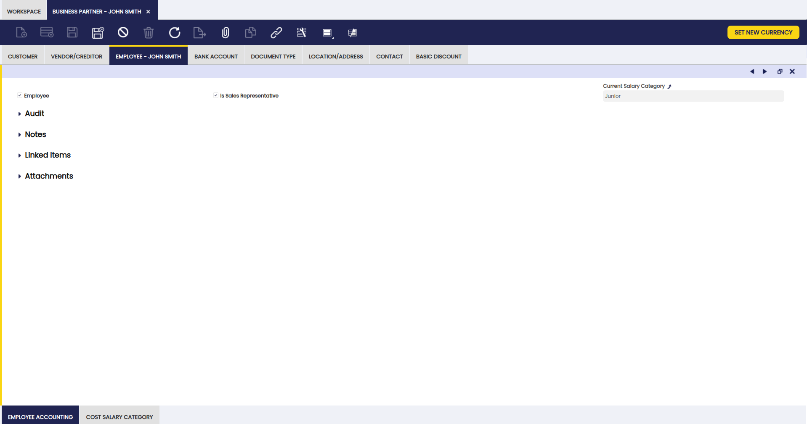

Use la solapa Operario para establecer cuáles de sus terceros son *Operarios*.

Un operario puede:

- ser designado como **agente comercial** de un cliente.

- definirse como el **responsable de uno o varios proyectos de la empresa**.

    !!! info
        Para más información, visite [Gestión de Proyectos y Servicios](../../project-and-service-management/getting-started.md).

- asignarse a un **proceso de producción** como un recurso.

    !!! info
        Para más información, visite [Gestión de Producción](../../production-management/getting-started.md).

- y puede **emitir informes de gasto** como parte de su participación en un proyecto de la empresa.

    !!! info
        Para más información, visite [Informe de gasto](../../project-and-service-management/transactions.md#expense-sheet).

#### Contabilidad empleado { #employee-accounting }

En esta solapa, añada las cuentas contables que se utilizarán al contabilizar transacciones relacionadas con operarios, como la contabilización de nóminas.

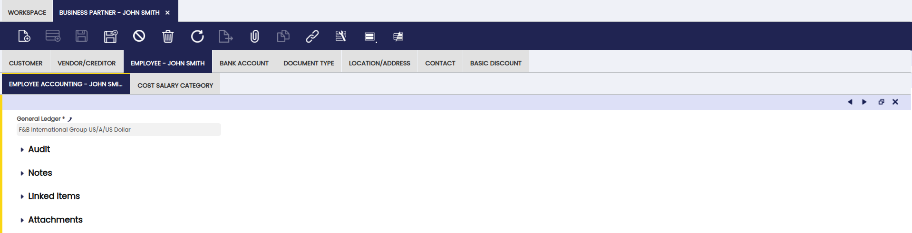

No se requieren cuentas contables para la contabilidad de empleados porque actualmente no existe ninguna transacción contabilizable para empleados en Etendo. Si se instala un módulo de Recursos Humanos, las cuentas para cualquier transacción de empleados que pueda contabilizarse se configuran aquí.

#### Categoría salarial { #cost-salary-category }

En esta solapa, configure la categoría salarial del operario seleccionando una de las opciones que se definieron previamente en la ventana [Categoría Salarial](../business-partner-setup/salary-category.md).

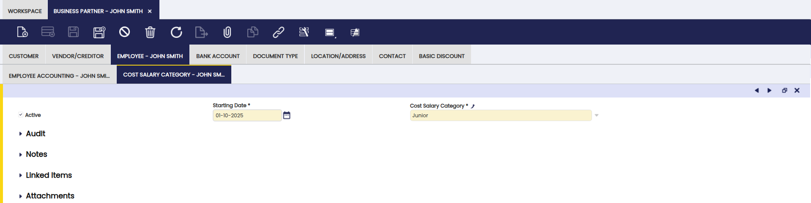

### Cuenta bancaria { #bank-account }

Use la solapa Cuenta bancaria para listar y configurar las cuentas bancarias de terceros.

Es posible configurar y establecer correctamente las cuentas bancarias de terceros para que se utilicen al realizar o recibir pagos de terceros de cualquier tipo.

!!! important
    Asegúrese de que cada cuenta bancaria esté completamente cumplimentada. Etendo utiliza esta información al procesar los pagos hacia y desde este tercero.

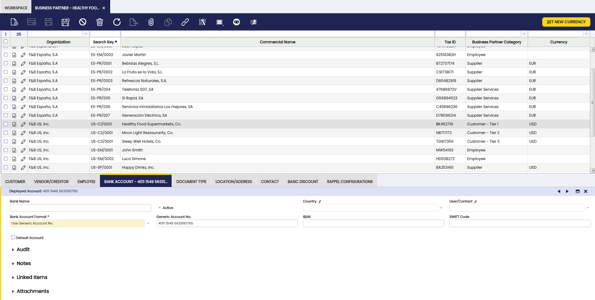

Campos a tener en cuenta:

- **Nombre**
- Indicador **Activo**: se recomienda mantener solo una cuenta bancaria como **Activo** para evitar errores; de lo contrario, asegúrese de que se utilice la cuenta bancaria correcta.
- **País**: seleccione un país de la lista para especificar si la cuenta bancaria es una cuenta bancaria nacional o una cuenta bancaria extranjera.
- **Usuario/Contacto**: en caso de que quiera asociar un contacto a esta cuenta bancaria.
- **Formato cuenta bancaria**: lista que contiene todos los valores posibles para generar la **Cuenta mostrada**, que posteriormente será utilizada por otros informes o procesos para obtener el identificador de la cuenta. Los valores posibles son:
    - **Usar nº de cuenta genérico.**
    - **Mostrar IBAN**
    - **Usar SWIFT + nº de cuenta genérico.**

    !!! note
        Otros módulos que amplían el **Formato cuenta bancaria** soportado pueden añadir otras opciones.

- **Nº de cuenta**: aquí se puede introducir un número de cuenta genérico para identificar la cuenta bancaria. Requerido si se selecciona **Usar nº de cuenta genérico.** o **Usar SWIFT + nº de cuenta genérico.** en el campo **Formato cuenta bancaria**.

- **IBAN**: el número de cuenta internacional utilizado en la mayoría de los países. Introduzca el IBAN completo exactamente como aparece en su extracto bancario. Requerido si seleccionó **Mostrar IBAN** en el campo **Formato cuenta bancaria**. Etendo valida el número automáticamente al guardar.
- **Código Swift**: el código identificador bancario utilizado para pagos internacionales (a veces denominado BIC en los extractos bancarios). Requerido si seleccionó **Usar SWIFT + nº de cuenta genérico.** en el campo **Formato cuenta bancaria**.
- **Cuenta mostrada**: se genera automáticamente en función del valor seleccionado en **Formato cuenta bancaria**. Este campo es de solo lectura y lo utilizan otros informes o procesos.

#### Gestión avanzada de cuentas bancarias { #advanced-bank-account-management-bank-account }

!!! info
    Para poder incluir esta funcionalidad, debe instalarse el módulo Advanced Bank Account Management del Financial Extensions Bundle. Para ello, siga las instrucciones del marketplace: [Financial Extensions Bundle](https://marketplace.etendo.cloud/#/product-details?module=9876ABEF90CC4ABABFC399544AC14558){target="_blank"}. Para más información sobre las versiones disponibles, la compatibilidad con el core y las nuevas funcionalidades, visite [Financial Extensions - Notas de la versión](../../../../../../whats-new/release-notes/etendo-classic/bundles/financial-extensions/release-notes.md).

Esta funcionalidad introduce la posibilidad de marcar una cuenta bancaria como **Valor por defecto** dentro de la solapa **Cuenta bancaria** de la ventana **Terceros**. Aquí es posible marcar la casilla **Cuenta por defecto** para establecer la cuenta que se utilizará en los documentos para diferentes transacciones.

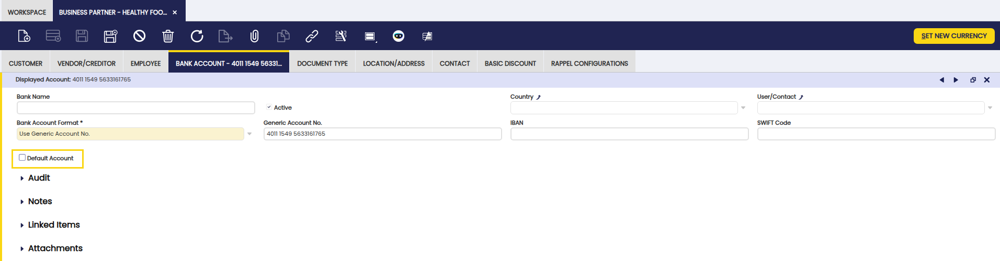

!!! note
    Si no se selecciona ninguna cuenta bancaria como predeterminada, se utiliza la última creada cuando no se selecciona ninguna cuenta bancaria en pedidos/facturas.

!!! warning
    Solo puede seleccionarse una cuenta bancaria como predeterminada para cada tercero.

### Tipo de documento { #document-type }

<iframe width="560" height="315" src="https://www.youtube.com/embed/8-MOprz-4FI?si=rc5geP_xaKmKvjsK" title="YouTube video player" frameborder="0" allow="accelerometer; autoplay; clipboard-write; encrypted-media; gyroscope; picture-in-picture; web-share" referrerpolicy="strict-origin-when-cross-origin" allowfullscreen></iframe>

!!! info
    Esta funcionalidad está disponible en Etendo 25.3 o versiones posteriores.

Esta solapa introduce flexibilidad al personalizar las asignaciones de tipo de documento a facturas, pedidos, albaranes y recepciones, específicamente en función del tercero.

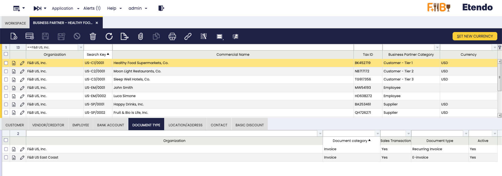

Esta funcionalidad le permite asignar un tipo de documento específico a cada transacción — pedido, factura, envío o recepción — según el tercero, anulando la configuración predeterminada de la organización. Esto es útil, ya que cada país, región e incluso cada empresa puede utilizar diferentes tipos de documentos con sus respectivos números de secuencia imprimibles e incluso personalizados.

Cuando se crea un documento de transacción (pedido, factura, albarán o recepción) y se vincula a un tercero, el sistema primero comprueba la solapa **Tipo de documento** para obtener la configuración correcta. Esta configuración puede mejorar significativamente la experiencia del usuario cuando los documentos se crean repetidamente.

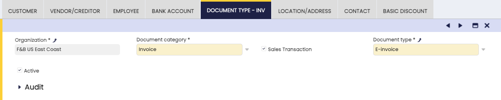

Campos a tener en cuenta:

1. **Organización**: especifica la organización a la que se aplica esta regla específica de asignación de documentos (p. ej., F&B US Inc.).
2. **Tipo doc. base**: seleccione el tipo de documento de transacción, como pedido, factura o albarán/recepción.
3. **Operación de venta**: casilla de verificación utilizada para distinguir la dirección del documento.

    - Marcada: corresponde a documentos de ventas (p. ej., pedidos de venta, facturas de venta, albaranes (Cliente)).
    - Desmarcada: corresponde a documentos de compras (p. ej., pedidos de compra, facturas de compra, albaranes (Proveedor)).

4. **Tipo de documento**: seleccione el tipo de documento específico disponible para la categoría elegida y la dirección de la transacción.

#### Prioridad de selección del tipo de documento { #document-type-selection-priority }

Cuando se crea una transacción para un tercero, Etendo selecciona el tipo de documento en este orden:

1. Comprueba si se ha definido una regla para este tercero y organización específicos.
2. Si no se encuentra ninguna, comprueba si existe una regla para una organización padre.
3. Si no existe ninguna regla en ningún nivel, utiliza el tipo de documento por defecto configurado para la organización.

Añada una regla aquí únicamente si desea sobrescribir el valor por defecto de la organización para este tercero en concreto.

!!! warning
     Esta funcionalidad no está disponible para documentos creados mediante un proceso en segundo plano/botón como "Facturar desde albarán" en la ventana [**Albarán (Cliente)**](../../sales-management/transactions.md#goods-shipment). En este caso, el tipo de documento que se utilizará es el definido a nivel de organización, en lugar del definido a nivel de la solapa **Tipo de documento**.

### Direcciones { #locationaddress }

Las ubicaciones de terceros y los detalles completos de la dirección pueden configurarse en esta solapa.

Los terceros pueden tener diferentes detalles de dirección en función de la dirección/ubicación utilizada, ya sea para fines de *Albaranes (Proveedor)/(Cliente)* o para fines de *Facturas*.

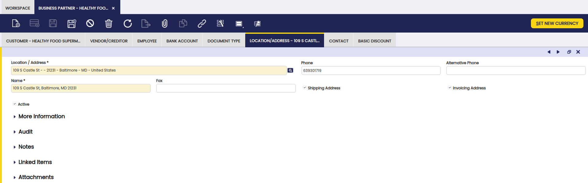

Campos a tener en cuenta:

- **Direcciones**: si hace clic en este campo, se abre el cuadro selector de ubicación, donde puede introducir la siguiente información:
    - la **1ª línea de dirección**
    - la **2ª línea de dirección**, si es necesario
    - el **Código postal de la cuenta**
    - la **Población en que está domiciliada la cuenta**
    - el **País**: se puede seleccionar uno de la lista, si existe
    - la **Provincia**: una vez seleccionado el país, puede seleccionar una provincia del país seleccionado, de la lista, si existe.

- **Teléfono**: el número de teléfono para contactar con el tercero.
- **Teléfono alternativo**: para un teléfono alternativo, si existe.
- **Nombre**: referido al nombre de la dirección. Este campo se completa automáticamente por Etendo, una vez que la información de Direcciones ha sido configurada. Cámbielo según sea necesario.
- **Fax**: el número de fax para contactar con el tercero.
- Casilla **Dirección de envío**: márquela si la dirección que se está configurando debe utilizarse para transacciones relacionadas con Albaranes (Proveedor)/(Cliente).
- Casilla **Dirección de facturación**: márquela si la dirección que se está configurando debe utilizarse para transacciones de facturas de venta o compra.

#### Gestión avanzada de cuentas bancarias { #advanced-bank-account-management-location }

!!! info
    Para poder incluir esta funcionalidad, debe instalarse el módulo Advanced Bank Account Management del Financial Extensions Bundle. Para ello, siga las instrucciones del marketplace: [Financial Extensions Bundle](https://marketplace.etendo.cloud/#/product-details?module=9876ABEF90CC4ABABFC399544AC14558){target="_blank"}. Para más información sobre las versiones disponibles, compatibilidad con el core y nuevas funcionalidades, visite [Financial Extensions - Notas de la versión](../../../../../../whats-new/release-notes/etendo-classic/bundles/financial-extensions/release-notes.md).

El campo Gestión avanzada de cuentas bancarias se introduce en la solapa Direcciones de la ventana Terceros para **asociar cuentas bancarias específicas** a las diferentes ubicaciones.

!!! warning
    En caso de tener tanto una cuenta bancaria por defecto como una ubicación con una cuenta bancaria definida, al generar un nuevo documento, la cuenta bancaria de la ubicación tiene prioridad sobre la cuenta por defecto.

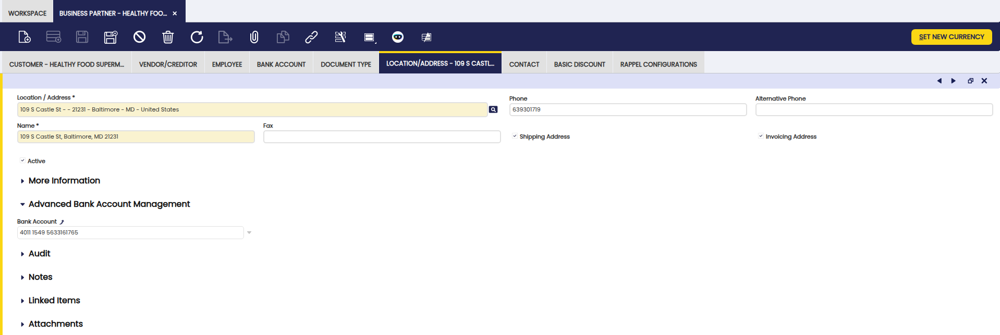

### Personas de contacto { #contact }

Use la solapa Personas de contacto para añadir y configurar los contactos del tercero con los que trabaja.

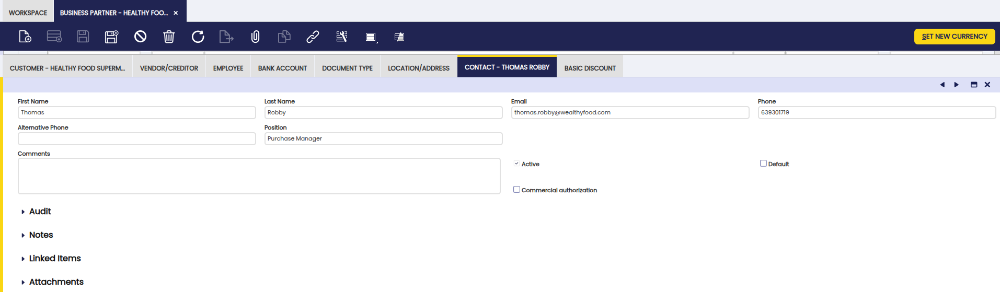

Campos a tener en cuenta:

- **Nombre** y **Apellidos** del contacto.
- **Correo electrónico** del contacto.
- **Teléfono** del contacto.
- **Teléfono alternativo** del contacto.
- **Cargo** en el tercero.
- **Comentarios**: para introducir información adicional.
- Indicador **Activo**: para indicar si este contacto está disponible para su uso o deshabilitado.
- **Autorización comercial**: esta casilla de verificación se selecciona para indicar si el cliente desea o no recibir información comercial de la organización.
- **Valor por defecto**: marca este contacto como el destinatario por defecto al enviar documentos por correo electrónico. Cuando se selecciona, la dirección de correo electrónico de este contacto se precarga automáticamente en el campo *Para* del pop-up de Opciones de correo electrónico. Si ningún contacto tiene este indicador marcado, el sistema utiliza el último correo electrónico utilizado para el tercero o, si no existe, el primer contacto activo ordenado alfabéticamente.

    !!! info
        Solo marque un contacto como Valor por defecto por tercero. Si hay más de uno marcado, el sistema no puede decidir de forma fiable qué dirección de correo electrónico utilizar.

### Descuentos { #basic-discount }

Use la solapa Descuentos para añadir y configurar los descuentos de terceros.

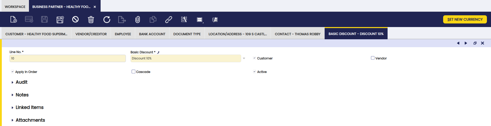

Es posible introducir tantos **Descuento** como se hayan acordado con sus terceros, completando la siguiente información:

- el **Descuento** que se aplicará al crear transacciones de venta/compra para ese tercero puede seleccionarse de la lista (si existe) o crearse navegando a la ventana [**Descuento**](../business-partner-setup/basic-discount.md).
- **Cliente:** esta casilla debe seleccionarse si el descuento se va a aplicar a un Tercero configurado como *Cliente*.
- **Proveedor:** esta casilla debe seleccionarse si el descuento se va a aplicar a un Tercero configurado como *Proveedor*.
- **Aplicar en pedido:** esta casilla debe seleccionarse en caso de que el descuento pueda aplicarse en pedidos de venta o de compra, según corresponda.
- Cálculo **En cascada** del descuento. Por ejemplo, si el primer descuento es del 10% y el segundo del 5%, un cálculo en cascada del descuento total no será del 15% sino del 14,5%.

    Sin cascada: cada descuento se calcula sobre el total original de la línea. Con cascada: cada descuento se calcula sobre el importe que queda después de haberse aplicado el descuento anterior.

    !!! example
        Un ejemplo para explicar la diferencia entre un descuento **En cascada** y uno que no es **En cascada** es el siguiente:

        Tres **Descuento**, cada uno del 10%; los dos primeros se definen como no **En cascada** y el tercero como **En cascada**. Sobre una línea de factura de 1.000 USD:

        - El primer descuento creará una línea de -100 USD (10% de 1.000 USD)
        - El segundo descuento también creará una línea de -100 USD (10% de 1.000 USD)
        - El tercero, sin embargo, creará un descuento basado en aplicar los descuentos anteriores en cascada, por lo que:
        - 1.000 USD - 10% = 900 USD (aplicando el 1er descuento **En cascada**)
        - 900 USD - 10% = 810 USD (aplicando el 2º descuento **En cascada**)
        - 10% de 810 USD = 81 USD. Por lo tanto, el tercer descuento será de -81 USD.
        - En total -100 -100 -81 = -281 USD para los tres descuentos (un descuento total del 28,1%)

### Configuraciones de Rappel { #rappel-configurations }

Los rappels son descuentos basados en el volumen de consumo de un tercero en un periodo de tiempo determinado. Use esta funcionalidad para configurar y conceder rappels a terceros.

!!! info
    Para poder incluir esta funcionalidad, debe estar instalado el módulo Advanced Rappels del Sales Extensions Bundle. Para ello, siga las instrucciones del marketplace: [Sales Extensions Bundle](https://marketplace.etendo.cloud/#/product-details?module=22CF01FC620140A6AA92CF550EB8DA36){target="_blank"}. Para más información sobre las versiones disponibles, la compatibilidad con el core y las nuevas funcionalidades, visite [Sales Extensions - Notas de la versión](../../../../../../whats-new/release-notes/etendo-classic/bundles/sales-extensions/release-notes.md).

Con esta funcionalidad, se muestra la solapa "Configuraciones de Rappel" en los terceros incluidos en las configuraciones de Rappel. Además, en la ventana Terceros, cree rappels mediante el botón **Crear Rappel**.

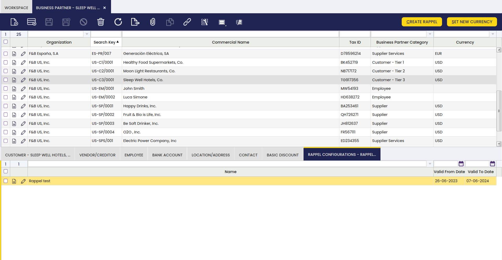

Para poder hacerlo, es necesario configurar determinados aspectos en la ventana **Configuraciones de Rappel**.

!!! info
    Para más información, visite [Configuraciones de Rappel](../business-partner-setup/rappel-configurations.md).

La solapa **Configuración de Rappel** se puede encontrar en la sección de solapas de la ventana Terceros. Esta solapa muestra los rappels configurados para cada tercero.

Para crear un nuevo rappel, seleccione una de las configuraciones disponibles en esta solapa y haga clic en el botón **Crear Rappel**. Aparecerá una ventana emergente en la que puede seleccionar el tercero (denominado aquí socio comercial) al que se asignará el Rappel, y también configurar un periodo de fechas en el que se tendrán en cuenta los consumos para calcular los descuentos, determinado por la información *fecha desde* y *fecha hasta*.

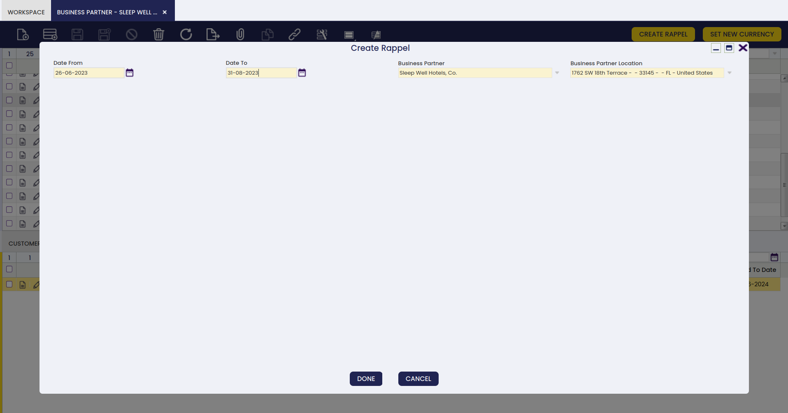

Cuando se crea el rappel, se crea automáticamente una factura de venta, como se muestra a continuación.

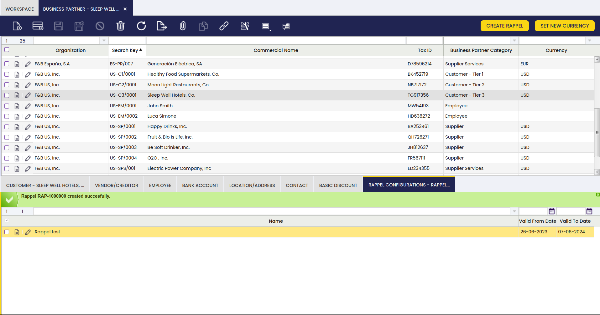

Cada vez que se concede un rappel a un tercero, se genera automáticamente una nueva factura de venta para mostrar el importe del descuento. Esta factura utiliza una serie de numeración dedicada (configurada por separado) para distinguir las facturas de rappel de las facturas de venta ordinarias, y muestra un importe negativo porque representa un descuento. Esta factura está en estado Borrador.

!!! info
    Para más información, visite [Factura (Cliente)](../../sales-management/transactions.md#advanced-rappels).

*[PO]: Purchase Order (OC — Orden de Compra)
*[OC]: Orden de Compra (Purchase Order)
*[SO]: Sales Order
*[BP]: Business Partner
*[IBAN]: International Bank Account Number
*[SWIFT]: Society for Worldwide Interbank Financial Telecommunication (also referred to as BIC)
*[BIC]: Bank Identifier Code

---

Este trabajo tiene licencia :material-creative-commons: :fontawesome-brands-creative-commons-by: :fontawesome-brands-creative-commons-sa: [ CC BY-SA 2.5 ES](https://creativecommons.org/licenses/by-sa/2.5/es/){target="_blank"} por [Futit Services S.L](https://etendo.software){target="_blank"}.
