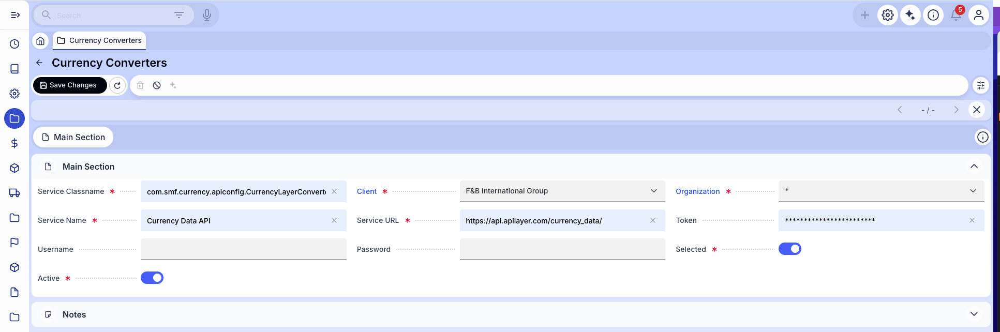

# Conversores de Moneda { #currency-converters }

:material-menu: `Aplicación` > `Gestión de Datos Maestros` > `Conversores de Moneda`

!!! info
    Para poder incluir esta funcionalidad, debe estar instalado el Financial Extensions Bundle. Para ello, siga las instrucciones del marketplace: [Financial Extensions Bundle](https://marketplace.etendo.cloud/#/product-details?module=9876ABEF90CC4ABABFC399544AC14558){target="_blank"}. Para más información sobre las versiones disponibles, la compatibilidad con el core y las nuevas funcionalidades, visite [Financial Extensions - Notas de la versión](../../../../../../whats-new/release-notes/etendo-classic/bundles/financial-extensions/release-notes.md).

## Descripción general { #overview }

La ventana **Conversores de Moneda** es donde se introducen las credenciales necesarias para que Etendo se conecte a un servicio externo que proporciona tipos de cambio diarios. Una vez configurado, el sistema puede descargar los tipos vigentes de forma automática, sin necesidad de introducirlos manualmente. El módulo [Descargador de Tasa de Conversión](../../../../../../user-guide/etendo-classic/optional-features/bundles/financial-extensions/conversion-rate-downloader.md) utiliza esta configuración para recuperar dichos tipos.

Este módulo es compatible con distintos servicios de conversión de moneda. Para conectarse a uno de estos servicios, el sistema utiliza una API — un canal estandarizado que permite que dos aplicaciones de software intercambien datos de forma automática, sin intervención manual. No es necesario comprender los detalles técnicos; solo debe registrarse en el proveedor del servicio y pegar aquí la clave de acceso (token) que le proporcione. Por defecto, se integra con [APILayer – Currency Data API](https://marketplace.apilayer.com/currency_data-api?utm_source=apilayermarketplace&utm_medium=featured){target="_blank"}.

Cada registro de esta ventana representa una integración con una API. Solo el registro con **Seleccionado** en **Sí** está activo para el proceso de descarga.

Los tipos de cambio se utilizan en todo Etendo cada vez que se registra una transacción en una moneda extranjera. Por ejemplo, cuando se crea un pedido de compra o una Factura (Cliente) en moneda extranjera, Etendo aplica el tipo de cambio vigente para convertir el importe a la moneda base de su empresa. La misma conversión se aplica a los informes financieros. Todas las cifras aparecen en la moneda base de su empresa, independientemente de la moneda utilizada en la transacción original. Mantener los tipos de cambio actualizados garantiza que estas conversiones reflejen los valores reales del mercado.

## Campos { #fields }

<figure markdown="span">
  
  <figcaption>Ventana Conversores de Moneda con una configuración de APILayer Currency Data API.</figcaption>
</figure>

`Nombre de Clase de Servicio`
:   Completado previamente por el sistema. No modifique este valor salvo que su administrador del sistema se lo indique.

`Entidad`
:   La cuenta de empresa en Etendo a la que pertenece esta configuración. En la mayoría de los casos, se cumplimenta automáticamente al iniciar sesión.

`Organización`
:   La unidad organizativa de Etendo que puede utilizar esta configuración. Para que esté disponible en todas las unidades de su empresa, introduzca `*`. Para restringir el acceso a un departamento o sucursal concretos, seleccione esa organización de la lista.

`Nombre del Servicio`
:   Identificador de este registro de configuración, por ejemplo `Currency Data API`.

`URL del Servicio`
:   Completado previamente por el sistema. No modifique este valor salvo que su administrador del sistema se lo indique.

`Token`
:   Su clave de acceso a la API. Para obtenerla, regístrese en [APILayer](https://marketplace.apilayer.com/){target="_blank"} y suscríbase a la **Currency Data API**. Copie el token proporcionado y péguelo aquí.

`Usuario` *(opcional)*
:   Nombre de usuario de autenticación. Déjelo en blanco para la configuración predeterminada de APILayer.

`Contraseña` *(opcional)*
:   Contraseña de autenticación. Déjela en blanco para la configuración predeterminada de APILayer.

`Seleccionado`
:   Establezca el valor en **Sí** para utilizar esta configuración en el proceso de descarga. Solo puede estar seleccionado un registro a la vez.

`Activo`
:   Establezca el valor en **Sí** para que esta configuración esté disponible en el sistema.

## Flujo de configuración completo { #full-setup-workflow }

La ventana Conversores de Moneda es un paso dentro del proceso general de automatización de tipos de cambio. Para consultar el flujo de configuración completo, incluido cómo programar descargas automáticas y definir reglas de conversión, visite la página [Descargador de Tasa de Conversión](../../../../../../user-guide/etendo-classic/optional-features/bundles/financial-extensions/conversion-rate-downloader.md).

---

This work is licensed under :material-creative-commons: :fontawesome-brands-creative-commons-by: :fontawesome-brands-creative-commons-sa: [ CC BY-SA 2.5 ES](https://creativecommons.org/licenses/by-sa/2.5/es/){target="_blank"} by [Futit Services S.L](https://etendo.software){target="_blank"}.
