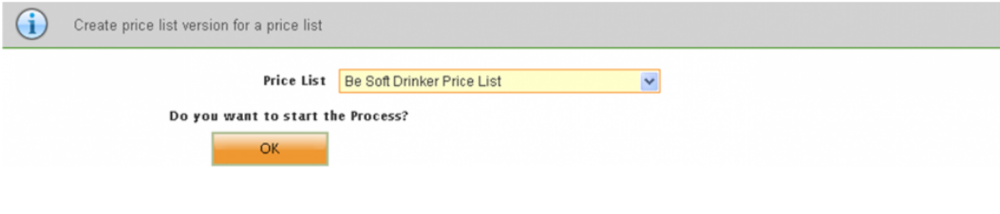
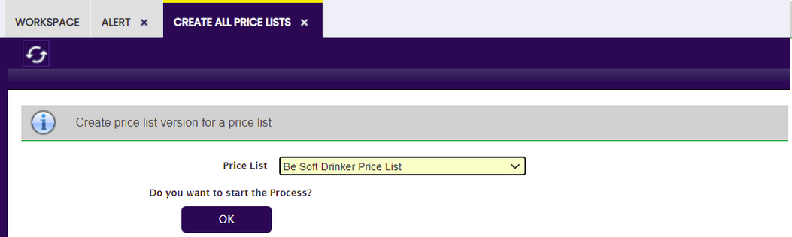

## Actualizar tarifas { #create-all-price-lists }

:material-menu: `Aplicación` > `Gestión de Datos Maestros` > `Tarifas` > `Actualizar tarifas`

### Visión general { #overview }

En las ventas diarias, especialmente en el comercio minorista y la distribución, las tarifas son muy importantes. Por lo tanto, Etendo incluye abundante información para gestionar y actualizar las versiones de tarifa por tercero.

Esta funcionalidad incluye diferentes tarifas, versiones de tarifa para cada tarifa y esquemas de tarificación. Revise estos conceptos para comprender mejor la funcionalidad de *Actualizar tarifas*.

Etendo permite una estructura jerárquica de tarifas y esta jerarquía se basa en los esquemas de tarificación.

#### Funcionalidad { #functionality }

Siga este ejemplo sobre para qué se utiliza *Actualizar tarifas*:

Ejemplo 1:

Imagine que usted es propietario de una panadería y vende diferentes tipos de pan a distintos clientes. Puede tener pan francés, bollos, bagels, etc. Y para cada tipo puede tener diferentes tamaños: pequeño, mediano y extra.

Usted utiliza una tarifa principal (con una versión de tarifa) que contiene un precio por pan cuando es de tamaño mediano. En base a esta tarifa, se crean otras 2 tarifas aplicando un esquema de tarificación. Para el pan pequeño, un 5% de descuento y para los panes extra, un 4% más. De este modo, podrá gestionar las actualizaciones de precios fácilmente. Suponga que el precio de la harina sube un 10% y usted quiere incrementar todos los precios de todos los panes. Podría seguir estos pasos:

- Crear un nuevo esquema de tarificación incrementando el precio un 10%.
- Crear una nueva versión para la tarifa principal, basada en el nuevo esquema de tarificación.
- Regenerar automáticamente todas las tarifas basadas en la tarifa principal. Para este tercer paso, puede utilizar la funcionalidad **Actualizar tarifas**.

#### Proceso { #process }

**Actualizar tarifas** genera todas las tarifas pendientes a partir de la tarifa seleccionada. El proceso comprueba todas las tarifas hijas y, aplicando el esquema de tarificación definido, genera una nueva versión para cada tarifa.

---

Este trabajo es una obra derivada de [Gestión de Datos Maestros](https://wiki.openbravo.com/wiki/Master_Data_Management){target="\_blank"} de [Openbravo Wiki](http://wiki.openbravo.com/wiki/Welcome_to_Openbravo){target="\_blank"}, utilizada bajo [CC BY-SA 2.5 ES](https://creativecommons.org/licenses/by-sa/2.5/es/){target="\_blank"}. Esta obra está licenciada bajo [CC BY-SA 2.5](https://creativecommons.org/licenses/by-sa/2.5/){target="\_blank"} por [Etendo](https://etendo.software){target="\_blank"}.
