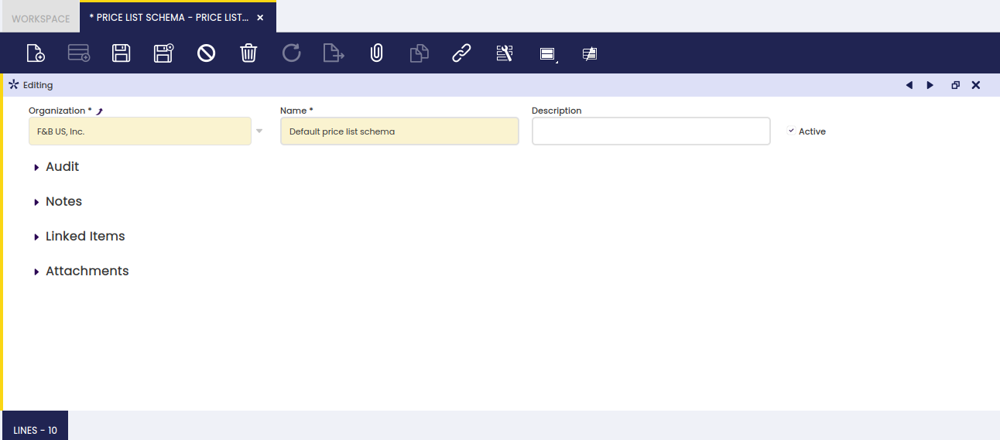
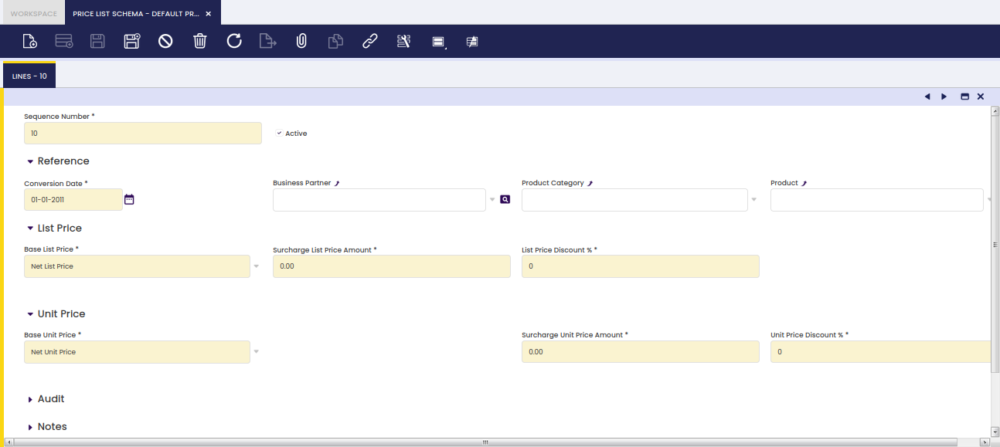

## Esquema de tarificación { #price-list-schema }

:material-menu: `Aplicación` > `Gestión de Datos Maestros` > `Tarifas` > `Esquema de tarificación`

### Visión general { #overview }

Un esquema de tarificación es una plantilla utilizada para completar automáticamente una nueva versión de una tarifa.

La gestión de tarifas no es una tarea fácil de manejar, principalmente en mercados competitivos donde los márgenes son muy ajustados.

Hoy en día, las organizaciones tienen que gestionar una enorme variedad de productos, que tienen precios diferentes en función de la temporada y otras variables de tarificación.

Etendo gestiona los precios a través de tres conceptos relacionados con las tarifas:

- la **Tarifa**
- el **Esquema de tarificación**
- y la **Versión de tarifa**

Y permite la creación de:

- Tarifas de venta y/o compra **generales**
- Tarifas **específicas** para un proveedor o cliente concreto, o un grupo de ellos.
- Tarifas **basadas en coste**, basadas en el coste del producto

La forma en que estos conceptos funcionan en Etendo se describe a continuación:

1.  **Creación de tarifa(s)**:
    1.  Se crea por defecto un "Esquema de tarificación por defecto", sin ninguna configuración, después de crear una organización.
    2.  El "Esquema de tarificación por defecto" es el esquema que se utilizará en la creación de las tarifas que NO son una "Versión de tarifa".
    3.  Las tarifas vinculadas al "Esquema de tarificación por defecto" pueden contener tanto el precio tarifa como los precios unitarios netos de los productos.  
        Para saber más, visite Tarifa.
    4.  La(s) tarifa(s) creada(s) puede(n) vincularse a los terceros según sea necesario.  
        Para saber más, visite Terceros
2.  **Creación de esquema(s) de tarificación**:
    1.  Se pueden crear nuevos esquemas de tarificación como una forma de configurar un conjunto de reglas comerciales que se aplicarán a tarifas existentes.  
        Para saber cómo, siga leyendo.
3.  **Creación de versión(es) de tarifa**:
    1.  Se crea una nueva versión de una tarifa existente como una combinación de una tarifa base y un "Esquema de tarificación" determinado.  
        Para saber más, visite Tarifa.
    2.  Las versiones de la(s) tarifa(s) creadas pueden vincularse a los terceros según sea necesario.  
        Para saber más, visite Terceros.

### Cabecera { #header }

La ventana de esquema de tarificación permite la creación de tantos esquemas de tarificación como sea necesario con el objetivo de obtener una gestión sencilla de las tarifas y de las versiones de tarifa.

Como se muestra en la imagen siguiente, la creación de un esquema de tarificación es tan sencilla como crearlo y asignarle un Nombre.

El conjunto de reglas de precio y descuento que podrían aplicarse a un conjunto de categorías de producto o a productos específicos debe configurarse en la solapa "Líneas".

### Líneas { #lines }

La solapa de líneas del esquema de tarificación permite definir un conjunto de reglas de precios, como aplicar un % de descuento al precio unitario neto de una categoría de producto determinada o de un producto específico.

Lo primero que hay que tener en cuenta es que, como se muestra en la imagen anterior, la solapa "Líneas" se divide en dos secciones:

- la primera sección permite al usuario:
  - informar a Etendo sobre:
    - el "Terceros" y/o
    - la "Categoría del producto" y/o
    - el "Producto"  
      a los que se van a aplicar las reglas de precio/descuento que se definirán en la siguiente sección.
- la segunda sección permite al usuario:
  - configurar qué precio de la tarifa existente se tomará como "Base precio tarifa" en la nueva versión de tarifa. Las opciones disponibles son:
    - **Precio tarifa** que es el precio publicado en la tarifa
    - **Precio unitario** que es el precio final utilizado en las líneas de pedido/factura de compra y venta
    - **Precio fijo**, ya que es posible configurar que, para la nueva versión de tarifa, el precio tarifa sea igual a un precio fijo determinado.
    - **Costo**, donde el precio publicado en la tarifa será el coste del producto (solapa Costo en la ventana de producto) y un margen.
    - **Precio fijo o basado en coste** combina las dos opciones anteriores con la siguiente condición:
      - Si el precio fijo es superior al coste, entonces se selecciona el precio fijo definido.
      - Si el precio fijo es inferior al coste, entonces se selecciona el coste (más el margen definido).
    - **Precio fijo o basado en coste más margen** combina las opciones de precio fijo y coste con la siguiente condición:
      - Si el precio tarifa/unitario fijo establecido es superior al coste actual más el margen del precio tarifa/unitario, la tarifa se creará con el precio fijo.
      - Si el precio tarifa/unitario fijo establecido es inferior al coste actual más el margen del precio tarifa/unitario, entonces la tarifa se creará utilizando el coste más el margen.
  - configurar qué precio de la tarifa existente se tomará como "Precio base unitario" en la nueva versión de tarifa. Las opciones disponibles son las mismas que las anteriores:
    - **Precio tarifa**
    - **Precio unitario**
    - **Precio fijo**, ya que es posible configurar que, para la nueva versión de tarifa, el precio unitario neto sea igual a un precio fijo determinado
    - **Costo**
    - **Precio fijo o basado en coste**
    - **Precio fijo o basado en coste más margen**
  - configurar los descuentos, si los hubiera, a aplicar al precio unitario neto y/o al precio tarifa en los campos:
    - **Descuento (%) precio tarifa**
    - **Descuento (%) precio estándar**
  - configurar el margen sobre el coste del producto a aplicar al precio unitario neto y/o al precio tarifa en los campos:
    - **%Margen Precio Neto**
    - **% Margen Precio Unitario**

Lo segundo que hay que tener en cuenta es que el conjunto de reglas de precios y/o descuentos podría configurarse de forma "jerárquica", es decir, línea por línea, o aplicando la última regla de precio válida (forma no jerárquica).

!!! info
    La preferencia Habilitar tarifa jerárquica está disponible para seleccionar el comportamiento deseado al aplicar las reglas de la tarifa.

Imaginemos que las reglas que deben formar parte de un esquema de tarificación son:

- aplicar un descuento del 5% sobre el precio unitario neto a los productos que pertenecen a una Categoría del producto X.
- aplicar un descuento del 10% sobre el precio unitario neto a los productos que pertenecen a la Categoría del producto Y.
- aplicar un descuento del 15% sobre el precio unitario neto al Producto X que pertenece a la Categoría del producto X.

La forma en que esto funciona en Etendo es:

- el esquema de tarificación debe contener 2 líneas, una por cada regla de descuento a aplicar:
  - La primera línea contendrá información como:
    - Secuencia = 10
    - Tipo de rango de conversión = Spot
    - Categoría del producto = Categoría del producto X
    - Precio Base Neto Unitario = Precio unitario
    - Descuento del precio unitario neto = 5.00
  - La segunda línea contendrá información como:
    - Secuencia = 20
    - Tipo de rango de conversión = Spot
    - Categoría del producto = Categoría del producto Y
    - Precio Base Neto Unitario = Precio unitario
    - Descuento del precio unitario neto = 10.00
  - La tercera línea contendrá información como:
    - Secuencia = 30
    - Tipo de rango de conversión = Spot
    - Categoría del producto = Categoría del producto X
    - Producto = Producto X
    - Precio Base Neto Unitario = Precio unitario
    - Descuento del precio unitario neto = 15.00

Usando comportamiento jerárquico:

- se aplica un descuento del 5% sobre el precio unitario a los productos que pertenecen a la Categoría del producto X.
- se aplica un descuento del 10% sobre el precio unitario a los productos que pertenecen a la Categoría del producto Y.
- se aplica un descuento del 15% sobre el precio unitario al Producto X, además del descuento del 5% por pertenecer a la Categoría del producto X.

Usando comportamiento no jerárquico:

- se aplica un descuento del 5% sobre el precio unitario a los productos que pertenecen a la Categoría del producto X, excepto al Producto X.
- se aplica un descuento del 10% sobre el precio unitario a los productos que pertenecen a la Categoría del producto Y.
- se aplica un descuento del 15% sobre el precio unitario al Producto X.

---

Este trabajo es una obra derivada de [Gestión de Datos Maestros](https://wiki.openbravo.com/wiki/Master_Data_Management){target="\_blank"} de [Openbravo Wiki](http://wiki.openbravo.com/wiki/Welcome_to_Openbravo){target="\_blank"}, utilizada bajo [CC BY-SA 2.5 ES](https://creativecommons.org/licenses/by-sa/2.5/es/){target="\_blank"}. Esta obra está licenciada bajo [CC BY-SA 2.5](https://creativecommons.org/licenses/by-sa/2.5/){target="\_blank"} por [Etendo](https://etendo.software){target="\_blank"}.
