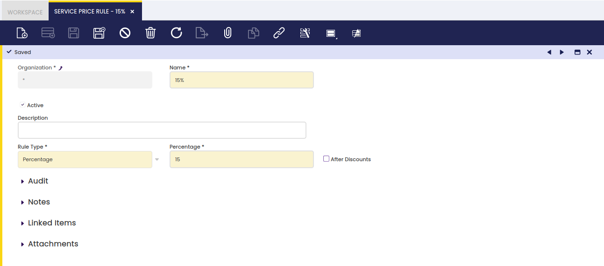
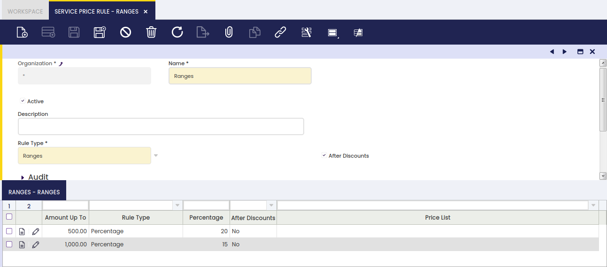

## Regla de Precio de Servicio { #service-price-rule }

:material-menu: `Aplicación` > `Gestión de Datos Maestros` > `Tarifas` > `Regla de Precio de Servicio`

### Visión general { #overview }

En esta ventana se configurarán las Reglas de Precio asignadas a servicios basados en Regla de Precio. En lugar de tener un precio fijo, habrá reglas que determinarán el precio del Servicio.

### Regla de Precio de Servicio { #service-price-rule_1 }

Campos de configuración:

- **Nombre**: Nombre de la Regla de Precio de Servicio.
- **Descripción**: Descripción de la Regla de Precio de Servicio.
- **Tipo de Regla**: Hay dos valores para seleccionar en el desplegable
  - Porcentaje: Si se selecciona, se mostrará un campo Porcentaje que permitirá establecer un Porcentaje. Para determinar el precio del servicio, este importe se aplicará al importe de las líneas relacionadas con el servicio.
    - **Porcentaje**: Porcentaje a aplicar.
    - **Después de Descuentos**: Si se selecciona, el porcentaje se aplicará después de añadir los descuentos al ticket.
  - **Rangos**: Si se selecciona, se mostrará una nueva solapa Rangos que permitirá crear diferentes Rangos en función del importe de las líneas relacionadas.

### Rangos { #ranges }

En esta solapa, se pueden crear diferentes Rangos en función del importe de las líneas de pedido relacionadas. Campos de configuración:

- **Importe Hasta**: Si el importe sumado de las líneas de pedido relacionadas es igual o inferior a este importe, se tendrá en cuenta la configuración de este rango.
- **Tipo de Regla**: Hay dos valores para seleccionar en el desplegable
  - Porcentaje: Si se selecciona, se mostrará un campo Porcentaje que permitirá establecer un Porcentaje. Para determinar el precio del servicio, este importe se aplicará al importe de las líneas relacionadas con el servicio.
    - **Porcentaje**: Porcentaje a aplicar.
    - **Después de Descuentos**: Si se selecciona, el porcentaje se aplicará después de añadir los descuentos al ticket.
  - **Precio fijo**: Si se selecciona, se mostrará un campo 'Tarifa'.
    - **Tarifa**: Tarifa de la que se obtendrá el precio del servicio.

---

Este trabajo es una obra derivada de [Gestión de Datos Maestros](https://wiki.openbravo.com/wiki/Master_Data_Management){target="\_blank"} de [Openbravo Wiki](http://wiki.openbravo.com/wiki/Welcome_to_Openbravo){target="\_blank"}, utilizada bajo [CC BY-SA 2.5 ES](https://creativecommons.org/licenses/by-sa/2.5/es/){target="\_blank"}. Esta obra está licenciada bajo [CC BY-SA 2.5](https://creativecommons.org/licenses/by-sa/2.5/){target="\_blank"} por [Etendo](https://etendo.software){target="\_blank"}.
