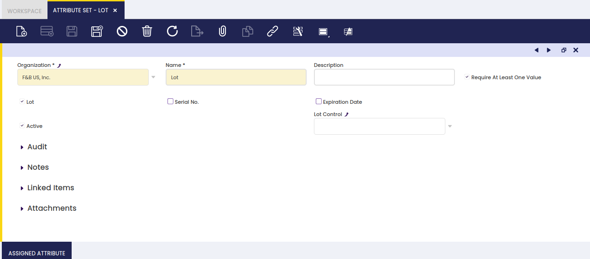
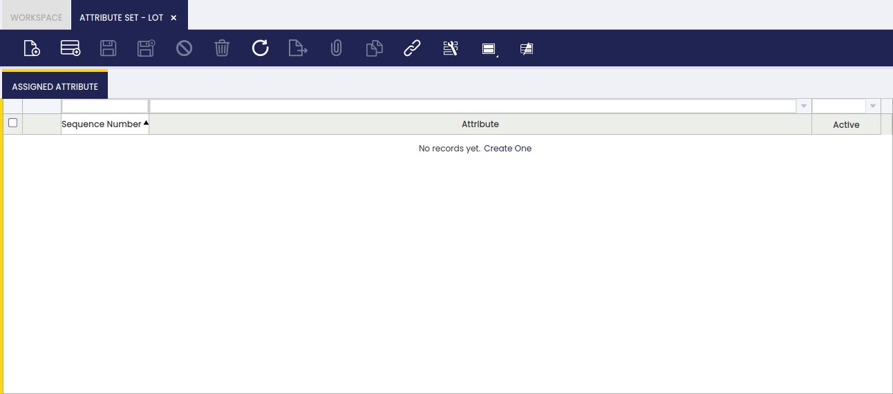

## Conjunto atributos { #attribute-set }

:material-menu: `Aplicación` > `Gestión de Datos Maestros` > `Configuración de productos` > `Conjunto atributos`

### Visión general { #overview }

Un conjunto de atributos puede definirse mediante un único atributo o mediante un conjunto de atributos para aplicar a productos específicos.

Si **un conjunto de atributos** incluye, entre otros, **un atributo que es único para cada instancia del producto**, por ejemplo, un número de lote o un número de serie, esta ventana es el lugar para definir qué **Control lote** o **Control nº serie** debe aplicarse para obtener ese atributo único.

Los pasos a seguir son:

- **Creación de la(s) secuencia(s) de número de lote**. Para saber cómo, visite Control lote
- **Creación de la(s) secuencia(s) de número de serie**. Para saber cómo, visite Control nº serie
- **Configurar la relación entre** la(s) **secuencia(s) de número de lote/serie** creada(s) previamente y el **Conjunto atributos**, en la ventana Conjunto atributos.  
  Para saber cómo, siga leyendo esta sección.

### Conjunto atributos { #attribute-set_1 }

La ventana Conjunto atributos permite crear tantas combinaciones de atributos como sea necesario para definir productos con pocas o múltiples características.

Tal y como se muestra en la imagen anterior, un conjunto de atributos que se va a asignar a un(os) producto(s) específico(s) puede contener:

- un **Nombre** del conjunto de atributos
- una breve **Descripción** si es necesario
- un **Lote** o identificador único asignado a una cantidad determinada de ese producto.  
  Si **la marca Lote está seleccionada**, se muestra un nuevo campo denominado "**Control lote**" para que seleccione la secuencia de número de lote que deben seguir los productos vinculados a ese conjunto de atributos.
- un **Nº de serie** o un identificador único asignado a cada unidad del producto.  
  Si **la marca Nº de serie está seleccionada**, se muestra un nuevo campo denominado "**Control del número de serie**" para que seleccione la secuencia de número de serie que deben seguir los productos vinculados a ese conjunto de atributos.
- una **F. caducidad** o fecha hasta la cual se garantiza la calidad del producto.  
  Si **la marca F. caducidad está seleccionada**, se muestra un nuevo campo denominado "**Días de garantía**" para que introduzca el número de días durante los cuales se puede garantizar un producto.
- por último, la marca "**Se requiere por lo menos un valor**" implica que se requerirá al menos un valor del conjunto de atributos en las transacciones relacionadas con el producto.

### Atributos asignados { #assigned-attribute }

Un conjunto de atributos puede tener asignado un único atributo o un conjunto de atributos.

Tal y como se muestra en la imagen anterior, un conjunto de atributos puede tener solo un atributo, por ejemplo Color, o tantos atributos como sea necesario, por ejemplo Talla, número de lote y número de serie.

La forma de conseguirlo es simplemente seleccionar en esta solapa los atributos creados previamente.

Debe tener en cuenta que:

- si uno de los atributos seleccionados es un atributo de tipo "Lote" o de tipo "Nº de serie", la secuencia de numeración correspondiente debe haberse configurado correctamente en la ventana Conjunto atributos.

---

Este trabajo es una obra derivada de [Gestión de Datos Maestros](https://wiki.openbravo.com/wiki/Master_Data_Management){target="\_blank"} de [Openbravo Wiki](http://wiki.openbravo.com/wiki/Welcome_to_Openbravo){target="\_blank"}, utilizada bajo [CC BY-SA 2.5 ES](https://creativecommons.org/licenses/by-sa/2.5/es/){target="\_blank"}. Este trabajo está licenciado bajo [CC BY-SA 2.5](https://creativecommons.org/licenses/by-sa/2.5/){target="\_blank"} por [Etendo](https://etendo.software){target="\_blank"}.
