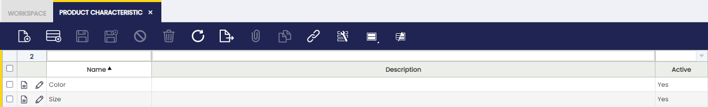
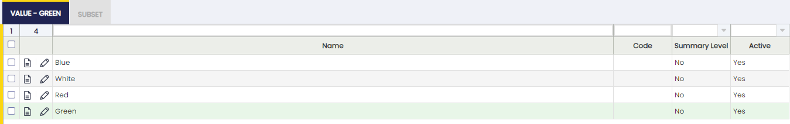
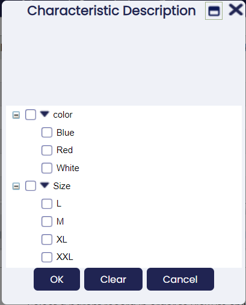
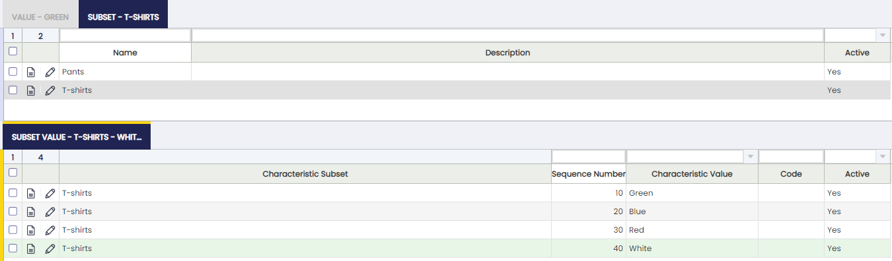
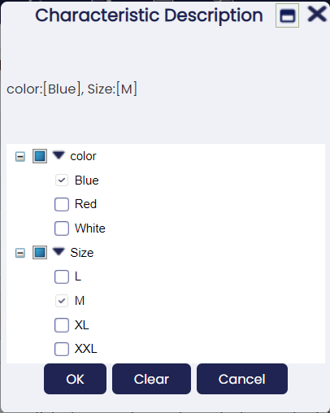
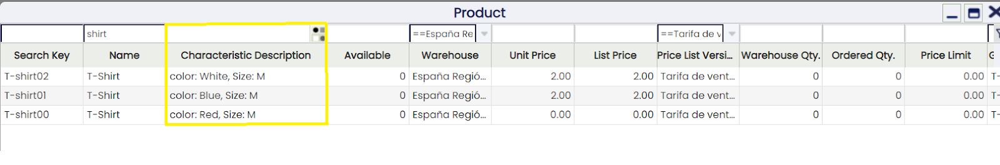
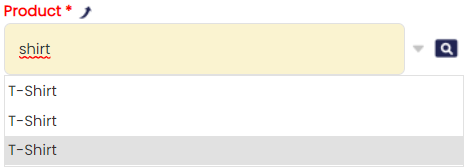
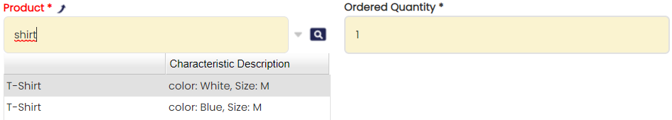
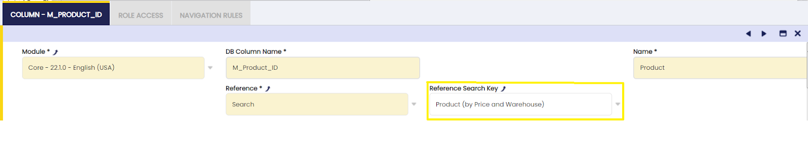
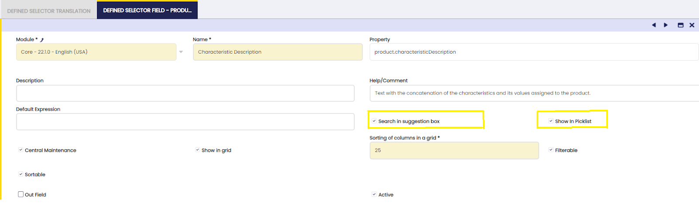

## Característica de producto { #product-characteristic }

:material-menu: `Aplicación` > `Gestión de Datos Maestros` > `Configuración de productos` > `Característica de producto`

### Visión general { #overview }

La **Característica de producto** puede definirse para completar la definición de un producto utilizando variantes.

Las _Características de producto_ son atributos que pueden añadirse a la definición del producto para ampliar la descripción de cada producto. Ejemplos de características son _Talla_, _Color_, _Calidad_, _Forma_ o _Peso_. Estas características pueden utilizarse posteriormente para filtrar o buscar productos.

Una vez creada la definición de las características, estas pueden asignarse a un producto y, a continuación, crear otros productos o SKU basados en este **Producto genérico** y sus características. Este es un producto genérico donde se definen atributos comunes como impuestos o precios. Por defecto, los productos heredan todos los atributos del _Producto genérico_ como impuestos, precios, etc. Pueden sobrescribirse en cada producto. Los productos genéricos no pueden comprarse ni venderse ni utilizarse en ningún documento.

Por ejemplo, el producto genérico _Camisas Temporada de Verano 2013 de Mi Proveedor_ implementa las características _Talla_ y _Color_ como variantes. Este _Producto genérico_ tendrá como variante de producto cada combinación de Color y Talla.

### Característica { #characteristic }

**Definición de característica**

Campos a tener en cuenta:

- **Variante**: cuando está marcado, explotará/creará combinaciones con sus valores. Si no está marcado, no creará combinaciones con otras características. Por ejemplo:
  - Característica Color: Variante marcada con valor Azul y Blanco
  - Característica Talla: Variante marcada con valor M y L
  - Característica Línea de moda: Variante no marcada con valor Sport, Classic, Vintage
- **Explotar Solapa de Configuración**: indicador disponible en las características de variante. Cuando está marcado, los valores de la característica de variante seleccionada se insertan automáticamente en la solapa _Configuración de características_ cuando la variante se asigna a un producto genérico. Si no está marcado, los valores deben añadirse manualmente.

Estas tres características se asignan al producto de esta forma:

- Color: Azul, Blanco
- Talla: M,L
- Línea de moda: Sport

Se crearán cuatro variantes/productos y todos ellos con la característica Sport. Se puede decir que una característica que no es una variante es como una etiqueta que se añade a cada nuevo producto.

### Costo { #value }

Cada uno de los valores de una característica.

Campos a tener en cuenta:

- Nombre: Valor
- Código: para utilizarse posteriormente al crear la variante. Se informará en el campo _Identificador_
- Nivel agrupación: se permite crear una estructura en árbol. Por ejemplo, si la característica es color y para el mismo valor (p. ej., Verde) hay diferentes referencias dependiendo del proveedor:

#### Botón Añadir Productos { #button-add-products }

El botón "Añadir Productos" se muestra cuando un valor de característica de producto NO es una "Variante", por lo tanto, puede asignarse a cualquier producto.

No actualiza los valores actuales. Por eso el botón solo muestra productos a los que no se les ha asignado la característica.

- Escenario 1:
  - El producto A tiene la característica Color (definida como variante) con valores Blanco, Rosa, Azul y Negro
  - Después de crear las variantes de producto, el usuario crea la característica no variante Línea de moda: Mujer, Hombre
  - La característica no variante puede asignarse al producto en la ventana Producto utilizando el botón de proceso Actualizar características.
- Escenario 2:
  - Se crea una característica de producto no variante en la ventana Característica de producto como "Variante" = No.
  - Una vez que se ha introducido una característica de producto en la solapa "Costo", se muestra un botón de proceso "Añadir Productos".
  - El botón "Añadir Productos" abre una ventana de selección/ejecución donde cualquier producto o conjunto de productos puede relacionarse con ese valor de característica de producto.

### Subconjunto { #subset }

Un subconjunto es una colección de valores de una Característica de producto.

La funcionalidad de subconjuntos es una característica potente que permite al usuario compartir las mismas características para diferentes propósitos. Por ejemplo, pueden crearse muchos colores y tallas para diferentes productos:

- Color:
  - Verde
  - Gris
  - Blanco
  - Azul
  - Amarillo
  - Rojo
  - Naranja

Pero finalmente tiene productos diferentes, por ejemplo camisetas y pantalones: subconjuntos:

- Pantalones
  - Verde
  - Blanco
  - Gris
  - Azul
- Camisetas
  - Verde
  - Blanco
  - Naranja
  - Azul

El objetivo de esta funcionalidad es evitar tener valores duplicados (azul, azul, verde, verde) debido a diferentes propósitos. Con este subconjunto, al seleccionar un producto que es un pantalón, por ejemplo, en lugar de seleccionar la característica _Color_ se selecciona el subconjunto _Pantalones_. De este modo, en lugar de recuperar siete valores, recuperará solo cuatro. Otra ventaja de hacer esto es que, al buscar variantes, en lugar de tener azul dos veces (y no sabría si el azul es para pantalones o camisetas), tendrá azul una sola vez. Así, al buscar variantes que tengan la característica _Azul_, el sistema recuperará pantalones y camisetas.

### Valor de subconjunto { #subset-value }

Cada uno de los valores de la característica de producto asignados al subconjunto.

- Número de secuencia: para ordenar la forma de ver los valores
- Nombre: Valor. Tenga en cuenta que solo pueden seleccionarse valores de la característica.
- Código: si se informa, sobrescribirá el código configurado en la característica

### Filtrado { #filtering }

Los campos basados en columnas cuya referencia es Características de producto pueden filtrarse en la cuadrícula con ayuda de un popup donde se muestra el árbol de características disponibles.

!!! info
    Las características disponibles en este popup se limitan a las aplicables a los datos filtrados en la cuadrícula donde se muestra, con los criterios de filtrado actuales para el resto de campos.

### Configuración { #configuration }

Las Características de producto están listas para usarse de forma estándar.

En cualquier caso, también pueden mostrarse algunas funcionalidades nuevas con opciones de configuración sencillas (estos cambios deben exportarse a la plantilla).

#### Mejorar el selector de producto { #improving-product-selector }

Puede seleccionar entre las diferentes características de producto utilizando el selector de producto. Allí tiene una columna que muestra la descripción de las características de producto (ver imagen).

Esto no sucede al seleccionar desde el cuadro de sugerencias. Allí solo se utilizan los nombres de producto. Teniendo en cuenta que los productos con características comparten el nombre, se vuelve imposible distinguir uno de otro (ver imagen).

La experiencia de usuario en este caso sería completamente diferente si los productos pudieran identificarse desde el cuadro de sugerencias (ver imagen).

Esto puede mejorarse fácilmente habilitando algunas opciones del selector.

Siga estos sencillos pasos para habilitar esta configuración y, por favor, no olvide exportar esos cambios a su plantilla.

- Inicie sesión como Administrador del sistema
- Vaya a Tablas y Columnas y seleccione C_OrderLine
- Vaya a la solapa líneas y seleccione producto (M_Product_ID)
- Navegue al selector (ver imagen)

- Vaya a la solapa Defined Selector y luego a la solapa de campo Defined Selector y seleccione el campo Descripción de característica.
- Edite y marque las casillas de verificación "Usado en el cuadro de sugerencias" y "Mostrar en la Lista" (ver imagen)

- El último punto sería exportar estos cambios a la plantilla. Esto es realmente importante para evitar problemas en futuros procesos de actualización y para mantener estos cambios después de la actualización.

---

Este trabajo es una obra derivada de [Gestión de Datos Maestros](https://wiki.openbravo.com/wiki/Master_Data_Management){target="\_blank"} de [Openbravo Wiki](http://wiki.openbravo.com/wiki/Welcome_to_Openbravo){target="\_blank"}, utilizada bajo [CC BY-SA 2.5 ES](https://creativecommons.org/licenses/by-sa/2.5/es/){target="\_blank"}. Este trabajo está licenciado bajo [CC BY-SA 2.5](https://creativecommons.org/licenses/by-sa/2.5/){target="\_blank"} por [Etendo](https://etendo.software){target="\_blank"}.
