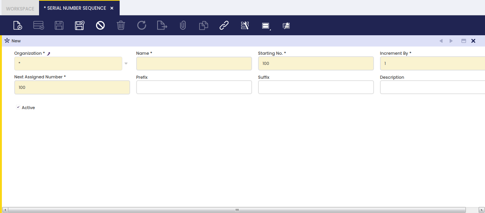

## Control nº serie { #serial-number-sequence }

:material-menu: `Aplicación` > `Gestión de Datos Maestros` > `Configuración de productos` > `Control nº serie`

### Visión general { #overview }

Un atributo de producto puede ser un número de serie.

Algunos productos requieren numeración de serie para asegurar el cumplimiento con los requisitos de trazabilidad impuestos por la mayoría de las industrias, lo cual implica que:

- cada unidad de un producto siempre debe estar vinculada a un número de serie único.

### Nº serie { #number-control }

Un número de serie es un número único asignado a cada unidad de un producto/artículo, que puede definirse con un prefijo o un sufijo, entre otras características.

Una secuencia de números de serie puede configurarse:

- definiendo el primer número o **Número inicial** que se utilizará como número de serie
- especificando el valor en el que el número de serie se **incrementará en**.  
  En el caso de los números de serie, siempre será "1".
- definiendo cuál es el **Valor actual** que se utilizará. Etendo actualiza el valor del siguiente número asignado a medida que se asignan los números de serie.
- introduciendo un **Prefijo** como **Nº serie?/**, que ayuda a entender fácilmente que el número en cuestión es un número de serie.
- introduciendo un **Sufijo** como **/2011**, que ayuda a proporcionar información adicional si fuese necesario.

---

Este trabajo es una obra derivada de [Gestión de Datos Maestros](https://wiki.openbravo.com/wiki/Master_Data_Management){target="\_blank"} de [Openbravo Wiki](http://wiki.openbravo.com/wiki/Welcome_to_Openbravo){target="\_blank"}, utilizada bajo [CC BY-SA 2.5 ES](https://creativecommons.org/licenses/by-sa/2.5/es/){target="\_blank"}. Este trabajo está licenciado bajo [CC BY-SA 2.5](https://creativecommons.org/licenses/by-sa/2.5/){target="\_blank"} por [Etendo](https://etendo.software){target="\_blank"}.
