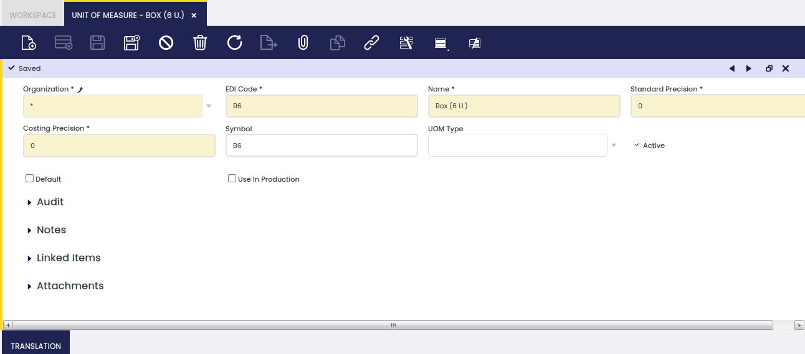

## Unidad de medida { #unit-of-measure }

:material-menu: `Aplicación` > `Gestión de Datos Maestros` > `Configuración de productos` > `Unidad de medida`

### Visión general { #overview }

Una unidad de medida es una unidad estándar o una combinación de unidades que se utilizará junto con la cantidad de un producto.

Hay muchas unidades de medida que se pueden utilizar para contabilizar la cantidad disponible de un producto, o para comprar o vender un producto.

Las unidades de medida también se pueden utilizar para medir el tiempo. Hay productos como servicios o recursos que deben medirse de esa manera.

A continuación, puede encontrar una lista de las unidades de medida que podría configurar en Etendo:

- **Unidad**
- **Empaquetar**
- **Hora**
- **Kilogramo**
- **KWh** (kilovatio hora)
- **Litro**
- **Palé**
- **Paquete**
- etc.

### Unidad de medida { #unit-of-measure_1 }

Los productos de cualquier tipo se gestionan en unidades de medida no monetarias.

Tal y como se muestra en la imagen anterior, se puede crear una unidad de medida no monetaria en Etendo completando los siguientes datos relevantes:

- el **Código EDI**, si existe.
- el **Nombre de la UOM**
- la **Precisión estándar** que se utilizará al redondear las cantidades calculadas de los productos que tengan esa unidad de medida
- la **Precisión de los  costos** que se utilizará al redondear el coste calculado de los productos que tengan esa unidad de medida.
- y el **Símbolo** o la abreviatura de unidad de medida de uso común

### Traducción { #translation }

Las Unidades de Medida se pueden traducir a cualquier idioma requerido.

La forma de conseguirlo es tan sencilla como:

- seleccionar primero el idioma requerido
- y luego introducir la unidad de medida traducida a ese idioma.

### Conversión { #conversion }

Edite la tasa de conversión de una unidad de medida a otra.

---

Este trabajo es una obra derivada de [Gestión de Datos Maestros](https://wiki.openbravo.com/wiki/Master_Data_Management){target="\_blank"} de [Openbravo Wiki](http://wiki.openbravo.com/wiki/Welcome_to_Openbravo){target="\_blank"}, utilizada bajo [CC BY-SA 2.5 ES](https://creativecommons.org/licenses/by-sa/2.5/es/){target="\_blank"}. Este trabajo está licenciado bajo [CC BY-SA 2.5](https://creativecommons.org/licenses/by-sa/2.5/){target="\_blank"} por [Etendo](https://etendo.software){target="\_blank"}.
