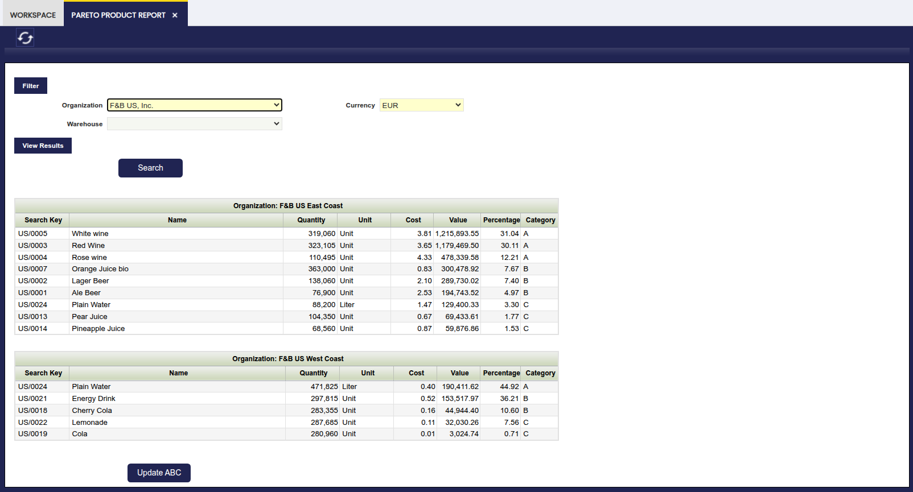

# Informe Pareto de Productos

:material-menu: `Aplicación` > `Gestión de Almacén` > `Herramientas de análisis` > `Informe Pareto de Productos`

## Descripción general

El Informe Pareto de Productos clasifica los productos en tres categorías — A, B y C — según la proporción del valor total del almacén que representa cada producto. Esta técnica se conoce comúnmente como **análisis ABC** y ayuda a las organizaciones a enfocar los esfuerzos de gestión de inventario donde más importan.

Por ejemplo:

| Categoría | Participación en el valor del almacén | Acción típica |
|-----------|---------------------------------------|---------------|
| **A** | ~80 % | Ciclo de conteo semanal, negociar condiciones con proveedores, mantener stock de seguridad ajustado |
| **B** | ~15 % | Ciclo de conteo mensual, reglas de reabastecimiento estándar |
| **C** | ~5 %  | Ciclo de conteo anual, considerar consolidación o discontinuación |

!!! info "Requisitos previos"
    La clasificación se basa en el costo de cada producto. Antes de ejecutar el informe, asegúrese de que lo siguiente esté configurado:

    - Una [Regla de cálculo de costes](../setup.md#costing-rules) validada para la organización.
    - Costos de **Transacción de Material** actualizados (disponibles en `Gestión de Almacén` > `Transacciones` > `Transacción de Material`) — estas son las entradas de costo registradas cada vez que el stock entra o sale.

    Si alguno de estos elementos falta, el informe puede devolver valores en cero o resultados incompletos.

## Parámetros

Antes de generar el informe, configure los siguientes filtros:

| Campo | Descripción |
|-------|-------------|
| **Organización** | Filtra el informe por la organización seleccionada. |
| **Moneda** | Define la moneda en la que se muestran todos los valores monetarios (Costo, Valor). Por defecto toma la moneda del sistema. |
| **Almacén** | Restringe el informe a un almacén específico dentro de la organización seleccionada. |

!!! warning
    Debe definirse un **Ratio de conversión** a la moneda seleccionada para que el informe funcione correctamente. Verifique esto en `Configuración General` > `Aplicación` > `Rangos de conversión` antes de ejecutar el informe.

Después de configurar los filtros, elija una de las dos acciones:

- **Buscar** — Muestra los resultados en la misma ventana.
- **Ver resultados** — Abre el informe en una vista separada, lo cual puede ser útil para imprimir o comparar en paralelo.

## Resultado del informe

El informe lista todos los productos del almacén seleccionado, ordenados por valor descendente, y asigna a cada producto su categoría ABC.

### Referencia de columnas

| Columna | Descripción |
|---------|-------------|
| **Identificador** | El código identificador único del producto. |
| **Nombre** | El nombre descriptivo del producto. |
| **Cantidad** | El stock actual (cantidad disponible) del producto en el almacén seleccionado. |
| **Unidad** | La unidad de medida del producto. |
| **Costo** | El costo unitario del producto (Valor total dividido por la Cantidad). |
| **Valor** | El valor total del inventario del producto, calculado como la suma de todos sus costos de transacciones de material. |
| **Porcentaje** | La relación entre el Valor del producto y el valor total del almacén (la suma de todas las líneas del informe). |
| **Categoría** | La clasificación ABC asignada al producto (A, B o C). Los productos cuyo valor acumulado alcanza hasta el 80 % del total se clasifican como A, los que se encuentran entre el 80 % y el 95 % como B, y el resto como C. |

!!! tip "Lectura de los resultados"
    Los productos al principio de la lista (Categoría A) tienen el mayor impacto individual en el valor del almacén. Enfoque primero los esfuerzos de revisión y control en estos artículos.

## Actualizar ABC

El botón **Actualizar ABC** en la parte inferior de la ventana escribe la clasificación de cada producto de vuelta al campo **ABC** en la pestaña **Org. Specific** de la ventana Producto.

- Si ya existe un registro para esa organización, el valor se **actualiza**.
- Si no existe ningún registro, se **crea un nuevo registro**.

Una vez guardada, la categoría ABC queda disponible para filtrar e informar en otras áreas de la aplicación — por ejemplo, al definir reglas de reabastecimiento o generar informes de compras.

!!! tip "Cuándo actualizar"
    Ejecute el informe y haga clic en **Actualizar ABC** periódicamente — por ejemplo, después de cada ciclo de valoración de inventario o cuando se hayan producido movimientos de stock significativos. Esto mantiene la clasificación alineada con las condiciones actuales del almacén.

## Uso de datos pre-agregados

Para usar datos pre-agregados, ejecute primero el [Informe Valoración de Stock](valued-stock-report.md). Una vez generado ese informe, el Informe Pareto de Productos reutilizará automáticamente sus resultados, reduciendo el tiempo de carga. Si omite este paso, el informe se ejecutará igualmente pero puede ser más lento en entornos de alto volumen.

!!! note
    El Informe Pareto de Productos también puede ejecutarse sin datos agregados. Sin embargo, el uso de datos agregados es especialmente útil en entornos de alto volumen donde se experimentan problemas de rendimiento al iniciar el informe.

---

Este trabajo es una derivación de [Warehouse Management](http://wiki.openbravo.com/wiki/Warehouse_Management){target="\_blank"} por [Openbravo Wiki](http://wiki.openbravo.com/wiki/Welcome_to_Openbravo){target="\_blank"}, utilizado bajo [CC BY-SA 2.5 ES](https://creativecommons.org/licenses/by-sa/2.5/es/){target="\_blank"}. Este trabajo está licenciado bajo [CC BY-SA 2.5](https://creativecommons.org/licenses/by-sa/2.5/){target="\_blank"} por [Etendo](https://etendo.software){target="\_blank"}.
