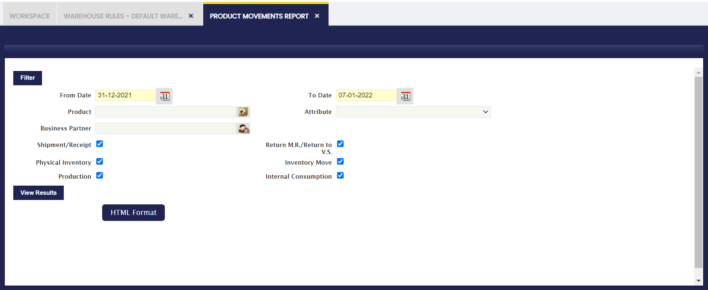

# Informe Movimiento de Productos { #product-movements-report }

:material-menu: `Aplicación` > `Gestión de Almacén` > `Herramientas de análisis` > `Informe Movimiento de Productos`

## Descripción general { #overview }

El **Informe Movimiento de Productos** proporciona una vista consolidada de todos los movimientos de productos que han tenido lugar en los almacenes. Abarca albaranes de proveedor, albaranes de cliente, movimientos de inventario, ajustes de inventario físico, transacciones de producción, consumos internos y devoluciones, todo agrupado por tipo de transacción y tercero.

Este informe ayuda a los responsables de almacén y coordinadores logísticos a responder preguntas clave del negocio, como:

- **¿Qué productos entraron o salieron durante un período específico?**: Realice un seguimiento del flujo entrante y saliente para comprender los patrones de demanda.
- **¿Qué terceros están asociados a cada movimiento?**: Identifique de un vistazo los albaranes de proveedor y los albaranes de cliente.
- **¿De dónde y hacia dónde se movieron los productos?**: Consulte las ubicaciones de almacén y hueco de origen y destino para cada transacción.
- **¿Existen discrepancias en el inventario?**: Compare los ajustes de inventario físico con los niveles de stock esperados para investigar diferencias.
- **¿Cuál es el historial completo de movimientos de un producto?**: Audite el rastro completo de un producto específico en todos los tipos de transacción.

Para una comprensión más amplia de las operaciones de almacén, consulte [Introducción a Gestión de Almacén](../getting-started.md) y [Transacciones de Almacén](../transactions.md).

## Ventana de Parámetros { #parameters-window }

Utilice la ventana de parámetros para filtrar el informe antes de generarlo. Los filtros disponibles son:

-   **Fecha desde** / **Fecha hasta**: Define el rango de fechas de los movimientos a incluir. Solo aparecen en el informe las transacciones dentro de este período.
-   **Producto**: Filtra por un [producto](../../master-data-management/product-setup/product-category.md) específico. Déjelo en blanco para incluir todos los productos.
-   **Atributo**: Filtra por un atributo de producto (como talla, color o lote). Déjelo en blanco para incluir todos los atributos.
-   **Tercero**: Filtra por un tercero específico (cliente o proveedor). Déjelo en blanco para incluir todos los terceros.

Además, utilice las casillas de verificación para incluir o excluir tipos de transacción específicos:

-   **Albarán/Recepción**: Incluye albaranes de cliente enviados a clientes y recepciones de proveedores.
-   **Devolución M.R./Devolución a V.S.**: Incluye devoluciones de material (Devolución M.R.) y devoluciones a proveedores (Devolución a V.S.).
-   **Inventario físico**: Incluye ajustes realizados durante los recuentos de inventario físico.
-   **Movimiento inventario**: Incluye movimientos de productos entre almacenes o huecos.
-   **Producción**: Incluye transacciones generadas por procesos de producción o fabricación.
-   **Consumo interno**: Incluye productos consumidos internamente (no enviados a un tercero externo).

Todas las casillas de verificación están habilitadas por defecto. Desmarque cualquier tipo para excluirlo de los resultados.

Tras configurar los filtros deseados, haga clic en **Ver resultados** para generar el informe. El informe también puede exportarse mediante el botón **Formato HTML**.

### Resultado del informe { #report-output }

El resultado del informe muestra los movimientos agrupados primero por tipo de transacción (por ejemplo, Entradas/Salidas) y luego por tercero. Cada fila representa un único movimiento de producto con las siguientes columnas:

-   **Nº Documento**: El identificador único del documento de origen (albarán de proveedor, albarán de cliente, recuento de inventario, etc.).
-   **Fecha**: La fecha en que se registró el movimiento.
-   **Descripción**: El nombre o descripción del producto implicado en el movimiento.
-   **Atributo**: El valor del atributo del producto, si corresponde (por ejemplo, número de lote o variante).
-   **Almacén de origen**: El almacén del que procedía el producto antes del movimiento.
-   **Ubicación de origen (X, Y, Z)**: Las coordenadas del hueco (Fila, Columna, Nivel) en el almacén de origen.
-   **Almacén de destino**: El almacén donde se recibió o trasladó el producto.
-   **Ubicación de destino (X, Y, Z)**: Las coordenadas del hueco (Fila, Columna, Nivel) en el almacén de destino.
-   **Salida**: Indica si el producto salió de la organización (Sí/No).
-   **Cantidad**: El número de unidades movidas, junto con la unidad de medida.

## Artículos relacionados { #related-articles }

[:material-file-document-outline: Informe Transacción de Material](material-transaction-report.md){ .md-button .md-button--primary }
[:material-file-document-outline: Informe Stock](stock-report.md){ .md-button .md-button--primary }
[:material-file-document-outline: Informe de Valuación de Existencias](valued-stock-report.md){ .md-button .md-button--primary }
[:material-file-document-outline: Introducción a Gestión de Almacén](../getting-started.md){ .md-button .md-button--primary }

---

This work is a derivative of [Warehouse Management](http://wiki.openbravo.com/wiki/Warehouse_Management){target="\_blank"} by [Openbravo Wiki](http://wiki.openbravo.com/wiki/Welcome_to_Openbravo){target="\_blank"}, used under [CC BY-SA 2.5 ES](https://creativecommons.org/licenses/by-sa/2.5/es/){target="\_blank"}. This work is licensed under [CC BY-SA 2.5](https://creativecommons.org/licenses/by-sa/2.5/){target="\_blank"} by [Etendo](https://etendo.software){target="\_blank"}.
