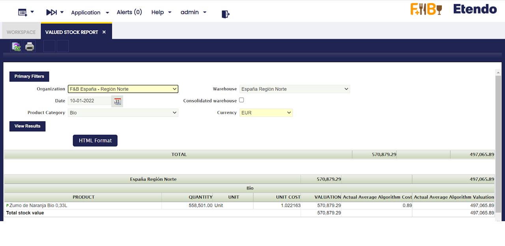
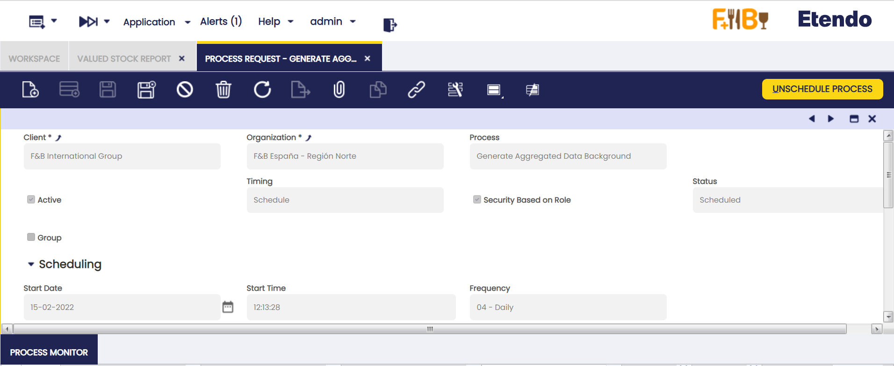

# Informe de Valuación de Existencias { #valued-stock-report }

:material-menu: `Aplicación` > `Gestión de Almacén` > `Herramientas de análisis` > `Informe de Valuación de Existencias`

## Descripción general { #overview }

El **Informe de Valuación de Existencias** proporciona una vista completa del inventario que se mantiene en cada almacén junto con su valor monetario. Es una herramienta esencial para comprender cuánto capital está inmovilizado en existencias, y da soporte a procesos empresariales clave como:

- **Informes financieros**: determinar el valor total del inventario para los balances y los cierres de período.
- **Conciliación contable**: comparar las valoraciones de existencias con los asientos del libro mayor para identificar discrepancias.
- **Análisis de costes**: evaluar los costes unitarios entre productos y almacenes para apoyar las decisiones de compra y de precios.
- **Visibilidad multi-almacén**: revisar los valores de existencias en varios almacenes, ya sea consolidados a nivel de organización o desglosados por almacén individual.

La valoración se calcula sumando el coste de cada [transacción de material](../transactions/goods-transaction.md) de cada producto en el almacén. Los costes de las transacciones se determinan mediante el proceso [Costing Server](../getting-started.md).

## Filtros primarios { #primary-filters }

<figure markdown="span">
  
  <figcaption>Ventana de parámetros del Informe de Valuación de Existencias</figcaption>
</figure>

Antes de generar el informe, configure los siguientes parámetros:

-   **Organización**: seleccione la organización sobre la que desea generar el informe. Solo están disponibles las organizaciones configuradas como *Legal with Accounting* (una entidad que contabiliza sus propios asientos contables) o *Generic* (una organización agrupadora sin contabilidad propia). Consulte con el administrador del sistema si no tiene claro el tipo de organización.
-   **Almacén**: cuando se selecciona una organización *Generic*, se listan todos los almacenes que pertenecen a esa organización. Cuando se selecciona una organización *Legal with Accounting*, no está disponible una selección específica de almacén.
-   **Fecha**: el informe muestra la información de inventario hasta esta fecha, inclusive.
-   **Almacén Consolidado**: cuando se marca, la información de existencias se consolida a nivel de organización. Cuando no se marca, el informe muestra un desglose por almacén individual.
-   **Categoría de producto**: filtra opcionalmente el informe para mostrar solo los productos que pertenecen a una [categoría](../../master-data-management/product-setup/product-category.md) específica.
-   **Moneda**: establece la [moneda](../../general-setup/application/currency.md) en la que se muestran todos los valores monetarios (como el coste y la valoración).

!!! warning
    Debe definirse un [tipo de cambio](../../general-setup/application/conversion-rates.md) a la moneda seleccionada para el informe. Si falta este tipo de cambio, el informe puede mostrar valores incorrectos o en cero en lugar de un mensaje de error. Verifique que el tipo de cambio esté configurado antes de confiar en los resultados.

## Ver resultados { #view-results }

<figure markdown="span">
  
  <figcaption>Salida del Informe de Valuación de Existencias</figcaption>
</figure>

Tras configurar los parámetros deseados, haga clic en **Ver resultados** para generar el informe. Exporte el informe mediante el botón **Formato HTML**.

La salida del informe incluye las siguientes columnas:

-   **Producto**: el nombre del producto.
-   **Cantidad**: la cantidad de existencias del producto a la fecha seleccionada.
-   **Unidad**: la unidad de medida en la que se expresa la cantidad de existencias.
-   **Coste Unitario**: el coste por unidad individual. Se calcula dividiendo la valoración total entre la cantidad de existencias.
-   **Valoración**: el valor monetario total de las existencias. Se calcula sumando las valoraciones de todas las transacciones de material que han tenido lugar en el almacén para ese producto.
-   **Actual Average/Standard Algorithm Cost**: el coste Medio o Estándar calculado más recientemente para el producto.
-   **Actual Average/Standard Algorithm Valuation**: la valoración de las existencias basada en el coste Medio o Estándar actual. Se calcula multiplicando la cantidad de existencias por el coste actual.

!!! info
    **Valoración** refleja el coste histórico de las transacciones que conformaron las existencias actuales. **Actual Average/Standard Algorithm Valuation** refleja cuánto valdrían hoy las existencias según el método de coste actual del producto. Estas dos cifras pueden diferir. Utilice **Valoración** para conciliar con las transacciones contables contabilizadas, y utilice **Actual Average/Standard Algorithm Valuation** para ver el valor de las existencias al coste actual.

## Mejora del rendimiento del informe (precálculo de datos) { #improving-report-performance-data-pre-calculation }

!!! note
    Este paso es **opcional**. El Informe de Valuación de Existencias funciona sin él. Sin embargo, si el informe tarda mucho en generarse porque el sistema tiene un gran volumen de transacciones, habilitar el precálculo de datos puede reducir significativamente los tiempos de espera.

El sistema puede resumir (precalcular) los datos de inventario de cada [período contable](../../financial-management/accounting/setup/openclose-period-control.md) cerrado con antelación, de modo que el informe no tenga que procesar cada transacción individual cada vez que se ejecuta. Para que esta funcionalidad funcione:

- Los períodos contables deben estar definidos en el [Calendario anual y periodos](../../financial-management/accounting/setup/fiscal-calendar.md).
- Al menos algunos períodos deben estar en estado *Cerrado* o *Cerrado permanente*.

!!! info
    Para habilitar esta funcionalidad, programe el proceso en segundo plano llamado *Generate Aggregated Data Background* a través de la ventana [Procesamiento de Peticiones](../../general-setup/process-scheduling/process-request.md).

El precálculo cubre todas las transacciones hasta el período cerrado más reciente. Las transacciones que ocurren después de ese período siguen calculándose en tiempo real. Si existe un período extenso de periodos abiertos con muchas transacciones, el informe puede seguir experimentando un rendimiento más lento.

<figure markdown="span">
  
  <figcaption>Ventana de Procesamiento de Peticiones configurada para el proceso de precálculo de datos</figcaption>
</figure>

!!! info
    Se recomienda programar este proceso para que se ejecute diariamente durante un período de baja actividad del sistema. El proceso solo genera nuevos datos precalculados cuando se ha cerrado o cerrado permanentemente un período adicional desde la última ejecución.

!!! warning "Limitaciones"
    Cuando el sistema precalcula los datos de un período cerrado, combina todas las transacciones de ese período en un único resumen. No se conserva la fecha original de cada transacción individual.

    **Qué significa esto para los informes multi-moneda:** si el informe se ejecuta en una moneda diferente de la moneda base de la organización, el sistema convierte los totales precalculados utilizando el tipo de cambio de la fecha de cierre del período, no el tipo de cambio de la fecha en que ocurrió originalmente cada transacción.

    Como resultado, pueden aparecer pequeñas diferencias en los valores de moneda en comparación con ejecutar el informe sin el precálculo habilitado, donde cada transacción se convertiría al tipo de cambio de su propia fecha.

---

Este trabajo es una derivación de [Warehouse Management](http://wiki.openbravo.com/wiki/Warehouse_Management){target="\_blank"} por [Openbravo Wiki](http://wiki.openbravo.com/wiki/Welcome_to_Openbravo){target="\_blank"}, utilizado bajo [CC BY-SA 2.5 ES](https://creativecommons.org/licenses/by-sa/2.5/es/){target="\_blank"}. Este trabajo está licenciado bajo [CC BY-SA 2.5](https://creativecommons.org/licenses/by-sa/2.5/){target="\_blank"} por [Etendo](https://etendo.software){target="\_blank"}.
