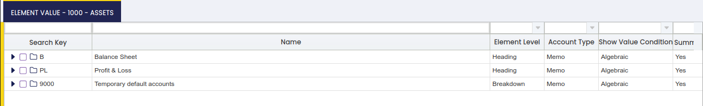
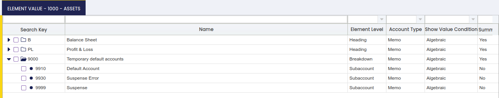

---
tags:
    - Cómo hacer
    - Árbol de cuentas
    - Plan de cuentas
    - Configuración contable
    - Gestión Financiera
---

## Visión general

En Etendo, un Árbol de cuentas define la estructura del Plan de cuentas (CoA) utilizado por una organización. Al crear un CoA desde cero, cada elemento debe crearse **individualmente** y, a continuación, organizarse en una **estructura jerárquica** que refleje los estados financieros de la organización.

El proceso comienza definiendo los nodos principales para el Balance y la Cuenta de resultados, y después creando progresivamente subnodos (Activos, Pasivos, Patrimonio neto, Ingresos, Gastos, etc.) hasta construir la estructura completa. 

#### Creación del Árbol de cuentas

La creación de un plan de cuentas desde cero implica crear cada elemento del plan de cuentas uno a uno:

-   Una vez creados, los elementos pueden organizarse de forma jerárquica según la estructura del estado financiero correspondiente utilizando la función **Arrastrar y soltar** de la funcionalidad Estructura de árbol.
-   Además, Etendo considera los elementos creados en orden alfanumérico como una lista ordenada y encuentra la posición en esa lista ordenada donde debe situarse el nuevo elemento.

Los pasos a seguir para la creación de un plan de cuentas (CoA) son:

-   seleccione la **Organización** para la cual se va a utilizar el CoA al contabilizar en el libro mayor, por ejemplo F&B US Inc.
-   introduzca el **Nombre** del Plan de cuentas, por ejemplo Test CoA
-   configúrelo como **Tipo definido por el usuario** para distinguirlo del Plan de cuentas importado
-   seleccione el **Árbol** como B&F International Group Element Value (Account, etc.).

Vaya a la pestaña **Cuenta Contable**.

Lo primero que debe hacerse en esta pestaña es crear todos los elementos de **Encabezado**, uno por cada estado financiero, por ejemplo **Balance** y **Cuenta de resultados**.

**Nodo de Balance:**

-   cree un nuevo registro
-   introduzca el valor **B** en el campo Identificador
-   introduzca el valor **Balance** en el campo Nombre
-   seleccione **Encabezado** en el campo Nivel del elemento
-   seleccione **Nota** en el campo Tipo de cuenta
-   seleccione el valor **Algebraico** en el campo Condición de mostrar valor
-   establezca el campo **Nivel agrupación** en Sí

**Nodo de Pérdidas y ganancias:**

-   cree un nuevo registro
-   introduzca el valor **P&L** en el campo Identificador
-   introduzca el valor **Pérdidas y ganancias** en el campo Nombre
-   seleccione **Encabezado** en el campo Nivel del elemento
-   seleccione **Nota** en el campo Tipo de cuenta
-   seleccione el valor **Algebraico** en el campo Condición de mostrar valor
-   y establezca el campo **Nivel agrupación** en Sí

Lo siguiente que debe hacerse en esta pestaña es crear un valor de elemento por cada nodo de estado financiero:

-   Los nodos de Balance son **Activos**, **Pasivos** y **Patrimonio neto**
-   Los nodos de Pérdidas y ganancias son **Ingresos** y **Coste de los bienes vendidos**, entre otros

##### Elementos de Balance

Centrémonos primero en explicar la creación de los nodos/elementos de un estado financiero de **Balance**.

El balance de una organización muestra su situación financiera en un momento determinado; las tres secciones de un balance son:

-   **Activos**
-   **Pasivos**
-   y **Patrimonio neto**

por lo tanto, el siguiente paso es crear un elemento del plan de cuentas por cada nodo del balance:

**Nodo de Activos:**

Para crear un nuevo registro, introduzca un valor en el campo **Identificador**; este valor podría ser un número, por ejemplo (1000), o un nombre (Activos).

!!! info
    Se recomienda utilizar un número, ya que ayuda al crear nuevos elementos del plan de cuentas. Se considera la siguiente regla al crear nuevos elementos del plan de cuentas:    
        Etendo primero considera los elementos en orden alfanumérico como una lista ordenada, encuentra la posición en esa lista ordenada donde debe situarse el nuevo elemento, mira el elemento que lo precede y, si ese elemento es un elemento de resumen y el elemento actual no lo es, añade el elemento como hijo de ese nodo; en caso contrario, añade el elemento como hermano de ese nodo.

-   introduzca el valor **Activos** en el campo Nombre
-   seleccione **Encabezado** en el campo Nivel del elemento
-   seleccione el valor **Activos** en el campo Tipo de cuenta
-   seleccione el valor **Algebraico** en el campo Condición de mostrar valor
-   y establezca el campo **Nivel agrupación** en Sí

Una vez hecho, este nodo se arrastra y se suelta bajo el **nodo de Balance**.

**Nodo de Pasivos:**

-   cree un nuevo registro
-   introduzca el valor (2000) en el campo Identificador
-   introduzca el valor **Pasivos** en el campo Nombre
-   seleccione **Encabezado** en el campo Nivel del elemento
-   seleccione el valor **Pasivo** en el campo Tipo de cuenta
-   seleccione el valor **Algebraico** en el campo Condición de mostrar valor
-   y establezca el campo **Nivel agrupación** en Sí

**Nodo de Patrimonio neto:**

-   cree un nuevo registro
-   introduzca el valor (3000) en el campo Identificador
-   introduzca el valor **Patrimonio neto** en el campo Nombre
-   seleccione **Encabezado** en el campo Nivel del elemento
-   seleccione el valor **Patrimonio neto** en el campo Tipo de cuenta
-   seleccione el valor **Algebraico** en el campo Condición de mostrar valor
-   y establezca el campo **Nivel agrupación** en Sí

!!! info
    Esta vez no es necesario arrastrar y soltar estos dos últimos nodos, ya que Etendo lo hace según la regla explicada anteriormente.

Tanto el Nodo de Pasivos como el Nodo de Patrimonio neto son nodos de resumen; por lo tanto, se añaden como hermanos del Nodo de Activos (elemento que los precede).

Es muy habitual desglosar los activos y pasivos en activos (o pasivos) corrientes y activos (o pasivos) a largo plazo.

Además, **Activos** puede dividirse en **Efectivo, inventario y cuentas a cobrar**, **Pasivos** puede dividirse en **Cuentas a pagar** y **Pagaré**, y finalmente **Patrimonio neto** puede dividirse en **Capital social** y **Reservas**, entre otros.

Todo lo anterior guía la creación de los siguientes subnodos en un nivel inferior bajo los nodos de encabezado.

**Nodo de Activos corrientes:**

-   cree un nuevo registro
-   introduzca el valor (1100) en el campo Identificador
-   introduzca el valor **Activos corrientes** en el campo Nombre
-   seleccione **Separar** en el campo Nivel del elemento
-   seleccione el valor **Activos** en el campo Tipo de cuenta
-   seleccione el valor **Algebraico** en el campo Condición de mostrar valor
-   y establezca el campo **Nivel agrupación** en Sí

Una vez hecho, arrastre este nodo bajo el nodo 1000-Activos.

**Nodo de Activos a largo plazo:**

-   cree un nuevo registro
-   introduzca el valor (1500) en el campo Identificador
-   introduzca el valor **Activos a largo plazo** en el campo Nombre
-   seleccione **Separar** en el campo Nivel del elemento
-   seleccione el valor **Activos** en el campo Tipo de cuenta
-   seleccione el valor **Algebraico** en el campo Condición de mostrar valor
-   y establezca el campo **Nivel agrupación** en Sí

!!! info
    Esta vez no es necesario arrastrar y soltar este último nodo, ya que Etendo lo hace según la regla explicada anteriormente.

El Nodo de Activos a largo plazo es un nodo de resumen; por lo tanto, se añade como hermano del Nodo de Activos corrientes (elemento que lo precede).

**Nodo de Pasivos corrientes:**

-   cree un nuevo registro
-   introduzca el valor (2100) en el campo Identificador
-   introduzca el valor **Pasivos corrientes** en el campo Nombre
-   seleccione **Separar** en el campo Nivel del elemento
-   seleccione el valor **Pasivo** en el campo Tipo de cuenta
-   seleccione el valor **Algebraico** en el campo Condición de mostrar valor
-   y establezca el campo **Nivel agrupación** en Sí

Una vez hecho, arrastre este nodo bajo el nodo 2000-Pasivos.

**Nodo de Pasivos a largo plazo:**

-   cree un nuevo registro
-   introduzca el valor (2500) en el campo Identificador
-   introduzca el valor **Pasivos a largo plazo** en el campo Nombre
-   seleccione **Separar** en el campo Nivel del elemento
-   seleccione el valor **Pasivo** en el campo Tipo de cuenta
-   seleccione el valor **Algebraico** en el campo Condición de mostrar valor
-   y establezca el campo **Nivel agrupación** en Sí

!!! info
    Esta vez no es necesario arrastrar y soltar este último nodo, ya que Etendo lo hace según la regla explicada anteriormente.

El Nodo de Pasivos a largo plazo es un nodo de resumen; por lo tanto, se añade como hermano del Nodo de Pasivos corrientes (elemento que lo precede).

**Nodo de Efectivo:**

-   cree un nuevo registro
-   introduzca el valor (1110) en el campo Identificador
-   introduzca el valor **Efectivo** en el campo Nombre
-   seleccione **Cuenta** en el campo Nivel del elemento
-   seleccione el valor **Activos** en el campo Tipo de cuenta
-   seleccione el valor **Algebraico** en el campo Condición de mostrar valor
-   y establezca el campo **Nivel agrupación** en Sí

Una vez hecho, arrastre este nodo bajo el nodo 1100-Activos corrientes.

**Nodo de Cuentas a cobrar:**

-   cree un nuevo registro
-   introduzca el valor (1120) en el campo Identificador
-   introduzca el valor **Cuentas a cobrar** en el campo Nombre
-   seleccione **Cuenta** en el campo Nivel del elemento
-   seleccione el valor **Activos** en el campo Tipo de cuenta
-   seleccione el valor **Algebraico** en el campo Condición de mostrar valor
-   y establezca el campo **Nivel agrupación** en Sí

!!! info
    Esta vez no es necesario arrastrar y soltar este último nodo, ya que Etendo lo hace según la regla explicada anteriormente.

El Nodo de Cuentas a cobrar es un nodo de resumen; por lo tanto, se añade como hermano del Nodo de Efectivo (elemento que lo precede).

El Nodo de Efectivo necesita tener elementos de subcuenta debajo, por ejemplo:

**111200 Cuenta corriente**

-   cree un nuevo registro
-   introduzca 111200 en el campo Identificador
-   introduzca el valor **Cuenta corriente** en el campo Nombre
-   seleccione **Subcuenta** en el campo Nivel del elemento
-   seleccione el valor **Activos** en el campo Tipo de cuenta
-   y seleccione el valor **Algebraico** en el campo Condición de mostrar valor

**111300 Cuenta corriente en transferencia**

-   cree un nuevo registro
-   introduzca 111300 en el campo Identificador
-   introduzca el valor **Cuenta corriente en transferencia** en el campo Nombre
-   seleccione **Subcuenta** en el campo Nivel del elemento
-   seleccione el valor **Activos** en el campo Tipo de cuenta
-   y seleccione el valor **Algebraico** en el campo Condición de mostrar valor

**111400 Caja chica**

-   cree un nuevo registro
-   introduzca 111400 en el campo Identificador
-   introduzca el valor **Caja chica** en el campo Nombre
-   seleccione **Subcuenta** en el campo Nivel del elemento
-   seleccione el valor **Activos** en el campo Tipo de cuenta
-   y seleccione el valor **Algebraico** en el campo Condición de mostrar valor

Las subcuentas anteriores son las que se utilizan al contabilizar asientos en el libro mayor.

!!! info
    No es necesario arrastrar y soltar las tres subcuentas anteriores en el nodo correspondiente, ya que Etendo lo hace.

El Nodo de Cuentas a cobrar necesita tener elementos de subcuenta debajo, por ejemplo:

**112100 Cuentas a cobrar comerciales**

-   cree un nuevo registro
-   introduzca 112100 en el campo Identificador
-   introduzca el valor **Cuentas a cobrar comerciales** en el campo Nombre
-   seleccione **Subcuenta** en el campo Nivel del elemento
-   seleccione el valor **Activos** en el campo Tipo de cuenta
-   y seleccione el valor **Algebraico** en el campo Condición de mostrar valor

**112200 Cuentas a cobrar de impuestos**

-   cree un nuevo registro
-   introduzca 112200 en el campo Identificador
-   introduzca el valor **Cuentas a cobrar de impuestos** en el campo Nombre
-   seleccione **Subcuenta** en el campo Nivel del elemento
-   seleccione el valor **Activos** en el campo Tipo de cuenta
-   y seleccione el valor **Algebraico** en el campo Condición de mostrar valor

Las subcuentas anteriores son las que se utilizan al contabilizar asientos en el libro mayor.

No es necesario arrastrar y soltar las dos subcuentas anteriores en el nodo correspondiente, ya que Etendo lo hace tal y como se explicó anteriormente.

Deben seguirse los mismos pasos para la creación de otros tipos de nodo de Cuenta y Subcuenta bajo los nodos:

-   Activos a largo plazo
-   Pasivos corrientes
-   Pasivos a largo plazo
-   y Patrimonio neto

Por último, pero no menos importante, es necesario crear un nodo que resuma los activos, otro que resuma los pasivos y el último que resuma el patrimonio neto.

Tomemos como ejemplo la creación del nodo de total de activos:

**Nodo de Total de activos**

-   cree un nuevo registro
-   introduzca 1900 en el campo Identificador
-   introduzca el valor **Total de activos** en el campo Nombre
-   introduzca 1100+1500 en el campo Descripción como forma de describir que este nodo suma los activos corrientes y los activos a largo plazo.
-   seleccione **Encabezado** en el campo Nivel del elemento
-   seleccione el valor **Activos** en el campo Tipo de cuenta
-   y seleccione el valor **Algebraico** en el campo Condición de mostrar valor
-   vaya a la pestaña Elemento personalizado
-   cree un nuevo registro
-   introduzca **1** en el campo Signo
-   seleccione la Cuenta **1100 - Activos corrientes**
-   cree un nuevo registro
-   introduzca **1** en el campo Signo
-   seleccione la Cuenta **1500 - Activos a largo plazo**

##### **Elementos de Cuenta de resultados**

Ahora, expliquemos brevemente la creación de los nodos/elementos de una **Cuenta de resultados**.

La cuenta de resultados de una organización muestra el rendimiento financiero de la empresa durante un periodo de tiempo (normalmente un año); por lo tanto, tiene dos secciones principales:

-   la primera sección detalla los ingresos de la organización
-   la segunda sección detalla los gastos de la organización

La cuenta de resultados también tiene en cuenta el coste de los bienes vendidos; por lo tanto, el beneficio bruto se refiere a la suma de los ingresos de una organización menos el coste de los bienes vendidos.

Además, es muy habitual separar los **Gastos de explotación** de los **Gastos no operativos**; por lo tanto, es posible calcular el resultado de explotación como la diferencia entre el beneficio bruto y los gastos de explotación, mientras que el resultado neto es la diferencia entre el resultado de explotación y los gastos no operativos.

Todo lo anterior impulsa la creación de los nodos/elementos que, una vez organizados, representarán la estructura de la cuenta de resultados de la organización.

Los nodos a crear, por ejemplo, pueden ser:

-   El nodo de **Ingresos**:
    -   este nodo de Encabezado y tipo de cuenta Ingresos puede incluir todas las subcuentas de ingresos.
-   El nodo de **Total de ingresos**:
    -   este nodo de Encabezado y tipo de cuenta Ingresos puede incluir un elemento personalizado del nodo de Ingresos anterior.
-   El nodo de **Coste de los bienes vendidos**:
    -   este nodo de Encabezado y tipo de cuenta Gastos puede incluir todas las subcuentas relacionadas con el coste de los bienes vendidos.
-   El nodo de **Total del coste de los bienes vendidos**:
    -   este nodo de Encabezado y tipo de cuenta Gastos puede incluir un elemento personalizado del nodo de Coste de los bienes vendidos anterior.
-   El nodo de **Margen bruto**:
    -   este nodo de Encabezado y tipo de cuenta Ingresos es un elemento personalizado del nodo de Ingresos y del nodo de Coste de los bienes vendidos anterior.
-   el nodo de **Gastos de explotación**:
    -   este nodo de Encabezado y tipo de cuenta Gastos puede incluir todas las subcuentas relacionadas con los gastos de explotación.
-   El nodo de **Total de gastos de explotación**:
    -   este nodo de Encabezado y tipo de cuenta Gastos puede incluir un elemento personalizado del nodo de Gastos de explotación anterior.
-   El nodo de **Resultado de explotación**:
    -   este nodo de Encabezado y tipo de cuenta Ingresos puede incluir un elemento personalizado del nodo de Ingresos, del nodo de Coste de los bienes vendidos y del nodo de Gastos de explotación.
-   El nodo de **Gasto no operativo**:
    -   este nodo de Encabezado y tipo de cuenta Gastos puede incluir todas las subcuentas relacionadas con los gastos no operativos.
-   El nodo de **Total de gastos no operativos**:
    -   este nodo de Encabezado y tipo de cuenta Gastos puede incluir un elemento personalizado del nodo de Gasto no operativo anterior.
-   y, por último, el nodo de **Resultado neto**:
    -   este nodo de Encabezado y tipo de cuenta Ingresos puede incluir un elemento personalizado del nodo de Resultado de explotación anterior y del nodo de Total de gastos no operativos anterior.

##### **Elementos temporales**

Como ya se ha explicado, existe una estrecha relación entre un **árbol de cuentas** y la configuración del Libro mayor en Etendo, ya que el Árbol de cuentas es una Dimensión del Libro mayor.

La configuración del Libro mayor también incluye un conjunto de cuentas por defecto (o subcuentas en términos de Etendo) que se utilizarán al contabilizar determinados tipos de transacciones. Esas cuentas deben crearse primero en el árbol de cuentas y luego configurarse en las pestañas de Configuración del Libro mayor que se enumeran a continuación:

-   [Contabilidad general](#contabilidad-general)
-   [Valores por defecto](#valores-por-defecto)

La mayoría de esas cuentas por defecto son cuentas de libro mayor, tales como:

-   la cuenta de Resumen de ingresos
-   la cuenta de Reservas
-   la cuenta de Pasivo de proveedor
-   o la cuenta de Cuentas a cobrar de cliente

Sin embargo, hay algunas de estas cuentas que no son cuentas de libro mayor, sino lo que podemos llamar cuentas **Temporales**, como la cuenta **Cuenta de asiento no cuadrado**.

!!! info
    No es necesario crear una cuenta de libro mayor por defecto, ya que estas se crean como parte del árbol de cuentas.

Sin embargo, las cuentas temporales por defecto deben crearse en el árbol de cuentas bajo una rama o nodo específico del árbol, para conseguir que el saldo de esas cuentas temporales no se tenga en cuenta al lanzar el Balance o la Cuenta de resultados.

Por lo tanto, debe crearse un nuevo elemento de **Encabezado** y **Resumen** en la pestaña **Nivel del elemento**; ese elemento puede denominarse **Cuentas temporales**.

Una vez creado, las cuentas siguientes (subcuentas) pueden crearse y moverse debajo de él:

-   cuenta Cuenta de asiento no cuadrado
-   cuenta de error de Cuenta de asiento no cuadrado

---

Este trabajo es una obra derivada de [Gestión Financiera](https://wiki.openbravo.com/wiki/Account_Tree){target="\_blank"} de [Openbravo Wiki](http://wiki.openbravo.com/wiki/Welcome_to_Openbravo){target="\_blank"}, utilizada bajo [CC BY-SA 2.5 ES](https://creativecommons.org/licenses/by-sa/2.5/es/){target="\_blank"}. Esta obra está licenciada bajo [CC BY-SA 2.5](https://creativecommons.org/licenses/by-sa/2.5/){target="\_blank"} por [Etendo](https://etendo.software){target="\_blank"}.