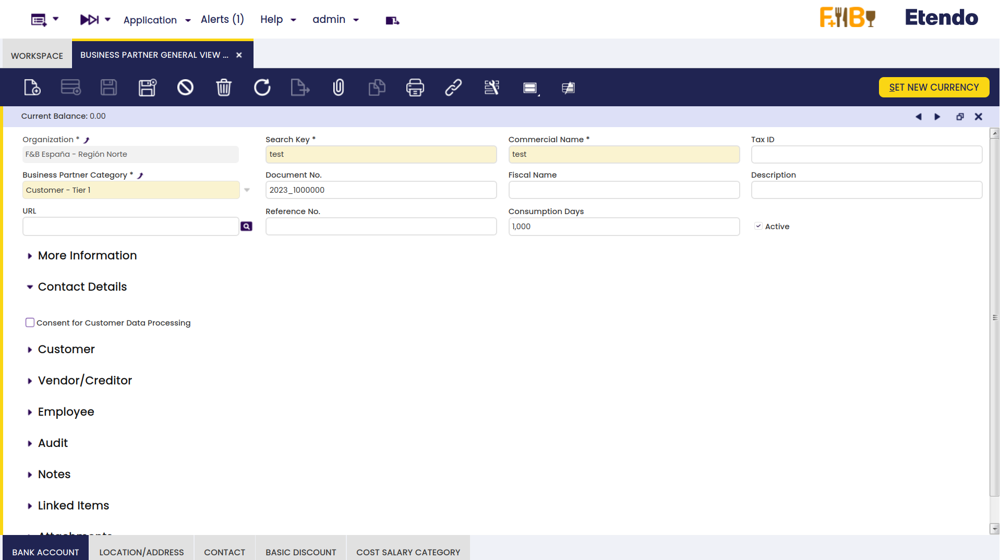
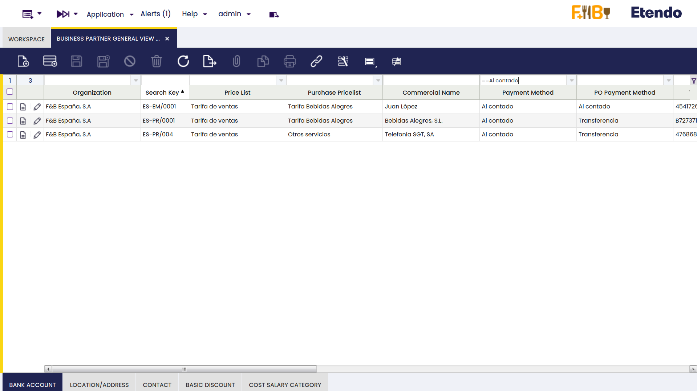
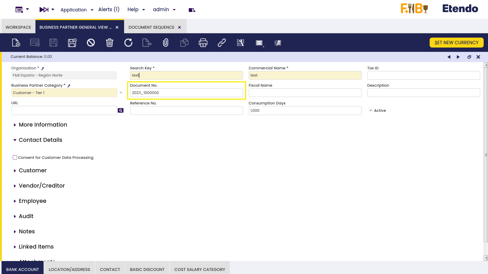
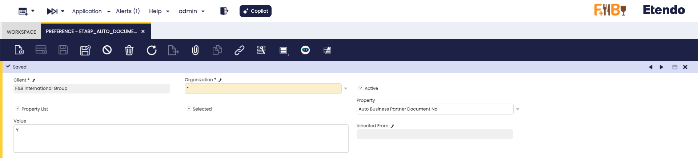
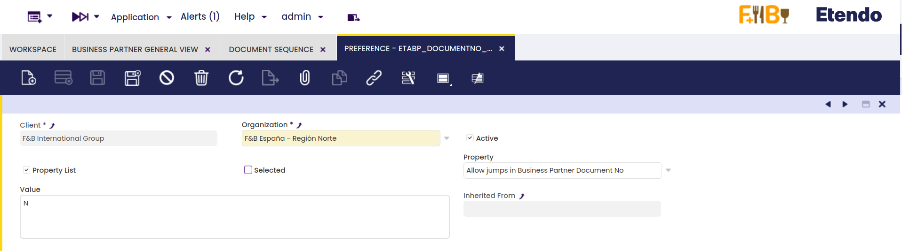
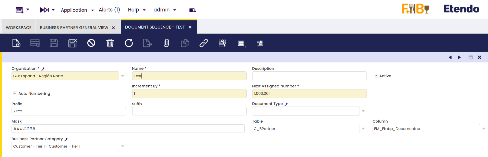

---
tags:
    - Terceros avanzados
    - Essentials Extensions
    - Terceros
    - Secuencia
---

# Terceros avanzados { #advanced-business-partner }
:octicons-package-16: Javapackage: `com.etendoerp.advanced.businesspartner` 

## Visión general { #overview }
Esta sección describe el módulo Terceros avanzados incluido en el bundle Etendo Essentials Extensions.

<iframe width="560" height="315" src="https://www.youtube.com/embed/sRvQCM8xZE0" title="Reproductor de vídeo de YouTube" frameborder="0" allow="accelerometer; autoplay; clipboard-write; encrypted-media; gyroscope; picture-in-picture; web-share" allowfullscreen></iframe>

!!! info
    Para poder incluir esta funcionalidad, debe estar instalado el Essentials Bundle. Para ello, siga las instrucciones del [Marketplace](https://marketplace.etendo.cloud/#/product-details?module=39AC2D9F72124AC7A1D0A3D005293C9E){target="_blank"}.

El módulo **Terceros avanzados** permite al usuario tener una vista general de la información de terceros y asignar números de secuencia a los terceros.

## Vista general de terceros { #business-partner-general-view }

:material-menu: `Aplicación` > `Gestión de Datos Maestros` > `Vista general de terceros`

La Vista general de terceros centraliza todos los datos del tercero — información de cliente, proveedor y empleado — en una única ventana, eliminando la necesidad de navegar entre solapas para consultar o actualizar condiciones comerciales.

En esta ventana, toda la información de terceros se consolida en un único formulario: las secciones Cliente, Proveedor/Acreedor y Empleado son visibles directamente en la vista principal, sin necesidad de cambiar entre solapas como ocurre en la ventana estándar Terceros.

En la vista de grilla, los campos de distintas solapas de la ventana estándar — como método de pago, tarifa y tarifa de compra — están disponibles como columnas. Esto permite filtrar, comparar y editar múltiples terceros a la vez sin necesidad de abrir cada registro de forma individual.

## Secuencia de documento (numeración) { #document-sequence }

:material-menu: `Aplicación` > `Gestión Financiera` > `Contabilidad` > `Configuración` > `Secuencia de documento (numeración)`

En esta ventana, también es posible crear una **secuencia** para cada tercero en función de su categoría. Esta secuencia se puede encontrar en el campo **Nº de documento** en la ventana **Terceros**.

Para ello, primero debe establecer algunas *preferencias* y configurar la *secuencia*, tal y como se explica a continuación.

### Preferencias { #preferences }

:material-menu: `Aplicación` > `Configuración General` > `Aplicación` > `Preferencias`

Para configurar una secuencia de terceros, deben habilitarse dos preferencias. Estas se pueden encontrar en la ventana **Preferencias**.

#### Nº de documento automático de terceros { #auto-business-partner-document-no }

Esta propiedad permite la generación automática de secuencias para terceros. El valor por defecto es *N* y, en caso de que sea necesario habilitar esta generación automática, **debe crearse una nueva preferencia**, pero con el valor `Y` y la opción `Selected` marcada. Cuando está deshabilitada, el campo *Nº de documento* se dejará en blanco.

#### Permitir saltos en el Nº de documento de terceros { #allow-jumps-in-business-partner-document-no }

Esta propiedad permite saltar entre los diferentes números de documento. El valor por defecto es *N*, por lo que no se permite **eliminar terceros** ni **cambiar las categorías de terceros**.

Sin embargo, es posible **crear una nueva preferencia** con valor *Y* y la opción `Selected` marcada para habilitar esta opción. Cuando se cambia la categoría del tercero, el número de documento también se modifica de acuerdo con la secuencia de documento (numeración) correspondiente.

### Cómo configurar la numeración de secuencias { #how-to-configure-sequences-number }

:material-menu: `Aplicación` > `Gestión Financiera` > `Contabilidad` > `Configuración` > `Secuencia de documento (numeración)`

Para configurar la **Secuencia**, vaya a la ventana *Secuencia de documento (numeración)*, cree un nuevo registro para cada organización y categoría, establezca la tabla, la columna y la categoría de terceros correspondientes, y guarde el registro. Los campos de tabla y columna deben completarse con las opciones que se muestran a continuación.

!!! info
    Para más información, visite [Secuencia](../../../../../developer-guide/etendo-classic/how-to-guides/how-to-use-advanced-sequences.md).

---
This work is licensed under :material-creative-commons: :fontawesome-brands-creative-commons-by: :fontawesome-brands-creative-commons-sa: [ CC BY-SA 2.5 ES](https://creativecommons.org/licenses/by-sa/2.5/es/){target="_blank"} by [Futit Services S.L](https://etendo.software){target="_blank"}.