# Integración bancaria con Salt Edge { #bank-integration-with-salt-edge }

:octicons-package-16: Javapackage: `com.etendoerp.psd2.bank.integration`

!!!info "Antes de comenzar"
    Este módulo requiere que el **Financial Extensions Bundle** esté instalado en su entorno de Etendo. Si no está seguro de si está instalado, contacte con su administrador de sistemas antes de continuar. Para instrucciones de instalación, visite el marketplace: [Financial Extensions Bundle](https://marketplace.etendo.cloud/#/product-details?module=9876ABEF90CC4ABABFC399544AC14558){target="_blank"}. Para conocer las versiones disponibles y la compatibilidad con el core, visite [Financial Extensions - Release notes](../../../../../whats-new/release-notes/etendo-classic/bundles/financial-extensions/release-notes.md).

## Visión general { #overview }

Esta página explica cómo conectar cuentas bancarias a Etendo para que las transacciones se importen automáticamente y los pagos salientes puedan iniciarse directamente desde el sistema. Está dirigida al personal de finanzas y contabilidad que realiza conciliaciones bancarias y ejecuciones de pagos a proveedores, y a los administradores que realizan la configuración inicial.

El módulo ofrece dos capacidades principales, ambas impulsadas por **[Salt Edge](https://www.saltedge.com/){target="_blank"}**, una plataforma de Open Banking que actúa como intermediario seguro entre Etendo y las entidades bancarias, conforme a la directiva PSD2.

- **AIS (Account Information Service)**: conecte de forma segura las cuentas bancarias y descargue automáticamente las transacciones para su conciliación.

    ``` mermaid
    flowchart LR
        A([Conectar cuenta bancaria]) --> B[Otorgar permisos]
        B --> C[Descargar transacciones]
        C --> D([Extracto listo<br/>para conciliación ✅])
    ```

- **PIS (Payment Initiation Service)**: inicie pagos a proveedores directamente desde Etendo, con la autorización gestionada a través del banco.

    ``` mermaid
    flowchart LR
        A([Crear Pago]) --> B[Generar pago bancario]
        B --> C[Autorizar en el portal del banco]
        C --> D[Verificar estado del pago]
        D --> E([Pago ejecutado ✅])
    ```


| | AIS | PIS |
|---|---|---|
| :material-bank-transfer: | Importación automatizada de transacciones | Iniciación directa de pagos |
| :material-bank-outline: | Varios bancos simultáneamente | Plantillas SEPA, FPS y DOMESTIC |
| :material-shield-check: | Las credenciales bancarias nunca se almacenan en Etendo | La autorización la gestiona el banco |

## Requisitos previos { #prerequisites }

Confirme lo siguiente antes de utilizar la funcionalidad de Integración bancaria:

- :material-server: **Configuración del servidor**: su administrador de sistemas ha configurado la URL de la aplicación `context.url` en el servidor de Etendo y ha ejecutado el proceso de configuración. Contacte con su equipo de IT o con el partner de implementación para confirmar que esto se ha realizado.
- :material-key: **Clave de API de Salt Edge**: su organización dispone de una Clave de API de Salt Edge. Contacte con el [Soporte de Etendo](../../../../../help-and-support/support-service.md) para solicitarla.
- :material-account: **Configuración de la Entidad**: la clave API se configura una única vez a nivel de Entidad (se detalla en la sección de Configuración a continuación).
- :material-bank-outline: **Cuentas financieras**: las cuentas financieras que se vincularán a sus cuentas bancarias existen en Etendo.

## Configuración { #setup }

### 1. Configurar la clave API de Salt Edge { #1-configure-salt-edge-api-key }

:material-menu: `Aplicación` > `Configuración General` > `Entidad`

Como **Administrador**:

1. Abra la ventana **Entidad** y seleccione su Entidad.
2. En el grupo de campos **Integración bancaria**, introduzca la **Clave de API** proporcionada por el servicio de soporte.

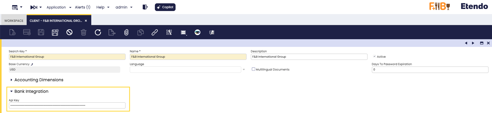

!!!info
    La clave API se configura **una vez por Entidad** y la comparten todos los usuarios de esa Entidad, incluidos los procesos planificados.

!!!warning "Visibilidad de botones y campos"
    Todos los botones y campos de Integración bancaria **solo son visibles** cuando la Entidad actual tiene configurada una clave API. Esto incluye:

    - En la ventana **Cuenta Financiera**: el botón **Conectar cuenta**, el botón **Obtener extracto bancario**, el selector **Proveedor bancario** y los campos **Fecha de importación desde**, **Fecha de importación hasta** y **Agrupación de extractos**.
    - En la ventana **Pago**: el botón **Generar pago bancario**.

    Si no ve estos elementos, verifique que la Entidad tenga una clave API válida configurada en la ventana **Entidad**.

### 2. Configurar cuentas financieras { #step-2-configure-financial-accounts }

:material-menu: `Gestión Financiera` > `Gestión de Cobros y Pagos` > `Transacciones` > `Cuenta Financiera`

El módulo admite cuentas financieras de tipo **Banco** y **Tarjeta**. Los campos que se describen a continuación se aplican por igual a ambos tipos.

Para cada cuenta financiera que desee sincronizar con un banco, ábrala y complete los siguientes campos en la pestaña **Integración bancaria**:

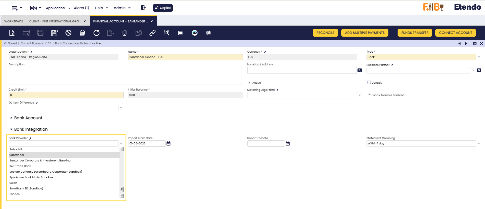

- **Proveedor bancario**: El banco asociado a esta cuenta. Si está configurado, el paso de selección de banco se omite al conectar (AIS) o al iniciar pagos (PIS). Déjelo vacío para seleccionar el banco manualmente cada vez; una vez que conecte con éxito, el sistema completa automáticamente este campo con el banco al que se conectó. La lista de proveedores debe sincronizarse primero; consulte el Paso 3.
- **Fecha de importación desde**: Fecha de inicio para importar transacciones. Si se deja vacía, el sistema utiliza la fecha del último extracto bancario importado. Establezca esta fecha solo para la importación inicial (p. ej., inicio del ejercicio fiscal); déjela vacía después para que las importaciones continúen automáticamente desde donde se detuvieron.
- **Fecha de importación hasta**: Fecha de fin para importar transacciones. Si se deja vacía, el sistema utiliza la fecha actual. Déjela vacía en la operación habitual. Déjela también vacía para que el proceso automático **Obtener extractos bancarios** incluya esta cuenta; si se establece una fecha, el proceso omite esa cuenta en cada ejecución programada.
- **Agrupación de extractos**: Controla cómo se agrupan las transacciones importadas en extractos bancarios: **Dentro de un día** (por defecto) agrupa las transacciones del mismo día en un único extracto; **Nuevo extracto en cada ejecución** crea un nuevo extracto en cada importación; **Dentro de 7 días** y **Dentro de 30 días** agrupan las transacciones en un único extracto por semana o por mes respectivamente, reactivándolo si ya ha sido procesado. Use una agrupación más amplia cuando importe con frecuencia para reducir el número total de extractos.

### 3. Sincronizar proveedores bancarios { #3-synchronize-bank-providers }

:material-menu: `Gestión Financiera` > `Gestión de Cobros y Pagos` > `Configuración` > `Integración bancaria` > `Sincronizar proveedores bancarios`

Ejecute este proceso una vez durante la configuración inicial. Vuelva a ejecutarlo bajo demanda si un proveedor bancario no aparece en la lista o si desea verificar si un banco concreto está soportado por Salt Edge. Ejecute el proceso desde el menú anterior; no se requiere ningún usuario específico.

!!!info
    Este paso es necesario antes de asignar un **Proveedor bancario** a una cuenta financiera o de iniciar pagos.

## Flujo de conexión bancaria (AIS) { #bank-connection-flow-ais }

### Conectar una cuenta bancaria o de tarjeta { #connect-a-bank-or-card-account }

Una vez configurada la clave API de la Entidad y establecidas las fechas de la cuenta financiera:

!!!tip
    Introduzca el campo **IBAN** en su Cuenta Financiera antes de conectar, si ya lo conoce. Para las cuentas de tipo **Banco**, el sistema intenta completar este campo automáticamente con los datos devueltos por el banco cuando está vacío; consulte el paso 4 a continuación para más detalles.

1. Abra la **Cuenta Financiera** (de tipo **Banco** o **Tarjeta**) que desea conectar y haga clic en el botón **Conectar cuenta**. Se abre un **widget de conexión de Salt Edge** en una ventana emergente; busque su banco en la lista de bancos soportados y selecciónelo para continuar.

    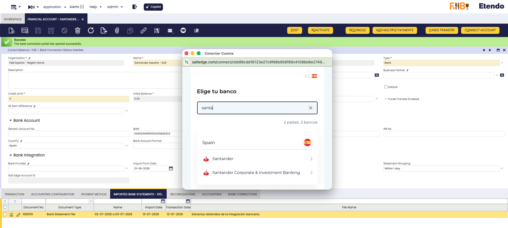

    !!!info
        Si ha asignado un **Proveedor bancario** a la Cuenta Financiera (consulte [Configuración - Paso 2](#step-2-configure-financial-accounts)), el paso de selección de banco se **omite automáticamente** y será llevado directamente a la página de autenticación de su banco.

2. **Autorice la conexión**: su banco le pedirá que confirme el permiso para que Salt Edge acceda a la información de su cuenta.

    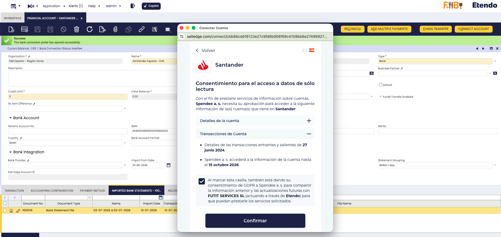

    Revise los permisos, confirme, y será redirigido a la página de inicio de sesión de su banco. Inicie sesión con sus credenciales bancarias (usuario, contraseña y cualquier autenticación adicional que requiera su banco).

    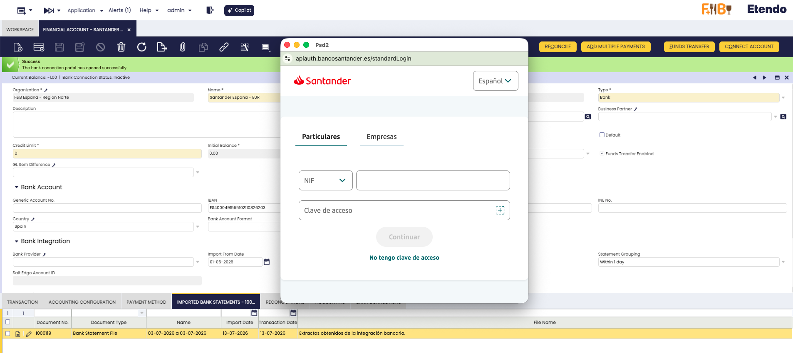

    !!!warning "Nota importante de seguridad"

        - Sus credenciales bancarias se introducen directamente en el sitio web de su banco, no en Etendo
        - Salt Edge nunca almacena sus credenciales bancarias
        - Etendo nunca tiene acceso a su usuario o contraseña del banco

3. **Seleccione la cuenta a conectar**.

    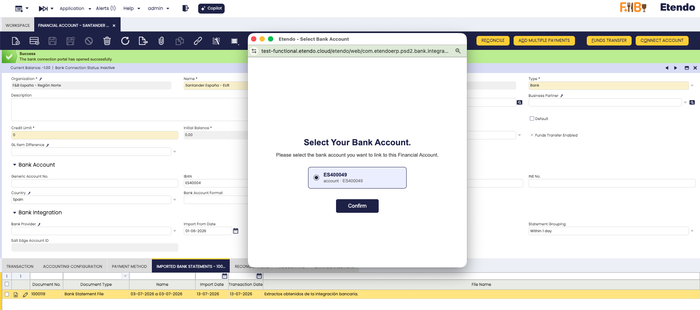

    Tras un inicio de sesión correcto, Salt Edge devuelve las cuentas que encuentra para esa conexión bancaria. Etendo siempre muestra una pantalla **Seleccione su cuenta bancaria** para que confirme cuál desea vincular a esta Cuenta Financiera.

    La lista solo muestra las cuentas candidatas que coinciden con el **Tipo** de la Cuenta Financiera que está conectando (cuentas bancarias para una Cuenta Financiera de tipo **Banco**, tarjetas de crédito para una Cuenta Financiera de tipo **Tarjeta**), y cada opción muestra el nombre de la cuenta o tarjeta junto con su IBAN o número de tarjeta enmascarado para que pueda identificar la correcta. Seleccione una opción y haga clic en **Confirmar**.

    !!!warning
        El proceso se detiene con un mensaje explicativo si el sistema no puede encontrar una cuenta válida para vincular. Esto ocurre, por ejemplo, cuando ninguna cuenta candidata coincide con el tipo esperado, cuando la moneda no coincide, o cuando todas las cuentas candidatas ya están vinculadas a otra Cuenta Financiera. Resuelva el problema e inténtelo de nuevo.

4. Después de confirmar la cuenta, Etendo completa la conexión de forma diferente según el **Tipo** de la Cuenta Financiera:

    === "Banco"

        - Si el campo **IBAN** está vacío, el sistema lo completa automáticamente con el IBAN devuelto por el banco.
        - Antes de guardarlo, el sistema valida que el IBAN sea válido (checksum) y que su código de país coincida con el **País** ya configurado en la Cuenta Financiera. Si **País** está vacío, el sistema lo completa automáticamente a partir del IBAN.
        - Si esta validación falla, la conexión se completa igualmente, pero un mensaje de advertencia indica que el IBAN no pudo completarse automáticamente. Introdúzcalo manualmente después.
        - Si la Cuenta Financiera ya tiene un **IBAN** introducido manualmente que no coincide con la cuenta seleccionada, el sistema bloquea la conexión con un error de conflicto. Verifique cuál IBAN es correcto y resuelva la discrepancia antes de continuar.

    === "Tarjeta"

        - El sistema completa automáticamente el número de tarjeta enmascarado devuelto por el banco, por ejemplo `•••• •••• •••• 1285`.

5. Una página de éxito confirma la conexión. El sistema sincroniza automáticamente su cuenta bancaria: los detalles de la conexión aparecen en la pestaña **Conexiones bancarias**.

### Importación de transacciones { #importing-transactions }

Existen dos formas de importar transacciones bancarias:

#### Opción 1: Importación manual (cuenta única) { #option-1-manual-import-single-account }

Para importar transacciones bajo demanda para cuentas específicas:

1. Abra la ventana **Cuenta Financiera**, seleccione una o más cuentas financieras y haga clic en el botón **Obtener extracto bancario** (en singular: importa solo la(s) cuenta(s) seleccionada(s)).

    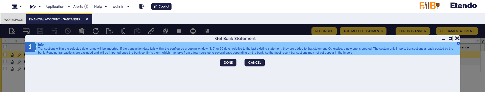

2. El sistema se conecta al banco y recupera las transacciones dentro del rango de fechas configurado. A continuación, crea o actualiza los extractos bancarios, nombrando cada uno según el rango de fechas real (de la transacción más antigua a la más reciente) del lote importado, y crea las líneas de extracto bancario correspondientes.

    !!!note
        Etendo recupera todo el historial de transacciones disponible en la conexión y lo filtra localmente utilizando los campos **Fecha de importación desde** y **Fecha de importación hasta**. Esto no cambia el resultado esperado: estos campos continúan definiendo qué se importa.

    !!!info "Transacciones contabilizadas frente a pendientes"
        Solo se importan las transacciones que el banco ya ha **contabilizado**. Las transacciones que aún están **pendientes** en el banco se excluyen y se recogerán en una importación posterior una vez que el banco las confirme; esto puede tardar desde unas horas hasta varios días según el banco, por lo que los movimientos más recientes pueden no aparecer inmediatamente después de conectar o tras ejecutar **Obtener extracto bancario**.

3. Un mensaje resumen muestra el resultado: si la importación se completó correctamente, si no se encontraron transacciones nuevas, o si se produjo un error.

    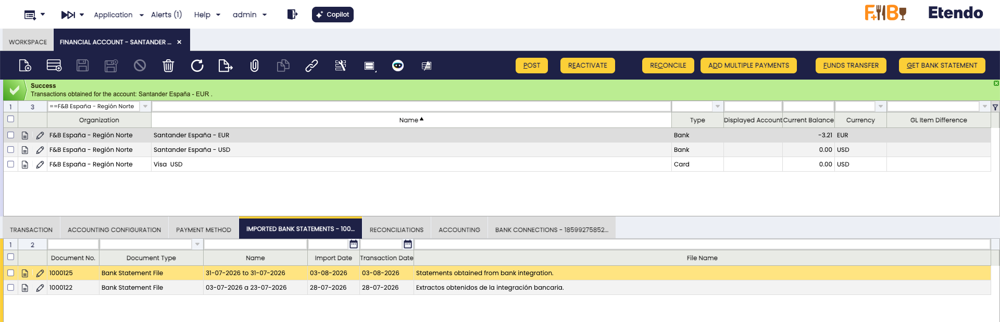

    !!!tip
        Use esta opción cuando necesite importar transacciones de inmediato para cuentas específicas o cuando desee revisar los resultados de la importación al momento.

    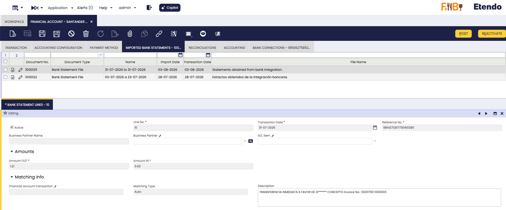

#### Opción 2: Importación automática (proceso planificado) { #option-2-automatic-import-scheduled-process }

Para importaciones regulares y automatizadas en todas las cuentas conectadas:

:material-menu: `Configuración General` > `Planificador de procesos` > `Procesamiento de Peticiones`

1. Haga clic en **Nuevo** para crear una solicitud de proceso, seleccione **Obtener extractos bancarios** (en plural: se ejecuta automáticamente para todas las cuentas conectadas, a diferencia del botón manual **Obtener extracto bancario** de la Opción 1) en el campo **Proceso** y establezca el campo **Programado** con la frecuencia que necesite (por ejemplo, Diaria).
2. Guarde el registro. El proceso se ejecuta automáticamente en el intervalo elegido e importa las nuevas transacciones para todas las cuentas conectadas.

    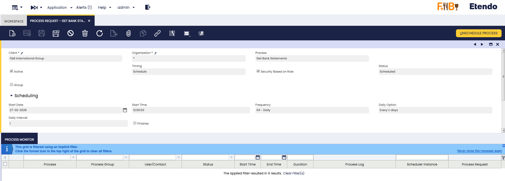

    !!!info
        **Planificación recomendada:**

        - Ejecute el proceso una vez al día, ya que la disponibilidad de las transacciones depende de la frecuencia de actualización de cada banco.
        - Tenga en cuenta la frecuencia de actualización de su banco y las necesidades de su negocio.

    !!!tip "Detalle de registro por cuenta"
        Cada ejecución de **Obtener extractos bancarios** registra una entrada por cada cuenta procesada en esa ejecución, tenga o no actividad, vinculada a la **Cuenta Financiera** a la que pertenece. Revise la ventana **Registros de la integración bancaria** (consulte [Monitorización y registros](#monitoring-and-logs)) para comprobar este detalle cuenta por cuenta; abra el campo **JSON Info** de cada entrada para ver el detalle completo.

## Gestión de conexiones { #connection-management }
:material-menu: `Gestión Financiera` > `Gestión de Cobros y Pagos` > `Transacciones` > `Cuenta Financiera`

Para ver todas sus conexiones bancarias, abra la ventana **Cuenta Financiera** y vaya a la pestaña **Conexiones bancarias**.

### Estado de la conexión { #connection-status }

Las conexiones bancarias pueden estar **Activo**, **Inactivo** o **Deshabilitado** (p. ej., cuando la autenticación caduca).

| Estado | Qué hacer |
|---|---|
| **Activo** | No se requiere ninguna acción: la conexión funciona con normalidad. |
| **Inactivo** | Reconecte cuando lo necesite; consulte [Reconectar una conexión bancaria](#reconnecting-a-bank-connection). |
| **Deshabilitado** | Consulte [Reconectar una conexión bancaria](#reconnecting-a-bank-connection) o [Problemas comunes y soluciones](#common-issues-and-solutions). |

### Desconectar una conexión bancaria { #disconnecting-a-bank-connection }

Etendo ofrece dos formas de desconectar una conexión bancaria: una desconexión simple, que conserva el historial de la conexión, y un borrado permanente, que la elimina por completo.

Abra la ventana **Cuenta Financiera**, vaya a la pestaña **Conexiones bancarias** y seleccione la conexión que desea desconectar. Haga clic en el botón **Desconectar cuenta**. Se abre un diálogo **Desconectar cuenta** con una casilla **Borrado permanente**.

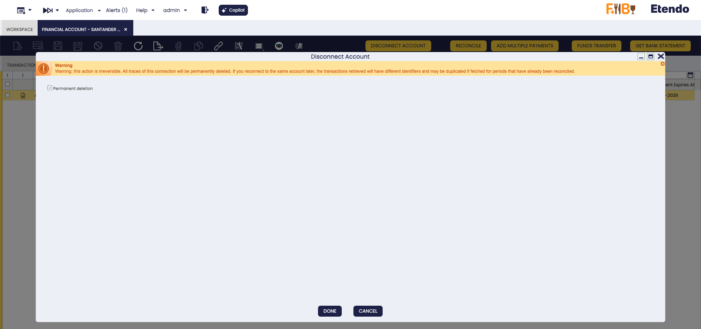

#### Opción 1: Desconexión simple { #option-1-simple-disconnection }

Deje la casilla **Borrado permanente** sin marcar y haga clic en **HECHO**. El estado de la conexión cambia a **Inactivo** y no se elimina ningún dato. Vuelva a conectar la misma cuenta más adelante, en cualquier momento (consulte [Reconectar una conexión bancaria](#reconnecting-a-bank-connection)), para restaurar la conexión y conservar su historial de transacciones existente.

#### Opción 2: Borrado permanente { #option-2-permanent-deletion }

Marque la casilla **Borrado permanente** y haga clic en **HECHO**.

!!!warning
    **Importante:**

    - Esta acción es irreversible.
    - Todos los rastros de la conexión se eliminan permanentemente tanto de Etendo como de Salt Edge.
    - Si vuelve a conectar la misma cuenta más adelante, las transacciones recuperadas tienen identificadores diferentes y pueden duplicarse si importa periodos que ya habían sido reconciliados.

!!!info
    En ambos casos, las transacciones pendientes ya importadas no se ven afectadas, y no se podrán importar nuevas transacciones desde la conexión hasta que la reconecte.

Tras la desconexión, verifique el resultado en la pestaña **Conexiones bancarias**: la conexión aparece como **Inactivo** en una desconexión simple, o deja de aparecer en la lista en un borrado permanente.

### Reconectar una conexión bancaria { #reconnecting-a-bank-connection }

Si una conexión aparece como **Inactivo** o **Deshabilitado**, abra la **Cuenta Financiera**: el botón **Reconectar la cuenta** aparece en la barra de herramientas superior de la ventana. Haga clic en él para volver a autenticarse con su banco y restaurar la conexión a **Activo**. Seguirá los mismos pasos de autorización bancaria, inicio de sesión y selección de cuenta descritos anteriormente (consulte los pasos 2 a 4 en [Conectar una cuenta bancaria o de tarjeta](#connect-a-bank-or-card-account)).

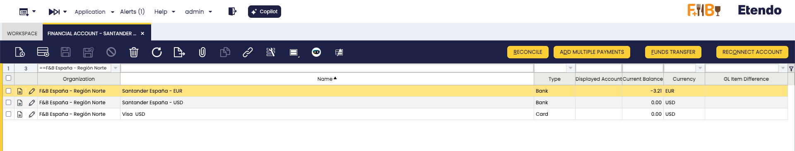

## Iniciación de pagos bancarios (PIS) { #bank-payment-initiation-pis }

Además de importar transacciones bancarias (AIS), este módulo le permite **iniciar pagos bancarios directamente desde Etendo**. Cuando crea un registro de Pago en Etendo, puede enviarlo a su banco para su autorización y ejecución, todo sin salir de Etendo.

### Cómo funcionan los pagos bancarios { #how-bank-payments-work }

El flujo de iniciación de pagos funciona de la siguiente manera:

1. Cree un registro de **Pago** en Etendo como de costumbre y haga clic en el botón **Generar pago bancario**. Aparece un formulario con valores precargados (importe, acreedor, plantilla, etc.).
2. Revise y confirme: se abre un **popup de autorización bancaria** donde autoriza el pago en el entorno seguro de su banco.
3. El estado del pago se rastrea automáticamente en Etendo.

### Plantillas de pago { #payment-templates }

El sistema soporta tres plantillas de pago, que determinan el formato y la información requerida para el pago:

| Plantilla | Moneda | Campos obligatorios | Caso de uso |
|---|---|---|---|
| **SEPA** | Solo EUR | IBAN del acreedor | Transferencias bancarias en la zona euro |
| **FPS** | Solo GBP | Código de banco + Número de cuenta | Pagos rápidos del Reino Unido (Faster Payments) |
| **DOMESTIC** | Cualquiera | Al menos uno de: IBAN, BBAN o Número de cuenta | Otras transferencias nacionales |

!!!note
    La plantilla se **selecciona automáticamente** en función de la moneda del pago, tal como se indica en la tabla anterior. Cámbiela manualmente en el formulario si es necesario.

### Configuración requerida { #required-configuration }

Antes de generar pagos bancarios, asegúrese de que el método de pago asignado a la cuenta financiera esté configurado correctamente.

:material-menu: `Gestión Financiera` > `Gestión de Cobros y Pagos` > `Transacciones` > `Cuenta Financiera`

1. Abra la **Cuenta Financiera** vinculada a la conexión bancaria, vaya a la pestaña **Método de Pago** y seleccione el método de pago utilizado para las transferencias bancarias.
2. En la sección **Pago**, asegúrese de que **Reintegro automático en cuenta** esté **deshabilitado** (sin marcar). Esto permite que el pago se cree sin ejecutarse automáticamente, de modo que pueda ejecutarlo luego desde el botón **Generar pago bancario**.

    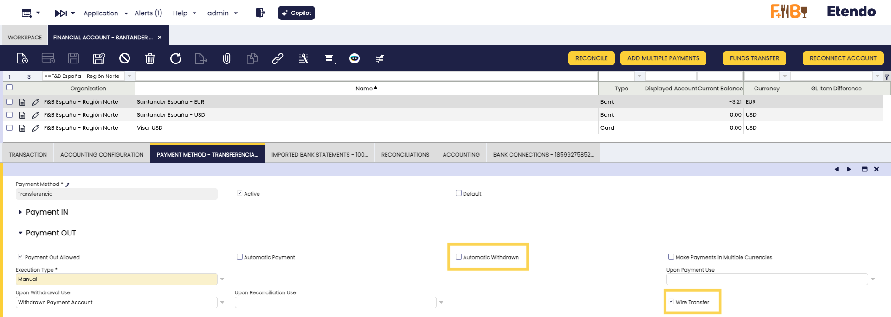

3. Asegúrese de que la casilla **Transferencia bancaria** esté habilitada para este método de pago; si no lo está, el botón **Generar pago bancario** no aparecerá al momento de generar pagos. Puede habilitarla globalmente en la ventana **Método de Pago**, o como excepción en esta misma pestaña **Método de Pago** de la Cuenta Financiera.

!!!warning
    El botón **Generar pago bancario** solo aparece cuando **Reintegro automático en cuenta** está **deshabilitado** y **Transferencia bancaria** está **habilitada** (globalmente o como excepción en esta Cuenta Financiera). Si no se cumple alguna de las dos condiciones, el botón no aparece en el registro de Pago.

### Generar un pago bancario { #generating-a-bank-payment }

Puede crear el pago desde una **Factura (Proveedor)** (:material-menu: `Aplicación` > `Gestión de Compras` > `Transacciones` > `Factura (Proveedor)`) o directamente desde un **Pago** (:material-menu: `Gestión Financiera` > `Gestión de Cobros y Pagos` > `Pago`). En ambos casos, al agregar el pago seleccione el importe y, en **Acción relacionada con el documento**, elija **Procesar Pago(s)**.

1. Agregue el pago y seleccione el importe a pagar. En **Acción relacionada con el documento**, seleccione **Procesar Pago(s)**.

    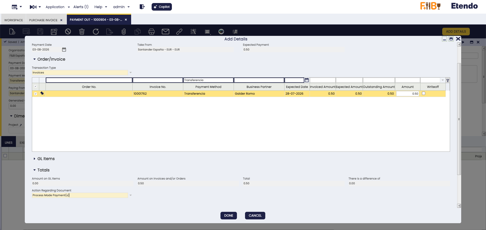

    !!!info
        **Procesar Pago(s)** procesa el pago sin ejecutarlo, lo que hace que el botón **Generar pago bancario** aparezca en el registro.

2. Abra el registro de **Pago** resultante y haga clic en el botón **Generar pago bancario**.

    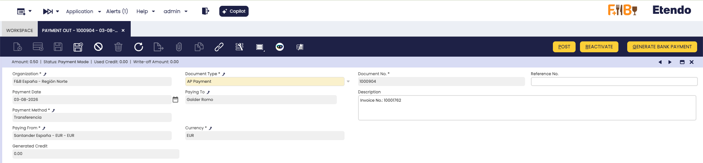

3. Aparece un **formulario de proceso** con los siguientes campos precargados:

    | Campo | Valor por defecto | Descripción |
    |---|---|---|
    | **Plantilla** | Según la moneda | Plantilla de pago (SEPA, FPS o DOMESTIC) |
    | **Identificación extremo a extremo** | Número de documento | Referencia única del pago (máx. 35 caracteres) |
    | **Nombre del acreedor** | Nombre del tercero | Nombre del beneficiario del pago |
    | **Importe** | Importe del pago | Importe a transferir |
    | **Moneda** | Moneda del pago | Moneda de la transferencia |
    | **Descripción** | Descripción del pago | Descripción del pago |
    | **IBAN del acreedor** | IBAN del tercero | Obligatorio para SEPA y opcional para DOMESTIC |
    | **Número de cuenta del acreedor** | Cuenta del tercero | Obligatorio para FPS, opcional para DOMESTIC |

    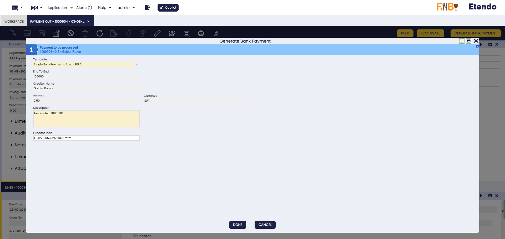

    !!!tip
        Los valores del formulario se calculan automáticamente a partir de los datos del Pago y del Tercero. Asegúrese de que sus Terceros tengan configurada su **información de cuenta bancaria** (IBAN o número de cuenta) para una mejor experiencia.

4. Revise los valores y haga clic en **Hecho** para iniciar el pago. Se abre un **popup de autorización bancaria** donde debe autorizar el pago con su banco.

    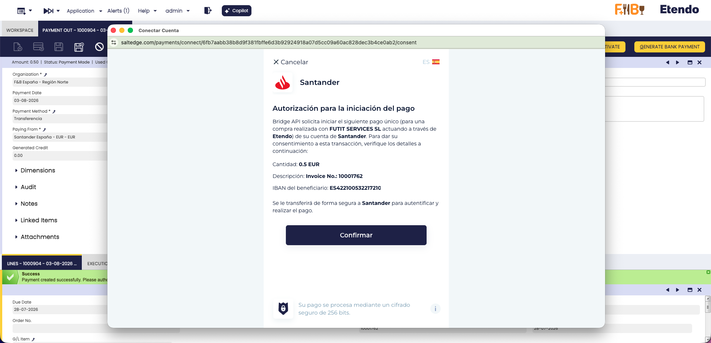

    !!!warning
        No cierre el popup hasta haber completado el proceso de autorización con su banco. El pago no puede continuar sin su autorización.

5. Tras completar la autorización, verá una **página de confirmación** que indica que el pago se ha registrado. Cierre el popup y vuelva a Etendo; el estado del pago se actualizará automáticamente.

### Consultar los pagos bancarios { #viewing-bank-payments }

Todos los pagos bancarios iniciados se registran en la pestaña **Pagos bancarios** del registro de Pago (:material-menu: `Gestión Financiera` > `Gestión de Cobros y Pagos` > `Pago`). Cada entrada muestra el **Estado**, el **Importe**, la **Moneda**, el **Nombre del acreedor** y el **IBAN del acreedor**, además del **Nombre del deudor** y el **IBAN del deudor** (su propia Cuenta Financiera) y la **Cuenta** vinculada. Utilice **Actualizar pago** para consultar el estado más reciente bajo demanda.

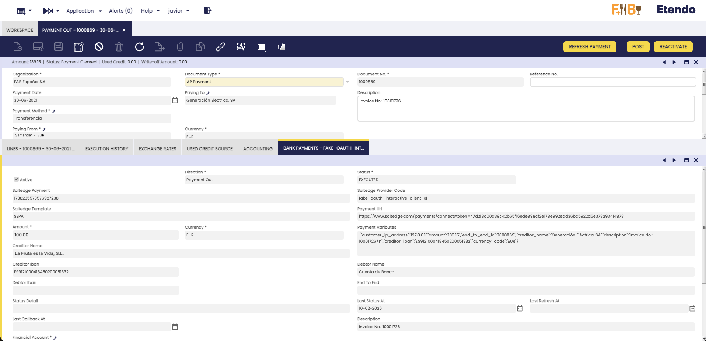

### Actualización del estado del pago { #refreshing-payment-status }

El estado del pago se actualiza automáticamente mediante dos mecanismos:

#### Actualizaciones automáticas { #automatic-updates }

Salt Edge envía notificaciones automáticas de estado a Etendo cada vez que el estado del pago cambia en el banco. Estas actualizaciones se procesan de forma inmediata y el registro del pago se actualiza en tiempo real.

#### Actualización manual { #manual-refresh }

Si desea consultar el estado más reciente de inmediato:

Vaya a la pestaña **Pagos bancarios**, seleccione uno o varios registros de pago y haga clic en el botón **Actualizar pago**.

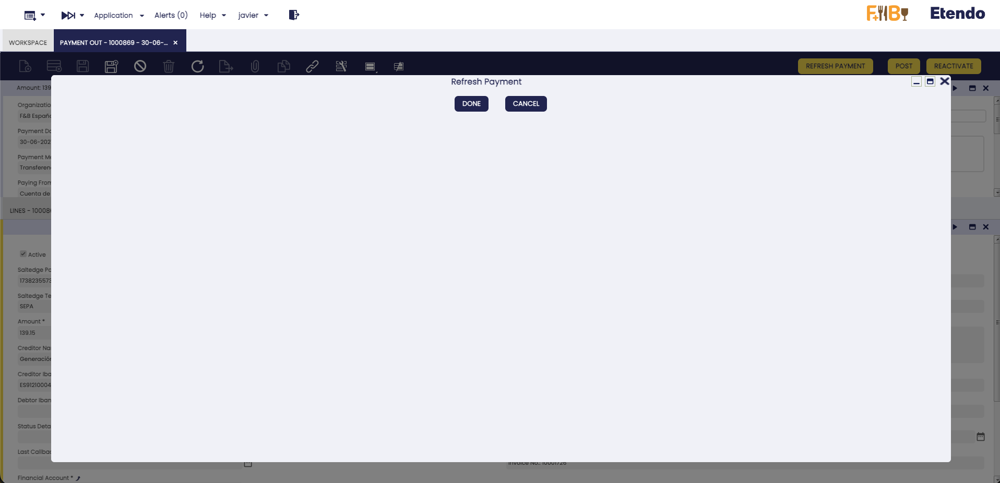

El sistema consulta al banco el estado actual y actualiza el registro.

!!!tip
    Utilice la actualización manual cuando desee verificar el estado actual de un pago sin esperar a la siguiente actualización automática.

#### Actualización automática programada { #scheduled-automatic-refresh }

El proceso **Actualizar pagos pendientes** se ejecuta cada **10 minutos** de forma predeterminada y actúa como red de seguridad por si no se procesa alguna actualización automática. Para ajustar la frecuencia, cree una nueva entrada de **Procesamiento de Peticiones** para este proceso y anule la programación de la entrada importada por el sistema (:material-menu: `Configuración General` > `Planificador de procesos` > `Procesamiento de Peticiones`).

## Problemas comunes y soluciones { #common-issues-and-solutions }

### Conexión y clave API

??? failure "No hay clave de API disponible"
    - Asegúrese de que la Entidad tenga configurada la clave API de Salt Edge.
    - Compruebe que la clave API sea correcta y esté activa.

??? failure "Clave de API inválida o caducada"
    - Su clave API ha caducado o ya no es válida.
    - Contacte con su administrador de Etendo o con el Soporte de Etendo para obtener una nueva clave API.
    - Actualice la clave API en la ventana **Entidad** (campo **Clave de API**, en el grupo de campos **Integración bancaria**).

??? warning "No se pudo obtener el enlace de redirección"
    - El servicio de conexión bancaria puede estar temporalmente no disponible.
    - Inténtelo de nuevo en unos minutos. Contacte con soporte si el problema persiste.

??? warning "No se encontraron transacciones nuevas"
    - Revise la configuración de **Fecha de importación desde** / **Fecha de importación hasta**.
    - Verifique que existan nuevas transacciones en su cuenta bancaria y que el rango de fechas cubra el periodo esperado.
    - Recuerde que las transacciones que aún estén pendientes en el banco todavía no se importan; consulte [Transacciones contabilizadas frente a pendientes](#importing-transactions). Espere a que el banco las confirme y vuelva a ejecutar **Obtener extracto bancario**.

??? warning "La fecha solicitada excede el historial máximo admitido por el banco"
    - Cada **Proveedor bancario** tiene un rango histórico máximo que puede proporcionar realmente (**Intervalo máximo de consulta**). Si la **Fecha de importación desde** configurada en la Cuenta Financiera es anterior a lo que admite el banco, el resultado de la importación incluye una advertencia indicando que la fecha solicitada excede el máximo admitido por ese banco.
    - Esta advertencia es solo informativa: no se requiere ninguna acción. El banco no dispone de más historial disponible.
    - El sistema ya importa el máximo historial que puede recuperar, comenzando desde la fecha más antigua que admite el banco.

??? warning "Límite de solicitudes alcanzado o servicio temporalmente no disponible"
    - El sistema ha superado el número permitido de solicitudes a la API, o Salt Edge está en mantenimiento.
    - Estos errores son transitorios: espere unos minutos e inténtelo de nuevo. Los procesos planificados reintentan automáticamente.

??? failure "El estado de la conexión aparece como Deshabilitado"
    Una conexión puede aparecer como **Deshabilitado** debido a la caducidad de la autenticación, errores de comunicación con Salt Edge o indisponibilidad temporal del banco.

    1. Ejecute **Obtener extractos bancarios** de nuevo para ver si el problema persiste.
    2. Si sigue apareciendo como **Deshabilitado**, haga clic en **Reconectar la cuenta** en la barra de herramientas de la Cuenta Financiera (consulte [Reconectar una conexión bancaria](#reconnecting-a-bank-connection)).

### Iniciación de pagos

??? failure "Plantilla requerida / Nombre del acreedor requerido"
    - No se pudo determinar la plantilla de pago, o falta el nombre del Tercero.
    - Asegúrese de que el pago tenga una moneda válida y un Tercero con un nombre válido asignado.

??? failure "IBAN requerido para SEPA"
    - Los pagos SEPA requieren el IBAN del acreedor.
    - Configure la cuenta bancaria del Tercero con un IBAN válido.

??? failure "SEPA requiere EUR / FPS requiere GBP / Código de banco o número de cuenta requerido para FPS"
    - Los pagos SEPA solo utilizan EUR; FPS solo utiliza GBP y requiere tanto el código de banco como el número de cuenta.
    - Compruebe la moneda del pago, cambie a la plantilla DOMESTIC si es necesario y verifique los datos de la cuenta bancaria del Tercero.

??? warning "El estado del pago queda en Iniciado o En autorización"
    - Es posible que el usuario no haya completado la autorización en el banco.
    - Haga clic en **Actualizar pago** para comprobar el estado más reciente. Si el problema persiste, contacte con el Soporte de Etendo indicando los datos del pago.

??? warning "El popup de autorización bancaria fue bloqueado / Pago no encontrado al volver del banco"
    - Es posible que su navegador haya bloqueado la ventana emergente; permita las ventanas emergentes para el sitio de Etendo e inténtelo de nuevo.
    - Si la redirección falló, revise la pestaña **Pagos bancarios**. Es posible que el pago se haya procesado correctamente y el estado se haya actualizado automáticamente poco después.

!!!tip "Obtener soporte"
    Antes de contactar con soporte, revise la ventana **Registros de la integración bancaria** para obtener detalles del error, verifique su clave API e intente el botón **Reconectar la cuenta** para problemas de conexión. Al contactar con el Soporte de Etendo, incluya el mensaje de error, las entradas de registro relevantes (incluyendo **JSON Info**), la cuenta financiera afectada y la fecha y hora del incidente.

## Monitorización y registros { #monitoring-and-logs }

El módulo ofrece dos ventanas dedicadas para monitorizar la actividad de la integración.

### Registros de la integración bancaria

:material-menu: `Gestión Financiera` > `Gestión de Cobros y Pagos` > `Configuración` > `Integración bancaria` > `Registros de integración bancaria`

Muestra toda la actividad y los registros de error generados por la integración. Cada entrada incluye:

| Campo | Descripción |
|-------|-------------|
| **Cuenta Financiera** | La cuenta financiera asociada al evento. |
| **Día de la ejecución** | La fecha y hora en que ocurrió el evento. |
| **Estado** | El resultado de la operación (*Success*, *Error*, etc.). |
| **Fuente** | El proceso que generó el registro (p. ej., *Transactions*, *Consents*, *Generate Payment*). |
| **Log** | Una descripción legible del evento, cuando está disponible. Este campo puede aparecer vacío en algunas entradas; en ese caso, recurra a **JSON Info**. |
| **JSON Info** | La respuesta cruda de la API. Esta es la fuente de referencia definitiva con el detalle para la resolución de problemas y el soporte. |

!!!info
    Las entradas de registro se conservan durante **90 días** y las entradas más antiguas se purgan automáticamente. Exporte o copie el **JSON Info** relevante antes de que se cierre esa ventana de tiempo si necesita conservar un registro con fines de soporte o auditoría.

!!!tip
    Filtre por **Cuenta Financiera** y ordene por **Día de la ejecución** de forma descendente para encontrar rápidamente los eventos más recientes.

### Proveedor bancario

:material-menu: `Gestión Financiera` > `Gestión de Cobros y Pagos` > `Configuración` > `Integración bancaria` > `Proveedor bancario`

Muestra todos los bancos disponibles a través de Salt Edge. Cada entrada muestra el **Código del proveedor** y el **Nombre del proveedor**.

## Recursos adicionales { #additional-resources }

- [Salt Edge Documentation](https://docs.saltedge.com/){target="_blank"}
- [Notas de la versión del Financial Extensions Bundle](../../../../../whats-new/release-notes/etendo-classic/bundles/financial-extensions/release-notes.md)
- [Guía de conciliación bancaria](../../../basic-features/financial-management/receivables-and-payables/transactions/financial-account.md#reconciliations)

*[AIS]: Servicio de Información de Cuentas
*[PIS]: Servicio de Iniciación de Pagos
*[SEPA]: Zona Única de Pagos en Euros
*[FPS]: Faster Payments Service (Reino Unido)
*[IBAN]: Número de Cuenta Bancaria Internacional
*[PSD2]: Directiva de Servicios de Pago 2
*[BBAN]: Número de Cuenta Bancaria Básico

---

This work is licensed under :material-creative-commons: :fontawesome-brands-creative-commons-by: :fontawesome-brands-creative-commons-sa: [ CC BY-SA 2.5 ES](https://creativecommons.org/licenses/by-sa/2.5/es/){target="_blank"} by [Futit Services S.L](https://etendo.software){target="_blank"}.
