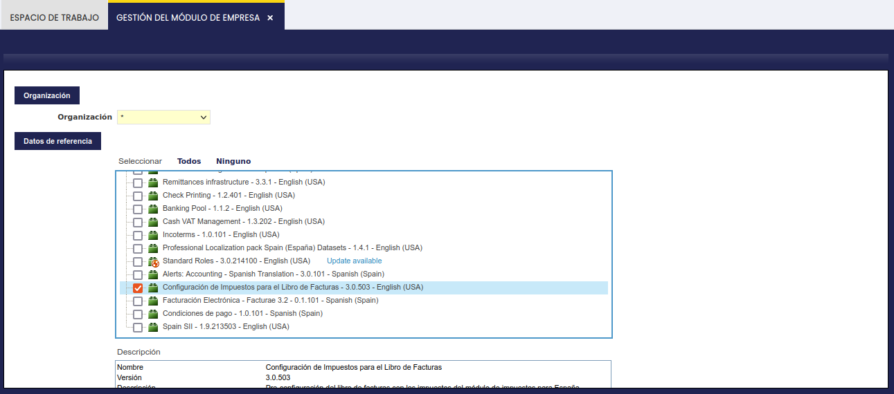
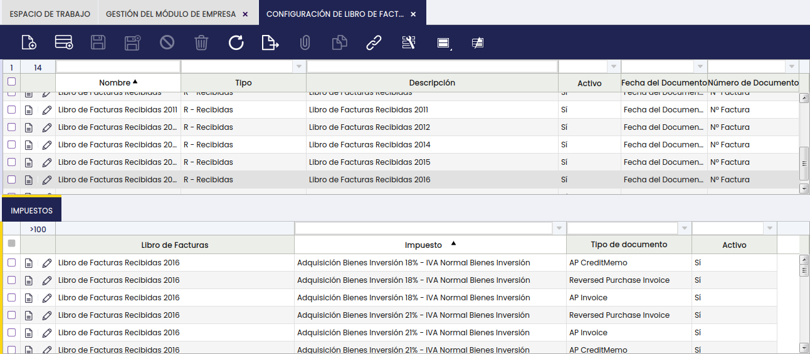

# Configuración de Impuestos para Libro de Facturas

:octicons-package-16: Javapackage (referencia técnica): `org.openbravo.module.invoicesregisterbook.estaxes`

## Descripción general

Esta sección contiene información sobre la configuración de impuestos de los libros de facturas que forman parte del [bundle de Localización española de Etendo](../../../../../user-guide/etendo-classic/optional-features/bundles/spain-localization/overview.md). Este módulo actúa como complemento del módulo [Libro de Facturas](../../../../../user-guide/etendo-classic/optional-features/bundles/spain-localization/libro-de-facturas.md), al que se recomienda consultar para obtener una descripción completa del funcionamiento de los libros.

## Instalación

El usuario debe instalar este módulo y posteriormente aplicar el conjunto de datos o "Datos de Referencia". Para ello, ve a `Configuración General` > `Organización` > `Gestión del Módulo de Empresa` en el menú de Etendo, localiza el módulo en la lista, selecciona la organización correspondiente y haz clic en **Aplicar** para activar los Datos de Referencia incluidos.

Una vez instalado y aplicado el módulo, puede verificar la configuración accediendo a `Gestión Financiera` > `Contabilidad` > `Configuración` > `Configuración de Libro de Facturas`, tal y como se muestra en la siguiente imagen:

Es importante recalcar que la configuración que se incluye en estos Datos de Referencia relaciona tipos/rangos de impuesto con el tipo de documento estándar de Etendo (AP Invoice, AR Invoice, etc) a incluir en el correspondiente libro (facturas recibidas o facturas emitidas).

Este conjunto de datos incluye los siguientes siete tipos de documento:

- Factura de Proveedor
- Abono de Proveedor
- Factura de Cliente
- Abono de Cliente
- Factura de Compra Anulada
- Factura de Venta Anulada
- Devolución de Venta

Las categorías de impuesto estándar incluidas son: IVA Normal, IVA Reducido, IVA Super Reducido, Exento y No Sujeto, todas ellas definidas en el módulo [Impuestos para España](../../../../../user-guide/etendo-classic/optional-features/bundles/spain-localization/impuestos-para-españa.md).

!!! warning "IVA de Caja no incluido"
    Los Datos de Referencia **no incluyen** los tipos de impuesto de [IVA de Caja](../../../../../user-guide/etendo-classic/optional-features/bundles/spain-localization/iva-de-caja.md). Las organizaciones acogidas al Régimen Especial del Criterio de Caja (RECC) — un régimen fiscal en el que el IVA se declara en el momento del cobro o pago efectivo, en lugar de en la fecha de la factura — o que reciben facturas de proveedores bajo este régimen, deben añadirlos de forma manual. Consulta la sección [Configuración para organizaciones acogidas al RECC](#configuracion-para-organizaciones-acogidas-al-recc) a continuación.

!!! note "Tipos de documento personalizados"
    Si se crean nuevos tipos de documento de factura de compra o venta en Etendo, hay que incluirlos de forma manual en la solapa **Impuestos** de cada libro en `Gestión Financiera` > `Contabilidad` > `Configuración` > `Configuración de Libro de Facturas`, tanto en el libro de facturas recibidas como en el de facturas emitidas según corresponda, asociados a los impuestos de compra o venta correspondientes.

## Configuración para organizaciones acogidas al RECC

Los Datos de Referencia estándar omiten de forma explícita todos los tipos de impuesto cuyo nombre contiene "IVA de Caja" o "IVA Caja". Esta exclusión afecta a dos tipos de organización: las acogidas al Régimen Especial del Criterio de Caja (RECC) y las que reciben facturas de proveedores acogidos a este régimen. Ambas deben añadir manualmente los tipos de impuesto de IVA de Caja a la configuración de sus libros.

### Procedimiento de configuración

1. Ve a `Gestión Financiera` > `Contabilidad` > `Configuración` > `Configuración de Libro de Facturas`.
2. Abre el registro del libro correspondiente y haz clic en la solapa **Impuestos**.
3. Usa el botón **Nuevo** para añadir cada tipo de impuesto de IVA de Caja.
4. Repite el proceso para el libro de facturas recibidas y para el de facturas emitidas, según el tipo de organización.

!!! info
    Para consultar qué tipos de impuesto de IVA de Caja están disponibles en su sistema, visite [Impuestos IVA de Caja](../../../../../user-guide/etendo-classic/optional-features/bundles/spain-localization/iva-de-caja.md).

### Resultado tras la configuración

Una vez añadidos los tipos de impuesto de IVA de Caja al libro, los datos de las columnas de pago se rellenan de forma automática. No es necesaria ninguna acción manual adicional:

- **Método de Pago**, **Fecha de pago** / **Fecha de cobro**, **Importe de Pago** / **Importe de cobro** y **Cuenta Financiera** se toman directamente de los registros de pago vinculados a cada factura acogida al RECC.
- Si una factura tiene varios pagos o cobros parciales, cada uno aparece como una línea independiente en el libro.
- Para las facturas no acogidas al RECC, estas columnas quedan siempre vacías en el libro impreso, aunque existan registros de pago en el sistema.

!!! info "Consulta también"
    - [Impuestos IVA de Caja](../../../../../user-guide/etendo-classic/optional-features/bundles/spain-localization/iva-de-caja.md) — configuración del módulo IVA de Caja y sus tipos de impuesto.
    - [Libro de Facturas](../../../../../user-guide/etendo-classic/optional-features/bundles/spain-localization/libro-de-facturas.md) — descripción completa del contenido de los libros impresos.

---

This work is a derivative of [Openbravo Localización Española](https://wiki.openbravo.com/wiki/Openbravo_Localizaci%C3%B3n_Espa%C3%B1a){target="\_blank"} by [Openbravo Wiki](http://wiki.openbravo.com/wiki/Welcome_to_Openbravo){target="\_blank"}, used under [CC BY-SA 2.5 ES](https://creativecommons.org/licenses/by-sa/2.5/es/){target="\_blank"}. This work is licensed under [CC BY-SA 2.5](https://creativecommons.org/licenses/by-sa/2.5/){target="\_blank"} by [Etendo](https://etendo.software){target="\_blank"}.
