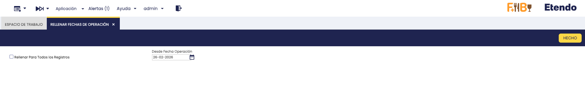
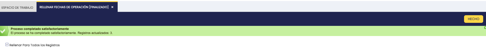
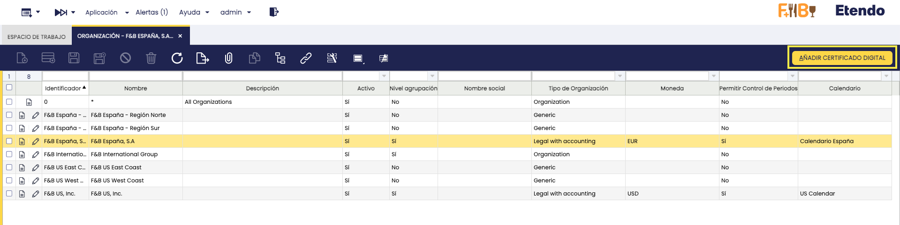
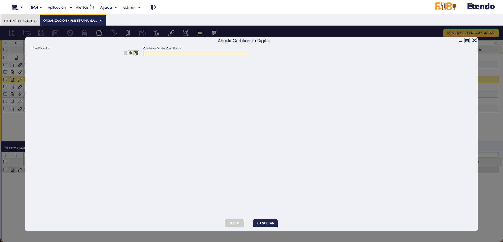
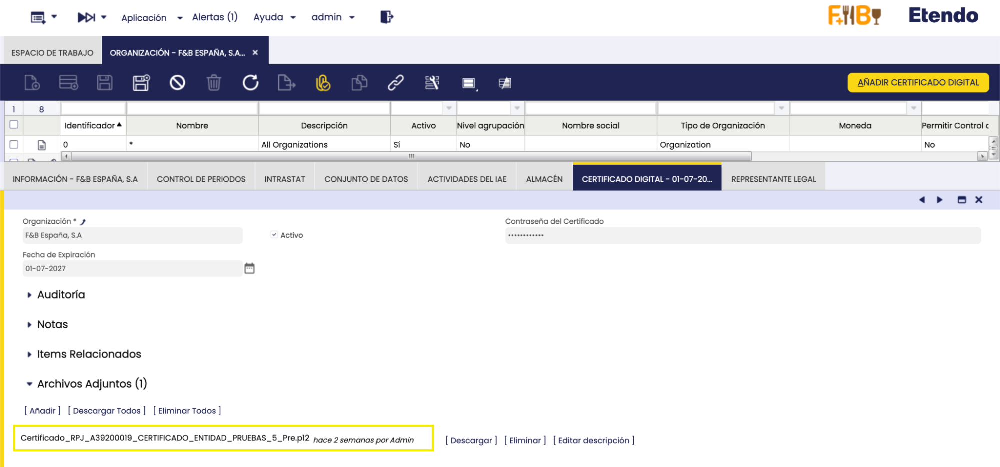
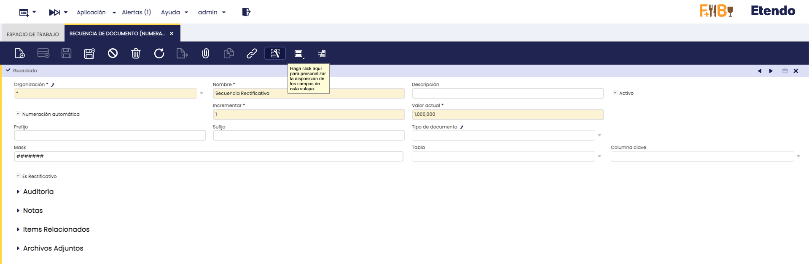
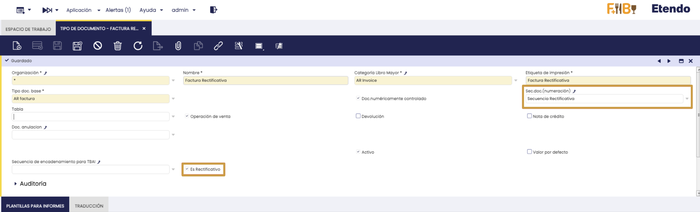

# Funcionalidades Generales Para SIFs

:octicons-package-16: Javapackage: `com.etendoerp.sif.general`

:octicons-package-16: Javapackage: `com.etendoerp.sif.general.template`

## Introducción

El módulo de Funcionalidades Generales para SIFs (**Sistemas de Información Fiscal**) se instala automáticamente junto con los módulos de [SII](./sii-para-iva.md), [Verifactu](./verifactu.md) y [TicketBAI](./ticketbai-batuz.md). Ofrece funcionalidades y configuraciones comunes a los tres sistemas:

- [Carga de certificados digitales](#carga-de-certificados-digitales): permite configurar el certificado digital de cada organización legal.
- [Rellenar Fechas de Operación](#rellenar-fechas-de-operacion): proceso para migrar las fechas de facturas existentes al nuevo campo unificado.
- [Tipos de Documento Rectificativos](#tipos-de-documento-rectificativos): define las restricciones sobre los documentos utilizados en facturas rectificativas.

## Rellenar Fechas de Operación

:material-menu: `Aplicación` > `Gestión Financiera` > `Sistemas de Facturación` > `Rellenar Fechas de Operación`

Para poder filtrar los datos del [**Informe Dimensional de Impuestos**](./overview.md#multidimensional-tax-report) por **Fecha de Operación**, se ha incorporado un nuevo campo **Fecha de Operación** dentro del grupo **Datos para Sistemas de Facturación** en las facturas. Este campo unifica las fechas equivalentes que existían en los sistemas [Verifactu](./verifactu.md), [TicketBAI](./ticketbai-batuz.md) y [SII](./sii-para-iva.md).

Al instalar el módulo, cuando se crea una factura nueva, el campo se rellena automáticamente. Sin embargo, en facturas ya existentes, este campo permanecerá vacío, lo que impide que el informe dimensional muestre correctamente esos datos.

Para poblar los valores del campo **Fecha de Operación** de las facturas, con los datos anteriores en las mismas provenientes de los sistemas de facturación, se recomienda utilizar el proceso **Rellenar Fechas de Operación**. 

El proceso consta de los siguientes parámetros:

- **Rellenar Para Todos los Registros**: Si esta opción está marcada, el proceso actualizará el campo **Fecha de Operación** en todas las facturas creadas desde la fecha de acogida al sistema de facturación en uso.
- **Desde Fecha Operación**: Este parámetro se podrá rellenar si la casilla **Rellenar Para todos los Registros** está desmarcada. La fecha introducida en este campo será la mínima fecha de operación a partir de la cual se copiarán los registros.

Al finalizar, el sistema mostrará un mensaje indicando la cantidad de registros actualizados.

!!! info "Fecha de acogida"
    La **fecha de acogida** es la fecha desde la cual la organización comenzó a operar con el sistema de facturación correspondiente ([SII](./sii-para-iva.md), [Verifactu](./verifactu.md) o [TicketBAI](./ticketbai-batuz.md)). Solo se actualizarán facturas emitidas a partir de esa fecha.

## Carga de Certificados Digitales

:material-menu: `Aplicación` > `Configuración General` > `Organización` > `Organización`

Se ha añadido a la ventana `Organización` el proceso **Añadir Certificado Digital**, el cual solo puede ejecutarse para organizaciones legales. El certificado se utiliza en procesos como la firma digital de documentos y el envío de facturas electrónicas.

!!! info
    Solo puede haber un certificado activo por organización legal. Cargar uno nuevo sobrescribirá el anterior.

### Obtener un certificado digital

El certificado debe solicitarse a través de la [FNMT (Fábrica Nacional de Moneda y Timbre)](https://www.cert.fnmt.es/){target="_blank"}. El tipo de certificado requerido varía según la forma jurídica:

1. **Autónomos (Personas Físicas)**: Certificado de Persona Física. Lo solicita el propio autónomo acreditando su identidad con DNI o vídeo identificación.
2. **Sociedades (S.L., S.A., etc.)**: El certificado se vincula a una persona física responsable:
    - **Administrador Único o Solidario**: puede solicitar un Certificado de Representante directamente con su DNIe.
    - **Apoderado o Representante Legal**: debe solicitar un Certificado de Representante de Persona Jurídica, acreditando autoridad mediante poderes notariales o certificado del Registro Mercantil.
3. **Entidades sin Personalidad Jurídica**: lo solicita el representante legal. Se requiere el Certificado de Representante de Entidad sin Personalidad Jurídica.

Para más detalle, consulte la [Guía de la AEAT](https://sede.agenciatributaria.gob.es/Sede/ayuda/consultas-informaticas/firma-digital-sistema-clave-pin-tecnica/informacion-pasos-obtencion-certificado-electronico.html){target="_blank"}.

### Pasos para cargar el certificado

1. Acceder a la ventana **Organización**

2. **Seleccionar la Organización Legal**: Elegir la organización legal que será responsable de emitir las facturas electrónicas.

    

3. Hacer clic en el botón **Añadir Certificado Digital**.
    
4. **Subir el Certificado**: En el proceso, se podrá cargar un certificado digital introduciendo la clave correspondiente.

    

5. **Guardar la configuración**: Al pulsar el botón **Hecho**, el sistema guardará la información del certificado digital en la solapa **Certificado Digital**.
    
    

    Una vez completados estos pasos, el certificado digital estará configurado y listo para su uso en la emisión de facturas electrónicas.

## Tipos de Documento Rectificativos

:material-menu: `Aplicación` > `Gestión Financiera` > `Contabilidad` > `Configuración` > `Tipo de Documento`

:material-menu: `Aplicación` > `Gestión Financiera` > `Contabilidad` > `Configuración` > `Secuencia de Documento (numeración)`

Las facturas rectificativas deben utilizar exclusivamente un tipo de documento y una secuencia marcados como rectificativos. Para configurarlos, siga estos pasos:

1. **Secuencia de Documento (Numeración)**: Crear un nuevo registro y marcar la casilla **Es Rectificativo**. Esto permite que el sistema la reconozca como una secuencia rectificativa.

2. **Tipo de Documento**: Crear un nuevo registro y marcar la casilla **Es Rectificativo**. Asociar la secuencia creada en el paso anterior en el campo **Sec.doc.(numeración)** si es no transaccional. En el selector solo aparecerán secuencias marcadas como rectificativas cuando el tipo de documento se ha configurado como rectificativo.

---

This work is licensed under :material-creative-commons: :fontawesome-brands-creative-commons-by: :fontawesome-brands-creative-commons-sa: [ CC BY-SA 2.5 ES](https://creativecommons.org/licenses/by-sa/2.5/es/){target="_blank"} by [Futit Services S.L](https://etendo.software){target="_blank"}.