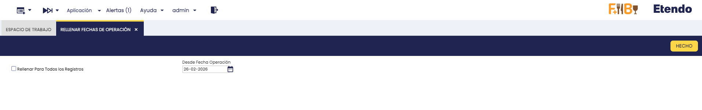
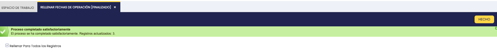
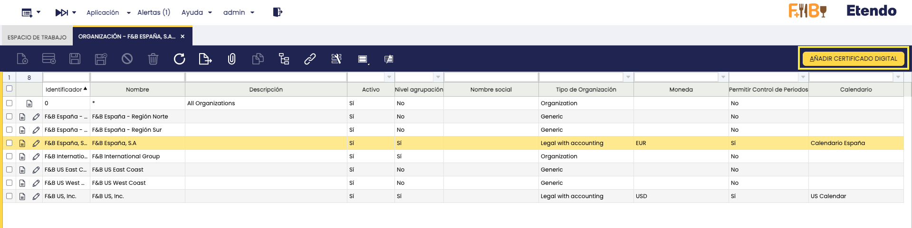
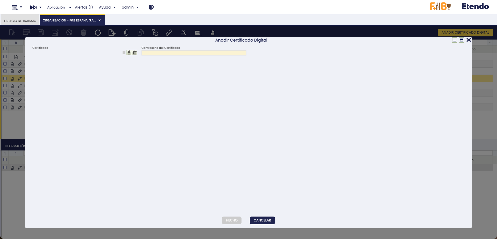
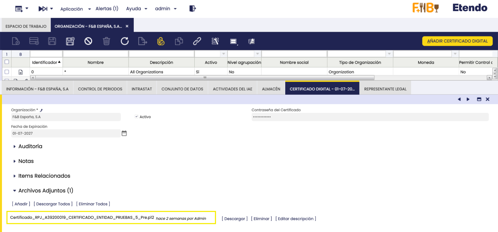
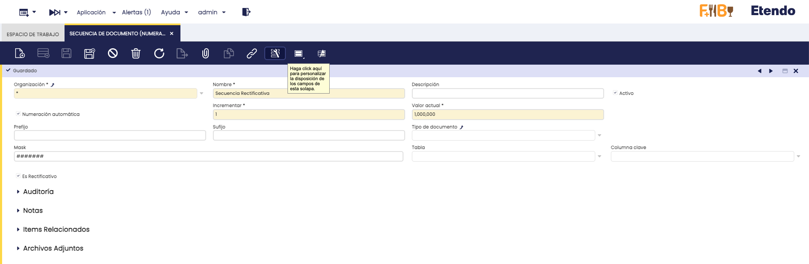
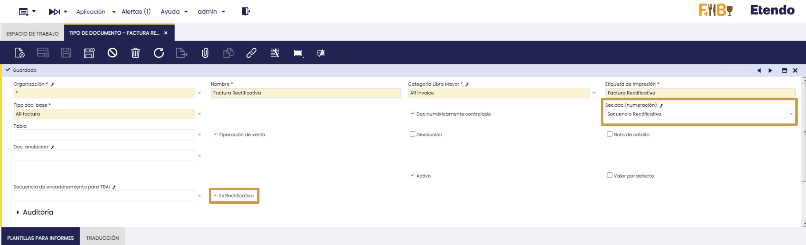

# Funcionalidades Generales Para SIFs

:octicons-package-16: Javapackage: `com.etendoerp.sif.general`

:octicons-package-16: Javapackage: `com.etendoerp.sif.general.template`

## Introducción

El módulo de Funcionalidades Generales para SIFs (**Sistemas de Información Fiscal**) se instala automáticamente junto con los módulos de [SII](./sii-para-iva.md), [Verifactu](./verifactu.md) y [TicketBAI](./ticketbai-batuz.md). Ofrece funcionalidades y configuraciones comunes a los tres sistemas:

- [Carga de certificados digitales](#carga-de-certificados-digitales): permite configurar el certificado digital de cada organización legal.
- [Rellenar Fechas de Operación](#rellenar-fechas-de-operacion): proceso para migrar las fechas de facturas existentes al nuevo campo unificado.
- [Tipos de Documento Rectificativos](#tipos-de-documento-rectificativos): define las restricciones sobre los documentos utilizados en facturas rectificativas.
- [Facturas Rectificativas](#facturas-rectificativas): explica qué rectificación usar en cada caso y cómo realizarla de principio a fin en Etendo, de forma común a todos los SIFs.

## Rellenar Fechas de Operación

:material-menu: `Aplicación` > `Gestión Financiera` > `Sistemas de Facturación` > `Rellenar Fechas de Operación`

Para poder filtrar los datos del [**Informe Dimensional de Impuestos**](./overview.md#multidimensional-tax-report) por **Fecha de Operación**, se ha incorporado un nuevo campo **Fecha de Operación** dentro del grupo **Datos para Sistemas de Facturación** en las facturas. Este campo unifica las fechas equivalentes que existían en los sistemas [Verifactu](./verifactu.md), [TicketBAI](./ticketbai-batuz.md) y [SII](./sii-para-iva.md).

Al instalar el módulo, cuando se crea una factura nueva, el campo se rellena automáticamente. Sin embargo, en facturas ya existentes, este campo permanecerá vacío, lo que impide que el informe dimensional muestre correctamente esos datos.

Para poblar los valores del campo **Fecha de Operación** de las facturas, con los datos anteriores en las mismas provenientes de los sistemas de facturación, se recomienda utilizar el proceso **Rellenar Fechas de Operación**. 

El proceso consta de los siguientes parámetros:

- **Rellenar Para Todos los Registros**: Si esta opción está marcada, el proceso actualizará el campo **Fecha de Operación** en todas las facturas creadas desde la fecha de acogida al sistema de facturación en uso.
- **Desde Fecha Operación**: Este parámetro se podrá rellenar si la casilla **Rellenar Para todos los Registros** está desmarcada. La fecha introducida en este campo será la mínima fecha de operación a partir de la cual se copiarán los registros.

Al finalizar, el sistema mostrará un mensaje indicando la cantidad de registros actualizados.

!!! info "Fecha de acogida"
    La **fecha de acogida** es la fecha desde la cual la organización comenzó a operar con el sistema de facturación correspondiente ([SII](./sii-para-iva.md), [Verifactu](./verifactu.md) o [TicketBAI](./ticketbai-batuz.md)). Solo se actualizarán facturas emitidas a partir de esa fecha.

## Carga de Certificados Digitales

:material-menu: `Aplicación` > `Configuración General` > `Organización` > `Organización`

Se ha añadido a la ventana `Organización` el proceso **Añadir Certificado Digital**, el cual solo puede ejecutarse para organizaciones legales. El certificado se utiliza en procesos como la firma digital de documentos y el envío de facturas electrónicas.

!!! info
    Solo puede haber un certificado activo por organización legal. Cargar uno nuevo sobrescribirá el anterior.

### Obtener un certificado digital

El certificado debe solicitarse a través de la [FNMT (Fábrica Nacional de Moneda y Timbre)](https://www.cert.fnmt.es/){target="_blank"}. El tipo de certificado requerido varía según la forma jurídica:

1. **Autónomos (Personas Físicas)**: Certificado de Persona Física. Lo solicita el propio autónomo acreditando su identidad con DNI o vídeo identificación.
2. **Sociedades (S.L., S.A., etc.)**: El certificado se vincula a una persona física responsable:
    - **Administrador Único o Solidario**: puede solicitar un Certificado de Representante directamente con su DNIe.
    - **Apoderado o Representante Legal**: debe solicitar un Certificado de Representante de Persona Jurídica, acreditando autoridad mediante poderes notariales o certificado del Registro Mercantil.
3. **Entidades sin Personalidad Jurídica**: lo solicita el representante legal. Se requiere el Certificado de Representante de Entidad sin Personalidad Jurídica.

Para más detalle, consulte la [Guía de la AEAT](https://sede.agenciatributaria.gob.es/Sede/ayuda/consultas-informaticas/firma-digital-sistema-clave-pin-tecnica/informacion-pasos-obtencion-certificado-electronico.html){target="_blank"}.

### Pasos para cargar el certificado

1. Acceder a la ventana **Organización**

2. **Seleccionar la Organización Legal**: Elegir la organización legal que será responsable de emitir las facturas electrónicas.

    

3. Hacer clic en el botón **Añadir Certificado Digital**.
    
4. **Subir el Certificado**: En el proceso, se podrá cargar un certificado digital introduciendo la clave correspondiente.

    

5. **Guardar la configuración**: Al pulsar el botón **Hecho**, el sistema guardará la información del certificado digital en la solapa **Certificado Digital**.
    
    

    Una vez completados estos pasos, el certificado digital estará configurado y listo para su uso en la emisión de facturas electrónicas.

## Tipos de Documento Rectificativos

Las facturas rectificativas deben utilizar exclusivamente un tipo de documento y una secuencia marcados como rectificativos. Para configurarlos, siga estos pasos:

1. **Secuencia de Documento (Numeración)**

	:material-menu: `Aplicación` > `Gestión Financiera` > `Contabilidad` > `Configuración` > `Secuencia de Documento (numeración)`

	Crear un nuevo registro y marcar la casilla **Es Rectificativo**. Esto permite que el sistema la reconozca como una secuencia rectificativa.

	!!! info "Restricción de prefijo en TicketBAI"
	    Si la organización está acogida a **TicketBAI**, la secuencia rectificativa debe llevar **prefijo**. Consulte el detalle en [TicketBAI y Batuz → Tipo de Documento para Facturas Rectificativas](./ticketbai-batuz.md#tipo-de-documento-para-facturas-rectificativas).

	

2. **Tipo de Documento**

	:material-menu: `Aplicación` > `Gestión Financiera` > `Contabilidad` > `Configuración` > `Tipo de Documento`

	Crear un nuevo registro y marcar la casilla **Es Rectificativo**. Asociar la secuencia creada en el paso anterior en el campo **Sec.doc.(numeración)** si es no transaccional. En el selector solo aparecerán secuencias marcadas como rectificativas cuando el tipo de documento se ha configurado como rectificativo.

	

	!!! info "Solo aplica a organizaciones acogidas a un SIF"
   		La selección y validación del tipo de documento rectificativo **solo se aplica en organizaciones que tengan configurado algún SIF** (*Verifactu*, *TicketBAI* o *SII*). Es decir, las comprobaciones que exigen que una factura rectificativa utilice un tipo de documento (y una secuencia) marcados como rectificativos, y que impiden usar un tipo rectificativo en una factura que no rectifica a ninguna otra, se activan únicamente cuando la entidad legal de la factura está acogida a *Verifactu*, *TicketBAI* o *SII*.

## Facturas Rectificativas

Cuando una factura ya emitida (completada y enviada al SIF correspondiente) contiene un error, la normativa **no permite reactivarla ni modificarla**: la corrección se realiza mediante una **factura rectificativa**, común a **Verifactu**, **TicketBAI** y **SII**.

En una rectificativa se registra la variación respecto a la factura original, **sin detallar los importes originales corregidos**.

Por ejemplo, si una factura original tenía una base de 1.000 € y una cuota de 210 € (21 %), y el importe correcto era 200 € superior, la rectificativa registrará **base +200 €, cuota +42 €** (no la base total corregida de 1.200 €).

### Qué motivo de rectificación usar (R1–R5)

Toda factura rectificativa debe indicar el **motivo de la rectificación**, que la AEAT clasifica según la causa. La siguiente tabla resume cuándo usar cada uno:

| Motivo | Cuándo se usa | Ejemplo |
|---|---|---|
| **R1** — Error fundado en derecho y art. 80.Uno, .Dos y .Seis LIVA | Es el motivo **general**, para la mayoría de correcciones: errores fundados en derecho (base o cuota mal calculadas, tipo de IVA incorrecto, etc.) y modificaciones de la base por **devolución** de mercancías, envases o embalajes, **descuentos o rappels** posteriores a la operación, resolución de operaciones o alteración/provisionalidad de precios. | Se devuelve parte de la mercancía; se aplica un descuento posterior; se corrige un tipo de IVA mal aplicado. |
| **R2** — Art. 80.Tres LIVA | El destinatario entra en **concurso de acreedores** después de emitida la factura. | El cliente es declarado en concurso y se modifica la base para recuperar el IVA. |
| **R3** — Art. 80.Cuatro LIVA | **Créditos incobrables** que cumplen los requisitos legales (plazos, reclamación, etc.). | Una factura impagada deviene incobrable transcurrido el plazo legal. |
| **R4** — Resto | Cualquier rectificación **no encuadrable en R1–R3**, incluidas las **correcciones de datos no monetarios** del mismo destinatario (razón social, domicilio, código postal, un apellido, etc.). | Corregir el domicilio o la razón social del cliente sin que cambien la base, la cuota ni el total. |
| **R5** — Facturas simplificadas | Rectificación de una **factura simplificada** (ticket). | Rectificar una factura simplificada emitida anteriormente. |

!!! note "Correcciones de datos no monetarios (R4)"
    Cuando solo se corrige un **dato no monetario** del **mismo** destinatario, la rectificativa se registra con **base 0 €, cuota 0 € y total 0 €**: no hay variación económica. Debe indicarse la causa y la modificación efectuada, e identificar la factura original; esta no se elimina, queda **complementada** por la rectificativa. Si, en cambio, la factura **identifica a otro destinatario** (otra persona o un NIF distinto), no basta con una rectificativa de importe cero: consulte [Reemplazar una factura por completo](#reemplazar-una-factura-por-completo-reversion-y-reemision).

    **Ejemplo:** factura original **F-2026-0105** a *Empresa Ejemplo, S.L.* (NIF `B12345678`) con el **domicilio mal consignado**. Se emite una rectificativa **R-2026-0012** con **motivo R4**, manteniendo el mismo destinatario y NIF, con el **domicilio correcto**, identificando la factura rectificada (F-2026-0105) y la causa (*«se corrige el domicilio del destinatario; no se modifican la base imponible, la cuota de IVA ni el importe total»*). Importes de la rectificación: **base 0 €, cuota 0 €, total 0 €**.

### Casos de uso y su registro

Cada caso se registra informando en un único registro **solo la variación** respecto a la factura original (base 1.000 €, cuota 210 € del ejemplo anterior), siguiendo el criterio de la [AEAT](https://sede.agenciatributaria.gob.es/Sede/iva/sistemas-informaticos-facturacion-verifactu/preguntas-frecuentes/procedimientos-facturacion.html){target="_blank"}:

| Caso | Registro |
|---|---|
| **Descuento posterior de 200 €** sobre la base (base correcta 800 €, cuota correcta 168 €) | base **−200 €**, cuota **−42 €**, total **−242 €** |
| **Aumento de la base** (se facturó 200 € de menos) | base **+200 €**, cuota **+42 €** |
| **Impago**: crédito incobrable (`R3`) o concurso (`R2`) del destinatario | base **0 €**, cuota **−210 €** (se rectifica solo la cuota repercutida que no se cobrará) |
| **Tipo de IVA incorrecto, base correcta** (se aplicó 10 % en lugar de 21 %) | dos desgloses a tipos positivos: se revierte el erróneo (base **−1.000 €**, cuota **−100 €** al 10 %) y se añade el correcto (base **+1.000 €**, cuota **+210 €** al 21 %); neto: base 0 €, cuota **+110 €** |
| **Reemplazo completo de la factura** (base incorrecta, error de cabecera, varios errores a la vez) | ver [reversión y reemisión](#reemplazar-una-factura-por-completo-reversion-y-reemision) |
| **Rectificar una rectificativa anterior** | nueva rectificativa con base y cuota positivas o negativas según el ajuste necesario |

### Cómo hacerlo en Etendo

El procedimiento es común a los tres SIFs:

1. **Configure un tipo de documento rectificativo** y su secuencia, tal como se describe en [Tipos de Documento Rectificativos](#tipos-de-documento-rectificativos). La factura rectificativa debe usar una **serie distinta** a la de la factura original.
2. **Cree una factura de venta** usando ese tipo de documento rectificativo.
3. **Introduzca las líneas con la diferencia** según el caso de la tabla anterior.
4. **Indique el motivo de rectificación** que corresponda (según el SIF, ver más abajo).
5. **Enlace la factura original** que se está rectificando en la solapa correspondiente (**Factura Rectificativa**).
6. **Complete la factura y envíela al SIF** por el procedimiento habitual (envío automático o botón de registro manual, según el SIF).

### Reemplazar una factura por completo (reversión y reemisión)

Cuando el error obliga a reemplazar la factura entera —por ejemplo, la factura **identifica a un destinatario equivocado** (otra persona o un NIF distinto)— se aplica el patrón de **reversión y reemisión**, en dos pasos:

1. **Revertir la factura original**: emitir una factura rectificativa, con el **motivo que corresponda a la causa** (por ejemplo, **`R4` — Resto** cuando el error está en el destinatario), por el **100 % de la original con signo contrario** (base −1.000 €, cuota −210 €), dejando la operación original **a cero**.
2. **Emitir una nueva factura normal** con los datos correctos (por ejemplo, con el destinatario corregido).

!!! warning "Efecto económico, no anulación registral"
    En el caso de un **destinatario equivocado**, este procedimiento consigue el **efecto económico de un abono** (deja la operación original a cero), pero **no** el efecto **técnico y registral de una anulación**:

    - La factura original **sigue constando en VERI\*FACTU como un registro de alta válido**, vinculado al destinatario equivocado.
    - La rectificativa R4 es un **segundo registro** de factura rectificativa.
    - La AEAT **no considera anulado** el registro original.
    - El destinatario incorrecto **podría seguir cotejando la factura original** mediante su código QR.

### Diferencias específicas por SIF

Aunque el mecanismo es común (un tipo de documento marcado como rectificativo, mediante el campo `Es Rectificativo`), cada SIF identifica la rectificativa con sus propios campos:

- **Verifactu**: se selecciona la **clave de tipo de factura** (motivo) `R1`–`R5`. Consulte [Verifactu → Rectificación](./verifactu.md#rectificacion).
- **TicketBAI**: se debe marcar la casilla **Factura rectificativa** en la cabecera de la factura, y luego seleccionar el **Código de factura rectificativa** adecuado al caso. Se utiliza un tipo de documento rectificativo con una **secuencia con prefijo** (ver [restricciones del prefijo](./ticketbai-batuz.md#tipo-de-documento-para-facturas-rectificativas)).
- **SII**: la rectificativa se identifica con **Clave tipo factura = Factura rectificativa** (`R`), más el **Motivo de la rectificación** (`R1`–`R5`). Consulte [SII → Facturas Rectificativas de Venta](./sii-para-iva.md#facturas-rectificativas-de-venta).

*[AEAT]: Agencia Estatal de Administración Tributaria
*[IVA]: Impuesto sobre el Valor Añadido
*[LIVA]: Ley del Impuesto sobre el Valor Añadido
*[NIF]: Número de Identificación Fiscal
*[QR]: Código de Respuesta Rápida
*[SIF]: Sistemas de Información Fiscal

---

This work is licensed under :material-creative-commons: :fontawesome-brands-creative-commons-by: :fontawesome-brands-creative-commons-sa: [ CC BY-SA 2.5 ES](https://creativecommons.org/licenses/by-sa/2.5/es/){target="_blank"} by [Futit Services S.L](https://etendo.software){target="_blank"}.