:octicons-package-16: Javapackage: `org.openbravo.module.aeat303.es`

## Descripción general

El módulo Modelo AEAT303 - Impuesto sobre el Valor Añadido - Autoliquidación, permite a las empresas cumplir con sus obligaciones fiscales de "Autoliquidación de IVA" como diferencia entre el IVA Devengado y el IVA Deducible, a través de la presentación del Modelo 303 como un fichero de texto válido conforme a los requerimientos establecidos por la Agencia Tributaria española (Orden EHA/3786/2008). Es parte del bundle de [Localización Española](overview.md) de Etendo.

!!! info
    Compatible con Etendo 21.4 o versiones posteriores.

La estructura válida del fichero se puede encontrar en el siguiente link de la AEAT: [_Modelo 303 - Fichero_](https://sede.agenciatributaria.gob.es/Sede/ayuda/consultas-informaticas/presentacion-declaraciones-ayuda-tecnica/modelo-303/presentacion-electronica-modelo-303-fichero.html){target="_blank"}.

El fichero del modelo 303 contiene la siguiente información:

-   **Información genérica**
    -   NIF
    -   Apellidos o Razón Social - Nombre
    -   Ejercicio
    -   Periodo
-   **IVA devengado** (IVA repercutido en ventas), incluyendo:
    -   IVA devengado conforme al régimen general - Base, Cuota y Tipo
    -   IVA devengado conforme al régimen especial de recargo de equivalencia, especificado por tipo de IVA - Base, Cuota y Tipo
    -   IVA devengado en las adquisiciones intracomunitarias de bienes- Base y Cuota
-   **IVA Deducible** (IVA soportado en compras), incluyendo:
    -   operaciones interiores de bienes y servicios - Base y Cuota
    -   operaciones interiores de bienes de inversión - Base y Cuota
    -   importaciones de bienes - Base y Cuota
    -   importaciones de bienes de inversión - Base y Cuota
    -   adquisiciones intracomunitarias de bienes - Base y Cuota
    -   adquisiciones intracomunitarias de bienes de inversión - Base y Cuota
    -   regularizaciones
-   **Diferencia** - Resultado de la liquidación como diferencia del IVA devengado - IVA soportado deducible, incluyendo otras operaciones tales como:
    -   entregas intracomunitarias de bienes - Base
    -   exportaciones - Base
    -   operaciones no sujetas o de inversión de sujeto pasivo - Base
-   **Datos bancarios y otros.**

Dicho fichero se genera en Etendo desde el Generador de declaraciones de impuestos que se encuentra en la ruta de aplicación: :material-menu: `Gestión Financiera` > `Contabilidad` > `Herramientas de análisis` > `Generador de declaraciones de impuestos`

El fichero se puede:

1.  **pre-validar** en la página web de la AEAT, en el siguiente link: [**_Formulario del 303 para su presentación (predeclaración)_**](https://www2.agenciatributaria.gob.es/es13/h/ie93030b.html){target="_blank"}.
2.  y, posteriormente **presentar** en el siguiente link de la AEAT: [**_Presentación del Modelo_**_._](https://www2.agenciatributaria.gob.es/es13/h/ie93030a.html){target="_blank"}.

La autoliquidación de IVA puede ser:

!!! info
    Las "casillas" corresponden a los campos del formulario oficial de la AEAT. Las "posiciones" indican la ubicación de cada dato dentro del fichero de texto generado.

-   "**A ingresar**" (casilla 48>0), en el caso de que el IVA Devengado > IVA deducible. El IVA a ingresar se reflejará en la casilla \[I\], posición 860.
-   "**A compensar**" (casilla 48<0), en el caso de que el IVA Devengado < IVA deducible. El IVA a compensar se reflejará en la casilla \[49\], posición 804.
-   "**A devolver**" (casilla 48<0 e inscripción en el Registro de devolución mensual), en el caso de que el IVA Devengado < IVA deducible. El IVA a devolver se reflejará en la casilla \[50\], posición 822.
-   "**Cero**" o "**Sin actividad**" (casilla 48=0).

## Presentación del Modelo 303
Los obligados a presentar el modelo 303 son:

-   Los sujetos pasivos que realicen actividades a las que aplique el Régimen General del Impuesto (IVA) o cualquier otro de los regímenes del mismo, a excepción del Régimen especial de agricultura, ganadería y pesca, del Régimen de recargo de equivalencia y del Régimen Simplificado.

La presentación del modelo 303 puede ser Mensual o Trimestral.

La presentación será obligatoria por vía telemática (fichero de texto válido) para los sujetos pasivos que:

-   tengan forma jurídica de sociedad anónima o sociedad de responsabilidad limitada
-   y/o estén inscritos en el "Régimen de devolución mensual".

??? info "Novedades a partir del 1 de julio de 2010"

    **MODIFICACIÓN TIPOS IMPOSITIVOS IVA**

    La Ley 26/2009 de Presupuestos Generales del Estado para 2010, modificó los tipos general y reducido del Impuesto sobre el Valor Añadido con efectos a partir del 1 de julio, de forma que el tipo general pasa del 16% al 18% y el tipo reducido pasa del 7% al 8%, sin que se haya producido alteración alguna en relación con el tipo superreducido del 4% y con los tipos del recargo de equivalencia.

    **Cumplimentación de declaraciones**

    En las autoliquidaciones de IVA, modelo 303, correspondientes a los períodos iniciados desde julio de 2010 (correspondientes al mes 07 ó al 3T) , se puede dar la situación de que en un mismo período de liquidación hayan de reflejarse operaciones gravadas según los nuevos tipos impositivos (18%, 8%) junto con otras devengadas en períodos anteriores y a las que les sean de aplicación los tipos vigentes hasta el 30 de junio (7% ó 16%).

    En estos supuestos deberá consignarse en las casillas correspondientes la suma algebraica de las bases imponibles. De igual forma se procederá con las casillas correspondientes a las cuotas devengadas.

    En cuanto a las casillas relativas a los tipos impositivos, se consignará el tipo resultante del cociente entre la cuota y la base imponible declarada, cualquiera que sea el resultado y si este cociente no da un número entero, se hará constar los dos primeros decimales del número resultante.

    En las autoliquidaciones modelo 303 correspondientes al 1T ó 2T de 2010 o a los meses 01 a 06 de 2010 no se puedan consignar bases ni cuotas a los nuevos tipos impositivos del 18% ó 8%.

    !!! info
        Los cambios expuestos en esta sección, implican una modificación del contenido de los datos de referencia del módulo.

??? info "Novedades a partir del 1 de septiembre de 2012"

    **MODIFICACIÓN TIPOS IMPOSITIVOS IVA Y RECARGO DE EQUIVALENCIA**

    El Real Decreto Ley 20/2012 de medidas para garantizar la estabilidad presupuestaria y de fomento de la competitividad, modificó los tipos general y reducido del Impuesto sobre el Valor Añadido con efectos a partir del 1 de septiembre, de forma que el tipo general pasa del 18% al 21% y el tipo reducido pasa del 8% al 10%, sin que se haya producido alteración alguna en relación con el tipo superreducido del 4%. Igualmente, los tipos de recargo de equivalencia pasan del 4% al 5,2% y del 1% al 1,4%.

    **Cumplimentación de declaraciones**

    En las autoliquidaciones de IVA, modelo 303, correspondientes a los períodos iniciados desde septiembre de 2012 (correspondientes al mes 09 ó al 3T), se puede dar la situación de que en un mismo período de liquidación hayan de reflejarse operaciones gravadas según los nuevos tipos impositivos junto con otras devengadas en períodos anteriores y a las que les sean de aplicación los tipos vigentes hasta el 30 de agosto.

    En estos supuestos, deberá consignarse en las casillas correspondientes la suma algebraica de las bases imponibles. De igual forma se procederá con las casillas correspondientes a las cuotas devengadas.

    En cuanto a las casillas relativas a los tipos impositivos, se consignará el tipo resultante del cociente entre la cuota y la base imponible declarada, cualquiera que sea el resultado y si este cociente no da un número entero, se hará constar los dos primeros decimales del número resultante.

    En las autoliquidaciones modelo 303 correspondientes al 1T ó 2T de 2012 o a los meses 01 a 08 de 2012 no se puedan consignar bases ni cuotas a los nuevos tipos impositivos.

    !!! info
        Los cambios expuestos en esta sección, implican una modificación del contenido de los datos de referencia del módulo.

## Instalación y aplicación del módulo
### Requisitos previos
Antes de instalar el módulo `Spain AEAT Modelo 303`, deben estar instalados y aplicados a la organización los siguientes módulos:

- **Etendo** (versión compatible con el bundle de Localización Española).
- **Bundle de Localización Española** (`com.etendoerp.localization.spain.extensions`), disponible en el [Marketplace](https://marketplace.etendo.cloud/#/product-details?module=003B475055DD421B9483B5BE15AA48C5){target=”_blank”}.
- **[Impuestos para España](impuestos-para-españa.md)** (`org.openbravo.localization.spain.referencedata.taxes`), incluido en el bundle anterior, con su dataset aplicado a la organización legal correspondiente.

!!! note
    El módulo incluye un conjunto de datos (dataset) que relaciona los rangos de impuestos de España con los parámetros del 303. Este dataset debe aplicarse a la organización legal correspondiente, tal y como se explica en el apartado siguiente.

### Aplicación del módulo
Una vez instalado el módulo del 303, el usuario debe aplicar su conjunto de datos a la organización legal con contabilidad correspondiente, desde :material-menu: `Configuración General` > `Organización` > `Gestión del módulo de Empresa`:

1. Seleccionar la **Organización** legal con contabilidad correspondiente. (Es la organización que representa a la entidad legal con obligaciones fiscales en España y que tiene configurada una contabilidad activa. Si no está seguro, consulte con el administrador del sistema.)
2. En **Datos de referencia**, marcar el dataset del módulo `Modelo AEAT 303`.
3. Hacer clic en **Aceptar**.

!!! note
    El dataset del módulo 303 solo aparece en esta lista una vez que el módulo `Spain AEAT Modelo 303` está instalado.

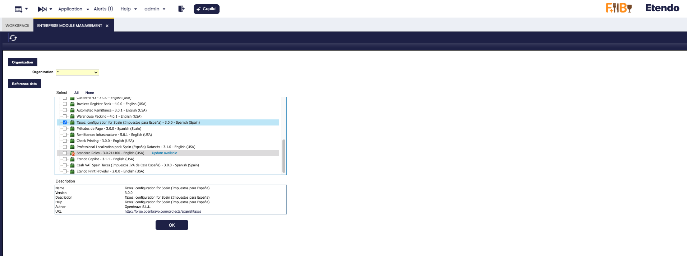

## Contenido del módulo
Al instalar y aplicar este módulo, Etendo crea automáticamente los siguientes elementos:

-   Se han creado dos nuevos informes, el modelo 303 mensual y el trimestral para la organización/es en la ruta de aplicación: :material-menu: `Gestión Financiera` > `Contabilidad` > `Configuración` > `Declaración de impuestos`, tal y como se muestra en la siguiente imagen:
     

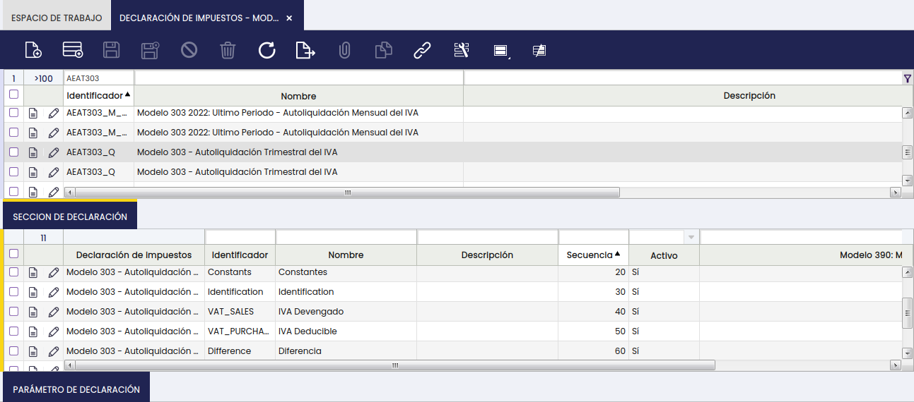

-   La pestaña "Sección de Impuestos" contiene la definición de toda la información que se va a incluir en el modelo 303 y, por tanto, en el fichero del 303 que se generará desde la ventana "Generador de Declaraciones de Impuestos". De todas estas secciones cabe destacar las secciones "IVA Devengado", "IVA Deducible" y "Diferencia".  
    Por ejemplo, la sección "IVA Devengado" incluye los parámetros siguientes en la pestaña "Parámetro de declaración":
    -   IVA Devengado - Régimen Ordinario
    -   IVA Devengado - Recargo de Equivalencia
    -   IVA Devengado - Adquisiciones Intracomunitarias

Estos parámetros se ligan a los tipos de impuestos en función de que las operaciones ligadas a ellos deban declararse, por ejemplo, como parte del IVA Devengado en Régimen Ordinario o bien como parte del IVA Devengado por Recargo de Equivalencia.

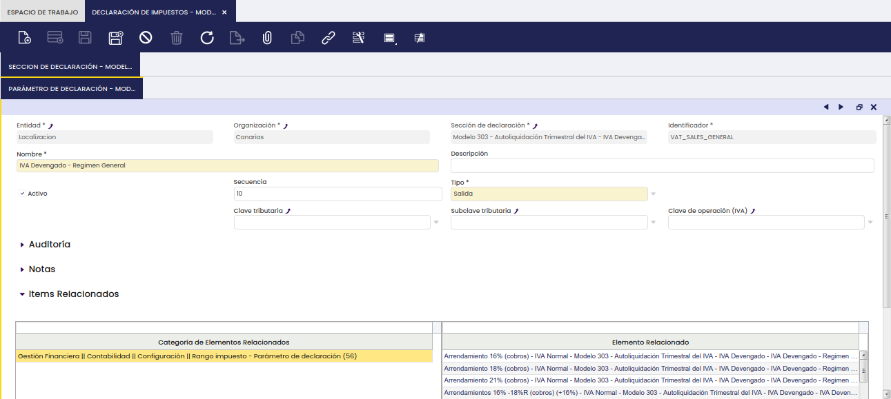

-   Por tanto, los rangos de impuestos se han asociado al correspondiente parámetro del 303, con el fin de que las transacciones completadas y contabilizadas ligadas a dichos impuestos, se tenga en cuenta en una u otra casilla/posición del fichero.  
     

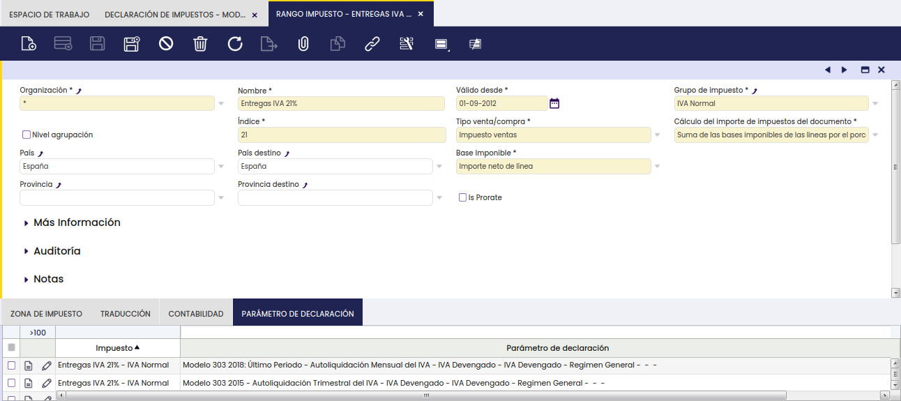

-   Por último, el generador de declaraciones de impuestos permite la generación del fichero para la presentación de la declaración-liquidación del modelo 303, desde la ruta de aplicación: :material-menu: `Gestión Financiera` > `Contabilidad` > `Herramientas de análisis` > `Generador de declaraciones de impuestos`, tal y como se muestra en la siguiente imagen:
     

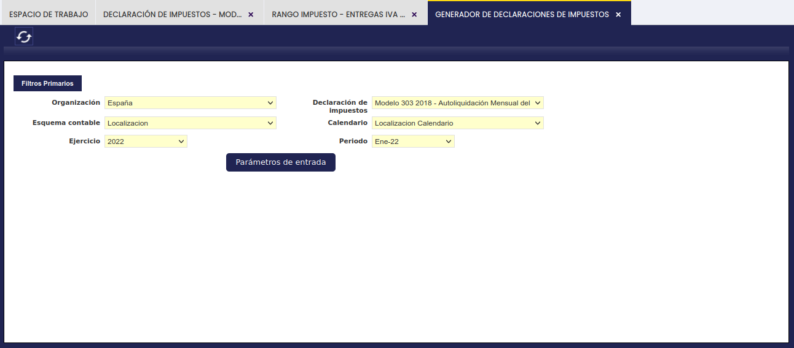

## Configuración
### Configuración de impuestos / IVA

Para configurar los impuestos, acceda a :material-menu: `Configuración General` > `Organización` > `Gestión del módulo de Empresa`. Seleccione la organización legal con contabilidad y aplique los módulos en el siguiente orden:

1. Primero, el módulo de **Impuestos para España** (si no ha sido aplicado previamente), a nivel de Organización raíz del sistema.
2. Después, el módulo **Modelo AEAT 303**, a nivel de Organización legal con contabilidad.

!!! note
    Si ya realizó este paso al seguir la sección [Aplicación del módulo](#aplicacion-del-modulo) más arriba, no es necesario repetirlo.

### Configuración del modelo 303
La configuración del modelo 303 se instala por defecto y se puede comprobar en la ruta de aplicación: :material-menu: `Gestión Financiera` > `Contabilidad` > `Configuración` > `Declaración de Impuestos`.

Tanto para el modelo 303 mensual como trimestral en la pestaña "Sección de declaración" se han creado 11 secciones, una por cada grupo de información a incluir a la hora de generar el fichero del Modelo 303:

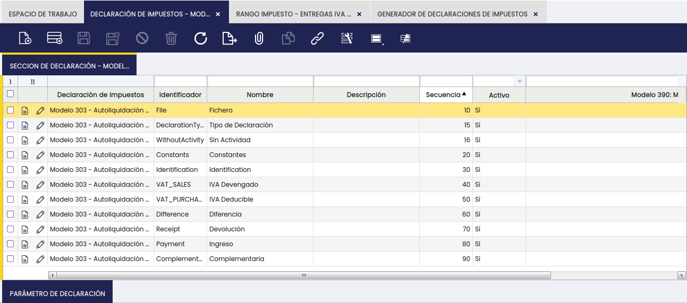

-   **Fichero**
    -   Esta sección contiene un parámetro de tipo "Entrada", para que el usuario pueda introducir el nombre del fichero 303 al generarlo.
-   **Tipo de declaración**
    -   Esta sección contiene a 8 parámetros de tipo "Entrada", uno por cada tipo de declaración, para que el usuario pueda marcar el correspondiente al generar el fichero.
        -   Compensación
        -   Devolución
        -   Ingreso
        -   Resultado cero
        -   Ingreso domiciliación bancaria
        -   Ingreso cuenta corriente tributaria
        -   Devolución cuenta corriente tributaria
        -   Devolución por transferencia al extranjero
-   **Sin Actividad**
    -   Esta sección contiene 1 parámetro de tipo "Entrada" para que el usuario pueda marcar una liquidación de IVA como "Sin Actividad".
-   **Constantes**
    -   Esta sección incluye todos los valores constantes que requiere el 303, tales como:
        -   Modelo = 303
        -   Página = 01
        -   Identificador de fin de registro = </T30301>
-   **Identificación**
    -   Esta sección incluye 4 parámetros de "Salida" que se corresponden con datos de identificación de la organización para la cual se genera el fichero y 1 parámetro de "Entrada" de tipo "checkbox" que es "Inscrito en el Registro de devolución mensual" que podría configurarse como constante.
-   **IVA Devengado**
    -   Esta sección incluye 3 parámetros de tipo "Salida", uno por cada tipo de IVA devengado.
        -   "IVA Devengado - Régimen General" de IVA. Este parámetro está ligado a los rangos de impuestos cuyas operaciones tributan en régimen general, por ejemplo, las entregas de bienes y servicios dentro del territorio de aplicación del impuesto.
        -   "IVA Devengado - Recargo de Equivalencia". Este parámetro está ligado a los rangos de impuestos cuyas operaciones tributan en régimen de recargo de equivalencia, por ejemplo, las entregas de bienes a minoristas dentro del territorio de aplicación del impuesto.
        -   "IVA Devengado - Adquisiciones Intracomunitarias”. Este parámetro está ligado a los rangos de impuestos de adquisiciones intracomunitarias de bienes

El listado completo de los rangos de impuesto ligados a cada uno de estos parámetros se puede consultar en el anexo al final de este documento.

-   **IVA Deducible**
    -   Esta sección incluye un total de 12 parámetros, 6 parámetros de tipo "Salida" y otros 6 de tipo "Entrada".  
        Los parámetros de tipo "Salida" se corresponden con el tipo de IVA Deducible del que se puede sacar información de Etendo, por ejemplo "IVA Deducible por cuotas soportadas en operaciones interiores corrientes".  
        Los parámetros de tipo "Entrada" se corresponden con tipos de IVA Deducible para los que no se puede sacar información de Etendo, por ejemplo "IVA Deducible por compensación Régimen Esp. A.G y P.(cuota)

El listado completo de los rangos de impuesto ligados a cada uno de estos parámetros se puede consultar en el anexo al final de este documento.

-   **Diferencia**
    -   Esta sección incluye 4 parámetros de tipo "Entrada" para que el usuario pueda introducir la siguiente información a la hora de generar el fichero:
        -   % Atribuible a la Administración del Estado %.  
            Los sujetos pasivos que tributen conjuntamente en la Administración del Estado y en las Diputaciones del País Vasco o a la Comunidad Foral de Navarra, deben hacer constar el % del volumen de operaciones en territorio común y que, por tanto, deben tributar en la Administración del Estado; el resto de sujetos pasivos harán costar un 100%.  
            Este dato podría configurarse como constante.
        -   Cuotas a compensar de periodos anteriores. Los sujetos pasivos deben hacer constar, cuando sea aplicable, las cuotas positivas a compensar procedentes de periodos anteriores.
        -   Resultado de la regularización anual. En la última liquidación del año se hará constar el resultado de la regularización anual por inversiones
        -   A deducir (autoliquidación complementaria), exclusivamente en el caso de declaración complementaria se hará constar el resultado de la última declaración presentada por el mismo concepto, correspondiente al mismo ejercicio y periodo.
    -   Y, además, 3 parámetros de salida correspondientes a operaciones no sujetas que originan derecho a deducción:
        -   Entregas Intracomunitarias de bienes. Este parámetro está ligado a los rangos de impuestos que se listan a continuación:
            -   Entregas intracomunitarias (%N=>0%)
            -   Entregas intracomunitarias (%R=>0%)
            -   Entregas intracomunitarias (%SR=>0%)
            -   Entregas intracomunitarias Bienes Inversión (%N=>0%)
        -   Exportaciones y Operaciones asimiladas. Este parámetro está ligado a los rangos de impuestos que se listan a continuación:
            -   Entregas a Canarias,Ceuta y Melilla (%N=>0%)
            -   Entregas a Canarias,Ceuta y Melilla (%SR=>0%)
            -   Entregas a Canarias,Ceuta y Melilla (%R=>0%)
            -   Exportaciones (%N=>0%)
            -   Exportaciones (%R=>0%)
            -   Exportaciones (%SR=>0%)
            -   Exportaciones Bienes Inversión (%N=>0%)
        -   Operaciones no sujetas o con inversión del sujeto pasivo. Este parámetro está ligado a los rangos de impuestos que se listan a continuación:
            -   Servicios a Canarias, Ceuta y Melilla (%N=>0%)
            -   Servicios a Canarias, Ceuta y Melilla (%SR=>0%)
            -   Servicios a Canarias, Ceuta y Melilla (%R=>0%)
            -   Servicios prestados internacional (%N=>0%)
            -   Servicios prestados internacional (%R=>0%)
            -   Servicios prestados UE (%N=>0%)
            -   Servicios prestados UE (%R=>0%)
-   **Devolución**
    -   Esta sección incluye un parámetro de tipo "Entrada" que es la cuenta bancaria a utilizar en caso de declaración a devolver. Este dato podría configurarse como constante.
-   **Ingreso**
    -   Esta sección incluye 5 parámetros de tipo "Entrada" relativos a declaraciones "A ingresar":
        -   la cuenta bancaria a utilizar en caso de declaración a ingresar. Este dato podría configurarse como constante.
        -   No consta
        -   Efectivo
        -   Adeudo en cuenta
        -   Domiciliación
-   **Complementaria**
    -   Esta sección incluye 2 parámetros de tipo entrada:
        -   Declaración complementaria, como un checkbox (si/no)
        -   Nº Justificate, de la declaración anterior que se complementa.

### Tipos de documento y fecha
A la hora de generar el fichero de texto válido para declarar el Modelo 303 de liquidación de IVA, se tiene en cuenta:

-   El IVA (soportado) deducible registrado y contabilizado en las Facturas/Abonos de Compra, que el usuario puede registrar en la ruta de aplicación: :material-menu: `Gestión de Compras` > `Transacciones` > `Factura (Proveedor)`, para los siguientes tipos de documento:
    -   AP Invoice (Factura de compra)
    -   AP Invoice negativa (Abono de compra)
    -   AP Credit Memo (Abono de compra)
-   El IVA devengado registrado y contabilizado en las Facturas/Abonos de Venta que el usuario puede emitir en la ruta de aplicación: :material-menu: `Gestión de Ventas` > `Transacciones` > `Factura (Cliente)`, para los siguientes tipos de documento:
    -   AR Invoice (Factura de venta)
    -   AR Invoice negativa (Abono de venta)
    -   AR Credit Memo (Abono de venta)

La actual versión del módulo no tiene en cuenta los tipos de documento de Etendo sin APRM que se enumeran a continuación, y que podrían estar ligados a un rango de impuesto, por considerarse que no se deberían utilizar para la contabilización de facturas que incluyan IVA:

-   Extracto bancario
-   Diario de Caja
-   Liquidaciones y asientos manuales

**La fecha que se tiene en cuenta** para la inclusión de las facturas de compra/venta en la declaración/fichero del 303 es la **fecha de contabilización**, lo cual que implica que:

-   Las facturas de compra/venta con fecha de contabilización dentro de un mes determinado se incluirán en la declaración mensual de ese mes.
-   Las facturas de compra/venta con fecha de contabilización dentro de un trimestre determinado se incluirán en la declaración trimestral correspondiente a ese trimestre.

## Caso de Usuario
### IVA Devengado - escenarios
Tal y como se ha explicado con anterioridad, el principal objetivo del modelo 303 es que las empresas españolas puedan autoliquidar el IVA regularmente como diferencia entre el IVA Devengado en facturas emitidas de Venta y el IVA soportado deducible.

El fichero del 303 recoge desde la posición 72 a la 357, la base imponible, tipo y cuota del IVA devengado en las operaciones de venta bajo el régimen general, especificando por tipo de IVA (16%/18%, 7%/8% y 4%), régimen de recargo de equivalencia especificado por tipo de IVA (4%, 1% y 0,5%) así como la base y cuota del IVA devengado en las adquisiciones intracomunitarias.

#### IVA devengado - régimen general
Durante el periodo correspondiente (mes/trimestre), el usuario contabilizará en Etendo las facturas/abonos de venta emitidas tanto por la entrega de bienes como por la prestación de servicios dentro del territorio de aplicación del impuesto/IVA (Península y Baleares).

Se tendrán en cuenta:

1.  las facturas/abonos emitidas por la venta de productos o por la prestación de servicios, contabilizadas en la ruta de aplicación :material-menu: `Gestión de Ventas` > `Transacciones` > `Factura (Cliente)`
2.  las facturas/abonos financieros emitidos desde la ruta de aplicación: :material-menu: `Gestión de Ventas` > `Transacciones` > `Factura (Cliente)`, marcados como "Factura Financiera" a nivel de línea de factura de venta, ligadas a un concepto contable previamente creado y asignado a una categoría de impuesto.
3.  las líneas de impuesto manualmente introducidas por el usuario en la ruta de aplicación: :material-menu: `Gestión de Ventas` > `Transacciones` > `Factura (Cliente) - Cabecera - Impuestos`

El fichero del 303 recogerá dichas transacciones dentro del mes/trimestre correspondiente, teniendo en cuenta la fecha de contabilización de dichas facturas, ya que el IVA se devenga cuando se realiza la puesta a disposición de los bienes o la prestación del servicio lo cual conlleva la facturación correspondiente, facturas que deben contabilizarse para tenerse en cuenta.

Los productos/servicios/conceptos contables tiene que estar ligados a una de las siguientes categorías de impuestos:

-   IVA Normal
-   IVA Reducido
-   IVA Super reducido
-   IVA Normal Servicios
-   IVA Reducido Servicios
-   IVA Super Reducido Servicios
-   IVA Normal B. Inmuebles
-   IVA Reducido B. Inmuebles
-   IVA Normal Bienes Inversión

Las líneas de facturas tienen que tener un rango de impuesto asociado a uno de los parámetros del 303 de la sección "IVA Devengado - Régimen General".

#### IVA devengado - régimen de recargo de equivalencia
Durante el periodo correspondiente (mes/trimestre), el usuario contabilizará en Etendo las facturas/abonos de venta emitidas por la entrega de bienes dentro del territorio de aplicación del impuesto/IVA (Península y Baleares) a terceros minoristas que se encuentren en régimen de recargo de equivalencia.

En estos casos, el emisor de la factura incluye, además del IVA, el tipo (%) de recargo correspondiente.

Se tendrán en cuenta:

1.  las facturas/abonos emitidas por la venta de productos, contabilizadas en la ruta de aplicación :material-menu: `Gestión de Ventas` > `Transacciones` > `Factura (Cliente)`
2.  las facturas/abonos financieros emitidos desde la ruta de aplicación: :material-menu: `Gestión de Ventas` > `Transacciones` > `Factura (Cliente)`, marcados como "Factura Financiera" a nivel de línea de factura de venta, ligadas a un concepto contable previamente creado y asignado a una categoría de impuesto.
3.  las líneas de impuesto manualmente introducidas por el usuario en la ruta de aplicación: :material-menu: `Gestión de Ventas` > `Transacciones` > `Factura (Cliente) - Cabecera - Impuestos`

El fichero del 303 recogerá dichas transacciones dentro del mes/trimestre correspondiente, teniendo en cuenta la fecha de contabilización de dichas facturas, ya que el IVA se devenga cuando se realiza la puesta a disposición de los bienes, lo cual conlleva la facturación correspondiente, facturas que deben contabilizarse para tenerse en cuenta.

Los productos/servicios/conceptos contables tiene que estar ligados a una de las siguientes categorías de impuestos:

-   IVA Normal
-   IVA Reducido
-   IVA Super reducido

Las líneas de facturas tienen que tener un rango de impuesto asociado a uno de los parámetros del 303 de la sección "IVA Devengado - Recargo de Equivalencia".

#### IVA devengado - Adquisiciones intracomunitarias
Durante el periodo correspondiente (mes/trimestre), el usuario registrará y contabilizará en Etendo las facturas/abonos de compra recibidos de sus proveedores/acreedores (no residentes en territorio de aplicación del impuesto, pero residentes en la Unión Europea que son operadores intracomunitarios), por la adquisición de bienes dentro del territorio de aplicación del impuesto/IVA (Península y Baleares).

Se tendrán en cuenta:

1.  las facturas/abonos registradas en el sistema por la compra de productos, contabilizadas en la ruta de aplicación :material-menu: `Gestión de Compras` > `Transacciones` > `Factura (Proveedor)`
2.  las facturas/abonos financieros emitidos desde la ruta de aplicación: :material-menu: `Gestión de Compras` > `Transacciones` > `Factura (Proveedor)`, marcados como "Factura Financiera" a nivel de línea de factura de compra, ligadas a un concepto contable previamente creado y asignado a una categoría de impuesto.
3.  las líneas de impuesto manualmente introducidas por el usuario en la ruta de aplicación: :material-menu: `Gestión de Compras` > `Transacciones` > `Factura (Proveedor) - Cabecera - Impuestos`

Los productos/conceptos contables tienen que estar relacionados con una de las siguientes categorías de impuesto:

-   IVA Normal
-   IVA Reducido
-   IVA Super Reducido

Las líneas de facturas tienen que tener un rango de impuesto asociado a uno de los parámetros del 303 de la sección "IVA Devengado - Adquisiciones Intracomunitarias".

Es importante recalcar que el caso de las adquisiciones intracomunitarias se considerarán realizadas en el territorio de aplicación del impuesto cuando:

-   se encuentre en este territorio el lugar de la llegada de la expedición o transporte con destino al adquirente.
-   y cuando el adquirente haya comunicado al vendedor el número de identificación a efectos del impuesto sobre el Valor Añadido atribuido por la Administración española.

Este régimen se caracteriza por el gravamen en destino de las entregas intracomunitarias realizadas entre empresas. Esto significa que se aplique una exención en el país de origen y que se considere realizado el hecho imponible en el de destino, con motivo de la adquisición. A esto se le denomina adquisición intracomunitaria de bienes, y se altera de esta manera la regla general del impuesto, al ser el sujeto pasivo del impuesto el que compra y no el que vende.

El sujeto pasivo/adquiriente es, por tanto, quien debe liquidar el IVA y, por tanto, deberá autorrepercutirse el IVA y a su vez deducírselo, si aplica. Es por ello que este tipo de operaciones, como las operaciones de Inversión de Sujeto Pasivo aparecen tanto en la sección de IVA devengado como en la sección de IVA deducible.

### IVA Deducible - escenarios
Tal y como se ha explicado con anterioridad, el principal objetivo del modelo 303 es que las empresas españolas pueda autoliquidar el IVA regularmente como diferencia entre el IVA Devengado en facturas emitidas de Venta y el IVA soportado deducible.

El fichero del 303 recoge desde la posición 357 a la 612, la base imponible y cuota, en la mayoría de los casos, del IVA soportado que es deducible en operaciones interiores, importaciones y adquisiciones intracomunitarias de bienes corrientes (bienes y servicios) y de bienes de inversión.

#### IVA deducible - cuotas soportadas en operaciones interiores corrientes
Durante el periodo correspondiente (mes/trimestre), el usuario registrará y contabilizará en Etendo las facturas/abonos de compra recibidos de sus proveedores/acreedores tanto por la compra de bienes como por los servicios prestados a la Empresa dentro del territorio de aplicación del impuesto/IVA (Península y Baleares), así como las facturas financieras.

Los productos/servicios/conceptos contables tienen que estar relacionados con una de las siguientes categorías de impuesto:

-   IVA Normal
-   IVA Reducido
-   IVA Super Reducido
-   IVA Normal Servicios
-   IVA Reducido Servicios
-   IVA Super Reducido Servicios
-   IVA Normal B. Inmuebles
-   IVA Reducido B. Inmuebles

Las líneas de facturas tienen que tener un rango de impuesto asociado a uno de los parámetros del 303 de la sección "IVA Deducible - Por cuotas soportadas en operaciones interiores corrientes".

#### IVA deducible - operaciones interiores bienes de inversión
Durante el periodo correspondiente (mes/trimestre), el usuario registrará y contabilizará en Etendo las facturas/abonos de compra recibidos de sus proveedores/acreedores tanto por la compra de bienes de inversión (se consideran bienes de inversión los bienes con un valor superior a 3.000,00 €) dentro del territorio de aplicación del impuesto/IVA (Península y Baleares), así como las facturas financieras.

Los productos/servicios/conceptos contables tienen que estar relacionados con una de las siguientes categorías de impuesto:

-   IVA Normal Bienes Inversión

Las líneas de facturas tienen que tener un rango de impuesto asociado a uno de los parámetros del 303 de la sección "IVA Deducible - Operaciones interiores bienes de inversión".

#### IVA deducible - por cuotas devengadas en importaciones de bienes
Durante el periodo correspondiente (mes/trimestre), el usuario registrará y contabilizará en Etendo las facturas/abonos de compra recibidos de sus proveedores/acreedores (no residentes en territorio de aplicación del impuesto), por la importación de bienes dentro del territorio de aplicación del impuesto/IVA (Península y Baleares), así como las facturas financieras.

Los productos/conceptos contables tienen que estar relacionados con una de las siguientes categorías de impuesto:

-   IVA Normal
-   IVA Reducido
-   IVA Super Reducido

Las líneas de facturas tienen que tener un rango de impuesto asociado a uno de los parámetros del 303 de la sección "IVA Deducible - Por cuotas devengadas en las importaciones de bienes corrientes".

#### IVA deducible - importaciones bienes de inversión
Durante el periodo correspondiente (mes/trimestre), el usuario registrará y contabilizará en Etendo las facturas/abonos de compra recibidos de sus proveedores/acreedores (no residentes en territorio de aplicación del impuesto), por la importación de bienes de inversión dentro del territorio de aplicación del impuesto/IVA (Península y Baleares), así como las facturas financieras.

Los productos/conceptos contables tienen que estar relacionados con una de las siguientes categorías de impuesto:

-   IVA Normal Bienes Inversión

Las líneas de facturas tienen que tener un rango de impuesto asociado a uno de los parámetros del 303 de la sección "IVA Deducible - Importaciones bienes de inversión".

#### IVA deducible - adquisiciones intracomunitarias de bienes
Durante el periodo correspondiente (mes/trimestre), el usuario registrará y contabilizará en Etendo las facturas/abonos de compra recibidos de sus proveedores/acreedores (no residentes en territorio de aplicación del impuesto, pero residentes en la Unión Europea que son operadores intracomunitarios), por la adquisición de bienes dentro del territorio de aplicación del impuesto/IVA (Península y Baleares), así como las facturas financieras.

Los productos/conceptos contables tienen que estar relacionados con una de las siguientes categorías de impuesto:

-   IVA Normal
-   IVA Reducido
-   IVA Super Reducido

Las líneas de facturas tienen que tener un rango de impuesto asociado a uno de los parámetros del 303 de la sección "IVA Deducible - adquisiciones intracomunitarias de bienes corrientes".

Tal y como ya se ha mencionado, es importante recalcar que el caso de las adquisiciones intracomunitarias se considerarán realizadas en el territorio de aplicación del impuesto cuando:

-   se encuentre en este territorio el lugar de la llegada de la expedición o transporte con destino al adquirente.
-   y cuando el adquirente haya comunicado al vendedor el número de identificación a efectos del impuesto sobre el Valor Añadido atribuido por la Administración española.

Este régimen se caracteriza por el gravamen en destino de las entregas intracomunitarias realizadas entre empresas. Esto significa que se aplique una exención en el país de origen y que se considere realizado el hecho imponible en el de destino, con motivo de la adquisición. A esto se le denomina adquisición intracomunitaria de bienes, y se altera de esta manera la regla general del impuesto, al ser el sujeto pasivo del impuesto el que compra y no el que vende.

El sujeto pasivo/adquiriente es, por tanto, quien debe liquidar el IVA y, por tanto, deberá autorrepercutirse el IVA y a su vez deducírselo, si aplica. Es por ello que este tipo de operaciones, como las operaciones de Inversión de Sujeto Pasivo aparecen tanto en la sección de IVA devengado como en la sección de IVA deducible.

#### IVA deducible - adquisiciones intracomunitarias de bienes de inversión
Durante el periodo correspondiente (mes/trimestre), el usuario registrará y contabilizará en Etendo las facturas/abonos de compra recibidos de sus proveedores/acreedores (no residentes en territorio de aplicación del impuesto, pero residentes en la Unión Europea que son operadores intracomunitarios), por la adquisición de bienes de inversión dentro del territorio de aplicación del impuesto/IVA (Península y Baleares), así como las facturas financieras.

Los productos/conceptos contables tienen que estar relacionados con una de las siguientes categorías de impuesto:

-   IVA Normal Bienes Inversión

Las líneas de facturas tienen que tener un rango de impuesto asociado a uno de los parámetros del 303 de la sección "IVA Deducible - adquisiciones intracomunitarias de bienes de inversión".

### Diferencia - escenarios
El fichero del 303 recoge desde la posición 629 a la 804, los datos relativos a la diferencia entre el IVA Devengado y el Deducible, junto con otro tipo de información adicional necesaria para el cálculo del resultado final casilla \[48\]

Desde Etendo, el usuario puede obtener la diferencia entre IVA Devengado y Deducible, así como parte de la información adicional necesaria para el cálculo del resultado final, el resto debe introducirse por parte del usuario como "parámetros de entrada" a la hora de generar el fichero.

La información que el usuario puede obtener desde el sistema es las bases imponibles para un periodo determinado (mes/trimestre) respecto de las operaciones que a continuación se detallan:

-   **Entregas intracomunitarias** - en este caso el sistema tiene en cuenta las facturas/abonos/facturas financieras de venta a clientes no residentes en territorio de aplicación del impuesto pero residentes en la Unión Europea, emitidos y contabilizados, por la entrega exenta de IVA de bienes fuera del territorio de aplicación del impuesto/IVA (Península y Baleares).  
    Las líneas de facturas tienen que tener un rango de impuesto asociado a uno de los parámetros del 303 de la sección "Diferencia - Entregas Intracomunitarias".
-   **Exportaciones y operaciones asimiladas** - lo mismo aplica a las exportaciones, en este caso el sistema tiene en cuenta las facturas/abonos/facturas financieras de venta emitidas y contabilizas, a clientes extranjeros, emitidos y contablizados, por la entrega exenta de IVA de bienes fuera del territorio de aplicación del impuesto/IVA (Península y Baleares).  
    Las líneas de facturas tienen que tener un rango de impuesto asociado a uno de los parámetros del 303 de la sección "Diferencia - Exportaciones y Operaciones Asimiladas".
-   **Operaciones no sujetas o con inversión del sujeto pasivo** que origina derecho a deducción - este caso aplica a facturas/abonos/facturas financieras de venta emitidos y contabilizados, por la prestación de servicios de la Empresa fuera del territorio de aplicación del impuesto, servicios exentos pero que originan derecho a deducción.  
    Las líneas de facturas tienen que tener un rango de impuesto asociado a uno de los parámetros del 303 de la sección "Diferencia - Operaciones no sujetas o con inversión del sujeto pasivo".

El resto de datos deben ser introducidos manualmente por el usuario a la hora de generar el modelo 303 desde la ventana "Generador de declaraciones de impuestos", tal y como se muestra en la pantalla siguiente:

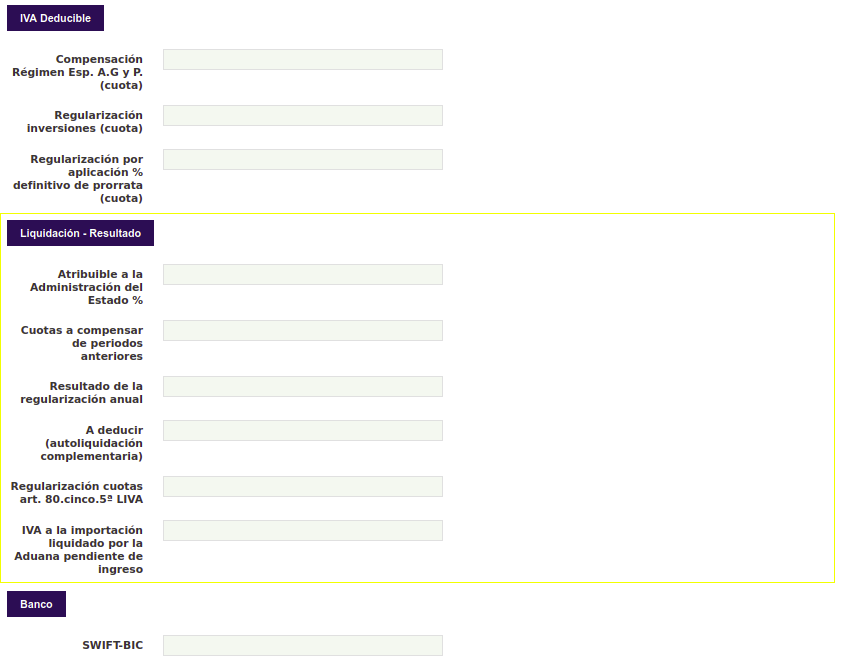

### Devoluciones - escenarios
#### Devoluciones - Devolución/Devolución cuenta corriente tributaria
Para este tipo de declaraciones, y siempre que el check 'Inscrito en registro de devolución mensual' esté marcado, los siguientes campos son obligatorios:

- IBAN
- Marca SEPA: indique si la cuenta bancaria pertenece a la zona SEPA. Consulte con su entidad bancaria si no está seguro.

#### Devoluciones - Devolución por transferencia al extranjero
Para este tipo de declaraciones, y siempre que el check 'Inscrito en registro de devolución mensual' esté marcado, los siguientes campos son obligatorios:

- IBAN (cuenta bancaria para la devolución)
- Nombre del banco (*Bank name*)
- Dirección del banco (*Bank address*)
- Ciudad (*City*)
- Código de país (*Country code*)
- Marca SEPA: indique si la cuenta bancaria pertenece a la zona SEPA. Consulte con su entidad bancaria si no está seguro.

### Configuración previa antes de generar el Informe

#### Actividades del I.A.E.
En el Modelo 303, para generar el informe mensual - último periodo, a partir de 2022, se deben declarar las principales actividades del I.A.E. (Impuesto de Actividades Económicas) en las que la empresa trabaja habitualmente.

El módulo Epígrafes I.A.E., instalado como dependencia del 303, añade una nueva solapa a la ventana de Organización en la que puede indicar todas las actividades en las que su empresa ha estado trabajando. El modelo 303 debe incluir como mínimo una actividad principal, que debe estar marcada en la aplicación como por defecto, y como máximo 5 actividades. En caso de incluir más de 5 actividades, se incluirán en el informe las 5 primeras según el número de línea.

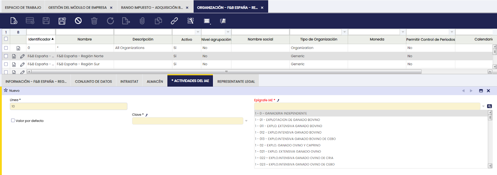

En el módulo de Epígrafes IAE se incluye el conjunto correspondiente a la clave 1. Si desea incluir un epígrafe que pertenezca a cualquier otra clave, tan sólo debe crear un nuevo registro en la ventana Epígrafes IAE e incluirlo en un registro de la solapa de Actividades del IAE de la ventana de Organización.

Para el modelo 303, los campos 'Epígrafe IAE' y 'Código' son obligatorios

### Generación del modelo 303
Tal y como ya se ha explicado, el modelo 303 de autoliquidación de IVA, se genera como un fichero de texto válido conforme a los requerimientos de la AEAT desde la ruta de aplicación: :material-menu: `Gestión Financiera` > `Contabilidad` > `Herramientas de análisis` > `Generador de declaraciones de impuestos`

Una vez que el usuario ha introducido los datos genéricos, tales como "organización", "ejercicio", "periodo":

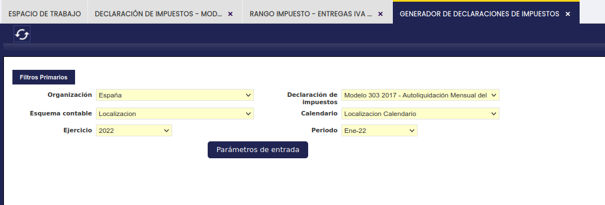

se pueden introducir los parámetros de entrada, o datos que no pueden obtenerse de Etendo a través de botón de proceso "Parámetros de entrada".

!!! info
    Es importante recalcar que algunos de los parámetros de entrada que se introducen a continuación, como por ejemplo "Inscrito en el Registro Devolución Mensual", pueden configurarse como parámetros "Constantes" con el fin de no tener que introducirlos cada vez que se genera el fichero del 303.

Para configurar un parámetro como constante:

1. Acceda a :material-menu: `Gestión Financiera` > `Contabilidad` > `Configuración` > `Declaración de Impuestos`.
2. Localice la sección de declaración que contiene el parámetro a configurar. Por ejemplo, el parámetro "Inscrito en el Registro de devolución mensual" se encuentra en la sección "Identificación".
3. En ese parámetro, cambie el tipo de "Entrada" a "Constante".
4. En el campo **Valor constante** (*Constant Value*), introduzca `1` si el sujeto pasivo está inscrito en el registro de devolución mensual, o `2` si no lo está.

Es importante recalcar que si se produce una actualización de los datos de referencia de este módulo, los cambios de parámetros de entrada a constante se sobreescribirán, por lo que será necesario el volver a configurarlos.

Las secciones de la nueva ventana que se muestra se corresponden con las secciones definidas para el Modelo 303:

Secciones: "**Fichero**", "**Tipo de declaración**" y "**Sin actividad**":

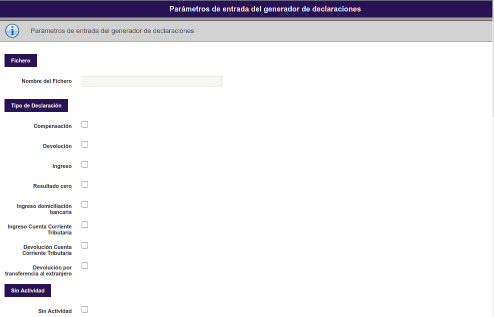

Secciones: "**IVA deducible**", **"Liquidación-resultado"** y **"Banco"**:

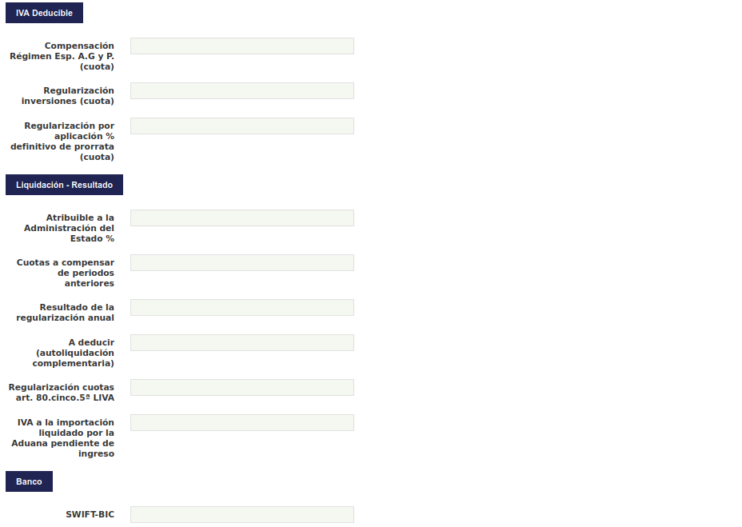

Secciones: **"Complementaria"**, **"Tributación por razón de territorio"** y **"Additional Information"** *(este nombre aparece en inglés en la aplicación)*

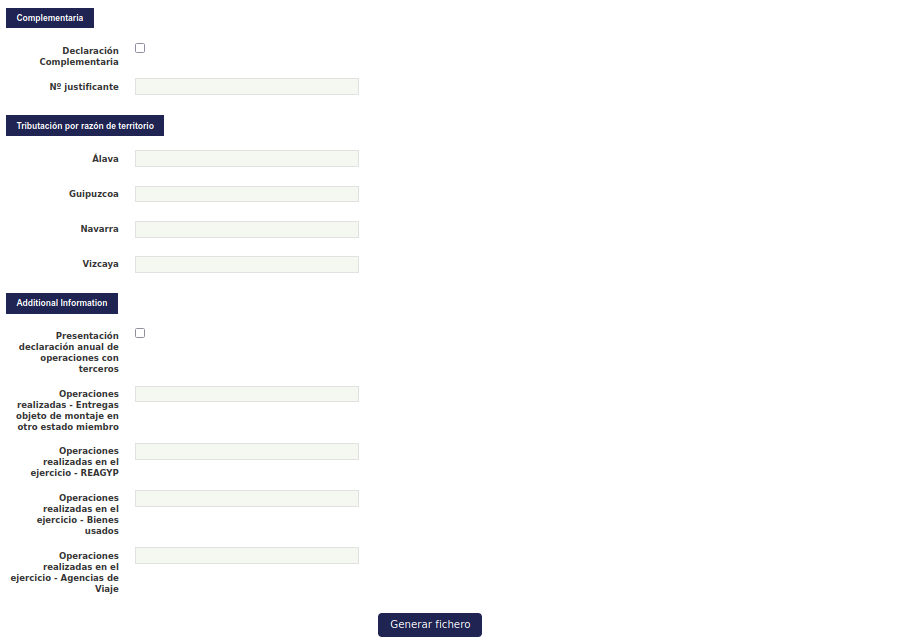

Una vez que el fichero se ha generado, tendrá este aspecto:

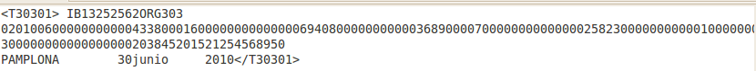

### Pre-validación del modelo 303
El fichero generado en Etendo se puede pre-validar en el siguiente link de la AEAT:

[_Formulario del modelo 303 para su presentación (predeclaración) ejercicio 2014 y siguientes (Régimen General)_](https://www2.agenciatributaria.gob.es/es13/h/ie43030b.html){target="_blank"}.

Una vez en dicho link el usuario podrá importar el fichero en la opción "Optativo: Importar datos de fichero", los datos obtenidos del fichero se mostrarán para su validación.

Una vez validados los datos, el modelo 303 se puede presentar en el siguiente link, para lo cual se requiere un certificado válido: [_Presentación ejercicio 2014 y siguientes (Régimen General)_](https://www.agenciatributaria.gob.es/AEAT.sede/procedimientoini/G414.shtml){target="_blank"}, para lo que se necesita certificado electrónico de identificación o DNI electrónico.

??? info "Anexo — Listado completo de rangos de impuesto"

    Este anexo incluye el listado completo de los rangos de impuestos asociados a los parámetros del modelo 303 de las secciones "IVA Devengado" e "IVA Deducible" incluidos en el dataset del módulo:

    ### **IVA Devengado**

    #### **IVA Devengado - Régimen General**

    -   Arrendamiento 18% (cobros)
    -   Arrendamientos 18% -21%R (cobros) (+18%)
    -   Arrendamiento 21% (cobros)
    -   Arrendamientos 21% -21%R (cobros) (+21%)
    -   Entregas Bienes Inversión 18%
    -   Entregas Bienes Inversión 21%
    -   Entregas IVA 18%
    -   Entregas IVA 8%
    -   Entregas IVA 21%
    -   Entregas IVA 10%
    -   Entregas IVA 4%
    -   Entregas IVA+RE 18+4% (+18%)
    -   Entregas IVA+RE 8+1% (+8%)
    -   Entregas IVA+RE 21+5.2% (+21%)
    -   Entregas IVA+RE 10+1.4% (+10%)
    -   Entregas IVA+RE 4+0.5% (+4%)
    -   Inversión Sujeto Pasivo no UE 18% (-18%)
    -   Inversión Sujeto Pasivo no UE 8% (-8%)
    -   Inversión Sujeto Pasivo no UE 21% (-21%)
    -   Inversión Sujeto Pasivo no UE 10% (-10%)
    -   Inversión Sujeto Pasivo UE 18% (-18%)
    -   Inversión Sujeto Pasivo UE 8% (-8%)
    -   Inversión Sujeto Pasivo UE 21% (-21%)
    -   Inversión Sujeto Pasivo UE 10% (-10%)
    -   Servicios prestados nacional 18%
    -   Servicios prestados nacional 21%
    -   Servicios prestados nacional 18% -15%R (+18%)
    -   Servicios prestados nacional 18% -7%R (+18%)
    -   Servicios prestados nacional 21% -21%R (+21%)
    -   Servicios prestados nacional 21% -9%R (+21%)
    -   Servicios prestados nacional 8%
    -   Servicios prestados nacional 10%
    -   Servicios prestados nacional 4%
    -   Transmisión B.Inmuebles 18%
    -   Transmisión B.Inmuebles 8%
    -   Transmisión B.Inmuebles 21%
    -   Transmisión B.Inmuebles 10%

    #### **IVA Devengado - Recargo de equivalencia**

    -   Entregas IVA+RE 18+4% (+4%)
    -   Entregas IVA+RE 8+1% (+1%)
    -   Entregas IVA+RE 21+5.2% (+5.2%)
    -   Entregas IVA+RE 10+1.4% (+1.4%)
    -   Entregas IVA+RE 4+0.5% (+0.5%)

    #### **IVA Devengado - Adquisiciones Intracomunitarias**

    -   Adquisiciones intracomunitarias 18% (-18%)
    -   Adquisiciones intracomunitarias 8% (-8%)
    -   Adquisiciones intracomunitarias 21% (-21%)
    -   Adquisiciones intracomunitarias 10% (-10%)
    -   Adquisiciones intracomunitarias 4% (-4%)
    -   Adquisiciones intracomunitarias Bienes Inversión 18% (-18%)
    -   Adquisiciones intracomunitarias Bienes Inversión 21% (-21%)

    ### **IVA Deducible**

    #### **IVA Deducible - Por cuotas soportadas en operaciones interiores corrientes**

    -   Adquisición B.Inmuebles 18%
    -   Adquisición B.Inmuebles 8%
    -   Adquisición B.Inmuebles 21%
    -   Adquisición B.Inmuebles 10%
    -   Adquisiciones IVA 18%
    -   Adquisiciones IVA 8%
    -   Adquisiciones IVA 21%
    -   Adquisiciones IVA 10%
    -   Adquisiciones IVA 4%
    -   Arrendamiento 18% (pagos)
    -   Arrendamiento 21% (pagos)
    -   Arrendamientos 18% -21%R (pagos) (+18%)
    -   Arrendamientos 21% -21%R (pagos) (+21%)
    -   Inversión Sujeto Pasivo no UE 18% (+18%)
    -   Inversión Sujeto Pasivo no UE 8% (+8%)
    -   Inversión Sujeto Pasivo no UE 21% (+21%)
    -   Inversión Sujeto Pasivo no UE 10% (+10%)
    -   Inversión Sujeto Pasivo UE 18% (+18%)
    -   Inversión Sujeto Pasivo UE 8% (+8%)
    -   Inversión Sujeto Pasivo UE 21% (+21%)
    -   Inversión Sujeto Pasivo UE 10% (+10%)
    -   Prestación servicios nacional 18%
    -   Prestación servicios nacional 21%
    -   Prestación servicios nacional 18% -15%R (+18%)
    -   Prestación servicios nacional 18% -1%R (18%)
    -   Prestación servicios nacional 18% -7%R (+18%)
    -   Prestación servicios nacional 21% -21%R (+21%)
    -   Prestación servicios nacional 21% -1%R (+21%)
    -   Prestación servicios nacional 21% -9%R (+21%)
    -   Prestación servicios nacional 8%
    -   Prestación servicios nacional 10%
    -   Prestación servicios nacional 4%

    #### **IVA Deducible - Operaciones interiores bienes de inversión**

    -   Adquisición Bienes Inversión18%
    -   Adquisición Bienes Inversión 21%

    #### **IVA Deducible - Por cuotas devengadas en las importaciones de bienes corrientes**

    -   Adquisiciones a Canarias,Ceuta y Melilla 18%
    -   Adquisiciones a Canarias,Ceuta y Melilla 8%
    -   Adquisiciones a Canarias,Ceuta y Melilla 21%
    -   Adquisiciones a Canarias,Ceuta y Melilla 10%
    -   Adquisiciones a Canarias,Ceuta y Melilla 4%
    -   Importaciones 18%
    -   Importaciones 8%
    -   Importaciones 21%
    -   Importaciones 10%
    -   Importaciones 4%

    #### **IVA Deducible - Importaciones bienes de inversión**

    -   Importaciones Bienes Inversión 18%
    -   Importaciones Bienes Inversión 21%

    #### **IVA Deducible - En adquisiciones intracomunitarias de bienes de corrientes**

    -   Adquisiciones intracomunitarias 18% (+18%)
    -   Adquisiciones intracomunitarias 8% (+8%)
    -   Adquisiciones intracomunitarias 21% (+21%)
    -   Adquisiciones intracomunitarias 10% (+10%)
    -   Adquisiciones intracomunitarias 4% (+4%)

    #### **IVA Deducible - Adq. Intracomunitarias bienes de inversión**

    -   Adquisiciones intracomunitarias Bienes Inversión 18% (+18%)
    -   Adquisiciones intracomunitarias Bienes Inversión 21% (+21%)

*[AEAT]: Agencia Estatal de Administración Tributaria
*[IVA]: Impuesto sobre el Valor Añadido
*[NIF]: Número de Identificación Fiscal
*[IAE]: Impuesto de Actividades Económicas
*[UE]: Unión Europea
*[IBAN]: International Bank Account Number
*[SEPA]: Single Euro Payments Area

---

This work is a derivative of [Openbravo Localización Española](https://wiki.openbravo.com/wiki/Openbravo_Localizaci%C3%B3n_Espa%C3%B1a){target="_blank"} by [Openbravo Wiki](http://wiki.openbravo.com/wiki/Welcome_to_Openbravo){target="_blank"}, used under [CC BY-SA 2.5 ES](https://creativecommons.org/licenses/by-sa/2.5/es/){target="_blank"}. This work is licensed under :material-creative-commons: :fontawesome-brands-creative-commons-by: :fontawesome-brands-creative-commons-sa: [CC BY-SA 2.5 ES](https://creativecommons.org/licenses/by-sa/2.5/es/){target="_blank"} by [Etendo](https://etendo.software){target="_blank"}.