:octicons-package-16: Javapackage: `org.openbravo.module.aeat347apr.es`  
:octicons-package-16: Javapackage: `org.openbravo.module.aeat347apr.es.es_es`

## Descripción general

Este módulo permite generar la declaración :material-menu:  `Modelo AEAT 347 - Declaración Anual de Operaciones con Terceros` como un fichero de texto (`*.txt`) válido conforme a los requerimientos de la Hacienda Pública española. Es parte del bundle de [Localización Española](overview.md) de Etendo.

El fichero se genera desde :material-menu: `Gestión Financiera` > `Contabilidad` > `Herramientas de análisis` > `Generador de declaraciones de impuestos`.

El fichero generado se carga directamente en la sede electrónica de la Agencia Tributaria para cumplir con la obligación de declaración anual.

!!! info
    Se publicará una nueva versión de este módulo cuando dichos requerimientos cambien.

### Obligados a presentar la declaración

De acuerdo con la normativa de la Hacienda Española, están obligados a presentar el modelo 347, las personas físicas o jurídicas, de naturaleza pública o privada, que desarrollen actividades empresariales o profesionales y que hayan realizado operaciones con otra persona o entidad por un importe superior a 3.005,06€ durante el año natural al que se refiere la declaración.

!!! info
    Para el cálculo de la cifra de 3.005,06 € se computan de forma separada las entregas de bienes y servicios y las adquisiciones de los mismos.

### No obligados a presentar la declaración

- Quienes realicen en España actividades empresariales o profesionales sin tener en territorio español la sede de su actividad, un establecimiento permanente o su domicilio fiscal.
- Las personas físicas y las entidades en atribución de rentas en el Impuesto sobre la Renta de las Personas Físicas, por las actividades que tributen por el método de estimación objetiva y, al mismo tiempo, en el Impuesto sobre el Valor Añadido por los regímenes especiales simplificado, de la agricultura, ganadería y pesca o del recargo de equivalencia, salvo por las operaciones por las que emitan factura.
- Los obligados tributarios que no hayan realizado operaciones que en su conjunto superen la cifra de 3.005,06€
- Los obligados tributarios que hayan realizado exclusivamente operaciones no declarables.
- Los obligados tributarios que deban informar sobre las operaciones incluidas en los libros registro de IVA (modelo 340) salvo que realicen operaciones que expresamente deban incluirse en el modelo 347.

### Operaciones declarables

Las operaciones declarables y que, por tanto, se incluyen en el modelo 347 son tanto las entregas de bienes y prestaciones de servicios realizadas por el declarante como sus adquisiciones de bienes y servicios, incluyéndose, en ambos casos, tanto las operaciones típicas y habituales como las ocasionales e incluso las operaciones inmobiliarias.

Debe tenerse en cuenta que dichas operaciones se incluirán estén o no sujetas al IVA y, en el primer caso, también las exentas de dicho impuesto.

**Operaciones incluidas de forma específica**

Además, se incluyen de forma específica y aparte:

- los Arrendamientos de locales de negocios
- los importes superiores a 6.000,00€ percibidos en metálico de cada una de las personas o entidades relacionadas en la declaración
- las cantidades que se perciban en contraprestación por transmisiones de bienes inmuebles que constituyan entregas sujetas a IVA
- y las prestaciones de servicios de/a no residentes (incluyendo Canarias, Baleares, Ceuta y Melilla) que no estén sujetos a retención.

Los importes que se incluyen en el modelo 347 son los “importes totales” de la contraprestación en euros (€).

En los supuestos de operaciones sujetas y no exentas de IVA se añaden, por tanto, a la base imponible, las cuotas del impuesto y recargos de equivalencia repercutidos. Los importes además se declaran netos de las devoluciones o descuentos y bonificaciones concedidos.

El modelo 347 incluye las operaciones realizadas por el declarante durante el año natural al que se refiere la declaración. La fecha que se utiliza para incluir una operación en el 347 es la fecha contable de la factura.

**Operaciones no declarables**

Las operaciones que en ningún caso se incluirán en el 347 por ser no declarables son las que se detallan a continuación:

- aquellas que hayan supuesto entregas de bienes o prestaciones de servicios por las que los obligados tributarios no debieron expedir y entregar factura o documento equivalente
- aquellas operaciones realizadas al margen de la actividad empresarial o profesional
- aquellas efectuadas a título gratuito
- los arrendamientos de bienes exentos de IVA
- las importaciones y exportaciones de mercancías, así como las entregas y adquisiciones de bienes que supongan envíos entre el territorio peninsular español o las islas Baleares y las islas Canarias, Ceuta y Melilla.
- Todas aquellas que se incluyan en otros modelos de la Administración Tributaria como por ejemplo aquellas cuya contraprestación haya sido objeto de retención o ingreso a cuenta; las operaciones intracomunitarias de bienes y servicios que se declaran en el [modelo 349](modelo-349.md) o las operaciones incluidas en los libros registro que deben incluirse en el modelo 340.

**Operaciones no incluidas por el módulo**

El módulo de generación del Modelo 347 no incluye las operaciones que se detallan a continuación, aunque deberían incluirse en el modelo 347, ya que corresponden a Administraciones Públicas, Entidades aseguradoras y Colegios Profesionales:
- las subvenciones, auxilios o ayudas satisfechas por las entidades integradas en las distintas Administraciones Públicas
- las operaciones de seguros realizadas por las entidades aseguradoras
- las prestaciones de servicios realizadas por las agencias de viajes
- los cobros por cuenta de terceros de honorarios profesionales o de derechos derivados de la propiedad intelectual, industrial, de autor u otros por cuenta de sus socios, asociados o colegiados efectuados por sociedades, asociaciones, colegios profesionales u otras entidades que, entre sus funciones, realicen las del cobro
- las operaciones sujetas al impuesto sobre la producción, los servicios y la importación en las ciudades de Ceuta y Melilla.

!!! note
    El módulo no contempla el caso de Declaración Complementaria, es decir, aquellos casos en los que solo deben incluirse operaciones que debieron declararse en otra declaración del mismo ejercicio presentada con anterioridad y que no se incluyeron.

    Estas operaciones deben ser incluidas manualmente por el usuario a través de la página de la AEAT (Agencia Estatal de Administración Tributaria), como se explica en la sección [Presentación de declaraciones sustitutivas](#presentacion-de-declaraciones-sustitutivas).

## Instalación del módulo

### Requisitos previos

Antes de instalar el módulo `Spain AEAT Modelo 347 for APR`, deben estar instalados y aplicados a la organización los siguientes módulos:

- **Etendo** (versión compatible con el bundle de Localización Española).
- **Bundle de Localización Española** (`com.etendoerp.localization.spain.extensions`), disponible en el [Marketplace](https://marketplace.etendo.cloud/#/product-details?module=003B475055DD421B9483B5BE15AA48C5){target="_blank"}.
- **[Impuestos para España](impuestos-para-españa.md)** (`org.openbravo.localization.spain.referencedata.taxes`), incluido en el bundle anterior, con su dataset aplicado a la organización legal correspondiente.

!!! info
    Para empresas acogidas al [Régimen Especial de Criterio de Caja (RECC)](iva-de-caja.md), se requiere además el módulo `Spain AEAT Modelo 347 Cash VAT compatible`.

    Si no está seguro de si su empresa aplica este régimen, consulte con su asesor fiscal o el departamento de contabilidad.

!!! note
    El módulo incluye un conjunto de datos (dataset) que relaciona los rangos de impuestos de España con los parámetros del 347. Este dataset debe aplicarse a la organización legal correspondiente, tal y como se explica en el apartado siguiente.

### Aplicación del módulo

Una vez instalado el módulo del 347, el usuario debe aplicar su conjunto de datos a la organización legal con contabilidad correspondiente, desde :material-menu: `Configuración General` > `Organización` > `Gestión del módulo de Empresa`:

1. Seleccionar la **Organización** legal con contabilidad correspondiente. (Es la organización que representa a la entidad legal con obligaciones fiscales en España y que tiene configurada una contabilidad activa. Si no está seguro, consulte con el administrador del sistema.)
2. En **Datos de referencia**, marcar el dataset del módulo `Modelo AEAT 347`.
3. Hacer clic en **Aceptar**.

!!! note
    El dataset del módulo 347 solo aparece en esta lista una vez que el módulo `Spain AEAT Modelo 347 for APR` está instalado.

!!! info
    El [módulo de impuestos para España](impuestos-para-españa.md) es necesario para generar el modelo 347 y debe estar instalado y aplicado bien a la organización raíz del sistema (\*), o bien directamente a la organización legal para la que se quiere generar el 347.

## Configuración del módulo

### Configuración del modelo 347

Una vez aplicado el conjunto de datos del Modelo 347, puede comprobar en la ruta de aplicación: :material-menu: `Gestión Financiera` > `Contabilidad` > `Configuración` > `Declaración de Impuestos` que el modelo 347 del periodo correspondiente está creado como informe anual de impuestos.

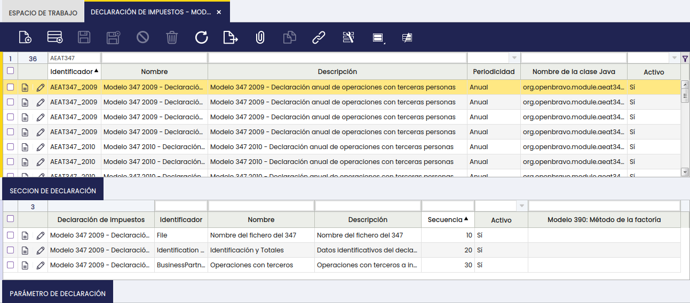

Una vez aplicado el conjunto de datos, la configuración del Modelo 347 se crea automáticamente. Solo necesitará revisar o modificar los parámetros marcados como **Entrada** si desea personalizar datos como el nombre del contacto o el teléfono de la declaración.

??? info "Detalle de parámetros (avanzado)"

    En la solapa `Secciones de la declaración` se han creado 3 grupos para el modelo 347:

    -   **Nombre del Fichero del 347**. Esta sección contiene:
        -   un parámetro de tipo `entrada` que se mostrará en el momento de generar el 347 con el fin de que el usuario introduzca manualmente el `Nombre del fichero txt del 347` que se va a generar.

    -   **Identificación y Totales**. Esta sección contiene:
        -   2 parámetros de tipo `constante` que el sistema tendrá en cuenta a la hora de incluir las operaciones, ya que solo incluirá las que superen las cifras límite que se detallan a continuación:
              
            -   Cifra límite de inclusión de operaciones con terceros = 3.005,06€
            -   Cifra límite para cobros percibidos en efectivo = 6.000,00€

        -   y 5 parámetros de tipo `entrada` que se mostrarán en el momento de generar el 347 con el fin de que el usuario los introduzca manualmente y que son:
              
            -   Nombre y apellidos de la persona de contacto. Si siempre presenta la declaración la misma persona, puede cambiarse a tipo `constante` para no tener que introducirlo en cada generación.
            -   Nº Teléfono de la persona de contacto. Igual que el anterior, puede configurarse como `constante` si el teléfono de contacto no varía entre declaraciones.
            -   Declaración sustitutiva (si/no)
            -   Nº de la declaración a sustituir
            -   NIF del representante legal

    -   **Operaciones con terceros**. Esta sección contiene:

        -   5 parámetros de tipo `salida` ligados a la clave tributaria correspondiente, que asociados a los tipos impositivos del módulo de impuestos para España, incluirán las operaciones de compra/venta en el 347:

            -   Adquisiciones de bienes - Clave A
            -   Entregas de bienes - Clave B
            -   Prestación de servicios - Clave A
            -   Servicios prestados - Clave B
            -   Transmisiones de inmuebles - Clave B

En la ruta :material-menu: `Gestión Financiera` > `Contabilidad` > `Configuración` > `AEAT347 Tipo de documento`, el usuario puede especificar los tipos de documentos que el 347 debe tener en cuenta. El funcionamiento de esta pantalla de parametrización es que si no se especifica ningún tipo de documento, Etendo tendrá en cuenta todos los tipos de documentos de tipo factura que se pueden contabilizar.

Si el usuario introduce algún tipo de documento, solo esos serán los que se tengan en cuenta.

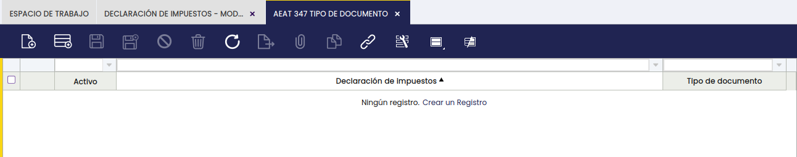

### Configuración de impuestos

La asignación de los tipos de IVA a los parámetros del Modelo 347 se realiza automáticamente al aplicar el conjunto de datos del módulo. En la mayoría de los casos no es necesario realizar ninguna acción adicional en este apartado.

??? info "Detalle de asignación de impuestos (avanzado)"

    Este módulo de generación del modelo 347 se basa en el módulo de impuestos para España, ya que utiliza los rangos de impuesto que incluye dicho módulo. Además, incluye un conjunto de datos que liga los rangos de impuesto del módulo de impuestos para España con los parámetros del 347 que se listan a continuación, en función de la operación de que se trate:

    - **Adquisiciones de bienes – Adquisición `A`**
    - **Entregas de bienes – Entregas `B`**
    - **Prestación de servicios – Adquisición `A`**
    - **Servicios prestados – Entregas `B`**
    - **Transmisiones de inmuebles – Entregas `B`**

    El usuario puede comprobar en la ruta de aplicación: :material-menu: `Gestión Financiera` > `Contabilidad` > `Configuración` > `Rango impuesto` - solapa `Parámetro de Impuesto` que los `tipos impositivos/impuestos` que deben incluirse en el 347 se han asociado al correspondiente parámetro de impuesto del 347:

    - Los tipos de IVA de compras/adquisiciones (nacional) incluyendo las adquisiciones de bienes inmuebles y bienes de inversión, se han asociado con el parámetro `Adquisiciones de bienes` que se corresponden con la clave de operación del 347 => `A`
    - Los tipos de IVA de ventas/entregas (nacional) (incluyendo Recargo de Equivalencia) se han asociado con el parámetro `Entregas de bienes` que corresponden con la clave de operación del 347 => `B`
    - Los tipos de IVA de `inversión del sujeto pasivo NO UE` (en los casos de prestación de servicios NO intracomunitarios) se han asociado con el parámetro `Prestación de servicios` que se corresponden con la clave de operación del 347 => `A`
    - Los tipos de IVA de entregas de bienes inmuebles (nacional) se han asociado con el parámetro `Transmisiones de inmuebles` que se corresponden con la clave de operación del 347 => `B`; ya que tiene que declararse dos veces como operación de venta y consignarse a parte el importe de la transmisión del bien inmueble.
    - Se han creado los tipos de IVA específicos para prestaciones de servicios (nacional e internacional), asociados a categorías de impuestos específicas para los servicios, que se han asociado con los parámetros del 347 `Prestación de servicios – clave de operación A` o `Servicios prestados – clave de operación B` en función de que la empresa declarante reciba o preste los servicios.
    - Los tipos de IVA de servicios desde/a Canarias, Baleares, Ceuta y Melilla se han asociado bien con el parámetro `Prestaciones de servicios` clave de operación del 347 => `B` o bien con el parámetro `Operaciones de servicios (Adquisición)` clave de operación del 347 => `A`, respectivamente, ya que sólo se incluyen en el 347 las operaciones de servicios y no las de bienes que supongan envíos de bienes entre el territorio peninsular español o las islas Baleares y las islas Canarias, Ceuta y Melilla
    - Y por último se han creado tipos de IVA específicos para alquileres (con y sin retenciones asociados a 2 tipos de BP tax category (categoría de impuesto del tercero), respectivamente). Los tipos de IVA de alquiler sin retenciones se han asociado con los parámetros del 347 `Prestación de servicios – clave de operación A` o `Servicios prestados – clave de operación B` en función de que la empresa sea arrendatario o arrendador del local u oficina arrendado y sujeto a IVA.

### Configuración de los locales de negocio

En el modelo 347 se deben incluir los arrendamientos de locales de negocios, es por ello que en la ruta de aplicación: `Gestión de Datos Maestros` > `Producto` se ha creado un nuevo parámetro `Local arrendado`.

#### Datos requeridos

Si el producto está marcado como local arrendado, es obligatorio completar los siguientes datos para que el módulo pueda incluirlo correctamente en el Modelo 347:

-   **Situación**. El usuario debe elegir entre una de las siguientes opciones:
    -   Locales en el extranjero
    -   Referencia catastral válida en País Vasco o en Navarra
    -   Referencia catastral válida excepto en País Vasco o Navarra
    -   Sin referencia catastral
-   **Referencia catastral.** Campo de texto libre.
-   **Tipo de vía.** El usuario debe elegir el tipo de vía de una lista normalizada según el INE español.
-   **Nombre de la vía pública**. Campo de texto libre.
-   **Tipo de numeración**. El usuario debe elegir el tipo de numeración de una lista normalizada.
-   **Número**. Campo de texto libre.
-   **Calificación del número**. Campo de texto libre.
-   **Bloque**. Campo de texto libre.
-   **Portal**. Campo de texto libre.
-   **Escalera**. Campo de texto libre.
-   **Planta o piso**. Campo de texto libre.
-   **Puerta**. Campo de texto libre.
-   **Complemento**. Datos complementarios del domicilio si los hubiera.
-   **Localidad o Población**. Campo de texto libre.
-   **Municipio**.
-   **Código de municipio**. El usuario debe elegir el código del municipio de una lista normalizada según el INE español.
-   **Código de provincia.** El usuario debe elegir el código de provincia de una lista de códigos de provincia de dos dígitos numéricos.
-   **Código postal**. El usuario debe elegir el código postal.

En el caso de `Locales en el extranjero` los datos a incluir son:

-   **Tipo de vía.**
-   **Nombre de la vía pública**.

El 347 refleja este tipo de operaciones de forma separada tal y como se explica en el correspondiente caso de usuario.

## Generación del modelo 347

!!! warning
    El módulo no contempla el caso de **Declaración Complementaria**, es decir, aquellos casos en los que solo deben incluirse operaciones que debieron declararse en otra declaración del mismo ejercicio presentada con anterioridad y que no se incluyeron. Estas operaciones deben añadirse manualmente a través de la página de la AEAT. Consulte la sección [Presentación de declaraciones sustitutivas](#presentacion-de-declaraciones-sustitutivas).

El modelo 347 se genera desde la ruta de aplicación: `Gestión Financiera` > `Contabilidad` > `Herramientas de análisis` > `Generador de declaraciones de impuestos`.

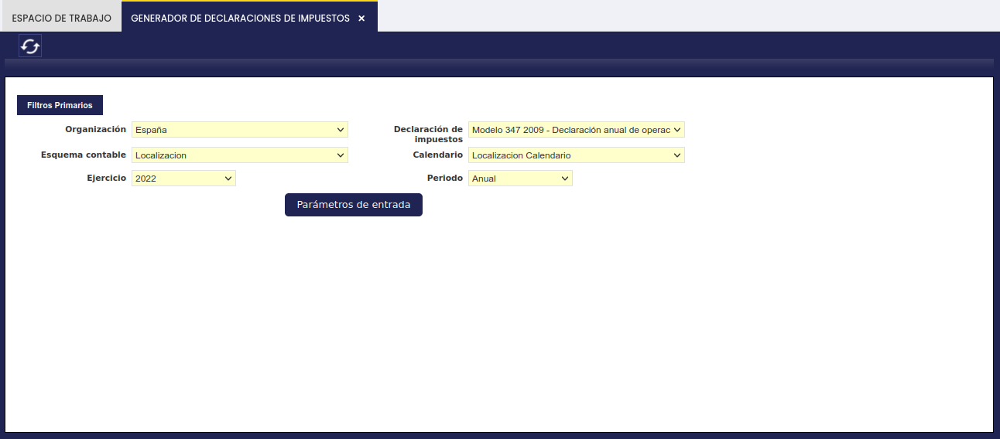

### Datos de entrada

El usuario deberá introducir los siguientes datos para generar el modelo 347:

- **Organización** para la cual quiere generar el Modelo 347. El sistema mostrará el calendario asociado a la organización en un campo no editable.
- **Esquema contable**: plan de cuentas asociado a la organización seleccionada. En la mayoría de los casos se completa automáticamente al elegir la organización. Si no es así, consulte con el administrador del sistema.
- **Declaración**. El usuario debe seleccionar aquí el modelo 347 del periodo impositivo que corresponda.
- **Ejercicio**. El usuario puede introducir el año natural para el cual quiere generar el modelo 347
- **Periodo**. El valor `Anual` debería mostrarse por defecto.

Una vez introducidos los datos anteriores, el usuario puede introducir los parámetros de entrada del 347 en el botón de proceso `Parámetros de entrada`.

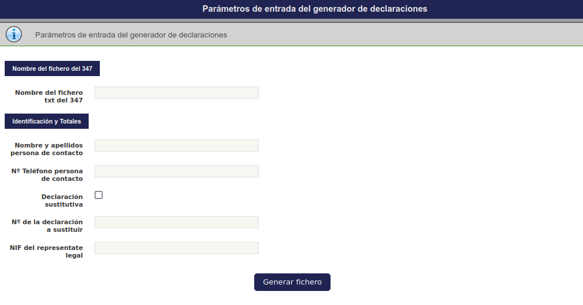

y una vez introducidos los parámetros de entrada, como por ejemplo `Nombre del Fichero` o `Persona/Teléfono de contacto`, el usuario puede generar el fichero del Modelo 347 a través del botón de proceso `Generar fichero`.

Es entonces cuando se genera el fichero de texto (`*.txt`) del Modelo 347 conforme a los requerimientos de la AEAT, que puede presentarse directamente en la web de la AEAT.

En el módulo [`Spain AEAT Modelo 347 for APR`](https://marketplace.etendo.cloud/#/product-details?module=003B475055DD421B9483B5BE15AA48C5){target="_blank"}, se genera un fichero zip que contiene tres ficheros:

- el fichero `txt` ya mencionado de igual formato y, por tanto, igualmente válido para la presentación del Modelo 347 a partir de 2014
- un fichero denominado `Facturas.csv`
- y un fichero denominado `Metalico.csv`

!!! note
    Los dos ficheros adicionales de formato `*.csv` sólo se generan si la declaración del 347 tiene contenido.

### Fichero `Facturas.csv`

El fichero csv `XXXFacturas.csv` incluye las siguientes columnas:

- **Tipo de documento**
    Estos son las facturas estándar (`AP/AR Invoice` (facturas de compra y venta), `AP/AR Credit Memo` (abonos de compra y venta), etc.) de Etendo. (Estos son los nombres internos que Etendo usa para los distintos tipos de documentos.)
- **Número de documento**
    O número de factura/abono.
- **Tercero**
    Cliente o proveedor.
- **NIF/CIF (número de identificación fiscal)** del tercero.
- **Fecha Factura**
- **Fecha Contable**
    Fecha contable de la factura.
- **Impuesto**
    Impuestos del dataset de impuestos para España ligados al parámetro del Modelo 347 correspondiente.
- **IVA de Caja**
    Esta columna indica si la factura está o no sujeta a IVA de Caja.
- **Cuota**
    Cuota ligada al tipo de impuesto incluido en la factura.
- **Base Imponible**
    Base imponible ligada al impuesto incluido en la factura.
- **Total**
    Suma de la base imponible y la cuota. Este valor es el que hay que tener en cuenta, ya que el 347 incluye importes totales, incluido el IVA, al ser una declaración de operaciones con terceros y no una liquidación de IVA.
- **Tipo de Línea**
    Dado que en el 347 se tiene que incluir de forma separada tanto los arrendamientos como las transmisiones de bienes inmuebles y operaciones de inversión del sujeto pasivo, por tanto, en este campo las opciones que hay son `vacío` para operaciones de compra/venta normales, `Arrendamientos`, `Transmisión B. Inmuebles` e `Inversión Sujeto Pasivo`.

### Fichero `Metalico.csv`

El fichero csv `XXXMetalico.csv` incluye las siguientes columnas:

- **Cuenta Financiera**
    Cuentas financieras de tipo `Caja` de Etendo.
- **Línea de Transacción**
    Número de línea de la transacción en la solapa **Transacción** de la cuenta Financiera.
- **Identificador de Transacción**
    Identificador único de la transacción generado automáticamente por Etendo. Se puede consultar en la solapa **Transacción** de la ventana **Cuenta Financiera** (`Gestión Financiera` > `Transacciones` > `Cuenta Financiera`).
- **Tercero**
- **NIF/CIF** del tercero.
- **Fecha Contable**
    Fecha contable del cobro.
- **Ejercicio**
    Ejercicio en el cual se devengó la operación o factura que se cobra. Este ejercicio puede ser el año de la declaración o un ejercicio anterior.
- **Importe transacción**
    Importe del cobro en metálico.

Estos ficheros csv permiten saber, por ejemplo:

-   qué tercero se debe incluir en la declaración y con qué importes por haberse superado el límite de 3.005,06 € en el volumen anual de operaciones realizadas con él.
-   qué tercero no se debe incluir en la declaración por no haberse superado el límite de 3.005,06 €.
-   cuáles son las facturas de compra cuya suma equivale al `Importe Anual/Trimestral de Operaciones` realizadas con un proveedor en concreto.
-   cuáles son los cobros en efectivo cuya suma equivale al `Importe percibido en metálico` de un cliente concreto incluido en la declaración.

## Casos de usuario

!!! note "Sobre el RECC"
    Varias subsecciones hacen referencia al RECC (Régimen Especial de Criterio de Caja). Es un régimen fiscal opcional para empresas cuya facturación anual no supera los 2.000.000 €, que permite retrasar el devengo del IVA hasta el momento del cobro o pago efectivo. Si no sabe si su empresa aplica este régimen, consulte con su asesor fiscal.

### Operaciones de compra y venta

Etendo permite la introducción y contabilización de facturas de compra y de venta, a través de la ventana correspondiente.

El modelo 347 recogerá agrupando por `tercero` y `clave [A (compras) o B (ventas)]`, las siguientes operaciones de compra/venta que superen la cifra de 3.005,06 euros:

-   compra/venta de bienes/servicios (no sujetos a retención) dentro del territorio de aplicación del impuesto (IVA), España y Baleares
-   compra/venta de servicios desde/hacia resto del mundo, incluyendo Canarias, Ceuta y Melilla.

No se van a tener en cuenta:

-   operaciones de compra/venta de bienes/servicios intracomunitarias, por reflejarse en otro modelo de hacienda, el Modelo 349, excepto las operaciones que no se incluyen en el Modelo 349.
-   importaciones/exportaciones de bienes.

#### Operaciones de compra y venta acogidas a RECC

Etendo permite la introducción y contabilización de facturas de compra y de venta acogidas al RECC (Régimen Especial de Criterio de Caja).

Para ello:

- la `Organización` debe estar acogida a este Régimen
-   o bien no acogida pero si alguno de los proveedores de los cuales recibe facturas de compra.

La aplicación de este conjunto de datos sigue el mismo proceso descrito en la sección [Aplicación del módulo](#aplicacion-del-modulo), seleccionando el dataset **Spain AEAT Modelo 347 Cash VAT compatible** en lugar del dataset principal.

Este módulo incluye un juego de datos que relaciona los impuestos de IVA de Caja con los parámetros correspondientes del Modelo 347.

Las transacciones de compra/venta se recogen en el Modelo 347 de forma anual conforme al criterio de devengo general de IVA y marcadas como `Operación de IVA de Caja`. Además, se incluye la parte correspondiente anual devengada conforme al criterio de IVA de Caja en otro campo.

#### Transmisión de inmuebles

Etendo permite la introducción y contabilización de transmisiones (ventas) de bienes inmuebles sujetas a IVA.

Este tipo de operaciones se recogen de forma separada en el modelo 347.

Es por ello que se ha creado en el módulo de impuestos para España:

-   categorías de impuestos específicas para los B. Inmuebles (IVA Normal B.Inmuebles e IVA Reducido B.Inmuebles)
-   rangos de impuestos (IVA) de compra/venta de Bienes Inmuebles

y en el conjunto de datos del 347:

- un parámetro específico denominado `Transmisiones de Inmuebles` ligado a los impuestos de venta de bienes inmuebles.

#### Transmisión de inmuebles sujetas a RECC

Este tipo de transacciones también se incluyen en el Modelo 347 de forma separada, en cómputo anual, y marcadas como `Operación IVA Caja`.

### Arrendamientos

Etendo permite la introducción y contabilización de facturas de compra y de venta que incluyan arrendamiento de locales de negocio sujetos a IVA.

Solo en el caso de arrendamientos de locales de negocio por parte del propietario del local, se debe incluir además información adicional sobre ese inmueble en un registro específico de tipo Inmueble. Para ello, los locales que se den de alta en el maestro de productos y puedan alquilarse deben configurarse como tales tras activar el parámetro `Local arrendado`.

Esto implica rellenar datos como los que se muestran en la siguiente imagen:

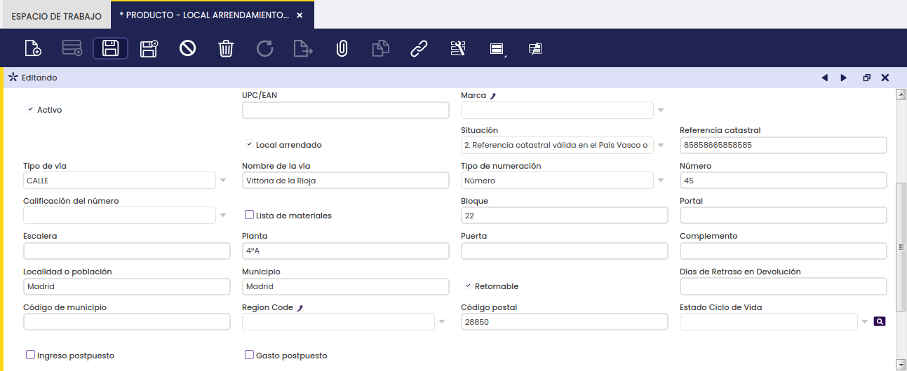

Este tipo de operaciones tienen que reportarse de forma separada en el 347 tal y como se muestra en la siguiente imagen:

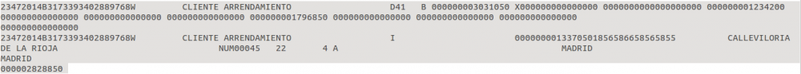

La transacción de venta (B) con el cliente `Cliente Arrendamiento` por un importe anual de 30.310,50, incluye además el arrendamiento de un inmueble por un importe de 13.370.50.

#### Arrendamientos en RECC

Estas operaciones se reflejan de forma anual en el modelo 347, marcadas como tales, e incluyen también la información correspondiente al registro del inmueble arrendado por el declarante.

### Cobros en efectivo

Etendo permite la introducción y contabilización de facturas de venta y sus correspondientes cobros en efectivo depositados y contabilizados en Etendo a través de cuentas financieras del tipo `Caja`.

Se recomienda configurar el método de pago `Contado` asociado a la cuenta financiera `Caja` como se detalla a continuación:

-   Permitido para Cobro
-   Depósito automático en cuenta
-   Cuenta de depósito = Cuenta contable para depósito.

!!! note "Umbral de declaración"
    Se declaran los cobros que, para un mismo tercero (cliente) y período, superen los **6.000,00 €**.

El módulo contempla los siguientes escenarios para cobros en efectivo:

#### Caso 1 — Cobro y operación en el mismo ejercicio

El cobro en efectivo y la factura que lo origina pertenecen al mismo ejercicio de la declaración. El importe se incluye tanto en el total de operaciones como en el campo de cobros en metálico.

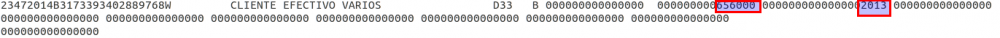

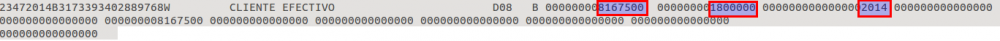

En el ejemplo anterior, el `Cliente Efectivo` (18.000,00) y el `Cliente Efectivo Varios` (6.560,00) se declaran de forma separada en las posiciones 101-115 (campos del fichero TXT definidos por la AEAT). La diferencia entre ambos es:

- **`Cliente Efectivo Varios`**: la operación que generó el cobro se devengó y declaró en el ejercicio anterior. Por eso no aparece importe en las posiciones 83-98 (campos del fichero TXT definidos por la AEAT) y el año de devengo corresponde al ejercicio anterior.
- **`Cliente efectivo B`**: la operación se devenga y cobra en el año de la declaración, y forma parte del total de operaciones (81.675,00).

#### Caso 2 — Cobro en el ejercicio actual por operación de ejercicio anterior

El cobro en efectivo se produce en el año de la declaración, pero la factura que lo origina fue devengada y declarada en un ejercicio anterior. En este caso, el importe aparece únicamente en el campo de cobros en metálico, sin importe de operación en el ejercicio actual.

#### Caso 3 — Cobro mixto: operaciones de ejercicios distintos

El cobro en efectivo del año en curso corresponde parcialmente a operaciones del ejercicio en curso y parcialmente a operaciones devengadas en ejercicios anteriores ya declarados.

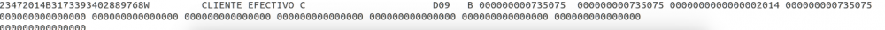

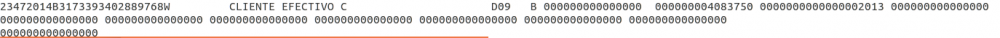

En el ejemplo, el cobro total asciende a 48.188,25: de los cuales 7.350,75 corresponden a operaciones del ejercicio en curso y 40.837,50 a operaciones declaradas en un ejercicio anterior.

#### Cobros en efectivo en RECC

Todo lo dicho en este apartado aplica igualmente a las operaciones de venta en IVA de Caja que se cobran en efectivo, salvo que en este caso no aplicaría un `Ejercicio` de devengo anterior a 2014, ya que el periodo de validez de este régimen comenzó el 1 de enero de 2014.

Además del importe anual de las operaciones y el importe anual devengado en criterio de IVA de Caja, debe añadirse el importe percibido en metálico, junto con el ejercicio de devengo de dichas operaciones.

### Presentación del modelo 347 en formato electrónico

La presentación telemática del modelo 347 en formato electrónico requiere que las empresas tengan un NIF español así como un Certificado electrónico emitido por la “Fábrica Nacional de Moneda y Timbre” (FNMT) u otro Certificado válido y reconocido por Hacienda.

Si aún no dispone de un certificado digital reconocido por la AEAT, puede obtener más información en la web de la FNMT o a través de la sede electrónica de la Agencia Tributaria.

La presentación telemática puede realizarse a través de la página web de la [Hacienda Pública española](https://sede.agenciatributaria.gob.es/Sede/procedimientoini/GI27.shtml){target="_blank"}.

#### Presentación de declaraciones sustitutivas

Es necesario presentar una declaración sustitutiva cuando dicha declaración tenga por objeto anular y sustituir completamente a otra declaración anterior para el mismo periodo ya enviada a Hacienda, en la cual se hubieran incluido datos inexactos o erróneos.

Para ello, el usuario deberá realizar en la aplicación los cambios en los datos/transacciones pertinentes y volver a generar la declaración 347 como fichero indicando:

-   que la declaración es sustitutiva
-   el número de la declaración original que se sustituye

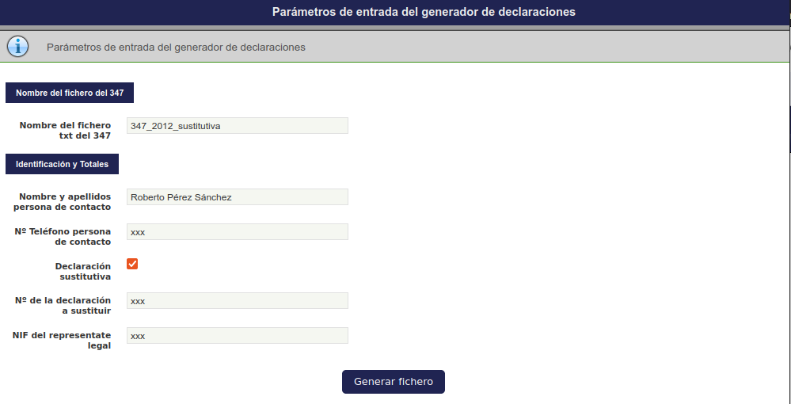

*[AEAT]: Agencia Estatal de Administración Tributaria
*[IVA]: Impuesto sobre el Valor Añadido
*[RECC]: Régimen Especial de Criterio de Caja
*[NIF]: Número de Identificación Fiscal
*[CIF]: Código de Identificación Fiscal
*[TXT]: Fichero de texto plano con extensión .txt
*[CSV]: Comma-Separated Values — fichero de valores separados por comas
*[ZIP]: Fichero comprimido con extensión .zip
*[INE]: Instituto Nacional de Estadística
*[FNMT]: Fábrica Nacional de Moneda y Timbre
*[UE]: Unión Europea
*[APR]: Aplicación de Presentación de Registros (módulo de presentación de la AEAT)

---

This work is a derivative of [Openbravo Localización Española](https://wiki.openbravo.com/wiki/Openbravo_Localizaci%C3%B3n_Espa%C3%B1a){target="_blank"} by [Openbravo Wiki](http://wiki.openbravo.com/wiki/Welcome_to_Openbravo){target="_blank"}, used under [CC BY-SA 2.5 ES](https://creativecommons.org/licenses/by-sa/2.5/es/){target="_blank"}. This work is licensed under [CC BY-SA 2.5](https://creativecommons.org/licenses/by-sa/2.5/){target="_blank"} by [Etendo](https://etendo.software){target="_blank"}.