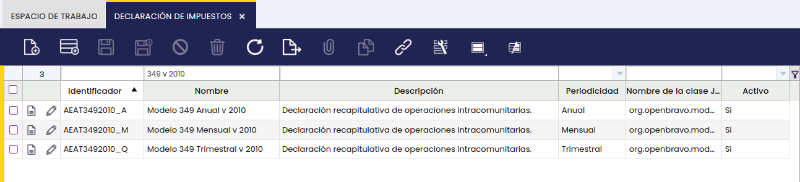
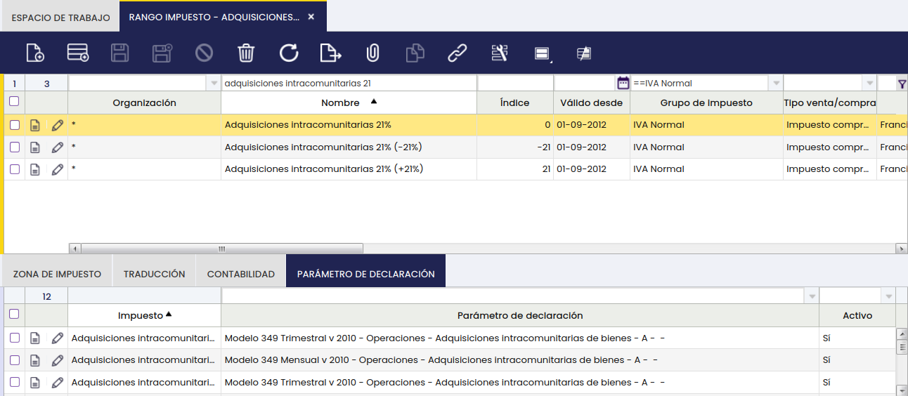
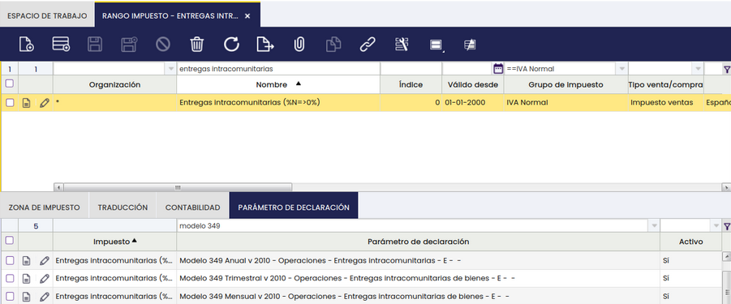
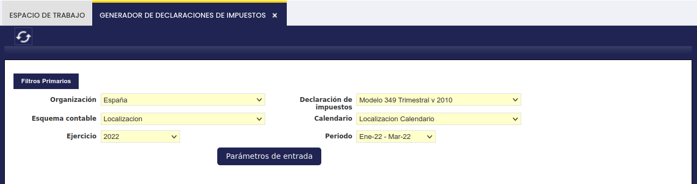
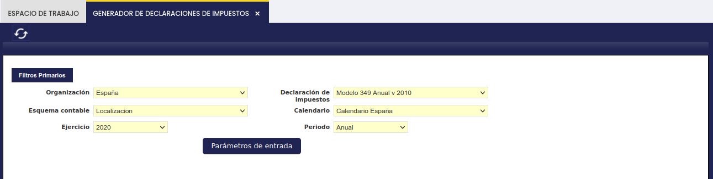
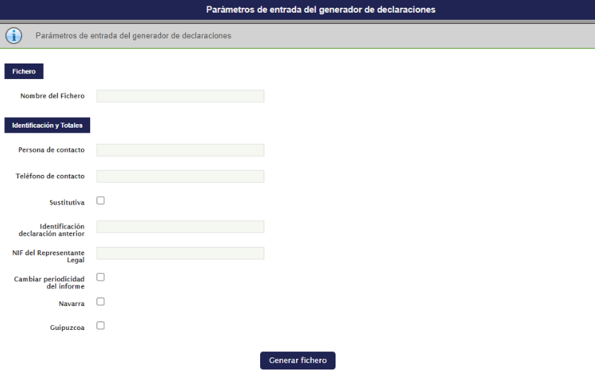
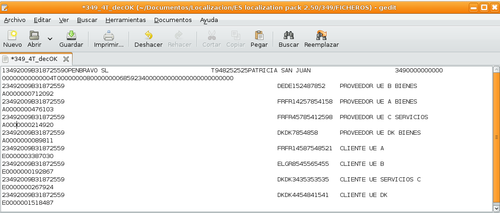
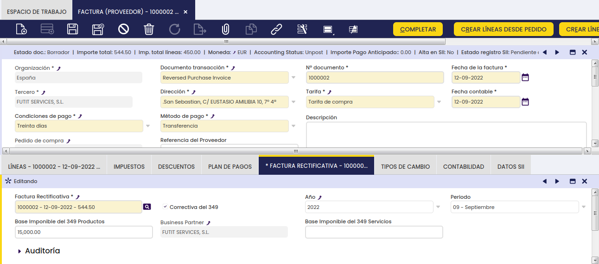
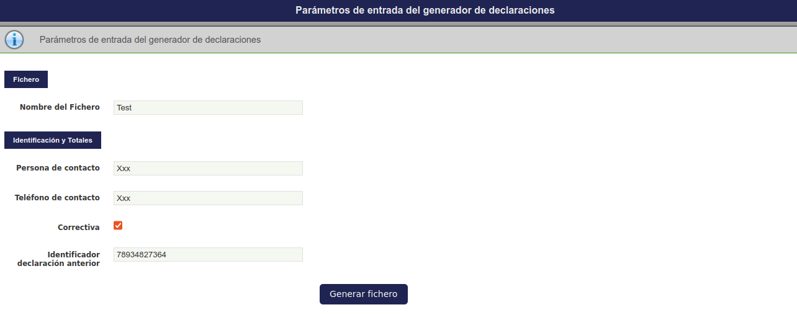

# Modelo 349

## Overview

:octicons-package-16: Javapackage: `org.openbravo.module.aeat349.es`

Esta sección describe el módulo **Modelo AEAT 349 - Declaración recapitulativa de operaciones intracomunitarias**, incluido en la Localización Española de Etendo.

## Introducción

### Descripción del módulo

El módulo de generación del Modelo 349 genera un fichero `*.txt` válido conforme a los requisitos establecidos por la Hacienda Española.

Esto permite a las empresas españolas cumplir con sus obligaciones fiscales relacionadas con la declaración recapitulativa de las entregas y adquisiciones intracomunitarias de bienes.

La funcionalidad sigue la Orden HAC/360/2002, modificada por última vez por la Orden HAC/174/2020.

De acuerdo con el reglamento del IVA, deben presentar el modelo 349 los sujetos pasivos del impuesto que realicen cualquiera de las siguientes operaciones:

-   Las entregas de bienes destinados a otro Estado miembro, entregas de bienes exentas del impuesto.
-   Las adquisiciones intracomunitarias de bienes sujetas al impuesto.
-   Las adquisiciones intracomunitarias de bienes y entregas subsiguientes exentas conocidas como Operaciones Triangulares.

La declaración recapitulativa de operaciones intracomunitarias incluye:

-   Las operaciones citadas en el apartado anterior, así como las rectificaciones de operaciones ya incluidas en la correspondiente declaración recapitulativa.
-   Los datos de identificación de los proveedores y adquirientes.
-   La base imponible en euros de las operaciones intracomunitarias de bienes declaradas.

En general, la declaración recapitulativa debe presentarse por cada mes natural dentro de los veinte primeros días naturales del mes siguiente.

Hay dos excepciones:

- La correspondiente al mes de julio puede presentarse durante el mes de agosto y los veinte primeros días naturales de septiembre.
- La correspondiente al último período del año debe presentarse durante los treinta primeros días naturales de enero.

Cuando ni en el trimestre de referencia ni en cada uno de los cuatro trimestres naturales anteriores el importe total de las entregas de bienes y prestaciones de servicios que deban consignarse en la declaración recapitulativa supere los 50.000 euros, excluido el IVA, la declaración debe presentarse dentro de los veinte primeros días naturales del mes siguiente al correspondiente período trimestral.

Si al final de cualquiera de los meses que componen un trimestre natural se supera ese importe, debe presentarse una declaración recapitulativa para el mes o meses transcurridos desde el inicio del trimestre, dentro de los veinte primeros días naturales siguientes.

!!! info
    Desde 2020 se suprime el período anual de declaración.

Las operaciones se entenderán realizadas el día en que se expida la factura o documento equivalente que sirva de justificante de las mismas.

El modelo 349 diferencia las notas de abono que rectifican facturas ya incluidas en declaraciones anteriores de las que no lo hacen. Para cubrir ese caso, el sistema incorpora una funcionalidad que relaciona las notas de abono con las facturas que están siendo abonadas o rectificadas, como se explica en la sección [Casos de usuario](#casos-de-usuario).

!!! info
    El módulo de generación del Modelo 349 no incluye las operaciones triangulares, puesto que dichas operaciones no se gestionan en Etendo. 

Este módulo no tiene en cuenta las transacciones correspondientes al tipo de documento de Etendo `AP/AR credit memo` como facturas de abono, ya que ese tipo de transacción no refleja devoluciones de mercancía.

Por ello, el módulo 349 sí tiene en cuenta:

- los tipos de documento `AP/AR invoice`, como facturas de compra y venta
- los tipos de documento `AP/AR invoice` negativos, como notas de abono o facturas rectificativas

Además, el módulo no contempla el supuesto de **Declaración Complementaria** para los casos en que deban incluirse solo operaciones que, aun debiendo haberse declarado en otra declaración del mismo ejercicio ya presentada, no se incluyeron.

Estas operaciones deben incorporarse manualmente a través de la página de la AEAT, tal y como se explica en la sección `Declaración Complementaria`.

## Instalación del módulo

Para la instalación del módulo **Modelo AEAT 349 - Declaración recapitulativa de operaciones intracomunitarias**, el usuario debe seguir los pasos que se describen a continuación en función de la situación de partida:

-   Instalación de la última versión disponible de Etendo
-   o la instalación del módulo de Localización Española.

!!! info
    Para la instalación del módulo de Localización Española, visite [*Marketplace*](https://marketplace.etendo.cloud/#/product-details?module=003B475055DD421B9483B5BE15AA48C5){target="_blank"}. 

Es importante recalcar que el módulo del Modelo AEAT 349 incluye el correspondiente conjunto de datos que relaciona los tipos/rangos de impuestos con los parámetros del 349.

### Aplicación del módulo

Una vez instalado el módulo del 349, el usuario debe aplicar el módulo del 349 a la organización legal con contabilidad que corresponda.

!!!note
    Es fundamental que el [módulo de impuestos para España](impuestos-para-españa.md) esté instalado y aplicado a la organización correspondiente. Ese módulo es válido para todos los modelos de declaración de impuestos.

El usuario deberá navegar a `Configuración General` > `Gestión del módulo de Empresa`, seleccionar la organización legal con contabilidad y aplicar los módulos en el orden especificado: primero el módulo de impuestos, si no está aplicado previamente, y después el módulo del 349.

## Configuración del módulo

### Configuración del modelo 349

Este módulo de generación del modelo 349 como un fichero de texto (`*.txt`) válido conforme a los requerimientos de la Hacienda Pública Española, se basa en la funcionalidad de `Generador de declaraciones de impuestos`.

El usuario puede comprobar en la ruta de aplicación `Gestión Financiera` > `Contabilidad` > `Configuración` > `Declaración de Impuestos` que el modelo 349 está creado como informe anual, trimestral o mensual de impuestos, todos con la misma configuración:

En la solapa **Sección de declaración** se han creado 4 secciones:

-   **Fichero**. Esta sección contiene un parámetro de tipo entrada para introducir el nombre del fichero del 349 al generar el fichero.
-   **Identificación y Totales**. Esta sección tiene:
    -   **4 parámetros de tipo entrada** que se mostrarán en el momento de generar el 349 con el fin de que el usuario los introduzca manualmente:
        -   Persona de contacto: Apellidos y nombre de la persona de contacto. Este parámetro de tipo entrada podría ser modificado a tipo constante y, por tanto, se debería especificar el valor de dicha constante que en este caso sería el nombre de la persona de contacto, para los escenarios en que la misma persona presenta la declaración. De ser así, este parámetro no tendría que informarse cada vez que se genera la declaración.
        -   Teléfono de contacto: Número de teléfono de la persona de contacto. Este parámetro de tipo entrada podría ser modificado a tipo constante y, por tanto, se debería especificar el valor de dicha constante que en este caso sería el teléfono de la persona de contacto, para los escenarios en que la misma persona presenta la declaración. De ser así, este parámetro no tendría que informarse cada vez que se genera la declaración.
        -   Declaración sustitutiva (si/no)
        -   Identificador declaración anterior: Número de la declaración a sustituir.
    -   **3 parámetros de tipo salida** que el sistema recogerá de la base de datos:
        -   Año
        -   Nombre de la organización
        -   NIF/CIF de la organización
-   **Operaciones**. Esta sección tiene 2 parámetros de tipo salida que, asociados a los tipos impositivos correspondientes, incluyen las operaciones en el 349:
    -   Entregas intracomunitarias de bienes – Clave tributaria E
    -   Adquisiciones intracomunitarias de bienes – Clave tributaria A
-   **Constantes**. Esta sección tiene 11 parámetros de tipo constante:
    -   Constante en caso de informe anual (0A)
    -   Constante para el primer trimestre (1T)
    -   Constante para el segundo trimestre (2T)
    -   Constante para el tercer trimestre (3T)
    -   Constante para el cuarto trimestre (4T)
    -   Número de declaración del 349 (349 se reemplaza al remitir el fichero)
    -   Tipo de declaración (349)
    -   Línea tipo 1 (1)
    -   Línea tipo 2 operaciones (2)
    -   Línea tipo 2 correcciones (2)
    -   Presentación (T)

### Configuración de impuestos

Este módulo de generación del modelo 349 se basa en el módulo de impuestos para España y en uno específico para el 349.

El usuario puede comprobar en la ruta de aplicación `Gestión Financiera` > `Contabilidad` > `Configuración` > `Rango impuesto`, en la solapa `Parámetro de declaración`, que los tipos impositivos que deben incluirse en el 349 se han asociado al correspondiente parámetro de impuesto del 349:

-   Los tipos de IVA de adquisiciones intracomunitarias se han asociado con el parámetro **Adquisiciones intracomunitarias de bienes**, que se corresponde con la clave de operación del 349: `A`.

-   Los tipos de IVA de entregas intracomunitarias se han asociado con el parámetro **Entregas intracomunitarias de bienes**, que se corresponde con la clave de operación del 349: `E`.

## Generación del modelo 349

El modelo 349 se genera desde la ruta de aplicación `Gestión Financiera` > `Contabilidad` > `Herramientas de análisis` > `Generador de declaraciones de impuestos`. El usuario puede generar el modelo 349 para cualquier mes natural, trimestre natural o para el año deseado, tal y como se muestra en las pantallas siguientes:

En la ventana de generación de informes, el usuario debe introducir los siguientes datos para generar el modelo 349:

-   **Organización**. Organización para la cual se genera el Modelo 349. El sistema muestra el calendario asociado en un campo no editable.
-   **Esquema contable**.
-   **Declaración de impuestos**. Aquí se selecciona el modelo 349 mensual, trimestral o anual.
-   **Ejercicio**. Año para el cual se obtiene el 349.
-   **Periodo**. Si el usuario selecciona el modelo 349 mensual, puede elegir un período como enero 22. Si selecciona el modelo 349 trimestral, puede elegir un período como enero 22 – marzo 22. Si selecciona el modelo 349 anual, este campo muestra por defecto `Anual`.

Una vez introducidos los datos anteriores, el usuario puede completar los parámetros de entrada del 349 desde el botón de proceso **Parámetros de entrada**.

Una vez introducidos esos parámetros, el usuario puede generar el 349 desde el botón de proceso **Generar fichero**.

### Navarra y Guipúzcoa

Se incluyen dos checks nuevos que permiten generar el fichero con la parametrización correcta para su presentación en **Hacienda Navarra** y **Hacienda Guipúzcoa**:

!!!note
    Si no se marca ningún check, el fichero se genera con la parametrización de la `AEAT`.

Anteriormente, el fichero generado del modelo 349 solo se podía presentar en la `AEAT`. Con esta mejora, el usuario puede presentarlo también en Navarra o en Guipúzcoa, según el check seleccionado.

### Edición de Número de Justificante

Si la declaración se presentará a la AEAT utilizando la opción **Ejercicio 202X. Presentación mediante fichero**, se debe editar manualmente el fichero generado y modificar el dato de número de justificante insertando un número válido, ya que **no se admiten justificantes que comiencen por el número de modelo y el resto de posiciones ceros**. Para leer el fichero correctamente debería aparecer 1820000000001 o cualquier otra variación, por ejemplo, 1822024000001 para el ejercicio 2024.

El campo **Número de justificante** se localiza siempre en el registro de tipo 1, declarante. Corresponde a la primera línea del fichero y normalmente se encuentra entre las posiciones 108 y 120.

Si la declaración se presenta utilizando la opción **Ejercicio 202X. Presentación (hasta 40.000 registros)**, no es necesario cambiar el número de justificante.

## Casos de usuario

### Generación del modelo 349 como un fichero de texto válido

Esta funcionalidad permitirá a las empresas españolas generar el modelo 349 como un fichero de texto conforme a los requisitos establecidos por la normativa española, para un periodo determinado.

Durante el año/trimestre/mes natural, el usuario registrará en Etendo las transacciones de compra y/o devolución con sus proveedores de la Unión Europea así como las transacciones de venta y/o devoluciones de ventas con sus clientes de la unión europea.

Las transacciones de compra y venta, se deberán introducir en el sistema normalmente a través de los tipos de documento de compra (albarán de compra y factura de compra =AP invoice) y de venta (albarán de venta y factura de venta =AR invoice), respectivamente.

Las transacciones de devolución, tanto de compra como de venta, se deberán introducir en el sistema normalmente a través de los tipos de documento de compra (albarán de compra y abono de compra =AP invoice Negativa) y de venta (albarán de venta y abono de venta=AR invoice Negativa).

Además, deberá asegurarse de que todos los productos tienen la parametrización adecuada en relación con las categorías de impuestos que tienen asociadas (21%-10%-4%).

Una vez que todas las operaciones se han registrado en el sistema, el usuario podrá generar el fichero del modelo 349 tal y como se explicó en la sección de este documento [Generación del Modelo 349](#generación-del-modelo-349). El fichero `txt` del 349 tiene la siguiente estructura:

### Tipo de registro 1 – Registro de declarante

|     |     |
| --- | --- |
| **Posiciones** | **Descripción** |
| **1** | Tipo de Registro (constante = 1) |
| **2-4** | Modelo Declaración (constante = 349) |
| **5-8** | Ejercicio |
| **9-17** | NIF del declarante |
| **18-57** | Apellidos y nombre o razón social del declarante |
| **58** | Blanco |
| **59-107** | Persona con quién relacionarse: Teléfono / Apellidos y nombre |
| **108-120** | Número identificativo de la declaración |
| **121-122** | Declaración complementaria o substitutiva |
| **123-135** | Número identificativo de la declaración anterior |
| **136-137** | Periodo (predeterminado = 1T,2T,3T,4T,0A,01,02,03,04,05,06,07,08,09,10,11,12) |
| **138-146** | Número total de operadores intracomunitarios |
| **147-161** | Importe de las operaciones intracomunitarias |
| **162-170** | Número total de operadores intracomunitarios con rectificaciones |
| **171-185** | Importe de las rectificaciones |
| **186** | Indicador cambio periodicidad en la obligación de declarar |
| **187- 390** | Blancos |
| **391 - 399** | NIF del representante legal |
| **400 - 500** | Blancos |

### Tipo de registro 2 – Registro de operador intracomunitario

|     |     |
| --- | --- |
| **Posiciones** | **Descripción** |
| **1** | Tipo de Registro (constante = 2) |
| **2-4** | Modelo Declaración (constante = 349) |
| **5-8** | Ejercicio |
| **9-17** | NIF del declarante |
| **18-75** | Blancos |
| **76-92** | NIF del operador comunitario |
| **93-132** | Apellidos y nombre o razón social del operador intracomunitario |
| **133** | Clave de operación (E, M, H, A, T, S, I, R, D o C) |
| **134-146** | Base Imponible o Importe |
| **147-178** | Blancos |
| **179- 195** | NIF Empresario o Profesional Destinatario final sustituto |
| **196- 235** | Apellidos y Nombre o Razón social del sujeto pasivo sustituto |
| **236- 500** | Blancos |

### Tipo de registro 2 – Registro de rectificaciones

|     |     |
| --- | --- |
| **Posiciones** | **Descripción** |
| **1** | Tipo de Registro (constante = 2) |
| **2-4** | Modelo Declaración (constante = 349) |
| **5-8** | Ejercicio |
| **9-17** | NIF del declarante |
| **18-75** | Blancos |
| **76-92** | NIF del operador comunitario |
| **93-132** | Apellidos y nombre o razón social del operador intracomunitario |
| **133** | Clave de operación (E, M, H, A, T, S, I, R, D o C) |
| **134-146** | Blancos |
| **147-178** | Rectificaciones       \- 147-150 ejercicio (de la declaración que se corrige)    \- 151-152 periodo (de la declaración que se corrige)    \- 153-165 base imponible (para el tercero y el periodo) rectificada    \- 166-178 base imponible (para el tercero y el periodo) declarada anteriormente |
| **179- 195** | NIF Empresario o Profesional Destinatario final sustituto |
| **196- 235** | Apellidos y Nombre o Razón social del sujeto pasivo sustituto |
| **236- 500** | Blancos |

### Operaciones rectificativas del 349

En el modelo 349, el registro de tipo 2 de rectificaciones distingue dos casos:

-   Notas de abono que rectifican una factura ya incluida en una declaración 349 de un periodo anterior.
-   Notas de abono que no rectifican una declaración anterior y que, por tanto, se acumulan en el periodo actual.

#### Cuándo una nota de abono es rectificativa

Una nota de abono es rectificativa cuando corrige una factura incluida en una declaración 349 ya presentada.

Ejemplo mensual:

-   Una nota de abono de agosto de 2022 rectifica una factura de julio de 2022 ya incluida en la declaración de julio de 2022.
-   En este caso, la nota de abono se incluye en la declaración de agosto como rectificativa de la declaración de julio.
-   Además, se informa el importe total o base imponible de compra o venta que se declaró en julio para ese proveedor o cliente.

La misma lógica aplica a las declaraciones trimestrales y anuales. Solo cambia el periodo de referencia.

#### Cuándo una nota de abono no es rectificativa

Una nota de abono no es rectificativa cuando corrige una factura del mismo periodo que todavía no se ha incluido en una declaración 349 presentada.

Ejemplo mensual:

-   Una nota de abono de agosto de 2022 rectifica una factura de agosto de 2022.
-   Como la factura todavía no se ha incluido en una declaración previa, la nota de abono se acumula en la declaración de agosto como un menor importe de compra o venta para ese proveedor o cliente.

La misma lógica aplica a las declaraciones trimestrales y anuales.

#### Cómo informar una operación rectificativa

Para cubrir este caso, el sistema incorpora una funcionalidad que permite indicar si una nota de abono o devolución es una `rectificativa del 349`.

Para introducir esta información, el usuario debe navegar a `Gestión de compras` o `Ventas` > `Transacciones` > `Factura (Proveedor)` o `Factura (Cliente)`.

Allí debe crear una nueva factura utilizando una de las siguientes opciones:

-   `AP/AR invoice` negativa
-   `AP/AR credit Memo`
-   `Reversed Purchase/Sales Invoice`
-   anulación total de una factura de compra o venta

Después, en la solapa `Factura Rectificativa`, debe crear un nuevo registro para:

-   seleccionar la factura original que se abona o rectifica
-   marcar el campo `Rectificativa del 349`, cuando corresponda
-   completar estos datos:
    -   Año de la factura original que se rectifica
    -   Periodo de la factura original y periodo en el que se incluyó en un 349 anterior
    -   Base imponible del 349 de productos, es decir, el importe total de compra o venta informado previamente para ese proveedor o cliente en productos
    -   Base imponible del 349 de servicios, es decir, el importe total de compra o venta informado previamente para ese proveedor o cliente en servicios

Si la nota de abono o devolución y la factura original pertenecen al mismo periodo, basta con relacionar ambos documentos en la solapa `Factura Rectificativa`.

En ese caso, no es necesario marcar el parámetro `Rectificativa del 349`.

En este escenario, el sistema acumula las facturas positivas y los abonos del mismo proveedor o cliente para el mismo periodo. Así genera el cómputo global del importe de las transacciones de compra y venta que debe incluirse en la declaración del 349.

Tal y como se muestra en la pantalla anterior, esta funcionalidad requiere mostrar en Etendo las columnas que se detallan a continuación:

-   Correctiva del 349
-   Año
-   Periodo
-   Base Imponible del 349 Productos
-   Business Partner (Tercero)
-   Base Imponible del 349 Servicios

!!! info
    No todas las notas de abono o devoluciones de mercancía serán rectificativas del 349, solo aquellas que así configure el usuario.

Si la nota de abono o devolución de mercancía y la factura original pertenecen al mismo periodo, por ejemplo al primer mes del año 2022 (enero 2022, en caso de declaración mensual) o al primer trimestre del año 2022 (enero 2022 a marzo 2022, en caso de declaración trimestral), solo será necesario relacionar ambos documentos en la solapa `Factura Rectificativa`, sin seleccionar el parámetro `Rectificativa del 349`.

En este último escenario, el sistema acumula las facturas positivas y los abonos del mismo proveedor o cliente para el mismo periodo. Así genera el cómputo global del importe de las transacciones de compra y venta que debe incluirse en la declaración del 349.

### Presentación del modelo 349 en formato electrónico

La presentación telemática del modelo 349 en formato electrónico requiere que la empresa tenga un NIF español y un certificado electrónico emitido por la **Fábrica Nacional de Moneda y Timbre (FNMT)** u otro certificado válido y reconocido por Hacienda.

La presentación telemática puede realizarse a través de la página web de la Hacienda Pública española, desde `Oficina virtual` > `Presentación de declaraciones` > `Todas las declaraciones` > `Modelo 349`.

!!! info
    Existe una **Guía de presentación telemática** en la página web de Hacienda que explica cómo debe realizarse este trámite y que se puede descargar [**aquí**](https://sede.agenciatributaria.gob.es/static_files/Sede/Procedimiento_ayuda/GI28/instr_mod_349.pdf).

### Presentación de declaraciones sustitutivas

Es necesario presentar una declaración sustitutiva cuando se debe anular y sustituir por completo una declaración anterior del mismo periodo que contiene datos inexactos o erróneos.

Para ello, el usuario debe realizar los cambios necesarios en la aplicación y volver a generar una nueva declaración 349 como fichero. En esa nueva declaración, debe indicar que se trata de una declaración sustitutiva e informar el número de la declaración original que sustituye, tal y como se muestra en la siguiente pantalla:

---

This work is a derivative of [Openbravo Localización Española](https://wiki.openbravo.com/wiki/Openbravo_Localizaci%C3%B3n_Espa%C3%B1a){target="\_blank"} by [Openbravo Wiki](http://wiki.openbravo.com/wiki/Welcome_to_Openbravo){target="\_blank"}, used under [CC BY-SA 2.5 ES](https://creativecommons.org/licenses/by-sa/2.5/es/){target="\_blank"}. This work is licensed under [CC BY-SA 2.5](https://creativecommons.org/licenses/by-sa/2.5/){target="\_blank"} by [Etendo](https://etendo.software){target="\_blank"}.
