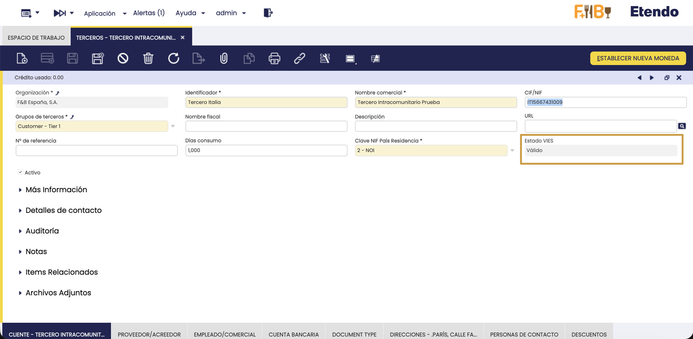

# Validación de NIF/VIES para Terceros

:octicons-package-16: Javapackage: `org.openbravo.module.bptaxidkey`

:material-menu: `Aplicación` > `Datos Maestros` > `Terceros`

## Introducción

La Localización Española incorpora una **validación del número de IVA (VAT) contra el registro VIES** —*VAT Information Exchange System*, el sistema de la Comisión Europea que permite comprobar si un número de IVA intracomunitario es válido— para los terceros (clientes y proveedores) identificados como **operadores intracomunitarios**.

El objetivo es comprobar, de forma automática **al guardar el tercero**, que el número de operador intracomunitario **existe y es válido** en el registro oficial de la UE, evitando errores posteriores en las declaraciones y en los envíos a los sistemas de facturación (*SII*, *TicketBAI*, *Verifactu*).

## Qué se valida y cuándo

Etendo valida la **existencia y validez del número de IVA intracomunitario** consultando el **servicio web oficial de VIES** de la Comisión Europea. La validación se ejecuta automáticamente **al guardar el tercero** (alta o modificación) en la ventana **Terceros**, siempre que se cumplan estas dos condiciones:

- La **Clave NIF País Residencia** —el campo de la ventana Terceros que indica bajo qué tipo de identificación fiscal opera el tercero— es **`2 - NOI`** (Número de Operador Intracomunitario).
- El tercero tiene informado el **NIF** (campo **Tax ID**), incluyendo el **prefijo de país** de dos letras (por ejemplo, `FR12345678901`, `IT15667431009`), a partir del cual se determina el país y el número a consultar.

Si se modifica el NIF o la clave y VIES no está accesible en ese momento, el estado se restablece a **Pendiente** para no conservar un resultado que ya no corresponde al número actual. El resultado de la validación queda reflejado en el campo **Estado VIES** del tercero (ver más abajo).

!!! info "Resultado no bloqueante ante errores de conexión"
    Si el servicio VIES no está disponible, devuelve un error temporal o se agota el tiempo de espera, la validación **no** marca el NIF como inválido: el estado queda como **Pendiente** para poder reintentarse más adelante. De este modo, un problema puntual de conexión con VIES nunca invalida por error un número correcto.

## Estado VIES

El resultado de la validación se almacena en el campo de solo lectura **Estado VIES** del tercero, que puede tomar los siguientes valores:

| Valor | Significado |
|---|---|
| **Válido** (`V`) | El número de identificación fiscal ha sido verificado correctamente en el registro VIES. |
| **No válido** (`I`) | El número de identificación fiscal no figura como válido en el registro VIES. |
| **Pendiente** (`P`) | Aún no verificado, o VIES no estaba accesible en el último intento. Es el valor por defecto. |

!!! warning "El campo Estado VIES es informativo: qué implica y qué hacer"
    Etendo **no bloquea** la facturación ni cambia automáticamente el tratamiento de IVA en función de este campo: es responsabilidad del usuario revisar el **Estado VIES** y decidir cómo proceder. Esto es especialmente importante porque, según la normativa de IVA intracomunitario, la exención de IVA en una entrega a un cliente de la UE **solo es aplicable si su NIF-IVA es válido en VIES**. Si el estado queda en **No válido**, la Agencia Tributaria puede no reconocer la exención aplicada y exigir el IVA no repercutido (con recargos e intereses) en una eventual inspección. Del mismo modo, si el **NIF-IVA propio** de la empresa no está validado, los proveedores de la UE deben facturarle con IVA de su país, sin poder aplicar la exención en la adquisición.

    **Si el estado no es Válido:**

    - **No válido**: significa que la **Clave NIF País Residencia** (`2 - NOI`) o el **NIF** informado no son correctos. Revise y corrija el NIF (incluyendo el prefijo de país) o, si el tercero no es realmente un operador intracomunitario, corrija la Clave NIF País Residencia. Al guardar de nuevo, se repite la validación. Mientras el estado no sea **Válido**, evalúe si corresponde facturar con IVA en lugar de aplicar la exención intracomunitaria, y conserve evidencia de la validación (por ejemplo, una captura de pantalla) como respaldo ante una posible inspección.
    - **Pendiente** (si persiste tras varios intentos): reintente guardando el tercero nuevamente más tarde, ya que suele deberse a que el servicio VIES no estaba disponible en ese momento. Si el problema continúa, puede verificar el número manualmente en el [sitio web oficial de VIES](https://ec.europa.eu/taxation_customs/vies/){target="_blank"} antes de contactar con soporte.

## Comportamiento al cambiar el país

Cuando se establece o cambia el **país** del tercero a un **país de la Unión Europea distinto de España**, y el **NIF** del tercero comienza con el prefijo de dos letras de ese país (por ejemplo, `FR…` para Francia), Etendo **actualiza automáticamente la Clave NIF País Residencia a `2 - NOI`** (si no lo era ya). La validación VIES no se dispara en ese instante, sino al guardar el tercero, según lo descrito en [Qué se valida y cuándo](#que-se-valida-y-cuando).

Este cambio automático **no borra otros campos ni cambia la visibilidad de los mismos**: únicamente ajusta la Clave NIF a `2 - NOI`. Si el país seleccionado **no** pertenece a la UE (o es España), o el prefijo del NIF no coincide con el país, no se realiza ningún cambio automático.

*[IVA]: Impuesto sobre el Valor Añadido
*[NIF]: Número de Identificación Fiscal
*[UE]: Unión Europea
*[VAT]: Impuesto sobre el Valor Añadido
*[VIES]: Sistema de verificación de IVA intracomunitario

---

This work is licensed under :material-creative-commons: :fontawesome-brands-creative-commons-by: :fontawesome-brands-creative-commons-sa: [ CC BY-SA 2.5 ES](https://creativecommons.org/licenses/by-sa/2.5/es/){target="_blank"} by [Futit Services S.L](https://etendo.software){target="_blank"}.
