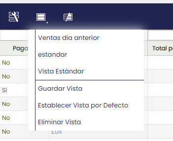

## Grid and Form View

Etendo allows the customization of grid and form views. Customized windows and form views are stored once saved in the Window Personalization window.

### Grid view

### Form view

## Grid View

The grid view functions as the base view and often as a starting point to filtering and drilling down. The user can open a record in the form view on top of the grid. The interaction metaphor that is used is that of a file explorer of an operating system. The grid is the folder with files, a double click opens the record. The record in form view can be closed at any time by clicking the close (X) button in the top right corner of the form.

A record (Form view) in the grid can be opened via:

-   A double click on the row.
-   Pressing ENTER on the keyboard.
-   Clicking the form/document icon on the left side of the row.

### Column Filtering

On top of the columns in a grid, the user will find column filters. These filters can be applied to find specific records. There are several types of column filters:

-   Regular column filters: These are fields that are empty by default, but once the user starts typing the first characters of a search term, the grid will be filtered in real-time.
-   Date column filters: Clicking it will launch a dialog where the user can set a range, for example, *8 days ago till today*.
-   Dropdown reference column filters: filters on references to other data, for example, from a sales order to a business partner. You can filter on multiple values, if there are many values to filter on then you can scroll in the dropdown box.
-   Dropdown column filters: Filters that contain a limited set of values. Just open the dropdown and select a value. 

The following symbols can be used in regular column filter fields to create more complex filter expressions. Note that once you start typing a filter expression in a numerical value column, the real-time filtering is switched off and you will need to hit Enter to apply the filter.

|     |     |     |     |
| --- | --- | --- | --- |
| **Symbol** | **Filter** | **Example** | **Meaning** |
| <   | less than (also works for strings) | <100 | Only shows amounts less than 100 |
| \>  | greater than (also works for strings) | \>100 | Only shows amounts greater than 100 |
| !   | not equal (also works for strings) | !100 | Shows everything except amounts that equal 100 |
| ^   | starts with | ^H  | Only shows values that start with "H" |
| \|  | ends with | H   | Only shows values that end with "H" |
| !^  | does not start with | !^H | Only shows values that do not start with "H" |
| !@  | does not end with | !@H | Only shows values that do not end with "H" |
| ~   | contains (this is the default for most column filters) | ~buenas | Only shows values that contain "buenas" |
| !~  | does not contain | !~buenas | Only shows values that do not contain "buenas" |
| ##   | is Null | ##   | Only shows records without a value in this column (works in regular and date column filters) |
| !##  | is not Null | !##  | Only shows records with a value in this column (works in regular and date column filters) |
| \== | exact match (for fields where 'contains' is the default) | \==FV/1 | Only shows values that equal exactly "FV/1" |
| a...b | range (between a and b) | 0...100 | Only shows values between 0 and 100. |
| or  | OR boolean | check or cash | Only shows records that contain "check" or "cash". Note if you want to use the term 'or' as a filter value then, you should prefix it with a '\\'. So to get all records containing the value 'or' filter using this value: \\or. |
| and | AND boolean | check and cash | Only shows records that contain "check" and "cash". Note if you want to use the term 'and' as a filter value then, you should prefix it with a '\\'. So to get all records containing the value 'and' filter using this value: \\and. |

Filters can be cleared by clicking the funnel icon in the top right of the grid.

### Right Click

The right click can be used to find more options about any section of the grid view. In this drop-down menu, keyboard shortcuts are displayed, columns can be added to the view and summary options can be found.

### Massive record cloning 

Etendo allows the user to massively clone records. This process engine facilitates the user to select an input entity, create criteria to get results, run actions for the input or define output which can be later used as input for other actions. 
These actions can be done via the Copy Record button from grid view, allowing the execution of cloning processes of all the entities for different workflows. 

Massive cloned records are shown in grid view and can then be identified according to the creation date.

!!! info
    When a single record is cloned, it is shown in form view. If multiple records are cloned, they are shown in grid view.

!!! warning
    Massive cloned records will be created as drafts.                                          

The entities which can be cloned are Orders and Invoices.
The document actions displayed when selecting more than one document will be all the ones available based on the statuses of the selected records, depending on the type of document being selected.

### **Save View**

Save View stores grid and form settings, column filters and even the entire layout of the screen, for example, the position of the splitter bar between the header and lines. With this option, the user can rearrange the grid, adapt it to their task and save this view to open it at another time. The user can access saved views through a pull down menu that sits underneath the Save View button in the toolbar.

A saved view can be set as default and can be deleted. The active view is indicated by a little arrow in front of the view name.

As an administrator, you are able to save predefined views on different levels (client, org, role) which are made available to users. As a regular user, you can only edit/save views on your own levels and not change views entered by an administrator.

### Keyboard shortcuts

|     |     |
| --- | --- |
| **Shortcut** | **Action** |
| Ctrl + Shift + f | Jump to column filters |
| Esc | Returns to grid while keeping the filter value |
| Alt + Del | Clear column filters |
| Ctrl + i | Insert row |
| Del | Delete row |
| F2  | Edit row |
| Ctrl + F2 | Switch to form view (while editing) |
| Enter | Open row (into form view) |
| Ctrl + Alt + Shift + <Letter> | Execute process (yellow buttons) |
| Esc | Cancel editing |

## Form View

In the form view, the user has access to detailed information about each record.

In this view, each field title can be followed by two different icons:

|     |     |
| --- | --- |
|  | By clicking here, the user can open a new tab with more specific information. 
|  | This shows the field is required to be complete. The field has a yellow background. 

### User Messages

User Messages are displayed at the top of the view and their function is to inform or warn the user about an exception, error or other situation in the application that needs the user's attention. There are four different types of user messages.

**Info:** This type of message is used to communicate interesting but not essential information.

**Success:** This type of message is displayed after successful process execution.

**Error:** This type of message is used for exceptions and errors. A typical case is a process that was not executed successfully.

**Warning:** This type of message is used to inform the user about a system status or event that might cause a problem.

### Status Bar

The status bar conveys the editing status of the document (New, Editing or Saved) together with a user-defined set of read-only attributes. These allow the user to get an overview of the document without having to scan the remainder of the form. The status bar is only visible in form view.

|     |     |
| --- | --- |
| 1   | Status |
| 2   | Buttons |

On the right side of the status bar, the following buttons are available:

|     |     |
| --- | --- |
|  | Browse to next record 
|  | Browse to previous record 
|  | Maximize form 
|  | Restore form to previous size 
|  | Close form (save and return to grid.png) |

### Keyboard shortcuts

|     |     |
| --- | --- |
| **Shortcut** | **Action** |
| Alt + ArrowDown | Open dropdown |
| Space | Once a multi-select dropdown list is opened, it (un)selects the focused item. Used in FK and List references in the grid filter |
| Ctrl + Enter | Open selector |
| Ctrl + Alt + Enter | Open on tab ("link out") |
| Alt + Shift + Enter | Maximize or restore form view |
| Ctrl + Shift + x | Save & Close |
| Esc | Close (same as X top-right icon) |
| Alt + Shift + PageUp | Next record |
| Alt + Shift + PageDown | Previous record |
| Ctrl + Del | Delete |
| Ctrl + s | Save |
| Ctrl + d | New record in form view |

### Grid summary function update on selection 
Via the set summary function through the right click button, it is possible to keep on updating the number of selected records in the grid. This function allows the user to dynamically get summary functions of a subset of records in the filtered window. 
  
## Tabs

Etendo allows the user to have multiple transactions opened at the same time on different tabs. You can switch between active tabs. The active tab is highlighted in blue color with a thin yellow line on top of it. The inactive tabs remain greyed out.

Tabs can be closed by pressing the X button:

It is possible to reorder tab position. To do it, drag the tab and drop it in the desired position:

In case of tab overflow, when the total width of the tabs exceeds the available horizontal space, three yellow arrows appear to the right of the last tab that allow you to scroll through the tabs and easily navigate to one:

  
---
This work is a derivative of ["User Interface Introduction"](http://wiki.openbravo.com/wiki/User_Interface_Introduction){target="_blank"} by [Openbravo Wiki](http://wiki.openbravo.com/wiki/Welcome_to_Openbravo){target="_blank"}, used under [CC BY-SA 2.5 ES](https://creativecommons.org/licenses/by-sa/2.5/es/){target="_blank"}. This work is licensed under [CC BY-SA 2.5](https://creativecommons.org/licenses/by-sa/2.5/){target="_blank"} by [Etendo](https://etendo.software){target="_blank"}.