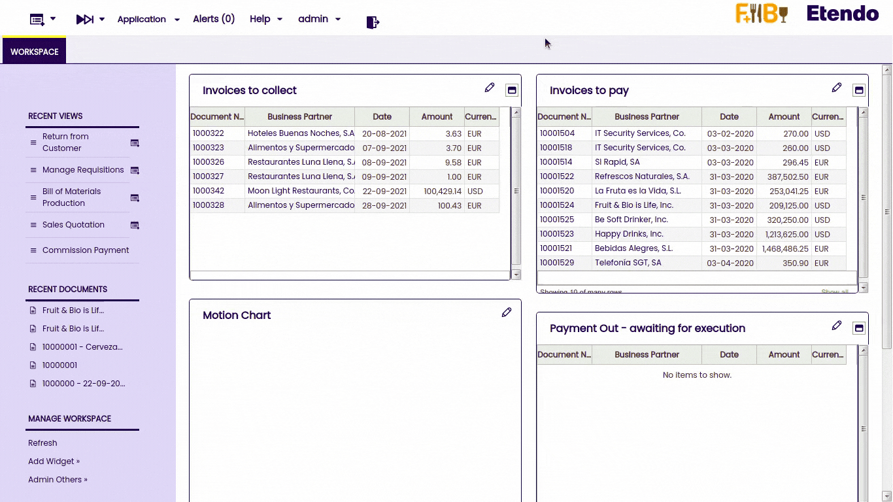
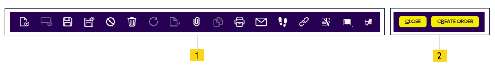

## Navigation 

To get to a window, type a part of its name in the **Create New button** or the **Quick Launch button**. Etendo also offers a tree menu for easy discovery.

### Quick Launch

!!! info
    For more information about Quick Launch functionalities, see the Quick Menu section in the Top Navigation Bar section.

### Application menu tree structure

The Application menu is used to make all the application elements accessible to the user. Also, the last three searches are shown in this window.

#### Icon references

There are different types of menu items which are identified with different icons:

|     |     |
| --- | --- |
|  | Folders are used to organize other items within them. They can be expanded or collapsed to show their contents by clicking them. |
|  | Reports explode information from Etendo Classic. |
|  | Processes allow complex operations to be performed. Some examples would be to import data from a file or the automatic creation of invoices from purchase orders. |
|  | Windows allow the user to create, modify or query records. By records, it is meant any entity that has its own data within Etendo Classic, such as a product, an order, an invoice, etc. |

## Application Areas 

Etendo is split into different application areas. Each area is represented by a separate folder accessible from the Application menu in **the top navigation** screen area.

### Window structure

The Toolbar contains action buttons and process buttons. Action buttons are generic and can be applied to almost all selected records.  Process buttons are record specific and depend on the record status and the active level (header or lines or lower).

|     |     |
| --- | --- |
| 1   | Action buttons |
| 2   | Process buttons |

### Buttons

The action buttons perform the following actions:   
 

|     |     |
| --- | --- |
|  | Create a new record in a form 
|  | Insert a new row in grid view 
|  | Save your changes in the database 
|  | Close the current record and return to grid view 
|  | Cancel changes and return to last saved state 
|  | Delete the current selected record(s) from the database |
|  | Refresh the current data from the database 
|  | Export to spreadsheet 
|  | Upload new attachment 
|  | Copy record 
|  | Print record 
|  | Email 
|  | Show audit trail 
|  | Get a direct link to this view or record 
|  | Form personalization 
|  | Save view |.png
|  | Show table and form |.png

---
This work is a derivative of [User Interface Introduction](http://wiki.openbravo.com/wiki/User_Interface_Introduction){target="_blank"} by [Openbravo Wiki](http://wiki.openbravo.com/wiki/Welcome_to_Openbravo){target="_blank"}, used under [CC BY-SA 2.5 ES](https://creativecommons.org/licenses/by-sa/2.5/es/){target="_blank"}. This work is licensed under [CC BY-SA 2.5](https://creativecommons.org/licenses/by-sa/2.5/){target="_blank"} by [Etendo](https://etendo.software){target="_blank"}.