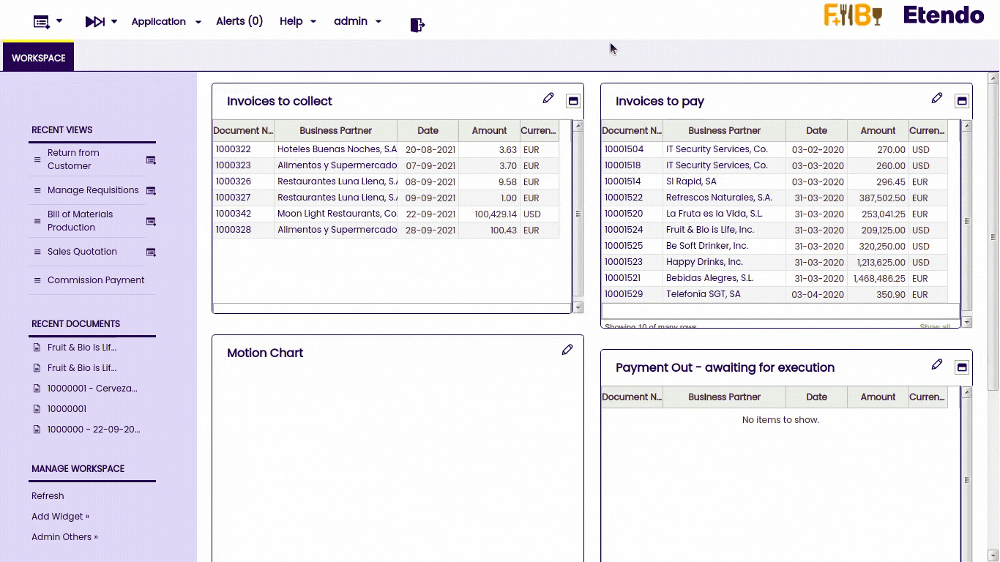
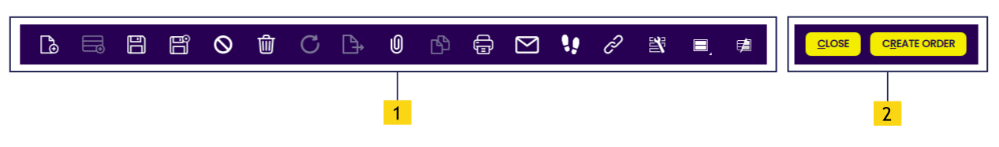
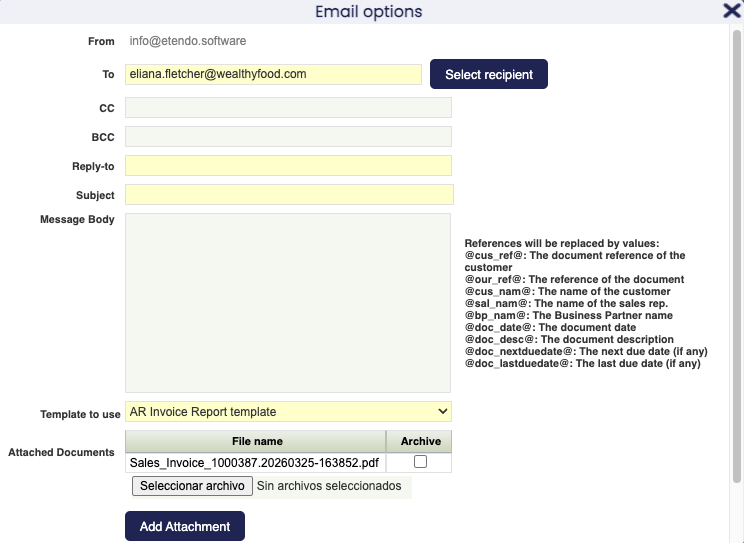

## Navigation 

To get to a window, type a part of its name in the **Create New button** or the **Quick Launch button**. Etendo also offers a tree menu for easy discovery.

### Quick Launch

!!! info
    For more information about Quick Launch functionalities, see the Quick Menu section in the Top Navigation Bar section.

### Application menu tree structure

The Application menu is used to make all the application elements accessible to the user. Also, the last three searches are shown in this window.

#### Icon references

There are different types of menu items which are identified with different icons:

|     |     |
| --- | --- |
|  | Folders are used to organize other items within them. They can be expanded or collapsed to show their contents by clicking them. |
|  | Reports explode information from Etendo Classic. |
|  | Processes allow complex operations to be performed. Some examples would be to import data from a file or the automatic creation of invoices from purchase orders. |
|  | Windows allow the user to create, modify or query records. By records, it is meant any entity that has its own data within Etendo Classic, such as a product, an order, an invoice, etc. |

## Application Areas 

Etendo is split into different application areas. Each area is represented by a separate folder accessible from the Application menu in **the top navigation** screen area.

### Window structure

The Toolbar contains action buttons and process buttons. Action buttons are generic and can be applied to almost all selected records.  Process buttons are record specific and depend on the record status and the active level (header or lines or lower).

|     |     |
| --- | --- |
| 1   | Action buttons |
| 2   | Process buttons |

### Buttons

The action buttons perform the following actions:   
 

|     |     |
| --- | --- |
|  | Create a new record in a form
|  | Insert a new row in grid view
|  | Save your changes in the database
|  | Close the current record and return to grid view
|  | Cancel changes and return to last saved state
|  | Delete the current selected record(s) from the database |
|  | Refresh the current data from the database
|  | Export to spreadsheet
|  | Upload new attachment
|  | Copy record
|  | Print record
|  | Email
|  | Show audit trail
|  | Get a direct link to this view or record
|  | Form personalization
|  | Save view |.png
|  | Show table and form |.png

#### Email

Clicking the **Email** button opens the **Email Options** popup, which allows sending an email directly from the current document to the business partner's contact.

The popup contains the following fields:

- **From**: The sender email address, populated automatically based on the system email configuration. Read-only.
- **To**: Editable text field for the recipient's email address. Includes a **Select recipient** button that opens a contact selector to pick from the business partner's contacts. When multiple contacts exist, the system preloads the email using the following order:
    1. The contact marked as **Default** in the Contact tab of the Business Partner window.
    2. If no Default contact exists, the last modified contact in the list.
- **Subject**: Subject line of the email.
- **CC**: Additional recipients to copy on the email.
- **BCC**: Recipients copied without being visible to others.
- **Reply-to**: Email address where replies will be directed if different from the From address.
- **Message Body**: Free-text body of the email. The following references can be used and will be automatically replaced with the document values when sending:

    | Reference | Description |
    | --- | --- |
    | `@cus_ref@` | The reference of the customer |
    | `@our_ref@` | The reference of the document |
    | `@cus_nam@` | The name of the customer |
    | `@sal_nam@` | The name of the sales rep. |
    | `@bp_nam@` | The Business Partner name |
    | `@doc_date@` | The document date |
    | `@doc_desc@` | The document description |
    | `@doc_nextduedate@` | The next due date (if any) |
    | `@doc_lastduedate@` | The last due date (if any) |

- **Template to use**: Dropdown to select a predefined email template, which will populate the subject and body automatically.
- **Attached Documents**: Lists the documents already attached to the record. Each attachment can be optionally archived. Additional files can be attached using the **Add Attachment** button.

!!! tip
    To ensure the correct recipient is preloaded automatically, mark the desired contact as **Default** in the Contact tab of the Business Partner window.

Multiple recipients can be added in the **To**, **CC**, and **BCC** fields by separating email addresses with `;` or `,`. The system validates all addresses before sending — if any is invalid, the send action is blocked and a validation message is displayed.

---
This work is a derivative of [User Interface Introduction](http://wiki.openbravo.com/wiki/User_Interface_Introduction){target="_blank"} by [Openbravo Wiki](http://wiki.openbravo.com/wiki/Welcome_to_Openbravo){target="_blank"}, used under [CC BY-SA 2.5 ES](https://creativecommons.org/licenses/by-sa/2.5/es/){target="_blank"}. This work is licensed under [CC BY-SA 2.5](https://creativecommons.org/licenses/by-sa/2.5/){target="_blank"} by [Etendo](https://etendo.software){target="_blank"}.