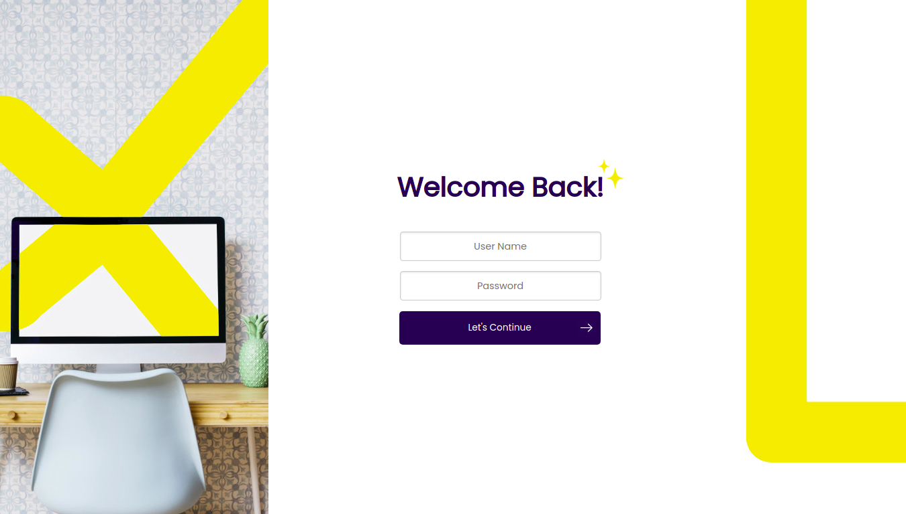
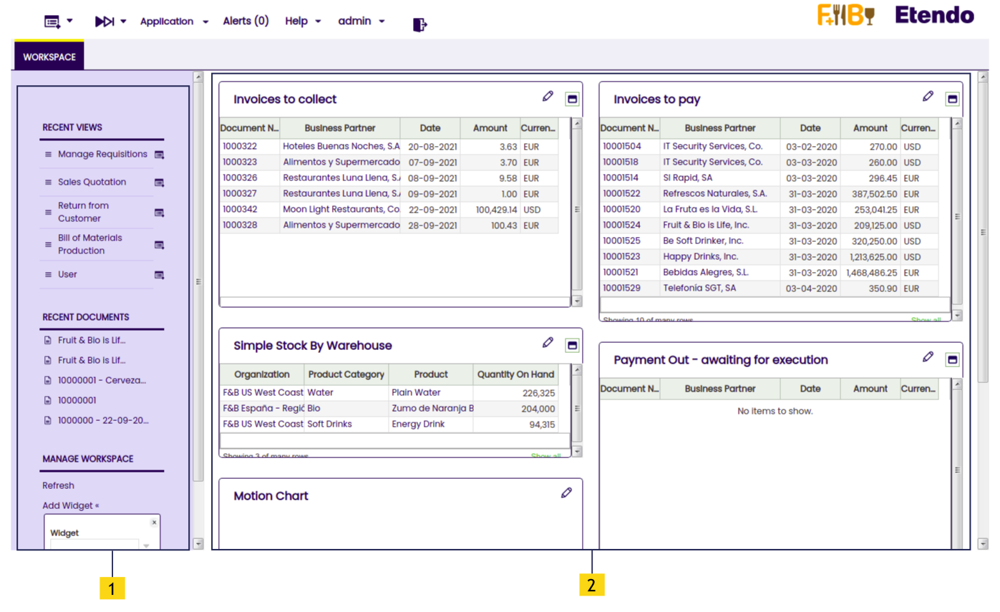
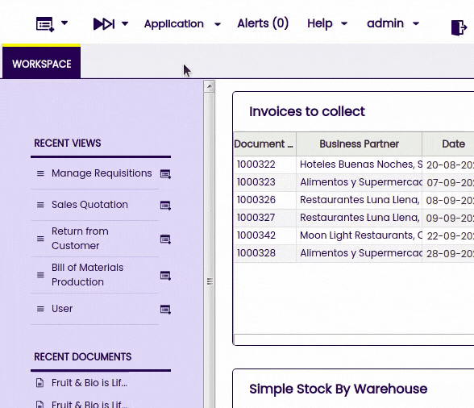
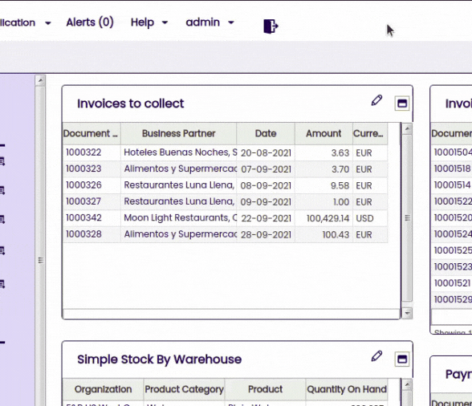

## Login 

Access **Etendo** through a Web browser by entering Etendo URL into the address bar of the browser.

The login window opens up:

!!! info
    In case the login page is not being displayed, please verify the correctness of the URL, or contact your system administrator.
    

Enter your user name and password. The user name and password are assigned by the system administrator.

!!! tip
    If you do not know your user name and password contact your system administrator.

Click **Let’s Continue** and the **Etendo** Home Page shows up.

## Welcome Page

The first tab contains **Etendo workspace**, a customized portal-style home page. Here you will find: 

1\. **Left bar**: In this section, the user’s recent view content and documents are shown. In the Manage Workspace subsection at the bottom of this bar, the user can also add and administrate widgets.

2\. **Widgets**:  This section is for the user to customize by adding direct access to resourceful information Widgets in the user’s workspace tab. Widgets are customizable and the available set will be dependent on role and instance activation status. See how to embed a Widget into a window tab:

!!! info
    To add widgets, click the **Add Widget** link in the left column in the workspace and select from the library.

## Top Navigation

The top navigation bar offers the following menus or functionalities:

|     |     |
| --- | --- |
| 1   | Quick Menu |
| 2   | Quick Launch |
| 3   | Application Menu |
| 4   | Alerts |
| 5   | Help |
| 6   | User section |
| 7   | End session |

From the top navigation bar, the user can launch new documents via the Quick Menu functionalities or jump to existing documents via the Application menu.

### Quick Menu

**Create New:**  Through faster navigation, the user can access the creation of a new document, saving time and increasing the user experience. By using this functionality, a new document of a specific type is created on a new tab in form view.

**Quick Launch:** It is a browser.  By entering the first couple of letters of the name of the document type, suggestions are offered for the type of document you are looking for. The browser shows the user’s last three searches.

### Application

Read more in the [Application areas](navigation.md#application-areas) section.

!!! info
    *The contents of the Application Menu depend on the user's role. For example, one user can have various roles and see different things with each one.*

### Alerts

An alert is a notification that informs or warns the user about a critical or important situation. In this section, you can see and edit all your active alerts.

The number of new alerts is shown in the top navigation as Alerts (n). This link takes you to the Alerts Management tab. This tab shows four sections, each one representing a status or stage in the alert life cycle:

-   **New alerts:** Alerts that you have not marked as read/acknowledged and that are not ignored nor solved.
-   **Pending alerts:** Alerts the user has marked as read/pending because they do not want to see them in the new section anymore. The user would do this, for example, when they have taken care of the problem but this has not been updated in the system. A typical example is: Stock of product x dropped below critical level. The user just placed a new order by phone\*\*,\*\* but it will still take a day to receive the orders.
-   **Ignored alerts:** Alerts that the user does not want to see again. By placing them in the Ignored section, it means that they are now exceptions to the alert rule.
-   **Solved alerts:** Alerts are automatically moved to the solved section when the system notices that the alert threshold ceased to be violated. Note that you cannot mark alerts as “Solved” yourself.

### Help

Context-sensitive help can be accessed by clicking the item Help in the top navigation bar. This action opens a new tab to provide the user with specific information about any selected window. 
In this section, the user can also find information about the ERP.

### User Section

The name of this section varies according to the name set up by the client.

The User section is split in two tabs: Profile and Change Password.

#### Profile

In this section, you can:

-   See the current role information.
-   Change the session options such as role, client, organization, warehouse and language you want to work with.
-   Set your default session options. Tick the “set as default” option to keep the same role every log in.

!!! info
    **Role:** The profile of security for the user, defining what windows and tabs they can see. 
    **Client:** Client for this installation. 
    **Organization:** The client’s organizational entity. 
    **Warehouse:** A logistical unit with the purpose of storage and manipulation of goods. 
    **Language:** The language in which the system information is shown.

#### Password

In this section, the user is able to change the password through this tab by writing the current password first and then, introducing the new password. Then, click **Confirm password.**

### End Session

|     |     |
| --- | --- |
|  | This button logs you out of the application. A confirmation dialog lets you confirm. 

---
This work is a derivative of [User Interface Introduction](http://wiki.openbravo.com/wiki/User_Interface_Introduction){target="_blank"} by [Openbravo Wiki](http://wiki.openbravo.com/wiki/Welcome_to_Openbravo){target="_blank"}, used under [CC BY-SA 2.5 ES](https://creativecommons.org/licenses/by-sa/2.5/es/){target="_blank"}. This work is licensed under [CC BY-SA 2.5](https://creativecommons.org/licenses/by-sa/2.5/){target="_blank"} by [Etendo](https://etendo.software){target="_blank"}.
