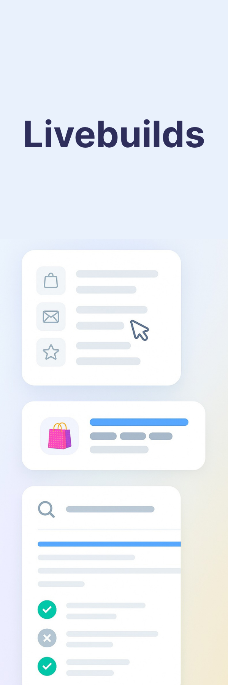

---
tags:
  - Builds
  - Livebuilds
  - Etendo
  - Real-time Testing
  - Postgres
  - Oracle
  - Environments

hide:
    - navigation
    - toc
---

{ width=250 align="right"}

#

### Welcome to the Etendo Classic live development builds. This page holds live testing instances.

**Etendo Classic with Supported Bundles**  
For detailed information about the installed bundles, please visit the [Etendo Marketplace](https://marketplace.etendo.cloud/#/modules?page=1&partner=434C406CDC664DD38BF4CDABBD72BAE2){ target="blank"}.

[Etendo 24.X + Bundles](https://demo-24.etendo.cloud/etendo/security/Login){ target="blank"}  
[Etendo 25.X + Bundles](https://demo-25.etendo.cloud/etendo/security/Login){ target="blank"}  

**Etendo Classic**

[Etendo 24.X](https://livebuild-24.labs.etendo.cloud/etendo/security/Login){ target="blank"}  
[Etendo 25.X](https://livebuild-25.labs.etendo.cloud/etendo/security/Login){ target="blank"}  

!!! tip "Credentials"
    The default access credentials are:   
        **Username:** admin  
        **Password:** admin  

!!! note 
    These live builds are refreshed and reset every day at 8:00 PM UTC.

!!! warning "Oracle"
    If your testing requirements include the Oracle database, please reach out to our [support team](../help-and-support/overview.md) for further assistance and access to Oracle-based environments.

