## Overview

This section describes the windows related to accounting financial reports in Etendo. These are:

[:material-file-document-outline: Accounting Transaction Details](#accounting-transaction-details){ .md-button .md-button--primary }  

[:material-file-document-outline: Balance Sheet and P/L Structure](#balance-sheet-and-pl-structure){ .md-button .md-button--primary }  

[:material-file-document-outline: Balance Sheet and P/L Structure Advanced](#balance-sheet-and-pl-structure-advanced){ .md-button .md-button--primary }  

[:material-file-document-outline: Trial Balance](#trial-balance){ .md-button .md-button--primary }  

[:material-file-document-outline: General Ledger Report](#general-ledger-report){ .md-button .md-button--primary }  

[:material-file-document-outline: General Ledger Report Advanced](#general-ledger-report-advanced){ .md-button .md-button--primary }  

[:material-file-document-outline: Journal Entries Report](#journal-entries-report){ .md-button .md-button--primary }  

[:material-file-document-outline: Journal Entries Report Advanced](#general-ledger-report-advanced){ .md-button .md-button--primary }  

[:material-file-document-outline: Create Tax Report](#create-tax-report){ .md-button .md-button--primary }  

[:material-file-document-outline: Customer Statement](#customer-statement){ .md-button .md-button--primary }  

[:material-file-document-outline: Tax Report Setup](#tax-report-setup_1){ .md-button .md-button--primary }  

## **Accounting Transaction Details**

### **Introduction**

The accounting transaction details window is a detailed list of every ledger entry of a general ledger.

Etendo has an integrated accounting system that combines financial and analytical accounting.

-   **Financial accounting** allows the user to exploit accounting dimensions such as "Organization", the "Account" and the "Accounting Date":
    -   These dimensions are always **mandatory,** that means they need to be specified every time that a document is posted to the ledger.
-   **Analytical accounting** allows the user to exploit other dimensions such as "Product", "Business Partner" and "Sales Region".
    -   These dimensions can be configured mandatory or optional in the organization's general ledger configuration if the client the organization belongs to does not **"centrally maintain"** the accounting dimensions.
    -   Otherwise, if the client **"centrally maintains"** the accounting dimensions, some  analytical dimensions above can be configured in the Client window (i.e "Product", "Project", "Cost Center") while some others need to be configured in the organization's general ledger configuration (i.e. "Sales Region", "Campaign").

Etendo allows the user to post transactions to the ledger only if the financial dimensions and the mandatory analytical dimensions are specified, while there is always the option to specify the optional analytical ones.

#### **Header**

This report lists every transaction posted to the ledger by showing every accounting dimension specified.

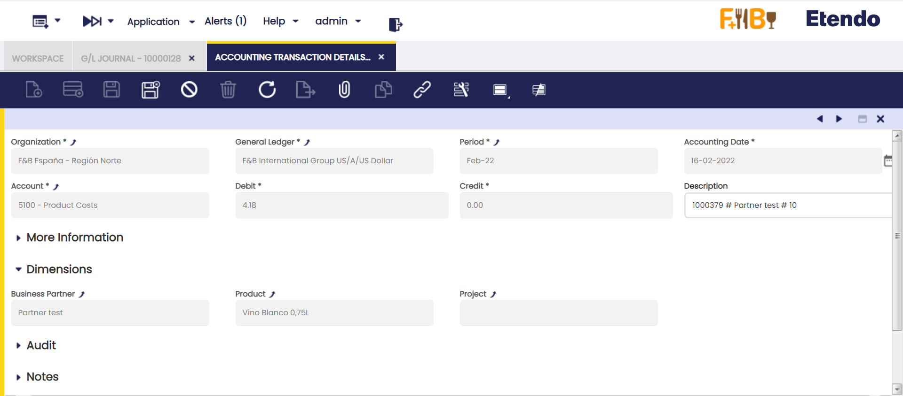

Column Filters allow the user to filter the information to be shown by any of the accounting dimensions.

## **Balance Sheet and P&L Structure**

### **Introduction**

The Balance sheet and P&L structure report engine allows the user to launch the Balance Sheet and P&L which need to be previously configured.

The Balance Sheet report is a quantitative summary of an organization's financial condition at a specific point in time. This report shows a summary of the assets and liabilities & Owner's Equity balances.

Profit and Loss report shows earnings, expenses and the net profit of an organization

These reports need to be configured prior to be launched in the Balance Sheet and P&L Structure setup window.

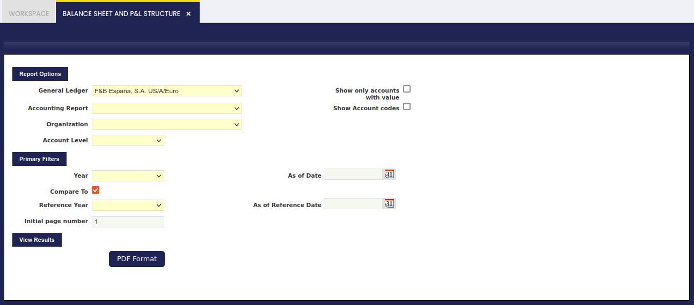

As shown in the image above, data to fill in is:

-   the *"General Ledger"* from which the accounting information needs to be obtained
-   the *"Accounting Report"* to launch.  
    This field lists the reports created and configured in the Balance Sheet and P&L structure setup window
-   the *"Organization"*.  
    This field lists the organization for which the report has been configured in the Balance Sheet and P&L structure setup window
    -   if the report is configured for a "Legal with Accounting" organization type, only that one is shown in this field. The account's balances shown in the report will be a roll-up of the organizations which belong to it, if any.
    -   if the report is configured for a "Generic" organization type, the organizations shown in this field are at least the generic organization and the legal with accounting organization type it belongs to, all of them linked to the general ledger selected.
-   the *"Account Level"* which defines up to which detail level is going to be shown in the report, the options available are the same as the account tree element levels:
    -   Heading, only "heading" elements are shown including summarized accounting information up to that level
        -   Account, in this case "heading" and "account" elements are shown including summarized accounting information up to each of those levels
            -   Breakdown, in this case "heading", "account" and "breakdown" elements are shown including summarized accounting information up to each of those levels
                -   Subaccount, in this case "heading", "account", "breakdown" and "subaccount" elements are shown including summarized accounting information up to each of those levels.  
                    It is important to recall that accounting entries are booked at subaccount level.
-   *"Show only accounts with value"* flag allows the user to see that the report does not show account elements having a *zero* amount balance, but elements defined as Title which are always shown regardless of its balance amount.
-   *Show Account codes* flag allows the user to make the report show the Element Level Search Key or not.

Under the *"Primary Filters"* section, it is possible to specify:

-   an *Initial page number* for the report, in case the report needs to be integrated.  
    This one is useful in case the report must be integrated as a part of a bigger report or document.
-   a *"Year"* and a *"Reference Year"* in order to get a comparative report normally between the current "Year" and the previous one entered as "Reference Year". The report has a filter *"Compare To"*, so it can be launched just for a concrete year, without forcing to compare it with another year.
-   and finally *"As of Date"* (Date To) and *"As of Reference Date"* (Date From filters can be entered, these filters behave differently depending on the report:
    -   In the case of Balance Sheet report, a "Date To" value can be entered to get that the report shows account balance information up to that date to.
    -   In the case of P&L report a "Date To" and a "Date From" can be entered to make the report show accounting information within that period of time (a year, a quarter, a month, etc).

#### **Balance Sheet Report Example**

!!! info
    Please note that the word "Provisional" (en\_US) \[or "Provisional" (es\_ES)\] is shown whenever at least one of the periods for which the report has been launched for it is not closed yet.

#### **P&L Report Example**
 

## **Balance Sheet and P&L Structure Advanced**

!!! info
    To be able to include this functionality, the Financial Extensions Bundle must be installed. To do that, follow the instructions from the marketplace: [Financial Extensions Bundle](https://marketplace.etendo.cloud/#/product-details?module=9876ABEF90CC4ABABFC399544AC14558){target="_blank"}. For more information about the available versions, core compatibility and new features, visit [Financial Extensions - Release notes](../../../../../whats-new/release-notes/etendo-classic/bundles/financial-extensions/release-notes.md).

The **Balance Sheet and P&L Structure Advanced report** is an enhanced version of the previous “Balance Sheet and P&L Structure”. Its purpose is to expand the filtering criteria, including all the existing accounting dimensions in the table Accounting Transaction Details.

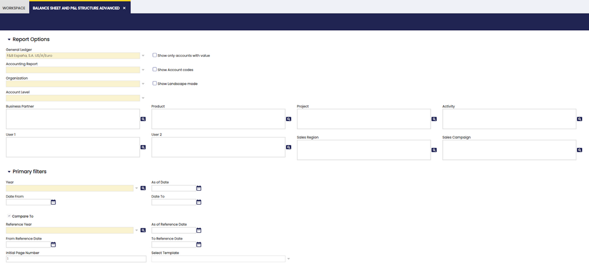

In addition to the previous basic filters: 

- General Ledger
- Accounting Report
- Organization
- Account level
- Year
- As of Date
- Compare to (check)
- Reference Year
- As of Reference Date

the following were added:    

-   Business Partner  
-   Product   
-   User 1    
-   User 2  
-   Project 
-   Activity    
-   Sales Region    
-   Sales Campaign  

In basic filters, in the section of the current year, the fields Date From and Date to were added to select a specific period from the selected year.

In the comparative year section, the fields From Reference Date, To Reference Date were added to select a specific period from the selected year apart from the Select Template field. 
 
In each filter, more than one option can be selected:
 
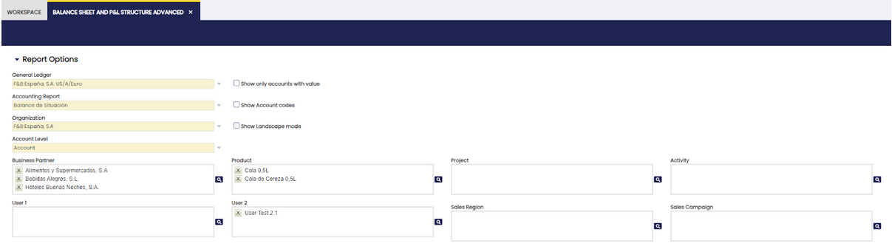

Another difference to take into account is that, in this case, the buttons View, Export to PDF and Export to Excel are located in the same section of the upper bar.

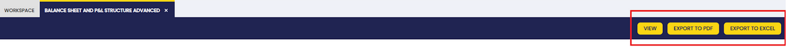

## **Trial Balance**

### **Introduction**

The trial balance helps to check that the total amount of debits is equal to the total amount of credits.

This report is commonly launched at the end of the period prior to the preparation of the Balance Sheet and the Income Statement. However, Etendo allows the user to launch it at any point in time to check that debits equal credits.

In Etendo terms, the "Trial Balance" shows for a given Organization and General Ledger:

-   the account balance as of a given date from
-   the account total sum of debits within a given period of time
-   the account total sum of credits within a given period of time
-   and finally the account balance as of a given date to

At the end of the report, the total sum of debits must be equal to the total sum of credits.

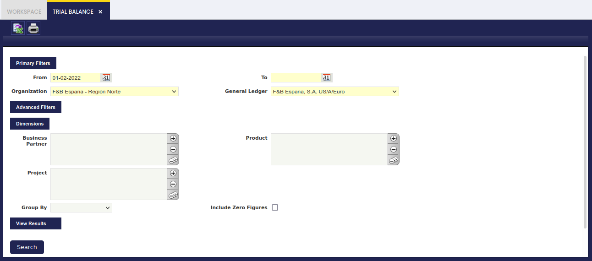

As shown in the screen above, it is possible to enter below data before launching the Trial Balance.

Under the **Primary Filters** section, it is possible to specify:

-   the *"From"* date when the account balance is going to be taken
-   the *"To"* date when the account balance is going to be calculated by following the formula below:
    -   *Balance as of to date = Balance as of from date + Sum of the Debit amounts - Sum of the Credit amounts*
-   the *"Organization"* for which the Trial Balance is required. It is important to remark that a Trial Balance can be launched for:
    -   "Legal with Accounting" type organizations
    -   "Generic" type organizations which must belong to a "Legal Entity with Accounting" organization.
        -   It is possible to enter and post transactions in this organization type as they inherit the general ledger of the legal entity with accounting they belong to.
    -   "Organization" type organizations, as this type can be linked to a general ledger to be shared by a set of organizations which belong to it.
        -   Regardless this organization type does not allow transaction posting, the Trial Balance obtained at this level summarizes the accounting information of all the organizations which belong to an organization of this type which share the same general ledger.
-   and finally the "General Ledger".

**Advanced filters** is a collapsible section which can be shown by clicking on it. Under this section, it is possible to specify:

-   the Account Level to show. The options available are from top to bottom:
    -   **Heading**
    -   **Account**
    -   **Breakdown**
    -   and **Subaccount**.

These are the Account Tree Elements.

"**Subaccount**" is the value set by default, regardless it can be changed if required.

This is due to the fact that a subaccount is the element which helps to check that the total amount of debits is equal to the total amount of credits for every subaccount of the account tree.

Also, the selection of this value allows the user to:

1\. select other "**Dimensions**", such as the "Business Partner", the "Product" and the "Project". These dimensions are recorded while posting transaction to the ledger and the transactions can be posted to the ledger through the subaccounts.

2\. Select “Group By” value to have more information about that option. Values are "Business Partner", "Product", "Project" and “Cost Center”

3\. select "**Include Zero Figures**" flag which allows the user to display all subaccounts even those which hold zero figures.

-   It is possible to enter the **initial page number** of the trial report if required
-   Also, the "**Opening Entry Amount to Initial Balance**" flag is marked by default.  
    This checkbox allows the user to configure if the "Opening" account balance (dated i.e. 1st January 2021) is shown separately in the first column "Balance As Of" or either in the "Debit" or in the "Credit" column.  
    In other words:
    -   the negative "Opening" balance of a liability type account can be shown in the "Balance As Of" column or in the "Credit" column
    -   the positive "Opening" balance of an asset type account can be shown in the "Balance As Of" column or in the "Debit" column.  
        This check only applies if the "From" date entered while launching the report is the same as the "Opening" Accounting date (i.e. 1st January 2021), otherwise the "Opening" account balance is always shown in the "Balance As Of" column.

Once all the data above has been properly filled in, the "Search" process button shows the results in the same window.

An example of the output of the report is:

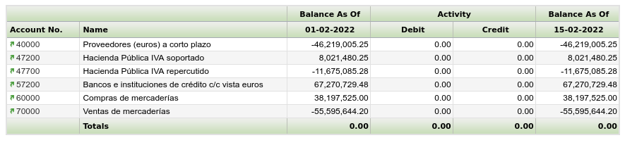

This report can also be shown in:

-   a *PDF format* by pressing the "Print" action icon of the Toolbar.
    -   the PDF file can be printed or archived for later reviews.
    -   the PDF file has the same grouping rules as the search button.
-   and in *excel format*:
-   the excel file has the same grouping rules as the search button. When the Trial Balance Report is launched at "Subaccount" level, this format shows the dimension selected in the combo group by, but when no grouping is selected in the combo, the report shows all dimensions.

## **General Ledger Report**

### **Introduction**

The General Ledger report lists every ledger "subaccount" and its debit and credit ledger entries within a given period of time.
   
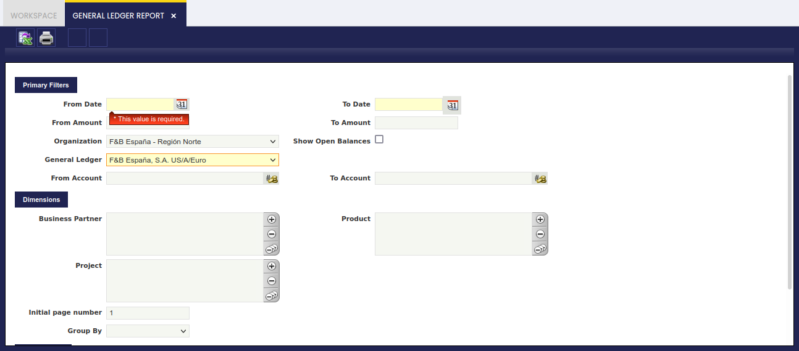

As shown in the image above, the fields to fill in for launching this report are:

-   the *"Organization"* for which the accounting information is required.  
    Once more, the accounting information provided by this report relies on the organization type selected as:
    -   accounting information shown might be just related to a "Generic" organization belonging to a "legal Entity with Accounting"
    -   or could be a roll-up in case of selecting either a "Legal Entity with Accounting" or an "Organization" having other organizations underneath.
-   *"Show Open Balances"* option which will hide those entries for which the balance is zero. (Ex. removing receivables/payables entries from invoices once those have been paid.)
-   and the corresponding *"General Ledger"* which will also rely on the Organization previously selected.

It is possible to narrow down the accounting information to be shown in the report by:

-   a range of "*amounts*"
-   a set of *"subaccounts"*
-   and a set of *"accounting dimensions"* such as business partner, product and project

Finally, it is also possible to:

-   *"group"* the information by any of the accounting dimensions
-   and enter a *"Initial Page Number"* for the report

Once all data have been properly entered, the "Search" button shows the outcome of the report in the same window:

-   the ledger entries displayed for each subaccount are ordered by accounting date and besides the subaccount balance is shown for each ledger entry.

The arrows in the toolbar allows the user to navigate through the report outcome shown in the window.

The General Ledger Report can also be viewed and saved in Excel format and PDF format:

-   Excel format by pressing on the *"Export to Excel"* action button of the Toolbar:
    -   This format contains a list of all the ledger entries per each subaccount not grouped, therefore it is possible to group them as desired.
    -   It also lists the corresponding accounting dimensions of each ledger entry.
-   PDF format by pressing on the *"Print Record"* action button of the Toolbar:
    -   This format includes an "Initial" balance of each subaccount, the "Subtotal" balance of each subaccount for the given period and calculates the "Total" balance of each subaccount.

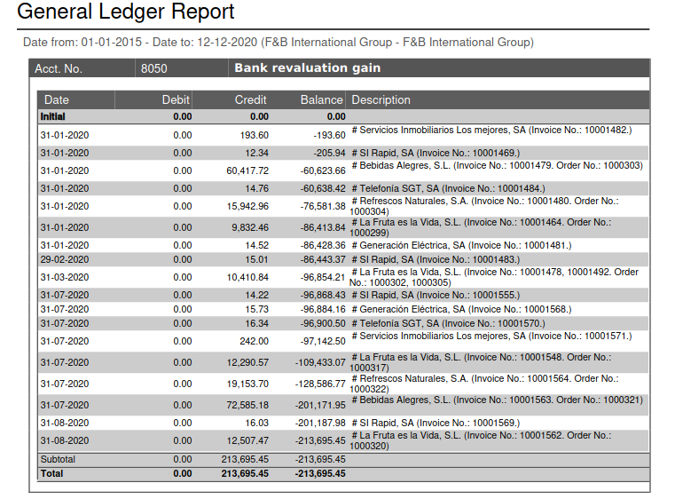

## **General Ledger Report Advanced**

!!! info
    To be able to include this functionality, the Financial Extensions Bundle must be installed. To do that, follow the instructions from the marketplace: [Financial Extensions Bundle](https://marketplace.etendo.cloud/#/product-details?module=9876ABEF90CC4ABABFC399544AC14558){target="_blank"}. For more information about the available versions, core compatibility and new features, visit [Financial Extensions - Release notes](../../../../../whats-new/release-notes/etendo-classic/bundles/financial-extensions/release-notes.md).

This **General Ledger Advanced** report is an enhanced version of the previous “General Ledger Report”. Its purpose is to expand the filtering criteria, including all the existing accounting dimensions in the table Accounting Transaction Details.

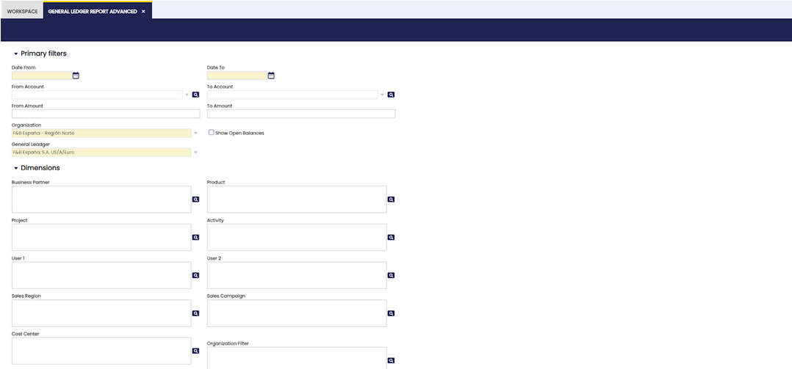

In addition to the previous basic filters: Date from, Date to, From amount, To amount, Organization, General Ledger, From Account, To account, and the previous dimension filters: Business partner, Product and Project, the following were added:
- User 1
- User 2
- Activity
- Sales Region
- Sales campaign
- Cost center

Moreover, the “Organization filter” was added, a filter that combines the original Organization field with the “Show related operations” check, to show intercompany transactions.

In each filter, more than one option can be selected.

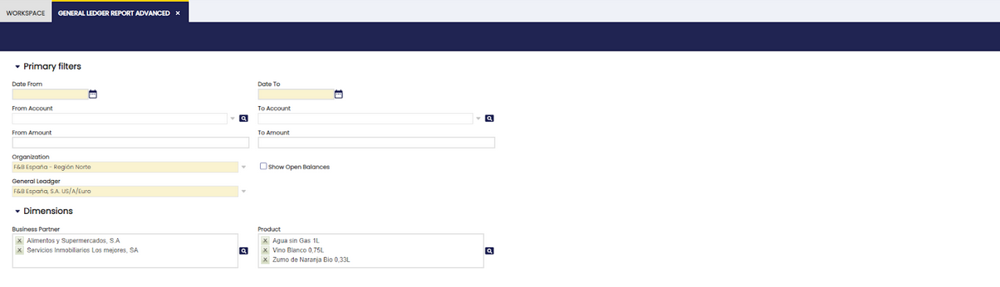

Another difference to take into account is that, in this case, the buttons View, Export to PDF and Export to Excel are located in the same section of the upper bar.

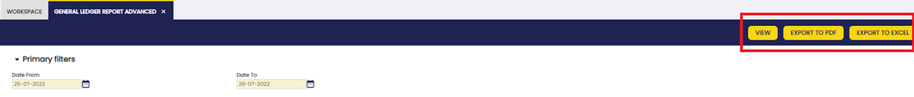

## **Journal Entries Report**

### **Introduction**

The Journal Entries Report is a list of all the journal vouchers of an organization and general ledger shown in a chronological order.

A journal entry is the recording of financial data in a journal voucher such that the debit equals credit and the debits are entered before the credits.

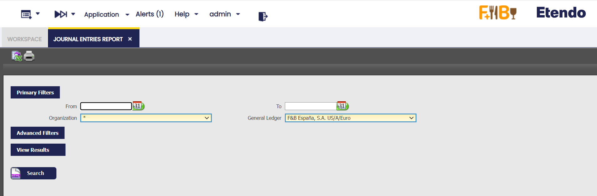

As shown in the image above, the "Primary Filters" section allows the user to specify:

-   the "*Organization*" and the "*General Ledger*" for which the financial data taken from the journal entries is required.

The "Advanced Filters" is now a collapsible section. Under this section, it is possible to specify:

-   a **From/To Account** to display journal entries with at least one line using an account defined in the range.
-   a Document Type to narrow down the financial data to be shown in the report to just the one related to that particular document type.
    -   If the document type selected has a document number associated, for instance an invoice document type, it will be possible to narrow down the data shown to a specific "**Document Number**".
-   the "**Initial Page Number**" *to be shown in the PDF format of the report*
-   the **"Initial Entry Number"** to be shown in the PDF format of the report
-   the **"Entry Description**" to be shown in the PDF format of the report

The rest of the checkboxes are selected by default in order to show:

-   the *"**regular**"* journal entries:
    -   these entries are the ones generated while posting either any of the Etendo document types or while posting a General Ledger Journal do not flag as "Opening".
-   the *"**opening**"* journal entries:
    -   these entries are automatically generated by Etendo after the closing of a given fiscal year
    -   these entries can also be manually generated while posting a General Ledger Journal whenever its journal entries are flagged as "Opening".
-   the "**closing**" journal entries:
    -   these entries are automatically generated by Etendo after the closing a given fiscal year
-   and finally the *"**P&L closing**"* journal entries:
    -   these entries are automatically generated by Etendo after the closing of a given fiscal year

Finally, and same way as for the rest of financial reports, the Journal Entries Report can be launched in:

-   *HTML* format. An example of the HTML output:

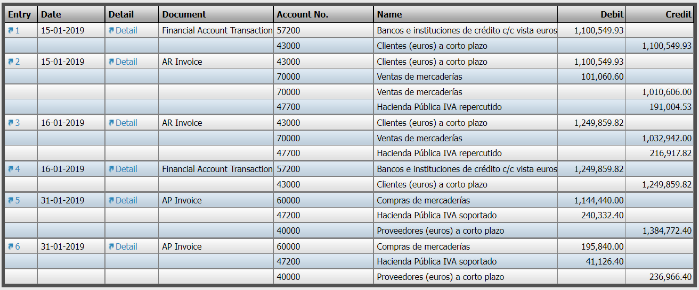

-   *PDF* format by using the "Print Record" action button of the Toolbar
-   or *XML* format by using the "Export to Excel" action button of the Toolbar.

## **Journal Entries Report Advanced**

!!! info
    To be able to include this functionality, the Financial Extensions Bundle must be installed. To do that, follow the instructions from the marketplace: [Financial Extensions Bundle](https://marketplace.etendo.cloud/#/product-details?module=9876ABEF90CC4ABABFC399544AC14558){target="_blank"}. For more information about the available versions, core compatibility and new features, visit [Financial Extensions - Release notes](../../../../../whats-new/release-notes/etendo-classic/bundles/financial-extensions/release-notes.md).

This **Journal Entries Advanced** report is an enhanced version of the previous “Journal Entries Report”. Its purpose is to expand the filtering criteria, including all the existing accounting dimensions in the table Accounting Transaction Details.

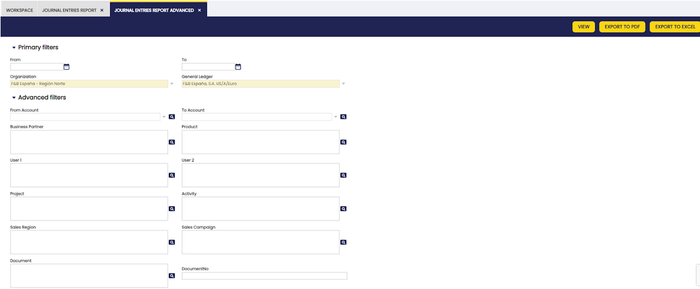

In addition to the previous basic filters: Date from, Date to, Organization, General Ledger and the previous advanced filters: From account, To account, Document, Document N°, the following were added:
- Business Partner
- Product
- User 1
- User 2
- Project
- Activity
- Sales Region
- Sales campaign

The report filters the transactions included in the selected dimensions, for the selected organization and general ledger and for a determined period, if necessary.

In each filter, more than one option can be selected:

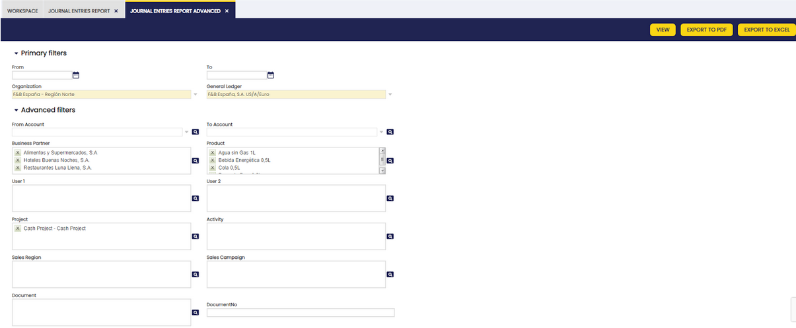

Another difference to take into account is that, in this case, the buttons View, Export to PDF and Export to Excel are located in the same section of the upper bar.

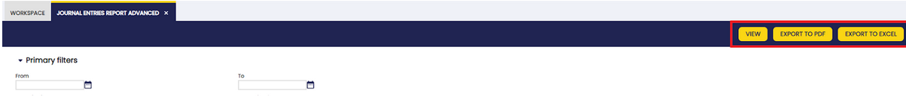

## **Create Tax Report**

### **Introduction**

This Form allows the user to create different Tax Reports according to the user's specific needs.

In order to explain the use of this process, it is necessary to understand the window Tax Report Setup.

##### **Tax Report Setup**

This window allows the user to create or modify different Tax Report for the different existing taxes. In the following lines, it will be explained how to create a new Tax Report:

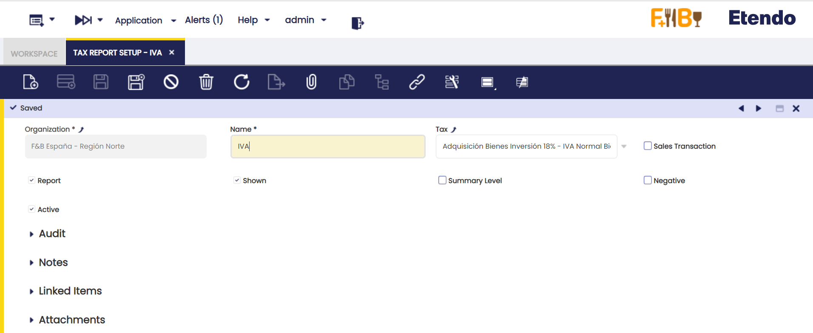

The window has some parameters to indicate the Tax Report created:

-   **Name:** The name of the Report.
-   **Tax:** The tax that will be shown in the report.
-   **Sales Transaction:** Checked if it’s a Sales Tax Report, unchecked if it’s a Purchase Tax Report.
-   **Report:** If checked, it will appear in the Create Tax Report form to be chosen.
-   **Shown:** If checked, it will appear in the Create Tax Report form to be chosen.
-   **Summary Level:** If it is checked, the tax rate is defined as a parent tax that has dependent taxes: the child taxes. If a tax is not going to have any “children,” it should not be checked as summary.
-   **Negative:** If checked, the report will be printed in negative values, otherwise, it will be printed in positive values.
-   **Active:** If it’s an active Tax Report.

Once, the Tax Report has been set up, it will appear in the Create Tax Report form:

##### **Create Tax Report**

This window allows printing Reports previously defined by the user. In order to print the Report, it is necessary to fill a few fields:

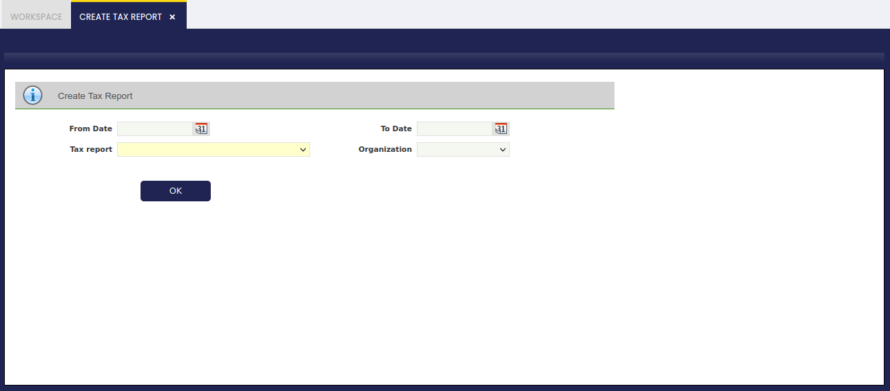

-   **From Date:** Starting Date of the Report.
-   **To Date:** Last Date of the Report.
-   **Tax Report:** In this list, all the Tax Reports created will appear to be chosen-
-   **Organization:** Organization for which the Report will be printed.

Once these fields have been introduced, it will be possible to print the Report that will show the amount during those dates.

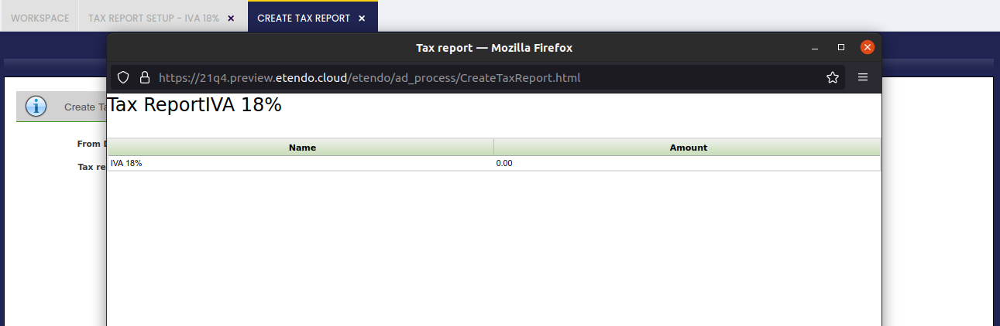

## **Customer Statement**

### **Introduction**

Customer statement is a consolidated statement of every transaction of a customer posted to the ledger over a given period.

Transactions aggregated from various sources like:

-   **Sales Invoices**
-   **Payment In**
-   **Financial Transactions**
-   **Reconciliations**

!!! warning
    Note that *Completed* but not *posted* transactions are not taken into consideration.

In case that a business partner is a customer as well as a vendor, the Customer Statement shows only customer related transactions and does not take into account vendor related transactions.

The *Multicurrency* parameter of the report, in case of checked, will group records based on the currency records and display original currency amounts. If unchecked, it will not group records, and it will display ledger currency amounts.

The Customer Statement provides the following details:

-   The credit/debit information including the document number of the transaction
-   The accounting date
-   The document type of the transaction. (i.e. AR Invoice, Financial Account Transaction, etc)
-   The net financial value of each transaction as \[Debit - Credit\], this column represents the accumulated value of the net financial value transaction by transaction, therefore an accumulated net financial value for the end of the given period is the end balance of the customer statement.  
    Note that negative amounts are highlighted by using brackets ().

#### **Customer Statement Report**

An example of the customer statement filter is shown in the image below:

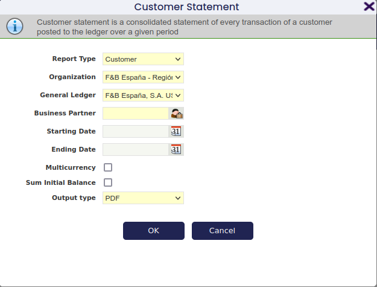

Note about some filters:

-   **Multicurrency.** If there are transactions in multiple currencies for the selected Business Partner, it is possible to use them to split the report. By default, this report converts all currency values into the currency of the General Ledger. If this flag is checked, then the report will be split by each different currency (each one with its initial and ending balance isolated from the rest).
-   **Sum Initial Balance.** By default, the report starts with an Initial Balance, then there are the transactions that have happened with the Business Partner, and for each one there is a Net Balance. The Ending Balance is the Initial Balance plus the final Net Balance. However, if this check is enabled, the Initial Balance is aggregated into each one of the Net Balances, in this case the final Balance is the same one as the last Net Balance.

An example of the Customer Statement output:

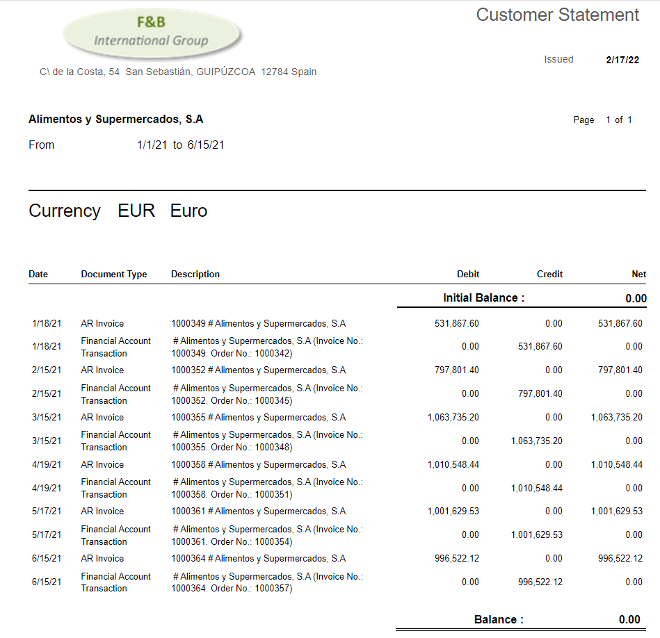

## **Tax Report Setup**

### **Introduction**

Etendo allows the user to create different Tax Reports according to the user’s specific needs.

In order to explain the use of this process, it is necessary to understand the window Tax Report Setup.

##### **Tax Report Setup**

This window allows the user to create or modify different Tax Reports for the different existing taxes. In the following lines, it will be explained how to create a new Tax Report:

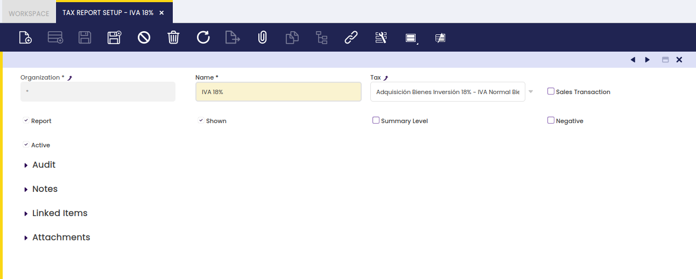

The window has some parameters to indicate the Tax Report created:

-   **Name:** The name of the Report.
-   **Tax:** The tax that will be shown in the report.
-   **Sales Transaction:** Checked if it’s a Sales Tax Report, unchecked if it’s a Purchase Tax Report.
-   **Report:** If checked, it will appear in the Create Tax Report form to be chosen.
-   **Shown:** If checked, it will appear in the Create Tax Report form to be chosen.
-   **Summary Level:** If it is checked, the tax rate is defined as a parent tax that has dependent taxes: the child taxes. If a tax is not going to have any “children,” it should not be checked as summary.
-   **Negative:** If checked, the report will be printed in negative values, otherwise, it will be printed in positive values.
-   **Active:** If it is an active Tax Report.

Once, the Tax Report has been set up, it will appear in the Create Tax Report form:

##### **Create Tax Report**

This window allows to print Reports previously defined by the user. In order to print the Report, it is necessary to fill a few fields:

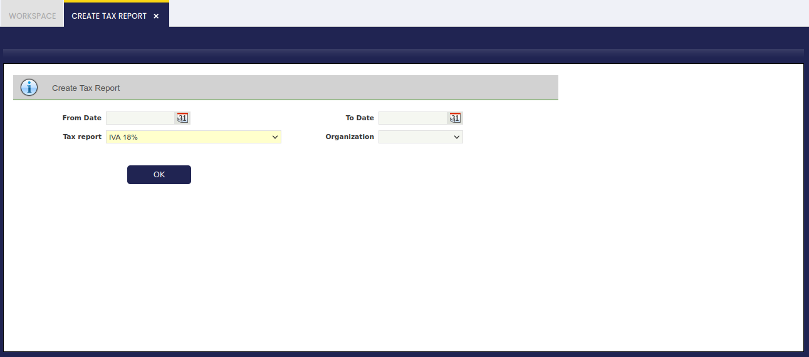

-   **From Date:** Starting Date of the Report
-   **To Date:** Last Date of the Report
-   **Tax Report:** In this list, all the Tax Reports created will appear to be chosen.
-   **Organization:** Organization for which the Report will be printed.

Once these fields have been introduced, it will be possible to print the Report that will show the amount during those dates.

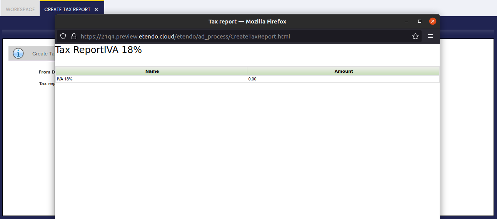