## Overview

This section describes the windows related to accounting financial reports in Etendo. These are:

[:material-file-document-outline: Accounting Transaction Details](#accounting-transaction-details){ .md-button .md-button--primary }  

[:material-file-document-outline: Balance Sheet and P/L Structure](#balance-sheet-and-pl-structure){ .md-button .md-button--primary }  

[:material-file-document-outline: Balance Sheet and P/L Structure Advanced](#balance-sheet-and-pl-structure-advanced){ .md-button .md-button--primary }  

[:material-file-document-outline: Trial Balance](#trial-balance){ .md-button .md-button--primary }  

[:material-file-document-outline: General Ledger Report](#general-ledger-report){ .md-button .md-button--primary }  

[:material-file-document-outline: General Ledger Report Advanced](#general-ledger-report-advanced){ .md-button .md-button--primary }  

[:material-file-document-outline: Journal Entries Report](#journal-entries-report){ .md-button .md-button--primary }  

[:material-file-document-outline: Journal Entries Report Advanced](#general-ledger-report-advanced){ .md-button .md-button--primary }  

[:material-file-document-outline: Create Tax Report](#create-tax-report){ .md-button .md-button--primary }  

[:material-file-document-outline: Customer Statement](#customer-statement){ .md-button .md-button--primary }  

[:material-file-document-outline: Tax Report Setup](#tax-report-setup_1){ .md-button .md-button--primary }  

## Accounting Transaction Details

:material-menu: `Application` > `Financial Management` > `Accounting` > `Analysis Tools` > `Accounting Transaction Details`

### Overview

The accounting transaction details window is a detailed list of every ledger entry of a general ledger.

Etendo has an integrated accounting system that combines financial and analytical accounting.

-   **Financial accounting** allows the user to exploit accounting dimensions such as "Organization", the "Account" and the "Accounting Date":
    -   These dimensions are always **mandatory,** that means they need to be specified every time that a document is posted to the ledger.
-   **Analytical accounting** allows the user to exploit other dimensions such as "Product", "Business Partner" and "Sales Region".
    -   These dimensions can be configured mandatory or optional in the organization's general ledger configuration if the client the organization belongs to does not **"centrally maintain"** the accounting dimensions.
    -   Otherwise, if the client **"centrally maintains"** the accounting dimensions, some  analytical dimensions above can be configured in the Client window (i.e "Product", "Project", "Cost Center") while some others need to be configured in the organization's general ledger configuration (i.e. "Sales Region", "Campaign").

Etendo allows the user to post transactions to the ledger only if the financial dimensions and the mandatory analytical dimensions are specified, while there is always the option to specify the optional analytical ones.

### Header

This report lists every transaction posted to the ledger by showing every accounting dimension specified.

Column Filters allow the user to filter the information to be shown by any of the accounting dimensions.

## Balance Sheet and P&L Structure
:material-menu: `Application` > `Financial Management` > `Accounting` > `Analysis Tools` > `Balance Sheet and P&L Structure`

### Overview

The Balance sheet and P&L structure report engine allows the user to launch the Balance Sheet and P&L which need to be previously configured.

The Balance Sheet report is a quantitative summary of an organization's financial condition at a specific point in time. This report shows a summary of the assets and liabilities & Owner's Equity balances.

Profit and Loss report shows earnings, expenses and the net profit of an organization.

These reports need to be configured prior to be launched in the [Balance Sheet and P&L Structure Setup](../accounting/setup.md#balance-sheet-and-pl-structure-setup) window.

### Header

As shown in the image above, data to fill in is:

- The **General Ledger** from which the accounting information needs to be obtained.
- The **Accounting Report** to launch. This field lists the reports created and configured in the [Balance Sheet and P&L structure Setup](./setup.md#balance-sheet-and-pl-structure-setup) window.
- The **Organization**. This field lists the organization for which the report has been configured in the Balance Sheet and P&L structure setup window.

    - If the report is configured for a "Legal with Accounting" organization type, only that one is shown in this field. The account's balances shown in the report will be a roll-up of the organizations which belong to it, if any.
    - If the report is configured for a "Generic" organization type, the organizations shown in this field are at least the generic organization and the legal with accounting organization type it belongs to, all of them linked to the general ledger selected.

- The **Account Level** which defines up to which detail level is going to be shown in the report, the options available are the same as the account tree element levels:

    - Heading, only "heading" elements are shown including summarized accounting information up to that level.
        - Account, in this case "heading" and "account" elements are shown including summarized accounting information up to each of those levels.
            - Breakdown, in this case "heading", "account" and "breakdown" elements are shown including summarized accounting information up to each of those levels.
                - Subaccount, in this case "heading", "account", "breakdown" and "subaccount" elements are shown including summarized accounting information up to each of those levels. It is important to recall that accounting entries are booked at subaccount level.

- **Show only accounts with value** flag allows the user to see that the report does not show account elements having a *zero* amount balance, but elements defined as Title which are always shown regardless of its balance amount.
- **Show Account codes** flag allows the user to make the report show the Element Level Search Key or not.

Under the **Primary Filters** section, it is possible to specify:

- An **Initial page number** for the report, in case the report needs to be integrated. This one is useful in case the report must be integrated as a part of a bigger report or document.
- A **Year** and a **Reference Year** in order to get a comparative report normally between the current "Year" and the previous one entered as "Reference Year". The report has a filter **Compare To**, so it can be launched just for a concrete year, without forcing to compare it with another year.
- And finally **As of Date** (Date To) and **As of Reference Date** (Date From filters can be entered, these filters behave differently depending on the report:
    -   In the case of Balance Sheet report, a "Date To" value can be entered to get that the report shows account balance information up to that date to.
    -   In the case of P&L report a "Date To" and a "Date From" can be entered to make the report show accounting information within that period of time (a year, a quarter, a month, etc).

**Balance Sheet Report Example**

!!! info
    Please note that the word "Provisional" (en\_US) \[or "Provisional" (es\_ES)\] is shown whenever at least one of the periods for which the report has been launched for it is not closed yet.

**P&L Report Example**
 

## Balance Sheet and P&L Structure Advanced
:material-menu: `Application` > `Financial Management` > `Accounting` > `Analysis Tools` > `Balance Sheet and P&L Structure Advanced`

<iframe width="560" height="315" src="https://www.youtube.com/embed/_vyLPYVFycU?si=WXJE2bGLZ_TMr9JX" title="YouTube video player" frameborder="0" allow="accelerometer; autoplay; clipboard-write; encrypted-media; gyroscope; picture-in-picture; web-share" referrerpolicy="strict-origin-when-cross-origin" allowfullscreen></iframe>

### Overview 

!!! info
    To be able to include this functionality, the Financial Extensions Bundle must be installed. To do that, follow the instructions from the marketplace: [Financial Extensions Bundle](https://marketplace.etendo.cloud/#/product-details?module=9876ABEF90CC4ABABFC399544AC14558){target="_blank"}. For more information about the available versions, core compatibility and new features, visit [Financial Extensions - Release notes](../../../../../whats-new/release-notes/etendo-classic/bundles/financial-extensions/release-notes.md).

The **Balance Sheet and P&L Structure Advanced** report is an enhanced version of the previous [Balance Sheet and P&L Structure](#balance-sheet-and-pl-structure). Its purpose is to expand the filtering criteria, including all available accounting dimensions and the ability to compare multiple years or periods.

### Header

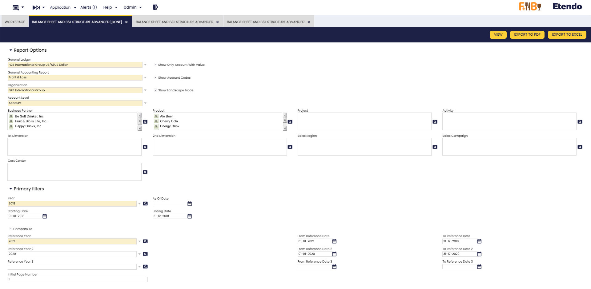

Fields to note:

In addition to the previous **Report Options**: 

- General Ledger
- General Accounting Report
- Organization
- Account level
- Show Only Account With Value (check)
- Show Account Codes (check)
- Show Landscape Mode (check)

The following dimension were added:    

- Business Partner  
- Product   
- 1st Dimension
- 2nd Dimension 
- Project 
- Activity    
- Sales Region    
- Sales Campaign
- Cost Center

!!! info
    In each dimension filter, more than one option can be selected.

Also, in addition to the previous **Primary Filters**: 

- Year
- As of Date (Only for Balance Sheet)
- Starting Date (Only for Profit & Loss)
- Ending Date (Only for Profit & Loss)
- Compare to (check)
- Reference Year
- As of Reference Date (Only for Balance Sheet)
- From Reference Date (Only for Profit & Loss)
- To Reference Date (Only for Profit & Loss)
- Initial page number, printed in the report.

!!! info 
    - It is now possible to compare up to **four years** simultaneously.
    - In addition, **new fields** have been added to allow the selection of specific dates and periods according to the needs of each report, providing greater flexibility in the analysis.
 

### Buttons

In this report, the **View**, **Export to PDF**, and **Export to Excel** buttons are added to the top bar, allowing you to either view the information directly or export it in different formats as needed.

**P&L Report Example**

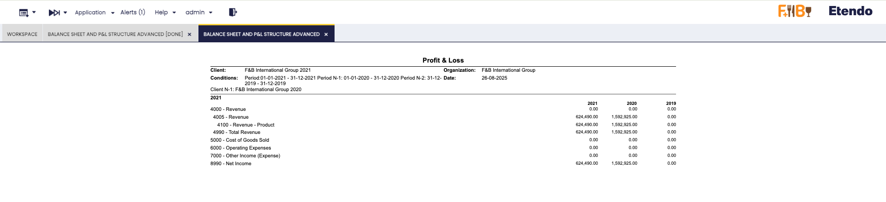

## Trial Balance

:material-menu: `Application` > `Financial Management` > `Accounting` > `Analysis Tools` > `Trial Balance`

<iframe width="560" height="315" src="https://www.youtube.com/embed/o5V3Op_qYtE?si=DnTJ77x6zSMZ5KrC" title="YouTube video player" frameborder="0" allow="accelerometer; autoplay; clipboard-write; encrypted-media; gyroscope; picture-in-picture; web-share" referrerpolicy="strict-origin-when-cross-origin" allowfullscreen></iframe>

!!! info
    To be able to include this functionality, the Financial Extensions Bundle must be installed. To do that, follow the instructions from the marketplace: [Financial Extensions Bundle](https://marketplace.etendo.cloud/#/product-details?module=9876ABEF90CC4ABABFC399544AC14558){target="_blank"}. For more information about the available versions, core compatibility and new features, visit [Financial Extensions - Release notes](../../../../../whats-new/release-notes/etendo-classic/bundles/financial-extensions/release-notes.md).

!!! warning
    If you do not have the [Financial Extensions Bundle](https://marketplace.etendo.cloud/#/product-details?module=9876ABEF90CC4ABABFC399544AC14558){target="_blank"}, the report will remain in a legacy version with limited functionality. You will not be able to navigate directly to the General Ledger from the Business Partner when the report is grouped by this dimension, and the interface improvements and improved options for exporting the report to Excel and PDF will not be available.

### Overview

The **Trial Balance** verifies that the total debits equal the total credits.

Although it is usually run at the end of a period before preparing the Balance Sheet and Income Statement, in Etendo it can be generated at any time.

For a selected **Organization** and **General Ledger**, the report shows:

- The account balance at the starting date
- The total debits within the selected period
- The total credits within the selected period
- The account balance at the ending date

At the bottom of the report, the **total debits must equal the total credits**.

### Header

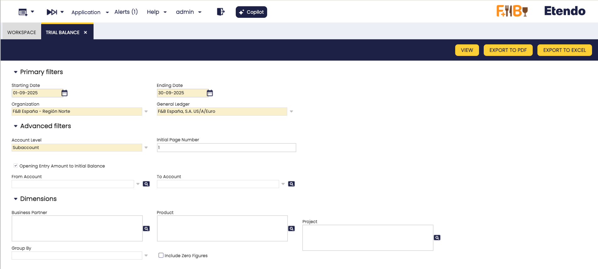

Key fields to note:

#### Primary Filters

- **Starting Date**: The date from which the account balance is taken.
- **Ending Date**: The date up to which the account balance is calculated, using the formula:  
  `Balance as of Ending Date = Balance as of Starting Date + Total Debits − Total Credits`
- **Organization**: The organization for which the Trial Balance is generated. It can be run for:
    - **Legal with Accounting** organization type.
    - **Generic** organization type, which must belong to a *Legal with Accounting* organization. These organizations inherit the general ledger of the legal entity they belong to and can post transactions.
    - **Organization** type entities, which may share a general ledger across multiple organizations that belong to them. While this type cannot post transactions directly, the Trial Balance summarizes the accounting information of all related organizations that share the same general ledger.
- **General Ledger**: The general ledger associated with the selected organization.

#### Advanced Filters

This section provides additional options to refine the Trial Balance report:

- **Account Level**: Defines the level of detail to display in the report. Options include:

    - **Heading**
    - **Account**
    - **Breakdown**
    - **Subaccount** (default)
    
    !!! info 
        By default, the report is generated at the **Subaccount** level. This ensures that for each subaccount in the account tree, the total debits equal the total credits.

- **Initial Page Number**: Sets the page number where the report starts. Useful when integrating this report into larger documents.

- **Opening Entry Amount to Initial Balance**: This option is selected by default. It controls how the opening balance (e.g., January 1, 2021) is displayed in the report:

    - For liability accounts with a negative opening balance, the amount can appear either in the **Balance As Of** column or in the **Credit** column.
    - For asset accounts with a positive opening balance, the amount can appear either in the **Balance As Of** column or in the **Debit** column.

    !!! note
        This setting only applies if the report’s **From Date** matches the opening accounting date (e.g., January 1, 2021). Otherwise, the opening balance is always shown in the **Balance As Of** column.

- **From Account / To Account**: Allows you to specify a range of subaccounts to include in the report (only available when the account level is set to *Subaccount*).

#### Dimensions

You can refine the Trial Balance report by selecting additional **Dimensions**, such as:

- **Business Partner**
- **Product**
- **Project**

These dimensions are recorded when transactions are posted to the ledger. Transactions are always linked through subaccounts.

- **Group By**: Lets you group the report by a specific dimension. Available options are *Business Partner*, *Product*, and *Project*.  
  For example, if you select *Business Partner*, the report will display results grouped by each partner, and you can directly navigate to that partner’s General Ledger from the report.

- **Include Zero Figures**: When enabled, the report displays all subaccounts, including those with zero balances.

### Buttons

- **View**: Opens the report results in a new window. From there, you can navigate directly to the General Ledger:
  
    - By clicking the Account Number of each subaccount.
    - Or, if the report is grouped by Business Partner, by clicking the partner’s name to access their General Ledger view.

    <figure markdown="span">
        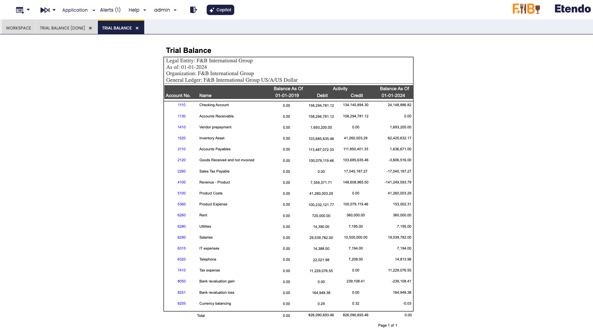
        <figcaption>Example of the report output not gruped</figcaption>
    </figure>

    <figure markdown="span">
        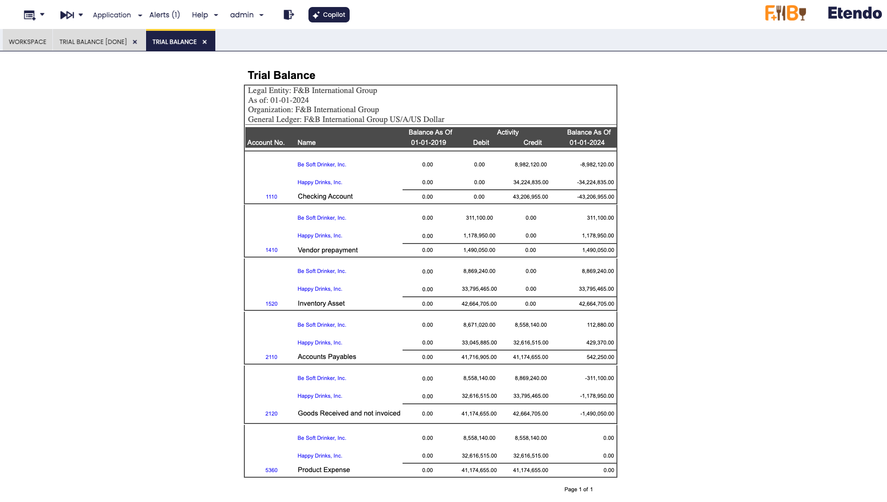
        <figcaption> Example of the report grouped by Business Partner</figcaption>
    </figure>

    In both cases, links are available to **navigate directly to the General Ledger**.

- **Export to PDF**: Generates a PDF version of the report. This file can be printed or stored for later review. The PDF output respects the same grouping rules applied in the search.

- **Export to Excel**: Generates an Excel file of the report. The exported file also follows the same grouping rules applied in the search.

## General Ledger Report

:material-menu: `Application` > `Financial Management` > `Accounting` > `Analysis Tools` > `General Ledger Report`

### Overview

The General Ledger report lists every ledger "subaccount" and its debit and credit ledger entries within a given period of time.
   
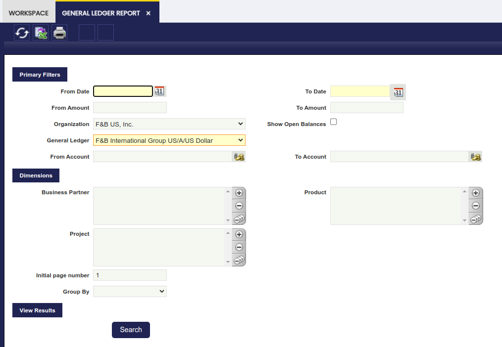

As shown in the image above, the fields to fill in for launching this report are:

- the *"Organization"* for which the accounting information is required.  
    Once more, the accounting information provided by this report relies on the organization type selected as:
    - accounting information shown might be just related to a "Generic" organization belonging to a "legal Entity with Accounting"
    - or could be a roll-up in case of selecting either a "Legal Entity with Accounting" or an "Organization" having other organizations underneath.
- *"Show Open Balances"* option which will hide those entries for which the balance is zero. (Ex. removing receivables/payables entries from invoices once those have been paid.)
- and the corresponding *"General Ledger"* which will also rely on the Organization previously selected.

It is possible to narrow down the accounting information to be shown in the report by:

- a range of "*amounts*"
- a set of *"subaccounts"*
- and a set of *"accounting dimensions"* such as business partner, product and project

Finally, it is also possible to:

- *"group"* the information by any of the accounting dimensions
- and enter a *"Initial Page Number"* for the report

Once all data have been properly entered, the "Search" button shows the outcome of the report in the same window:

- the ledger entries displayed for each subaccount are ordered by accounting date and besides the subaccount balance is shown for each ledger entry.

The arrows in the toolbar allows the user to navigate through the report outcome shown in the window.

The General Ledger Report can also be viewed and saved in Excel format and PDF format:

- Excel format by pressing on the *"Export to Excel"* action button of the Toolbar:
    - This format contains a list of all the ledger entries per each subaccount not grouped, therefore it is possible to group them as desired.
    - It also lists the corresponding accounting dimensions of each ledger entry.
-   PDF format by pressing on the *"Print Record"* action button of the Toolbar:
    - This format includes an "Initial" balance of each subaccount, the "Subtotal" balance of each subaccount for the given period and calculates the "Total" balance of each subaccount.

## General Ledger Report Advanced

:material-menu: `Application` > `Financial Management` > `Accounting` > `Analysis Tools` > `General Ledger Report Advanced`

<iframe width="560" height="315" src="https://www.youtube.com/embed/o5V3Op_qYtE?si=DnTJ77x6zSMZ5KrC" title="YouTube video player" frameborder="0" allow="accelerometer; autoplay; clipboard-write; encrypted-media; gyroscope; picture-in-picture; web-share" referrerpolicy="strict-origin-when-cross-origin" allowfullscreen></iframe>

!!! info
    To be able to include this functionality, the Financial Extensions Bundle must be installed. To do that, follow the instructions from the marketplace: [Financial Extensions Bundle](https://marketplace.etendo.cloud/#/product-details?module=9876ABEF90CC4ABABFC399544AC14558){target="_blank"}. For more information about the available versions, core compatibility and new features, visit [Financial Extensions - Release notes](../../../../../whats-new/release-notes/etendo-classic/bundles/financial-extensions/release-notes.md).

This **General Ledger Advanced** report is an enhanced version of the previous [General Ledger Report](#general-ledger-report). Its purpose is to expand the filtering criteria, including all the existing accounting dimensions in the table Accounting Transaction Details.

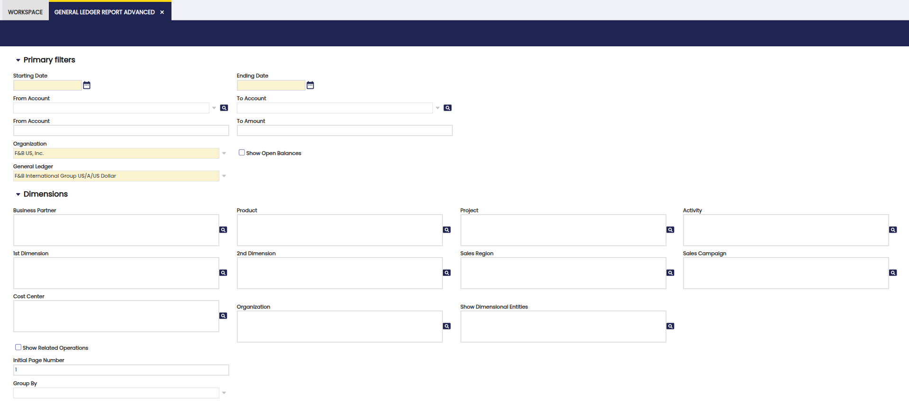

In addition to the previous basic filters: Date from, Date to, From amount, To amount, Organization, General Ledger, From Account, To account, and the previous dimension filters: Business partner, Product and Project, the following were added:

- 1st Dimension
- 2nd Dimension
- Activity
- Sales Region
- Sales Campaign
- Cost Center

Moreover, the Organization filter was added, a filter that combines the original Organization field with the Show Related Operations check, to show intercompany transactions. In each filter, more than one option can be selected.

The new **Show Dimensional Entities** field enables the selection of accounting dimensions to be included in the report.

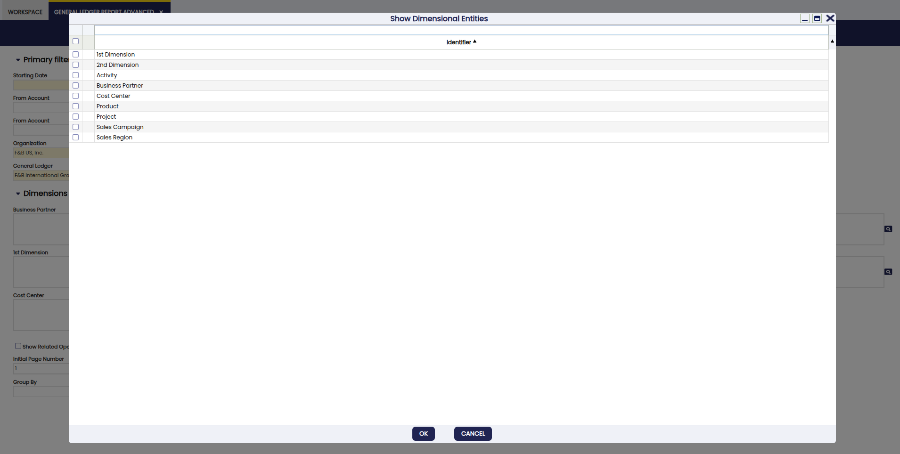

In the Group By menu, the following options are added:

- Activity
- 1st Dimension
- 2nd Dimension
- Sales Region
- Sales Campaign
- Cost Center

It is possible to select the desired accounting dimension for the grouping. When generating the report, the selected dimension appears in the header, indicating the grouping criteria used.

### Buttons

In the toolbar, you can find the buttons **View**, **Export to PDF** and **Export to Excel** to generate the report. In the case of the View option, a new window is opened with the corresponding report. In the other cases, the report is exported in PDF or Excel format.

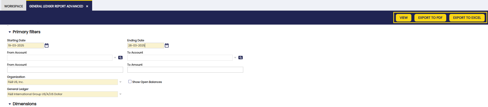

!!!warning
    If the View or Export to PDF options are chosen, the limit of dimensions to be included is 4 to avoid visualization issues. This is not the case with Export to Excel, in which case you can choose any number of dimensions.

Also, with this functionality you can navigate to the related journal entry directly from the report. This allows easier and more efficient access to information. By clicking on a journal entry, the user can navigate to the Journal Entries Report window, applying all selected filters.

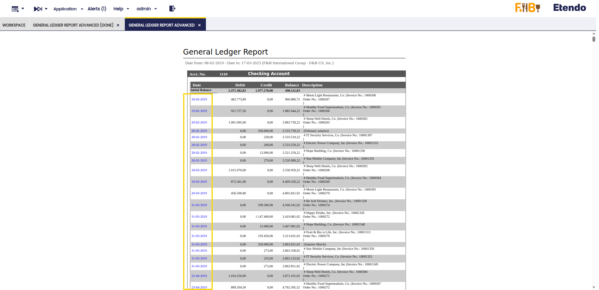

## Journal Entries Report

:material-menu: `Application` > `Financial Management` > `Accounting` > `Analysis Tools` > `Journal Entries Report`

### Overview

The Journal Entries Report is a list of all the journal vouchers of an organization and general ledger shown in a chronological order.

A journal entry is the recording of financial data in a journal voucher such that the debit equals credit and the debits are entered before the credits.

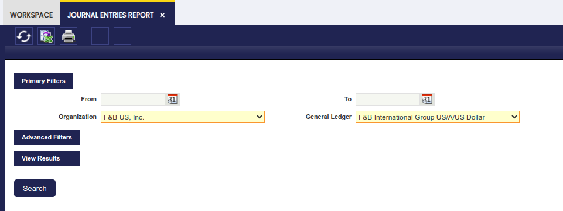

As shown in the image above, the "Primary Filters" section allows the user to specify:

-   the "*Organization*" and the "*General Ledger*" for which the financial data taken from the journal entries is required.

The "Advanced Filters" is now a collapsible section. Under this section, it is possible to specify:

- a **From/To Account** to display journal entries with at least one line using an account defined in the range.
- a Document Type to narrow down the financial data to be shown in the report to just the one related to that particular document type.
    - If the document type selected has a document number associated, for instance an invoice document type, it will be possible to narrow down the data shown to a specific "**Document Number**".
- the "**Initial Page Number**" *to be shown in the PDF format of the report*
- the **"Initial Entry Number"** to be shown in the PDF format of the report
- the **"Entry Description**" to be shown in the PDF format of the report

The rest of the checkboxes are selected by default in order to show:

- the *"**regular**"* journal entries:
    - these entries are the ones generated while posting either any of the Etendo document types or while posting a General Ledger Journal do not flag as "Opening".
- the *"**opening**"* journal entries:
    - these entries are automatically generated by Etendo after the closing of a given fiscal year
    - these entries can also be manually generated while posting a General Ledger Journal whenever its journal entries are flagged as "Opening".
- the "**closing**" journal entries:
    - these entries are automatically generated by Etendo after the closing a given fiscal year
- and finally the *"**P&L closing**"* journal entries:
    - these entries are automatically generated by Etendo after the closing of a given fiscal year

Finally, and same way as for the rest of financial reports, the Journal Entries Report can be launched in:

- *HTML* format. An example of the HTML output:

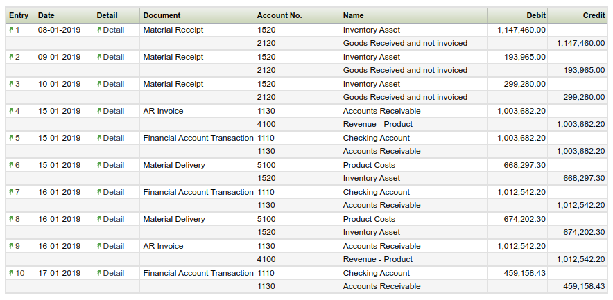

- *PDF* format by using the "Print Record" action button of the Toolbar
- or *XML* format by using the "Export to Excel" action button of the Toolbar.

## Journal Entries Report Advanced

:material-menu: `Application` > `Financial Management` > `Accounting` > `Analysis Tools` > `Journal Entries Report Advanced`

<iframe width="560" height="315" src="https://www.youtube.com/embed/o5V3Op_qYtE?si=DnTJ77x6zSMZ5KrC" title="YouTube video player" frameborder="0" allow="accelerometer; autoplay; clipboard-write; encrypted-media; gyroscope; picture-in-picture; web-share" referrerpolicy="strict-origin-when-cross-origin" allowfullscreen></iframe>

!!! info
    To be able to include this functionality, the Financial Extensions Bundle must be installed. To do that, follow the instructions from the marketplace: [Financial Extensions Bundle](https://marketplace.etendo.cloud/#/product-details?module=9876ABEF90CC4ABABFC399544AC14558){target="_blank"}. For more information about the available versions, core compatibility and new features, visit [Financial Extensions - Release notes](../../../../../whats-new/release-notes/etendo-classic/bundles/financial-extensions/release-notes.md).

This **Journal Entries Advanced** report is an enhanced version of the previous [Journal Entries Report](#journal-entries-report). Its purpose is to expand the filtering criteria, including all the existing accounting dimensions in the table Accounting Transaction Details.

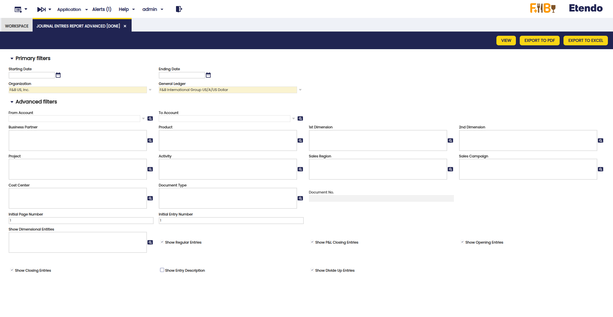

In addition to the previous basic filters: Date from, Date to, Organization, General Ledger and the previous advanced filters: From account, To account, Document, Document N°, the following were added:

- Business Partner
- Product
- 1st Dimension
- 2nd Dimension
- Project
- Activity
- Sales Region
- Sales campaign
- Cost Center

The new **Show Dimensional Entities** field enables the selection of accounting dimensions to be included in the report.

After using the available fields and checkboxes, the report filters the transactions included in the selected dimensions, for the selected organization and general ledger and for a determined period, if necessary. In each filter, more than one option can be selected.

### Buttons

In the upper bar, you can find the buttons **View**, **Export to PDF** and **Export to Excel** to generate the report. In the case of the View option, a new window is opened with the corresponding report. In the other cases, the report is exported in PDF or Excel format.

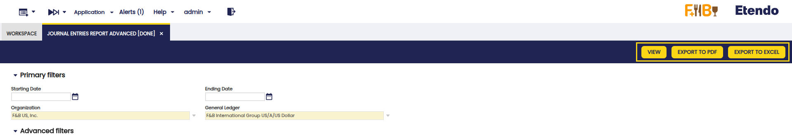

!!!warning
    If the View or Export to PDF options are chosen, the limit of dimensions to be included is 4 to avoid visualization issues. This is not the case with Export to Excel, in which case you can choose any number of dimensions.

Also, with this functionality you can navigate to the related transaction directly from the entry number of reports. This improves traceability and streamlines accounting analysis. 

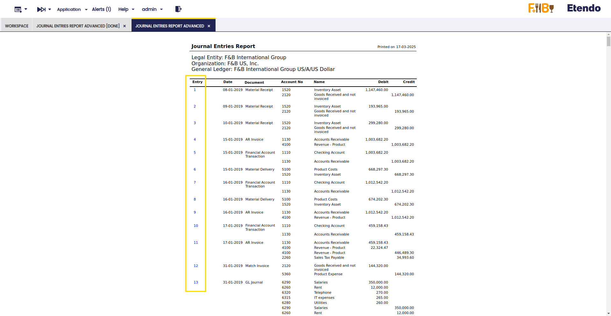

## Create Tax Report

:material-menu: `Application` > `Financial Management` > `Accounting` > `Analysis Tools` > `Create Tax Report`

### Overview

This Form allows the user to create different Tax Reports according to the user's specific needs.

In order to explain the use of this process, it is necessary to understand the window Tax Report Setup.

##### Tax Report Setup

This window allows the user to create or modify different Tax Report for the different existing taxes. In the following lines, it will be explained how to create a new Tax Report:

The window has some parameters to indicate the Tax Report created:

- **Name:** The name of the Report.
- **Tax:** The tax that will be shown in the report.
- **Sales Transaction:** Checked if it’s a Sales Tax Report, unchecked if it’s a Purchase Tax Report.
- **Report:** If checked, it will appear in the Create Tax Report form to be chosen.
- **Shown:** If checked, it will appear in the Create Tax Report form to be chosen.
- **Summary Level:** If it is checked, the tax rate is defined as a parent tax that has dependent taxes: the child taxes. If a tax is not going to have any “children,” it should not be checked as summary.
- **Negative:** If checked, the report will be printed in negative values, otherwise, it will be printed in positive values.
- **Active:** If it’s an active Tax Report.

Once, the Tax Report has been set up, it will appear in the Create Tax Report form:

##### Create Tax Report

This window allows printing Reports previously defined by the user. In order to print the Report, it is necessary to fill a few fields:

- **From Date:** Starting Date of the Report.
- **To Date:** Last Date of the Report.
- **Tax Report:** In this list, all the Tax Reports created will appear to be chosen-
- **Organization:** Organization for which the Report will be printed.

Once these fields have been introduced, it will be possible to print the Report that will show the amount during those dates.

## Customer Statement

:material-menu: `Application` > `Financial Management` > `Accounting` > `Analysis Tools` > `Customer Statement`

### Overview

Customer statement is a consolidated statement of every transaction of a customer posted to the ledger over a given period.

Transactions aggregated from various sources like:

- **Sales Invoices**
- **Payment In**
- **Financial Transactions**
- **Reconciliations**

!!! warning
    Note that *Completed* but not *posted* transactions are not taken into consideration.

In case that a business partner is a customer as well as a vendor, the Customer Statement shows only customer related transactions and does not take into account vendor related transactions.

The *Multicurrency* parameter of the report, in case of checked, will group records based on the currency records and display original currency amounts. If unchecked, it will not group records, and it will display ledger currency amounts.

The Customer Statement provides the following details:

- The credit/debit information including the document number of the transaction
- The accounting date
- The document type of the transaction. (i.e. AR Invoice, Financial Account Transaction, etc)
- The net financial value of each transaction as \[Debit - Credit\], this column represents the accumulated value of the net financial value transaction by transaction, therefore an accumulated net financial value for the end of the given period is the end balance of the customer statement.  
    Note that negative amounts are highlighted by using brackets ().

#### Customer Statement Report

An example of the customer statement filter is shown in the image below:

Note about some filters:

- **Multicurrency.** If there are transactions in multiple currencies for the selected Business Partner, it is possible to use them to split the report. By default, this report converts all currency values into the currency of the General Ledger. If this flag is checked, then the report will be split by each different currency (each one with its initial and ending balance isolated from the rest).
- **Sum Initial Balance.** By default, the report starts with an Initial Balance, then there are the transactions that have happened with the Business Partner, and for each one there is a Net Balance. The Ending Balance is the Initial Balance plus the final Net Balance. However, if this check is enabled, the Initial Balance is aggregated into each one of the Net Balances, in this case the final Balance is the same one as the last Net Balance.

An example of the Customer Statement output:

## Tax Report Setup

:material-menu: `Application` > `Financial Management` > `Accounting` > `Analysis Tools` > `Tax Report Setup`

### Overview

Etendo allows the user to create different Tax Reports according to the user’s specific needs.

In order to explain the use of this process, it is necessary to understand the window Tax Report Setup.

##### Tax Report Setup

This window allows the user to create or modify different Tax Reports for the different existing taxes. In the following lines, it will be explained how to create a new Tax Report:

The window has some parameters to indicate the Tax Report created:

- **Name:** The name of the Report.
- **Tax:** The tax that will be shown in the report.
- **Sales Transaction:** Checked if it’s a Sales Tax Report, unchecked if it’s a Purchase Tax Report.
- **Report:** If checked, it will appear in the Create Tax Report form to be chosen.
- **Shown:** If checked, it will appear in the Create Tax Report form to be chosen.
- **Summary Level:** If it is checked, the tax rate is defined as a parent tax that has dependent taxes: the child taxes. If a tax is not going to have any “children,” it should not be checked as summary.
- **Negative:** If checked, the report will be printed in negative values, otherwise, it will be printed in positive values.
- **Active:** If it is an active Tax Report.

Once, the Tax Report has been set up, it will appear in the Create Tax Report form:

##### **Create Tax Report**

This window allows to print Reports previously defined by the user. In order to print the Report, it is necessary to fill a few fields:

- **From Date:** Starting Date of the Report
- **To Date:** Last Date of the Report
- **Tax Report:** In this list, all the Tax Reports created will appear to be chosen.
- **Organization:** Organization for which the Report will be printed.

Once these fields have been introduced, it will be possible to print the Report that will show the amount during those dates.

---

This work is a derivative of [Financial Management](http://wiki.openbravo.com/wiki/Financial_Management){target="\_blank"} by [Openbravo Wiki](http://wiki.openbravo.com/wiki/Welcome_to_Openbravo){target="\_blank"}, used under [CC BY-SA 2.5 ES](https://creativecommons.org/licenses/by-sa/2.5/es/){target="\_blank"}. This work is licensed under [CC BY-SA 2.5](https://creativecommons.org/licenses/by-sa/2.5/){target="\_blank"} by [Etendo](https://etendo.software){target="\_blank"}.