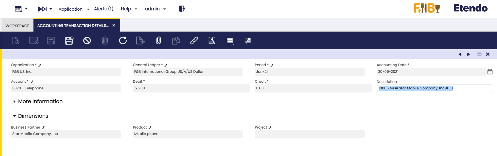

---
tags:
  - Etendo Classic
  - Financial Management
  - Accounting
  - Accounting Transaction Details
  - General Ledger
---

# Accounting Transaction Details

:material-menu: `Application` > `Financial Management` > `Accounting` > `Analysis Tools` > `Accounting Transaction Details`

## Overview

The accounting transaction details window is a detailed list of every ledger entry of a general ledger.

Etendo has an integrated accounting system that combines financial and analytical accounting.

-   **Financial accounting** allows the user to exploit accounting dimensions such as "Organization", the "Account" and the "Accounting Date":
    -   These dimensions are always **mandatory,** that means they need to be specified every time that a document is posted to the ledger.
-   **Analytical accounting** allows the user to exploit other dimensions such as "Product", "Business Partner" and "Sales Region".
    -   These dimensions can be configured mandatory or optional in the organization's general ledger configuration if the client the organization belongs to does not **"centrally maintain"** the accounting dimensions.
    -   Otherwise, if the client **"centrally maintains"** the accounting dimensions, some  analytical dimensions above can be configured in the Client window (i.e "Product", "Project", "Cost Center") while some others need to be configured in the organization's general ledger configuration (i.e. "Sales Region", "Campaign").

Etendo allows the user to post transactions to the ledger only if the financial dimensions and the mandatory analytical dimensions are specified, while there is always the option to specify the optional analytical ones.

## Header

This report lists every transaction posted to the ledger by showing every accounting dimension specified.

Column Filters allow the user to filter the information to be shown by any of the accounting dimensions.

---

This work is a derivative of [Financial Management](http://wiki.openbravo.com/wiki/Financial_Management){target="\_blank"} by [Openbravo Wiki](http://wiki.openbravo.com/wiki/Welcome_to_Openbravo){target="\_blank"}, used under [CC BY-SA 2.5 ES](https://creativecommons.org/licenses/by-sa/2.5/es/){target="\_blank"}. This work is licensed under [CC BY-SA 2.5](https://creativecommons.org/licenses/by-sa/2.5/){target="\_blank"} by [Etendo](https://etendo.software){target="\_blank"}.
