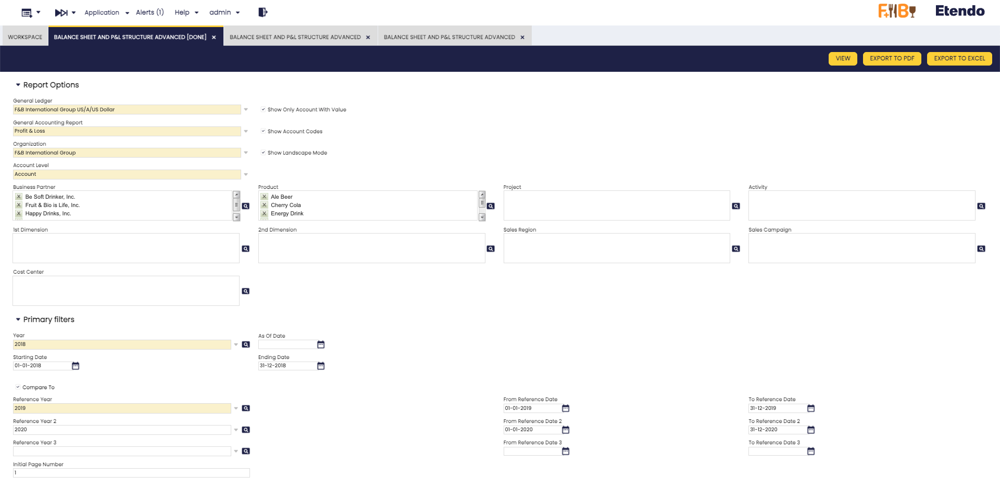
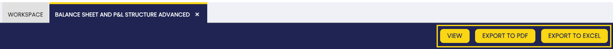
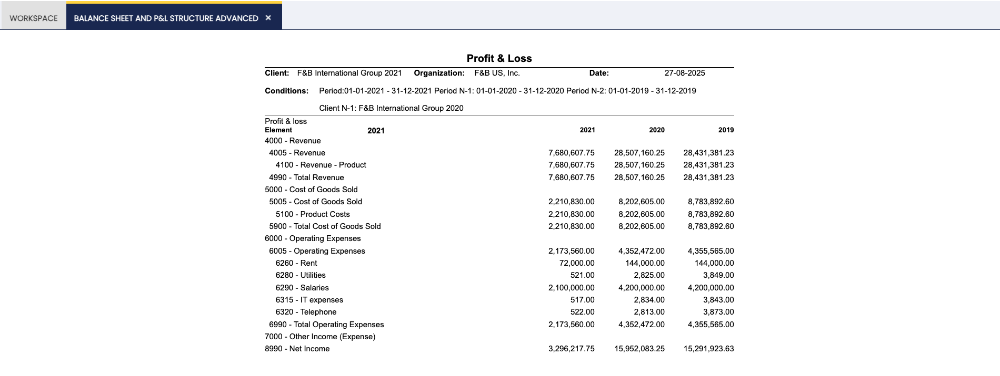

---
tags:
  - Etendo Classic
  - Financial Management
  - Accounting
  - Balance Sheet
  - Financial Extensions
---

# Balance Sheet and P&L Structure Advanced

:material-menu: `Application` > `Financial Management` > `Accounting` > `Analysis Tools` > `Balance Sheet and P&L Structure Advanced`

<iframe width="560" height="315" src="https://www.youtube.com/embed/_vyLPYVFycU?si=WXJE2bGLZ_TMr9JX" title="YouTube video player" frameborder="0" allow="accelerometer; autoplay; clipboard-write; encrypted-media; gyroscope; picture-in-picture; web-share" referrerpolicy="strict-origin-when-cross-origin" allowfullscreen></iframe>

## Overview 

!!! info
    This functionality is available starting from version **3.4.0** of the Financial Extensions Bundle, compatible with **Etendo 25.1**. To install it, follow the instructions from the marketplace: [Financial Extensions Bundle](https://marketplace.etendo.cloud/#/product-details?module=9876ABEF90CC4ABABFC399544AC14558){target="_blank"}. For more information about the available versions, core compatibility and new features, visit [Financial Extensions - Release notes](../../../../../whats-new/release-notes/etendo-classic/bundles/financial-extensions/release-notes.md).

The **Balance Sheet and P&L Structure Advanced** report is an enhanced version of the previous [Balance Sheet and P&L Structure](./balance-sheet-and-pl-structure.md). Its purpose is to expand the filtering criteria, including all available accounting dimensions and the ability to compare multiple years or periods.

## Header

Fields to note:

In addition to the previous **Report Options**: 

- General Ledger
- General Accounting Report
- Organization
- Account level
- Show Only Account With Value (check)
- Show Account Codes (check)
- Show Landscape Mode (check)

The following dimension were added:    

- Business Partner  
- Product   
- 1st Dimension
- 2nd Dimension 
- Project 
- Activity    
- Sales Region    
- Sales Campaign
- Cost Center

!!! info
    In each dimension filter, more than one option can be selected.

Also, in addition to the previous **Primary Filters**: 

- Year
- As of Date (Only for Balance Sheet)
- Starting Date (Only for Profit & Loss)
- Ending Date (Only for Profit & Loss)
- Compare to (check)
- Reference Year
- As of Reference Date (Only for Balance Sheet)
- From Reference Date (Only for Profit & Loss)
- To Reference Date (Only for Profit & Loss)
- Initial page number, printed in the report.

!!! info 
    - It is now possible to compare up to **four years** simultaneously.
    - In addition, **new fields** have been added to allow the selection of specific dates and periods according to the needs of each report, providing greater flexibility in the analysis.
 

## Buttons

In this report, the **View**, **Export to PDF**, and **Export to Excel** buttons are added to the top bar, allowing you to either view the information directly or export it in different formats as needed.

**P&L Report Example**

---

This work is a derivative of [Financial Management](http://wiki.openbravo.com/wiki/Financial_Management){target="\_blank"} by [Openbravo Wiki](http://wiki.openbravo.com/wiki/Welcome_to_Openbravo){target="\_blank"}, used under [CC BY-SA 2.5 ES](https://creativecommons.org/licenses/by-sa/2.5/es/){target="\_blank"}. This work is licensed under [CC BY-SA 2.5](https://creativecommons.org/licenses/by-sa/2.5/){target="\_blank"} by [Etendo](https://etendo.software){target="\_blank"}.
