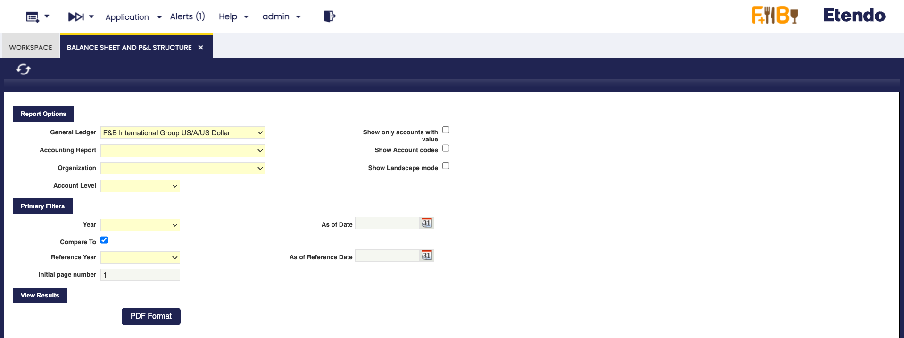
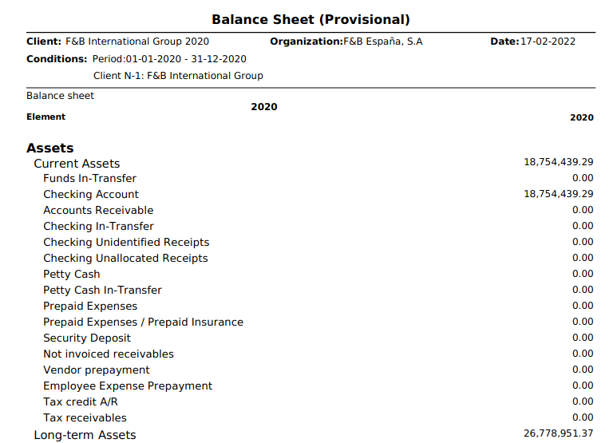

---
tags:
  - Etendo Classic
  - Financial Management
  - Accounting
  - Balance Sheet
  - Financial Reports
---

# Balance Sheet and P&L Structure

:material-menu: `Application` > `Financial Management` > `Accounting` > `Analysis Tools` > `Balance Sheet and P&L Structure`

## Overview

The Balance sheet and P&L structure report engine allows the user to launch the Balance Sheet and P&L which need to be previously configured.

The Balance Sheet report is a quantitative summary of an organization's financial condition at a specific point in time. This report shows a summary of the assets and liabilities & Owner's Equity balances.

Profit and Loss report shows earnings, expenses and the net profit of an organization.

These reports need to be configured prior to be launched in the [Balance Sheet and P&L Structure Setup](../accounting/setup/balance-sheet-and-pl-structure-setup.md) window.

## Header

As shown in the image above, data to fill in is:

- The **General Ledger** from which the accounting information needs to be obtained.
- The **Accounting Report** to launch. This field lists the reports created and configured in the [Balance Sheet and P&L structure Setup](./setup/balance-sheet-and-pl-structure-setup.md) window.
- The **Organization**. This field lists the organization for which the report has been configured in the Balance Sheet and P&L structure setup window.

    - If the report is configured for a "Legal with Accounting" organization type, only that one is shown in this field. The account's balances shown in the report will be a roll-up of the organizations which belong to it, if any.
    - If the report is configured for a "Generic" organization type, the organizations shown in this field are at least the generic organization and the legal with accounting organization type it belongs to, all of them linked to the general ledger selected.

- The **Account Level** which defines up to which detail level is going to be shown in the report, the options available are the same as the account tree element levels:

    - Heading, only "heading" elements are shown including summarized accounting information up to that level.
        - Account, in this case "heading" and "account" elements are shown including summarized accounting information up to each of those levels.
            - Breakdown, in this case "heading", "account" and "breakdown" elements are shown including summarized accounting information up to each of those levels.
                - Subaccount, in this case "heading", "account", "breakdown" and "subaccount" elements are shown including summarized accounting information up to each of those levels. It is important to recall that accounting entries are booked at subaccount level.

- **Show only accounts with value** flag allows the user to see that the report does not show account elements having a *zero* amount balance, but elements defined as Title which are always shown regardless of its balance amount.
- **Show Account codes** flag allows the user to make the report show the Element Level Search Key or not.

Under the **Primary Filters** section, it is possible to specify:

- An **Initial page number** for the report, in case the report needs to be integrated. This one is useful in case the report must be integrated as a part of a bigger report or document.
- A **Year** and a **Reference Year** in order to get a comparative report normally between the current "Year" and the previous one entered as "Reference Year". The report has a filter **Compare To**, so it can be launched just for a concrete year, without forcing to compare it with another year.
- And finally **As of Date** (Date To) and **As of Reference Date** (Date From filters can be entered, these filters behave differently depending on the report:
    -   In the case of Balance Sheet report, a "Date To" value can be entered to get that the report shows account balance information up to that date to.
    -   In the case of P&L report a "Date To" and a "Date From" can be entered to make the report show accounting information within that period of time (a year, a quarter, a month, etc).

**Balance Sheet Report Example**

!!! info
    Please note that the word "Provisional" (en\_US) \[or "Provisional" (es\_ES)\] is shown whenever at least one of the periods for which the report has been launched for it is not closed yet.

**P&L Report Example**
 

---

This work is a derivative of [Financial Management](http://wiki.openbravo.com/wiki/Financial_Management){target="\_blank"} by [Openbravo Wiki](http://wiki.openbravo.com/wiki/Welcome_to_Openbravo){target="\_blank"}, used under [CC BY-SA 2.5 ES](https://creativecommons.org/licenses/by-sa/2.5/es/){target="\_blank"}. This work is licensed under [CC BY-SA 2.5](https://creativecommons.org/licenses/by-sa/2.5/){target="\_blank"} by [Etendo](https://etendo.software){target="\_blank"}.
