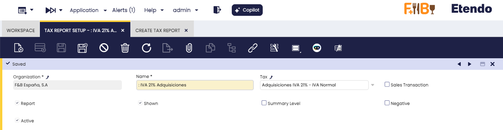
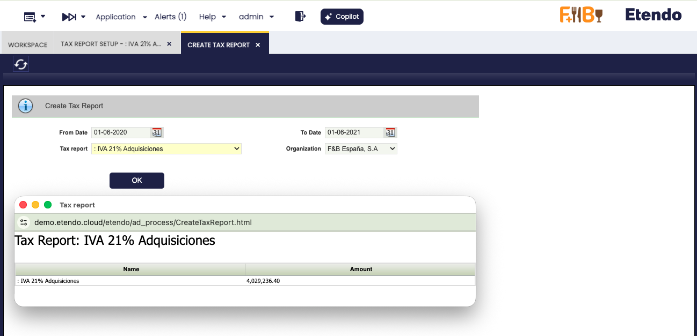

---
tags:
  - Etendo
  - Financial Management
  - Accounting
  - Tax Report
  - Financial Reports
---

# Create Tax Report

## Overview

A Tax Report summarizes the tax amounts collected or paid during a period — for example, sales VAT collected or purchase VAT paid.

Working with Tax Reports involves two sequential steps. First, define the report structure in **Tax Report Setup**: specify which taxes are included, whether the report covers sales or purchases, and how each line is displayed. Second, generate the report in **Create Tax Report**: select an organization and date range, then run the report to produce the output.

## Tax Report Setup

:material-menu: `Application` > `Financial Management` > `Accounting` > `Analysis Tools` > `Tax Report Setup`

Use this window to create or edit Tax Report definitions. Each definition controls which tax is reported, whether it covers sales or purchases, and how figures are displayed.

- **Name:** The label used to identify this report definition.
- **Tax:** The specific tax this report will cover (for example, VAT 21% or Import Duty). Select from the list of taxes already configured in your system.
- **Sales Transaction:** Check for a sales tax report; leave unchecked for a purchase tax report.
- **Report:** If checked, this Tax Report definition appears in the list on the Create Tax Report form and can be selected for generation. If unchecked, the definition is saved but not available for selection.
- **Shown:** If checked, this tax line appears as a visible row in the report output. If unchecked, the tax line still contributes to calculated totals but the individual row is hidden. Use this when a sub-total should appear without showing every line that feeds into it.
- **Summary Level:** Check this box only if this tax is a grouping category that contains sub-taxes underneath it (for example, a "VAT" parent that groups "VAT 10%" and "VAT 21%"). If the tax stands alone with no sub-taxes, leave this unchecked. If unsure, check the tax structure with your system administrator.
- **Negative:** If checked, the report is printed in negative values; otherwise, it is printed in positive values.
- **Active:** Controls whether this Tax Report definition is active. When unchecked, the definition is disabled and hidden from the system without being deleted. Uncheck this field to retire a definition without losing its configuration.

## Create Tax Report

:material-menu: `Application` > `Financial Management` > `Accounting` > `Analysis Tools` > `Create Tax Report`

Use this form to run a previously configured Tax Report for a specific organization and date range. Fill in the following fields:

- **From Date:** The first day of the reporting period.
- **To Date:** The last day of the reporting period.
- **Tax Report:** The report definition to run. The list shows all Tax Report definitions that have the **Report** flag enabled in Tax Report Setup.
- **Organization:** The company or branch for which the report is generated. In a multi-organization setup, select the correct legal entity for the tax period being reported.

Once the fields are filled in, click **OK** to generate the report. The report displays the tax amounts — broken down by the tax lines defined in Tax Report Setup — for the selected date range and organization. Use this output to verify that your tax totals match what you will submit to the tax authorities when settling taxes for the period.

---

This work is a derivative of [Financial Management](http://wiki.openbravo.com/wiki/Financial_Management){target="\_blank"} by [Openbravo Wiki](http://wiki.openbravo.com/wiki/Welcome_to_Openbravo){target="\_blank"}, used under [CC BY-SA 2.5 ES](https://creativecommons.org/licenses/by-sa/2.5/es/){target="\_blank"}. This work is licensed under [CC BY-SA 2.5](https://creativecommons.org/licenses/by-sa/2.5/){target="\_blank"} by [Etendo](https://etendo.software){target="\_blank"}.
