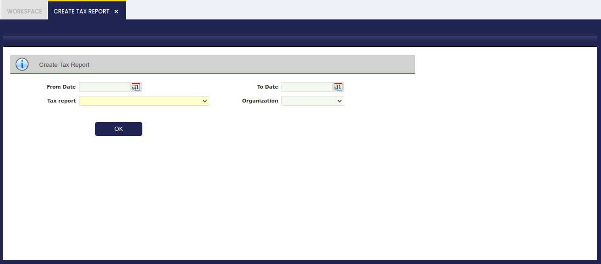
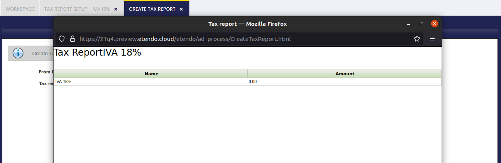

---
tags:
  - Etendo Classic
  - Financial Management
  - Accounting
  - Tax Report
  - Financial Reports
---

# Create Tax Report

:material-menu: `Application` > `Financial Management` > `Accounting` > `Analysis Tools` > `Create Tax Report`

## Overview

This form allows the user to generate a previously configured Tax Report for a selected organization and date range.

Before using this form, the tax report must be configured in the [Tax Report Setup](tax-report-setup.md) window.

## Create Tax Report

Fill in the following fields:

- **From Date:** Starting Date of the Report.
- **To Date:** Last Date of the Report.
- **Tax Report:** In this list, all Tax Reports created appear here for selection.
- **Organization:** The company or branch for which the report is generated. In a multi-organization setup, select the correct legal entity for the tax period being reported.

Once these fields are filled in, click the button to generate the report. The report displays the tax amounts — broken down by the tax lines defined in the Tax Report Setup — for the selected date range and organization.

---

This work is a derivative of [Financial Management](http://wiki.openbravo.com/wiki/Financial_Management){target="\_blank"} by [Openbravo Wiki](http://wiki.openbravo.com/wiki/Welcome_to_Openbravo){target="\_blank"}, used under [CC BY-SA 2.5 ES](https://creativecommons.org/licenses/by-sa/2.5/es/){target="\_blank"}. This work is licensed under [CC BY-SA 2.5](https://creativecommons.org/licenses/by-sa/2.5/){target="\_blank"} by [Etendo](https://etendo.software){target="\_blank"}.
