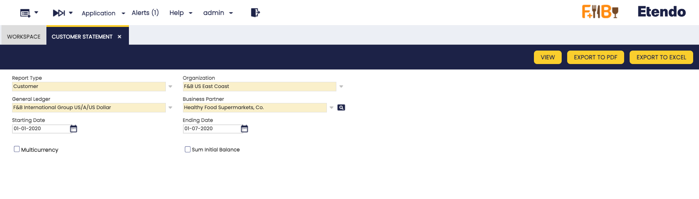
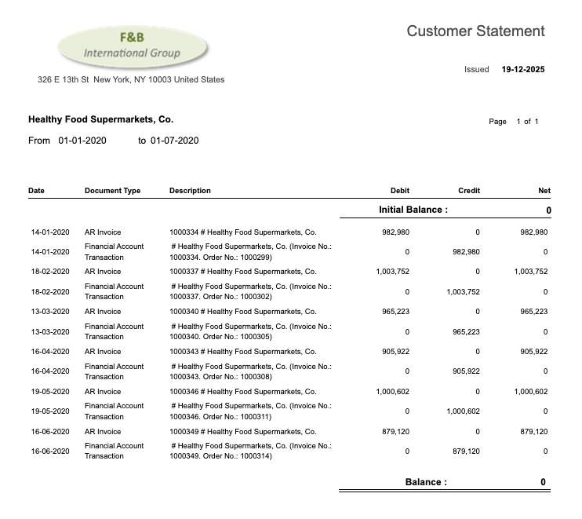

---
tags:
  - Etendo Classic
  - Financial Management
  - Accounting
  - Customer Statement
  - Financial Extensions
---

# Customer Statement

:material-menu: `Application` > `Financial Management` > `Accounting` > `Analysis Tools` > `Customer Statement`

!!! info
    This functionality is available starting from version **3.8.0** of the Financial Extensions Bundle, compatible with **Etendo 25.1**. To do that, follow the instructions from the marketplace: [Financial Extensions Bundle](https://marketplace.etendo.cloud/#/product-details?module=9876ABEF90CC4ABABFC399544AC14558){target="_blank"}. For more information about the available versions, core compatibility and new features, visit [Financial Extensions - Release notes](../../../../../whats-new/release-notes/etendo-classic/bundles/financial-extensions/release-notes.md).

!!! warning
    If you do not have the [Financial Extensions Bundle](https://marketplace.etendo.cloud/#/product-details?module=9876ABEF90CC4ABABFC399544AC14558){target="_blank"}, the report will remain in a legacy version with limited functionality.

## Overview

The **Customer Statement** is a consolidated report that displays all transactions of a business partner posted to the ledger over a specified period. This report provides a complete financial history of the business relationship, showing debits, credits, and running balances for each transaction.

This report can be generated for business partners configured as:

- **Customer**: Displays customer-related transactions (sales invoices, payments received, etc.).
- **Vendor**: Displays vendor-related transactions (purchase invoices, payments made, etc.).
- **Customer/Vendor**: Displays all transactions for business partners with both roles.

The report aggregates transactions from various sources including:

- Sales Invoices / Purchase Invoices
- Payment In / Payment Out
- Financial Transactions
- Reconciliations

!!! warning
    Only *Posted* transactions are included in the report. *Completed* but not *posted* transactions are not taken into consideration.

The Customer Statement provides the following information for each transaction:

- **Document Number**: Identification of the transaction.
- **Accounting Date**: Date when the transaction was posted.
- **Document Type**: Type of transaction (e.g., AR Invoice, AP Invoice, Financial Account Transaction).
- **Debit/Credit**: Financial amounts of each transaction.
- **Net Balance**: Accumulated balance calculated as \[Debit - Credit\] for each transaction, showing the running balance throughout the period.

!!! note
    Negative amounts are highlighted by using brackets ( ).

## Header

As shown in the image above, the following parameters can be configured:

- **Report Type**: Defines the type of report to generate. Options include:
    - **Customer**: Displays customer-related transactions.
    - **Vendor**: Displays vendor-related transactions.
    - **Customer/Vendor**: Displays all transactions for business partners with both roles. The report shows vendor and customer transactions separately, dividing them into distinct sections.
- **Organization**: The organization for which the statement will be generated.
- **General Ledger**: The general ledger associated with the selected organization.
- **Business Partner**: The business partner (customer, vendor, or both) for which to generate the statement.
- **Starting Date**: Starting date of the period to include in the report.
- **Ending Date**: Ending date of the period to include in the report.
- **Multicurrency**: 
    - **Unchecked** (default): Does not group records by currency and displays all amounts in the General Ledger currency.
    - **Checked**: Groups records by currency and displays original currency amounts. The report will be split by each different currency, each one with its initial and ending balance isolated from the rest.
- **Sum Initial Balance**: 
    - **Unchecked** (default): The report shows an Initial Balance at the beginning, then lists each transaction with its Net Balance. The Ending Balance equals the Initial Balance plus the final Net Balance.
    - **Checked**: The Initial Balance is aggregated into each transaction's Net Balance, making the final Ending Balance equal to the last Net Balance shown.

## Buttons

In the toolbar, you can find the following buttons to generate the report:

- **View**: Opens the report results in a new window for immediate visualization.
- **Export to PDF**: Generates a PDF version of the report that can be printed or stored.
- **Export to Excel**: Generates an Excel file of the report for further analysis or customization.

An example of the Customer Statement output:

---

This work is a derivative of [Financial Management](http://wiki.openbravo.com/wiki/Financial_Management){target="\_blank"} by [Openbravo Wiki](http://wiki.openbravo.com/wiki/Welcome_to_Openbravo){target="\_blank"}, used under [CC BY-SA 2.5 ES](https://creativecommons.org/licenses/by-sa/2.5/es/){target="\_blank"}. This work is licensed under [CC BY-SA 2.5](https://creativecommons.org/licenses/by-sa/2.5/){target="\_blank"} by [Etendo](https://etendo.software){target="\_blank"}.
