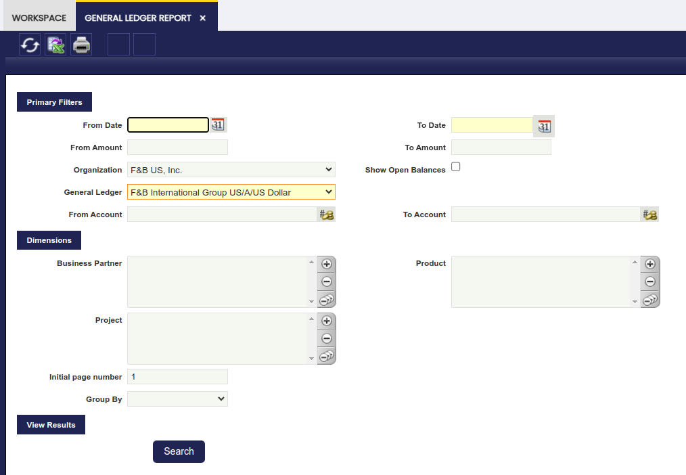
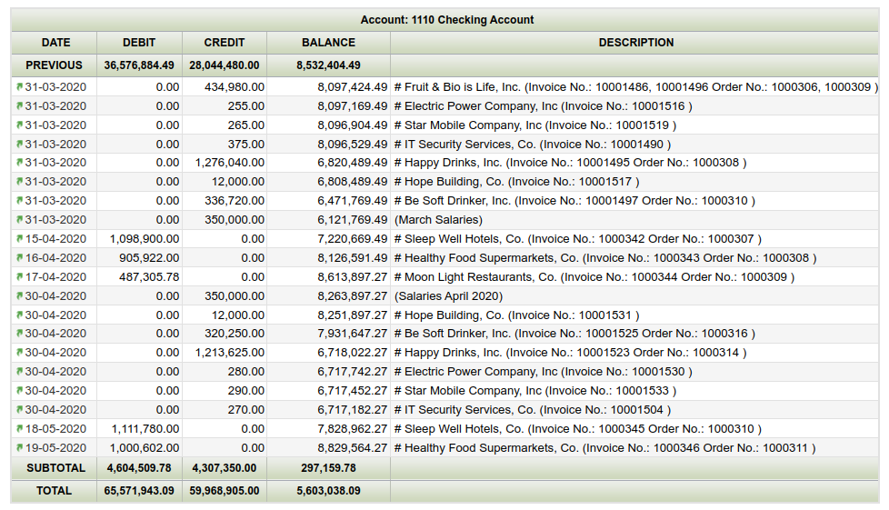

---
tags:
  - Etendo Classic
  - Financial Management
  - Accounting
  - General Ledger Report
  - Financial Reports
---

# General Ledger Report

:material-menu: `Application` > `Financial Management` > `Accounting` > `Analysis Tools` > `General Ledger Report`

## Overview

The General Ledger report lists every ledger "subaccount" and its debit and credit ledger entries within a given period of time.
   

As shown in the image above, the fields to fill in for launching this report are:

- the *"Organization"* for which the accounting information is required.  
    Once more, the accounting information provided by this report relies on the organization type selected as:
    - accounting information shown might be just related to a "Generic" organization belonging to a "legal Entity with Accounting"
    - or could be a roll-up in case of selecting either a "Legal Entity with Accounting" or an "Organization" having other organizations underneath.
- *"Show Open Balances"* option which will hide those entries for which the balance is zero. (Ex. removing receivables/payables entries from invoices once those have been paid.)
- and the corresponding *"General Ledger"* which will also rely on the Organization previously selected.

It is possible to narrow down the accounting information to be shown in the report by:

- a range of "*amounts*"
- a set of *"subaccounts"*
- and a set of *"accounting dimensions"* such as business partner, product and project

Finally, it is also possible to:

- *"group"* the information by any of the accounting dimensions
- and enter a *"Initial Page Number"* for the report

Once all data have been properly entered, the "Search" button shows the outcome of the report in the same window:

- the ledger entries displayed for each subaccount are ordered by accounting date and besides the subaccount balance is shown for each ledger entry.

The arrows in the toolbar allows the user to navigate through the report outcome shown in the window.

The General Ledger Report can also be viewed and saved in Excel format and PDF format:

- Excel format by pressing on the *"Export to Excel"* action button of the Toolbar:
    - This format contains a list of all the ledger entries per each subaccount not grouped, therefore it is possible to group them as desired.
    - It also lists the corresponding accounting dimensions of each ledger entry.
-   PDF format by pressing on the *"Print Record"* action button of the Toolbar:
    - This format includes an "Initial" balance of each subaccount, the "Subtotal" balance of each subaccount for the given period and calculates the "Total" balance of each subaccount.

---

This work is a derivative of [Financial Management](http://wiki.openbravo.com/wiki/Financial_Management){target="\_blank"} by [Openbravo Wiki](http://wiki.openbravo.com/wiki/Welcome_to_Openbravo){target="\_blank"}, used under [CC BY-SA 2.5 ES](https://creativecommons.org/licenses/by-sa/2.5/es/){target="\_blank"}. This work is licensed under [CC BY-SA 2.5](https://creativecommons.org/licenses/by-sa/2.5/){target="\_blank"} by [Etendo](https://etendo.software){target="\_blank"}.
