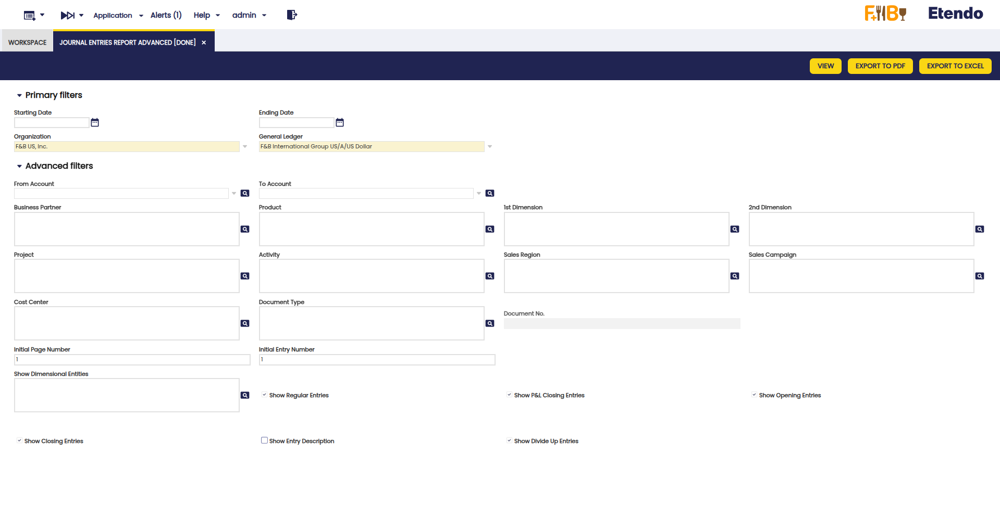
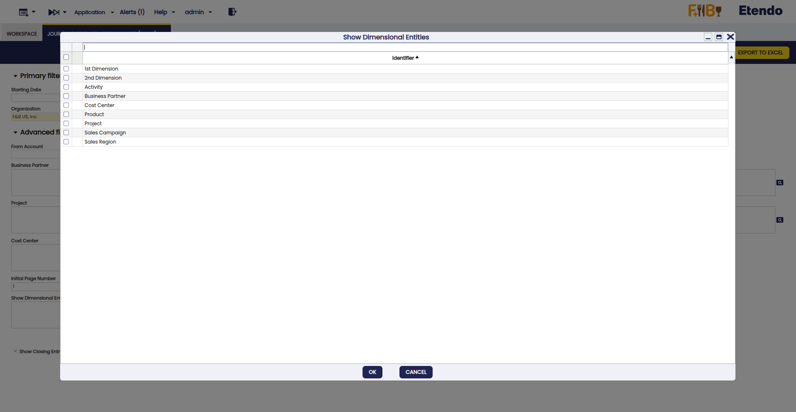
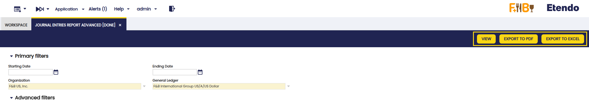
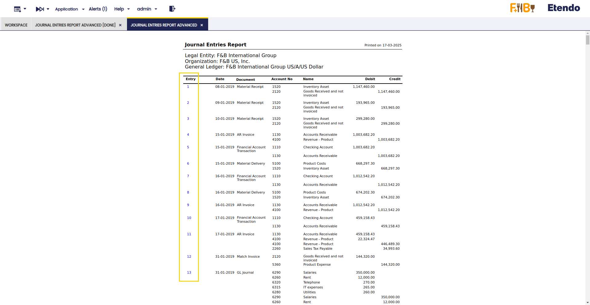

---
tags:
  - Etendo Classic
  - Financial Management
  - Accounting
  - Journal Entries Report
  - Financial Extensions
---

# Journal Entries Report Advanced

:material-menu: `Application` > `Financial Management` > `Accounting` > `Analysis Tools` > `Journal Entries Report Advanced`

<iframe width="560" height="315" src="https://www.youtube.com/embed/o5V3Op_qYtE?si=DnTJ77x6zSMZ5KrC" title="YouTube video player" frameborder="0" allow="accelerometer; autoplay; clipboard-write; encrypted-media; gyroscope; picture-in-picture; web-share" referrerpolicy="strict-origin-when-cross-origin" allowfullscreen></iframe>

!!! info
    To be able to include this functionality, the Financial Extensions Bundle must be installed. To do that, follow the instructions from the marketplace: [Financial Extensions Bundle](https://marketplace.etendo.cloud/#/product-details?module=9876ABEF90CC4ABABFC399544AC14558){target="_blank"}. For more information about the available versions, core compatibility and new features, visit [Financial Extensions - Release notes](../../../../../whats-new/release-notes/etendo-classic/bundles/financial-extensions/release-notes.md).

## Overview

This **Journal Entries Advanced** report is an enhanced version of the previous [Journal Entries Report](./journal-entries-report.md). Its purpose is to expand the filtering criteria, including all the existing accounting dimensions in the table Accounting Transaction Details.

In addition to the previous basic filters: Date from, Date to, Organization, General Ledger and the previous advanced filters: From account, To account, Document, Document N°, the following were added:

- Business Partner
- Product
- 1st Dimension
- 2nd Dimension
- Project
- Activity
- Sales Region
- Sales campaign
- Cost Center

The new **Show Dimensional Entities** field enables the selection of accounting dimensions to be included in the report.

After using the available fields and checkboxes, the report filters the transactions included in the selected dimensions, for the selected organization and general ledger and for a determined period, if necessary. In each filter, more than one option can be selected.

## Buttons

In the upper bar, you can find the buttons **View**, **Export to PDF** and **Export to Excel** to generate the report. In the case of the View option, a new window is opened with the corresponding report. In the other cases, the report is exported in PDF or Excel format.

!!!warning
    If the View or Export to PDF options are chosen, the limit of dimensions to be included is 4 to avoid visualization issues. This is not the case with Export to Excel, in which case you can choose any number of dimensions.

Also, with this functionality you can navigate to the related transaction directly from the entry number of reports. This improves traceability and streamlines accounting analysis. 

---

This work is a derivative of [Financial Management](http://wiki.openbravo.com/wiki/Financial_Management){target="\_blank"} by [Openbravo Wiki](http://wiki.openbravo.com/wiki/Welcome_to_Openbravo){target="\_blank"}, used under [CC BY-SA 2.5 ES](https://creativecommons.org/licenses/by-sa/2.5/es/){target="\_blank"}. This work is licensed under [CC BY-SA 2.5](https://creativecommons.org/licenses/by-sa/2.5/){target="\_blank"} by [Etendo](https://etendo.software){target="\_blank"}.
