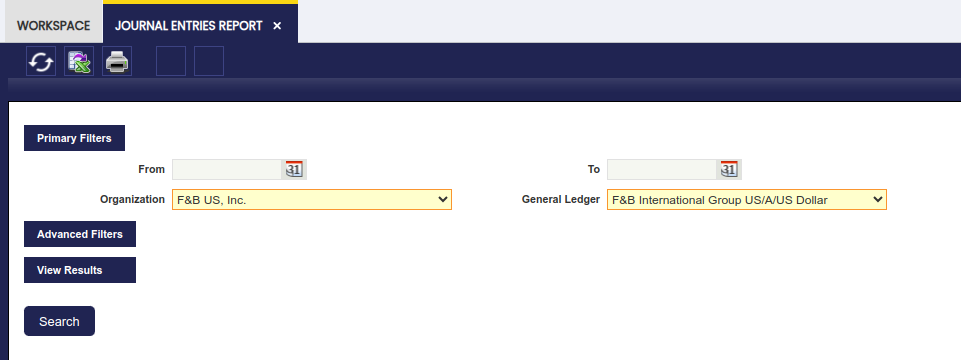
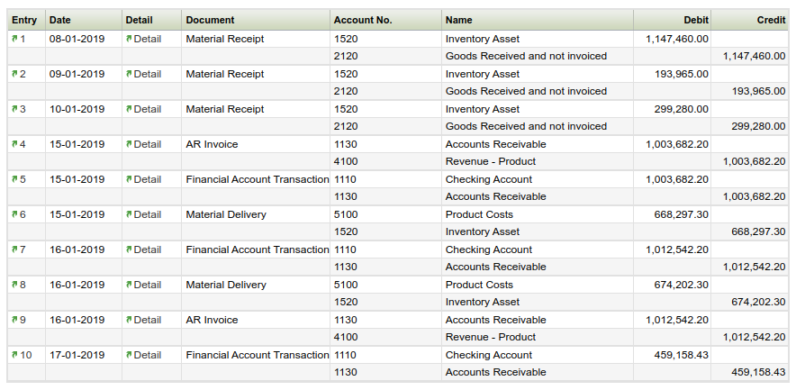

---
tags:
  - Etendo Classic
  - Financial Management
  - Accounting
  - Journal Entries Report
  - Financial Reports
---

# Journal Entries Report

:material-menu: `Application` > `Financial Management` > `Accounting` > `Analysis Tools` > `Journal Entries Report`

## Overview

The Journal Entries Report is a list of all the journal vouchers of an organization and general ledger shown in a chronological order.

A journal entry is the recording of financial data in a journal voucher such that the debit equals credit and the debits are entered before the credits.

As shown in the image above, the "Primary Filters" section allows the user to specify:

-   the "*Organization*" and the "*General Ledger*" for which the financial data taken from the journal entries is required.

The "Advanced Filters" is now a collapsible section. Under this section, it is possible to specify:

- a **From/To Account** to display journal entries with at least one line using an account defined in the range.
- a Document Type to narrow down the financial data to be shown in the report to just the one related to that particular document type.
    - If the document type selected has a document number associated, for instance an invoice document type, it will be possible to narrow down the data shown to a specific "**Document Number**".
- the "**Initial Page Number**" *to be shown in the PDF format of the report*
- the **"Initial Entry Number"** to be shown in the PDF format of the report
- the **"Entry Description**" to be shown in the PDF format of the report

The rest of the checkboxes are selected by default in order to show:

- the *"**regular**"* journal entries:
    - these entries are the ones generated while posting either any of the Etendo document types or while posting a General Ledger Journal do not flag as "Opening".
- the *"**opening**"* journal entries:
    - these entries are automatically generated by Etendo after the closing of a given fiscal year
    - these entries can also be manually generated while posting a General Ledger Journal whenever its journal entries are flagged as "Opening".
- the "**closing**" journal entries:
    - these entries are automatically generated by Etendo after the closing a given fiscal year
- and finally the *"**P&L closing**"* journal entries:
    - these entries are automatically generated by Etendo after the closing of a given fiscal year

Finally, and same way as for the rest of financial reports, the Journal Entries Report can be launched in:

- *HTML* format. An example of the HTML output:

- *PDF* format by using the "Print Record" action button of the Toolbar
- or *XML* format by using the "Export to Excel" action button of the Toolbar.

---

This work is a derivative of [Financial Management](http://wiki.openbravo.com/wiki/Financial_Management){target="\_blank"} by [Openbravo Wiki](http://wiki.openbravo.com/wiki/Welcome_to_Openbravo){target="\_blank"}, used under [CC BY-SA 2.5 ES](https://creativecommons.org/licenses/by-sa/2.5/es/){target="\_blank"}. This work is licensed under [CC BY-SA 2.5](https://creativecommons.org/licenses/by-sa/2.5/){target="\_blank"} by [Etendo](https://etendo.software){target="\_blank"}.
