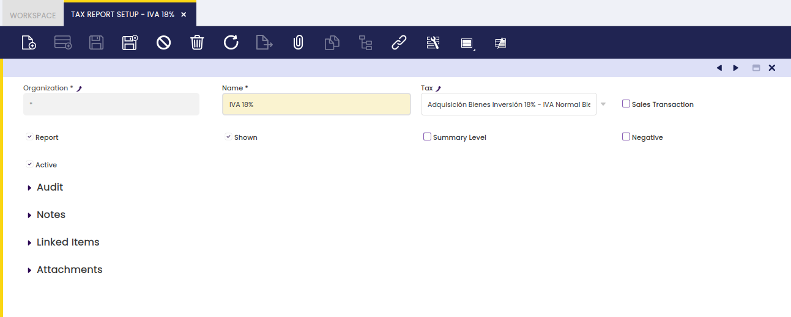
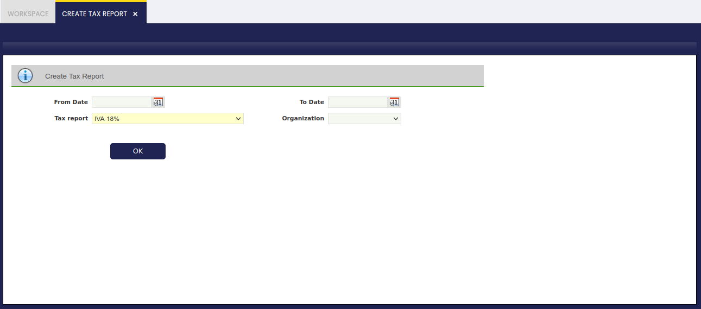
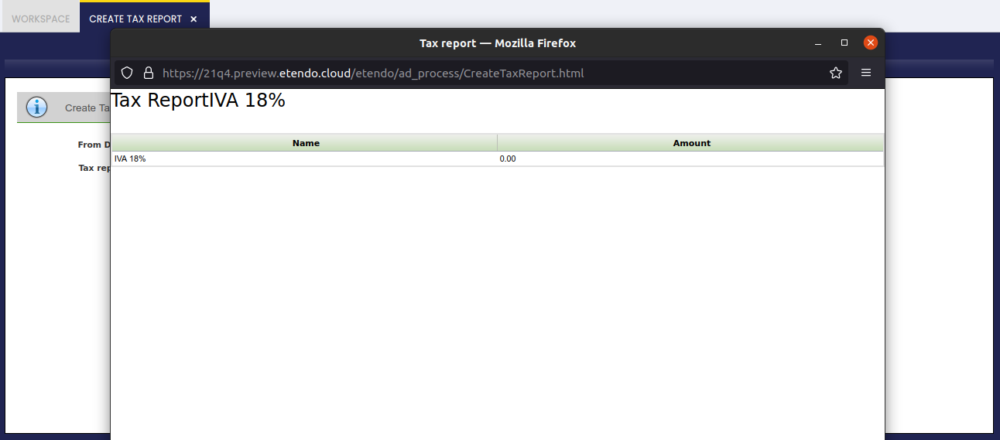

---
tags:
  - Etendo Classic
  - Financial Management
  - Accounting
  - Tax Report Setup
  - Financial Reports
---

# Tax Report Setup

:material-menu: `Application` > `Financial Management` > `Accounting` > `Analysis Tools` > `Tax Report Setup`

## Overview

Etendo allows the user to create different Tax Reports according to the user's specific needs.

In order to explain the use of this process, it is necessary to understand the window Tax Report Setup.

##### Tax Report Setup

This window allows the user to create or modify different Tax Reports for the different existing taxes. In the following lines, it will be explained how to create a new Tax Report:

The window has some parameters to indicate the Tax Report created:

- **Name:** The name of the Report.
- **Tax:** The tax that will be shown in the report.
- **Sales Transaction:** Checked if it's a Sales Tax Report, unchecked if it's a Purchase Tax Report.
- **Report:** If checked, it will appear in the Create Tax Report form to be chosen.
- **Shown:** If checked, it will appear in the Create Tax Report form to be chosen.
- **Summary Level:** If it is checked, the tax rate is defined as a parent tax that has dependent taxes: the child taxes. If a tax is not going to have any "children," it should not be checked as summary.
- **Negative:** If checked, the report will be printed in negative values, otherwise, it will be printed in positive values.
- **Active:** If it is an active Tax Report.

Once, the Tax Report has been set up, it will appear in the Create Tax Report form:

##### **Create Tax Report**

This window allows to print Reports previously defined by the user. In order to print the Report, it is necessary to fill a few fields:

- **From Date:** Starting Date of the Report
- **To Date:** Last Date of the Report
- **Tax Report:** In this list, all the Tax Reports created will appear to be chosen.
- **Organization:** Organization for which the Report will be printed.

Once these fields have been introduced, it will be possible to print the Report that will show the amount during those dates.

---

This work is a derivative of [Financial Management](http://wiki.openbravo.com/wiki/Financial_Management){target="\_blank"} by [Openbravo Wiki](http://wiki.openbravo.com/wiki/Welcome_to_Openbravo){target="\_blank"}, used under [CC BY-SA 2.5 ES](https://creativecommons.org/licenses/by-sa/2.5/es/){target="\_blank"}. This work is licensed under [CC BY-SA 2.5](https://creativecommons.org/licenses/by-sa/2.5/){target="\_blank"} by [Etendo](https://etendo.software){target="\_blank"}.
