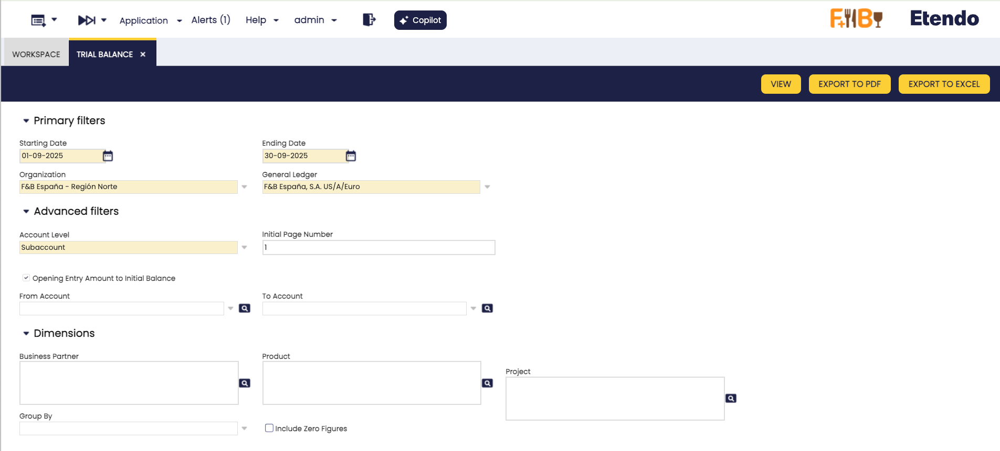
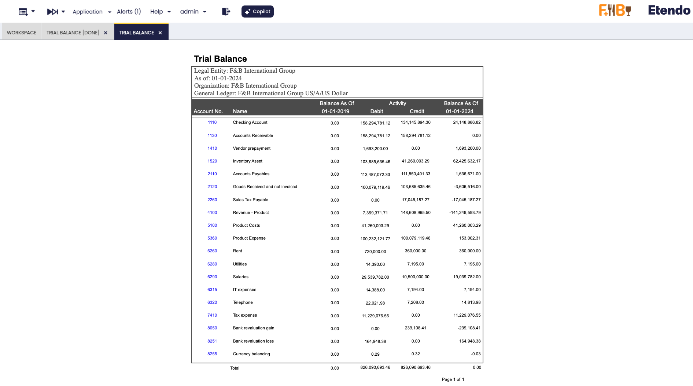
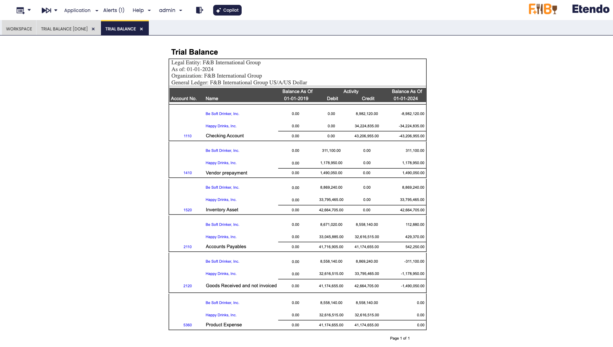

---
tags:
  - Etendo Classic
  - Financial Management
  - Accounting
  - Trial Balance
  - Financial Extensions
---

# Trial Balance

:material-menu: `Application` > `Financial Management` > `Accounting` > `Analysis Tools` > `Trial Balance`

<iframe width="560" height="315" src="https://www.youtube.com/embed/o5V3Op_qYtE?si=DnTJ77x6zSMZ5KrC" title="YouTube video player" frameborder="0" allow="accelerometer; autoplay; clipboard-write; encrypted-media; gyroscope; picture-in-picture; web-share" referrerpolicy="strict-origin-when-cross-origin" allowfullscreen></iframe>

!!! info
    To be able to include this functionality, the Financial Extensions Bundle must be installed. To do that, follow the instructions from the marketplace: [Financial Extensions Bundle](https://marketplace.etendo.cloud/#/product-details?module=9876ABEF90CC4ABABFC399544AC14558){target="_blank"}. For more information about the available versions, core compatibility and new features, visit [Financial Extensions - Release notes](../../../../../whats-new/release-notes/etendo-classic/bundles/financial-extensions/release-notes.md).

!!! warning
    If you do not have the [Financial Extensions Bundle](https://marketplace.etendo.cloud/#/product-details?module=9876ABEF90CC4ABABFC399544AC14558){target="_blank"}, the report will remain in a legacy version with limited functionality. You will not be able to navigate directly to the General Ledger from the Business Partner when the report is grouped by this dimension, and the interface improvements and improved options for exporting the report to Excel and PDF will not be available.

## Overview

The **Trial Balance** verifies that the total debits equal the total credits.

Although it is usually run at the end of a period before preparing the Balance Sheet and Income Statement, in Etendo it can be generated at any time.

For a selected **Organization** and **General Ledger**, the report shows:

- The account balance at the starting date
- The total debits within the selected period
- The total credits within the selected period
- The account balance at the ending date

At the bottom of the report, the **total debits must equal the total credits**.

## Header

Key fields to note:

### Primary Filters

- **Starting Date**: The date from which the account balance is taken.
- **Ending Date**: The date up to which the account balance is calculated, using the formula:  
  `Balance as of Ending Date = Balance as of Starting Date + Total Debits − Total Credits`
- **Organization**: The organization for which the Trial Balance is generated. It can be run for:
    - **Legal with Accounting** organization type.
    - **Generic** organization type, which must belong to a *Legal with Accounting* organization. These organizations inherit the general ledger of the legal entity they belong to and can post transactions.
    - **Organization** type entities, which may share a general ledger across multiple organizations that belong to them. While this type cannot post transactions directly, the Trial Balance summarizes the accounting information of all related organizations that share the same general ledger.
- **General Ledger**: The general ledger associated with the selected organization.

### Advanced Filters

This section provides additional options to refine the Trial Balance report:

- **Account Level**: Defines the level of detail to display in the report. Options include:

    - **Heading**
    - **Account**
    - **Breakdown**
    - **Subaccount** (default)
    
    !!! info 
        By default, the report is generated at the **Subaccount** level. This ensures that for each subaccount in the account tree, the total debits equal the total credits.

- **Initial Page Number**: Sets the page number where the report starts. Useful when integrating this report into larger documents.

- **Opening Entry Amount to Initial Balance**: This option is selected by default. It controls how the opening balance (e.g., January 1, 2021) is displayed in the report:

    - For liability accounts with a negative opening balance, the amount can appear either in the **Balance As Of** column or in the **Credit** column.
    - For asset accounts with a positive opening balance, the amount can appear either in the **Balance As Of** column or in the **Debit** column.

    !!! note
        This setting only applies if the report's **From Date** matches the opening accounting date (e.g., January 1, 2021). Otherwise, the opening balance is always shown in the **Balance As Of** column.

- **From Account / To Account**: Allows you to specify a range of subaccounts to include in the report (only available when the account level is set to *Subaccount*).

### Dimensions

You can refine the Trial Balance report by selecting additional **Dimensions**, such as:

- **Business Partner**
- **Product**
- **Project**

These dimensions are recorded when transactions are posted to the ledger. Transactions are always linked through subaccounts.

- **Group By**: Lets you group the report by a specific dimension. Available options are *Business Partner*, *Product*, and *Project*.  
  For example, if you select *Business Partner*, the report will display results grouped by each partner, and you can directly navigate to that partner's General Ledger from the report.

- **Include Zero Figures**: When enabled, the report displays all subaccounts, including those with zero balances.

## Buttons

- **View**: Opens the report results in a new window. From there, you can navigate directly to the General Ledger:
  
    - By clicking the Account Number of each subaccount.
    - Or, if the report is grouped by Business Partner, by clicking the partner's name to access their General Ledger view.

    <figure markdown="span">
        
        <figcaption>Example of the report output not gruped</figcaption>
    </figure>

    <figure markdown="span">
        
        <figcaption> Example of the report grouped by Business Partner</figcaption>
    </figure>

    In both cases, links are available to **navigate directly to the General Ledger**.

- **Export to PDF**: Generates a PDF version of the report. This file can be printed or stored for later review. The PDF output respects the same grouping rules applied in the search.

- **Export to Excel**: Generates an Excel file of the report. The exported file also follows the same grouping rules applied in the search.

---

This work is a derivative of [Financial Management](http://wiki.openbravo.com/wiki/Financial_Management){target="\_blank"} by [Openbravo Wiki](http://wiki.openbravo.com/wiki/Welcome_to_Openbravo){target="\_blank"}, used under [CC BY-SA 2.5 ES](https://creativecommons.org/licenses/by-sa/2.5/es/){target="\_blank"}. This work is licensed under [CC BY-SA 2.5](https://creativecommons.org/licenses/by-sa/2.5/){target="\_blank"} by [Etendo](https://etendo.software){target="\_blank"}.
