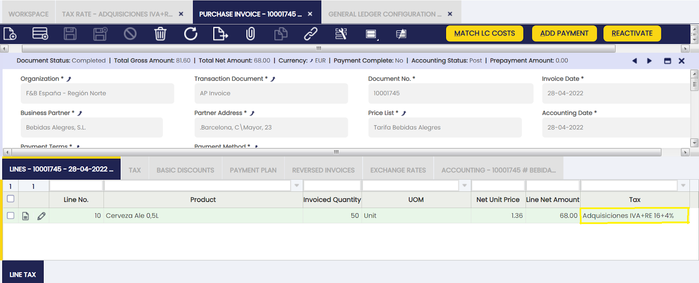

## Overview

This section describes the windows that are necessary to configure the accounting functionalities of Etendo. The corresponding windows are:

[:material-file-document-outline: Open/Close Period Control](#openclose-period-control){ .md-button .md-button--primary }  

[:material-file-document-outline: Financial Type](#financial-type){ .md-button .md-button--primary }  

[:material-file-document-outline: Period Control Log](#period-control-log){ .md-button .md-button--primary }  

[:material-file-document-outline: Account Tree](#account-tree){ .md-button .md-button--primary }  

[:material-file-document-outline: General Ledger Configuration](#glconfig){ .md-button .md-button--primary }  

[:material-file-document-outline: Fiscal Calendar](#fiscal-calendar){ .md-button .md-button--primary }  

[:material-file-document-outline: Account Combination](#account-combination){ .md-button .md-button--primary }  

[:material-file-document-outline: Accounting Process](#accounting-process){ .md-button .md-button--primary }  

[:material-file-document-outline: G/L Item](#gl-item){ .md-button .md-button--primary }  

[:material-file-document-outline: G/L Category](#gl-category){ .md-button .md-button--primary }  

[:material-file-document-outline: Document Type](#document-type){ .md-button .md-button--primary }  

[:material-file-document-outline: Document Sequence](#document-sequence){ .md-button .md-button--primary }  

[:material-file-document-outline: Tax Category](#tax-category){ .md-button .md-button--primary }  

[:material-file-document-outline: Business Partner Tax Category](#business-partner-tax-category){ .md-button .md-button--primary }  

[:material-file-document-outline: Tax Rate](#tax-rate){ .md-button .md-button--primary }  

[:material-file-document-outline: Cost Center](#cost-center){ .md-button .md-button--primary }  

[:material-file-document-outline: ABC Activity](#abc-activity){ .md-button .md-button--primary }  

[:material-file-document-outline: Accounting Templates](#accounting-templates){ .md-button .md-button--primary }  

[:material-file-document-outline: Balance Sheet and P/L Structure Setup](#balance-sheet-and-pl-structure-setup){ .md-button .md-button--primary }  

## Open/Close Period Control

:material-menu: `Application` > `Financial Management` > `Accounting` > `Setup` > `Open/Close Period Control`

### Overview

The **Open/Close Period Control** feature allows the user to manage which accounting periods are open or closed for a certain organization.

Before using this window, ensure that:

- [x] Your organization has a **[Fiscal Calendar](#fiscal-calendar)** defined.
- [x] The fiscal calendar contains **Years** and **Periods** (typically monthly).
- [x] The organization's type is **Legal with Accounting** and has **[Allow Period Control](../../general-setup/enterprise-model.md#organization-1)** enabled.

Here’s how the process works in Etendo:

1. **Create years and periods** in the [Fiscal Calendar](#fiscal-calendar) window.
2. **Open all periods** (including the "13th Period" for adjustments) in the Open/Close Period Control window.
3. **Close standard periods** (except the 13th Period) once all transactions for those periods are posted.

    !!!note
        Closing standard periods before running [Close Year](../accounting/transactions.md#end-year-close) process is recommended for better monitoring but not required.

4. **Post any final adjustments** in the 13th Period using G/L Journals.
5. **Run the [Close Year](../accounting/transactions.md#end-year-close) process** in the End Year Close window. This creates closing entries and permanently closes all periods for the year.  

    !!!warning
        Permanently closed periods can’t be reopened unless you run Undo Close Year first.

6. If needed, **run [Undo Close Year](../accounting/transactions.md#undo-close-year)** to reopen periods and allow further changes. After making changes, you can run Close Year again.

!!!important
    - You can’t create years or periods in the Open/Close Period Control window—use the Fiscal Calendar window for that.
    - You can’t generate closing entries here—use the End Year Close window.
    - You can also check the status of any period in the [Period Control](../../general-setup/enterprise-model.md#period-control) tab of the Organization.

#### Why Use this Feature?

Using period control helps the user:

- Track financial activity by controlling which periods are open for posting.
- Prevent unwanted changes to closed periods.
- Manage closing entries during year-end processes.

### Period Control

The **Open/Close Period Control** window allows the user to revise and manage all accounting periods created in the [Fiscal Calendar](#fiscal-calendar). You can **open**, **close**, or **permanently close** periods as needed for your organization.

**Fields to note:**

- **Status:** Shown in two columns—one with a color code, one with the status name. Statuses include:
    - *All Never Opened* (gray): Newly created periods.
    - *All Opened* (green): All document types are open.
    - *All Closed* (red): All document types are closed.
    - *Mixed* (orange): Some document types are open, others are closed.
    - *All Permanently Closed* (red): All document types are permanently closed.
- **Calendar:** Shows the organization’s calendar (read-only).
- **Organization**
- **Year**
- **Period No.**
- **Name:** Name of the period.
- **Starting Date:** When the period begins.
- **Ending Date:** When the period ends.

You can use these fields to filter and find the periods you need. For example, filter by calendar, organization, and year to see all periods for a specific year.

**Default Filters:** 

By default, this window only shows periods that:

- Are **not** closed.
- Belong to the organization you’re logged into.

    !!!info
        Remember you can remove these filters by clicking the funnel icon.

**Available Buttons:**

- **Open Period:** Allows posting in the period(s).
- **Close Period:** Blocks posting in the period(s). You can reopen a closed period if needed.

    !!!info
        It is possible to select multiple records to open or close periods in bulk.

    !!!important 
        - Only periods for "Legal with Accounting" organizations with "Allow Period Control" enabled can be opened or closed. 
        - If a period is open for all document types except one (e.g., AP Invoice), you can post all transactions except for that document type in that period.

#### Period Control Example

Here’s a simple example of how period control works:

An organization has created and opened all periods for three years, including the "13th Period" for adjustments.

With the setup shown above, you can post any document to any period within those years. If you try to post to a period that doesn’t exist (like December 2018, in this example), Etendo will show an error.

Imagine you want to close the year 2019. Before running the "Close Year" process, you should close all standard periods for 2019 (except the 13th Period) to prevent further postings. Here’s how:

1. Go to the **Open/Close Period Control** window.
2. Filter by Calendar, Organization, and Year (e.g., 2019) to show the corresponding periods.
3. You should see all 13 periods for the year.
4. Select all periods except the 13th Period.
5. Click **Close Period** and confirm.

After this, all standard periods for 2019 are closed. You can only:

- Post G/L Journals in the 13th Period.
- Post closing entries created by the Close Year process.

!!!important
    If you need to make changes in a closed period, you must reopen it, which is only possible if the year is not permanently closed; otherwise, run Undo Close Year first.

### Documents Tab

Each accounting period in Etendo can be opened or closed for all document types at once, or for specific document types.

- When you open a period, all document types for that period are opened, so you can post any kind of transaction.
- You can also open or close individual document types (like AP Invoice or G/L Journal) within a period.

This is useful in case the user needs to prevent the creation of further documents of a certain type for a specific period.

**Status columns:**  
Each document type shows its status with a color and a name:

- **Never Opened** (gray): Not yet opened.
- **Open** (green): Posting is allowed.
- **Closed** (red): Posting is blocked.
- **Permanently Closed** (red): Locked; can only be reopened by undoing the year close.

!!!important
    - The 13th Period only allows G/L Journal entries.
    - If a period is open for all document types except one (for example, AP Invoice), you can post all transactions except for that type.

**How to open or close a document type in a period:**

1. Select a period in the Periods tab.
2. Go to the Documents tab to see all document types for that period.
3. Use filters to find the document types you want.
4. Select the document types.
5. Click **Open/Close Period**, choose the action, and click OK.

Etendo will confirm when the process is complete.

## Financial Type

:material-menu: `Application` > `Financial Management` > `Accounting` > `Setup` > `Financial Type`

!!! info
    To be able to include this functionality, the Financial Extensions Bundle must be installed. To do that, follow the instructions from the marketplace: [Financial Extensions Bundle](https://marketplace.etendo.cloud/#/product-details?module=9876ABEF90CC4ABABFC399544AC14558){target="_blank"}. For more information about the available versions, core compatibility and new features, visit [Financial Extensions - Release notes](../../../../../whats-new/release-notes/etendo-classic/bundles/financial-extensions/release-notes.md).

### Overview

In this window, the user can configure the different options to use in the Financial Type Configuration window.

!!! info
    For more information, visit [Financial Type Configuration](../../financial-management/accounting/transactions.md#financial-type-configuration).

#### How to install the Financial Type dataset
 
Go to the Enterprise Module Management window and select the organization needed to import the date by default. Then, check the dataset called "Banking Pool" and click the OK button. 

The information imported from the Financial Type window is shown. 

## Period Control Log

:material-menu: `Application` > `Financial Management` > `Accounting` > `Setup` > `Period Control Log`

### Overview

This window shows the log for period control.

The periods of a year can be opened, closed and permanently closed. The **Period Control Log** Window shows all the Openings and Closings of the Periods that had taken place in the application, therefore it can be used to understand how the Status of a Period has changed over time.

When a Period is Open or Closed through the Open/Close Period Control Window, or has been permanently Closed as a result of the closing of a Year through the End Year Close Window, a record is created in the Period Control Log.

For example, this screenshot shows the Period Control Log for an Organization that has opened all of its Periods for the Year 2019:

As shown in the image above, the main fields in this Window are:

-   Organization.
-   Calendar.
-   Year.
-   Period. The starting Period from which the Period Action is going to be performed (usually matches the Until Period)
-   Until Period. The ending Period to which the Period Action is going to be performed (usually matches the Period)
-   Period Action. The action that has taken place. It can be Open Period, Close Period or Permanently Close Period.
-   Document Category. If the Period Action has been done only for Document Type, it will be shown here. This means that the Period Action has affected only the shown Document Type for that Period, not all the other Document Types, which remains in the same status as before.

## Account Tree

:material-menu: `Application` > `Financial Management` > `Accounting` > `Setup` > `Account Tree`

### Overview  

An **account tree** represents the **Chart of Accounts (CoA)** of an organization. The CoA is the list of accounts used in the general ledger, including assets, liabilities, income, and expenses.  

Etendo provides several ways to configure a CoA based on the organization’s accounting needs. CoAs can follow country-specific requirements, be translated into different languages, and adapted to fit the company’s practices.  

The **Account Tree window** lets users:  

- **Review and manage** a chart of accounts imported from a CoA module.  
- **Create and customize** a new chart of accounts from scratch if needed.  

### Account Tree Configuration

Etendo offers different options for CoAs configuration: 

- **Install a location module or a generic plan**: Some countries such as Spain or France require that a specific chart of accounts is used in the statutory books, therefore the authorities can see the same list of accounts and the same level of detail in the P&L and Balance Sheet. In other hand, some countries such as the USA do not require that specific level of detail.

    !!!info 
        In the case of Spain, Etendo provides a [Localization Bundle](../../../optional-features/bundles/spain-localization/overview.md) which includes the Statutory Chart of Accounts.

        For instance, the Spanish Localization Bundle includes:

        -   the [General Spanish CoA](../../../optional-features/bundles/spain-localization/overview.md#chart-of-accounts-pgc-2007-general).
        -   the [PYMES Spanish CoA](../../../optional-features/bundles/spain-localization/overview.md#chart-of-accounts-pgc-2007-pymes).

    Each organization can **define the chart of accounts that best suits their practices**. In that case, Etendo provides a **Generic Chart of Accounts module** which delivers a standard list of accounts which can be evolved for the organization's needs. After installation, the generic Chart of Accounts is available for selection during the [Initial Client Setup](../../../../../developer-guide/etendo-classic/how-to-guides/how-to-run-an-initial-client-setup-process.md) and the [Initial Organization Setup](../../../basic-features/general-setup/enterprise-model.md#initial-organization-setup).

- **Import a CSV file with the account tree structure**: You can import a CSV file that defines the account tree structure during the [Initial Client Setup](../../../../../developer-guide/etendo-classic/how-to-guides/how-to-run-an-initial-client-setup-process.md) or [Initial Organization Setup](../../../basic-features/general-setup/enterprise-model.md#initial-organization-setup) if the **Include Accounting** checkbox is selected. In that case, you will be prompted to choose the CSV file (accounting file).   

    This process creates:

    - The organization’s **Account Tree** (Chart of Accounts).
    -  Default [General Ledger configuration](#general-ledger-configuration).  

    !!! info
        As explained in the [How to Create a Chart of Accounts Module](../../../../../developer-guide/etendo-classic/how-to-guides/how-to-create-a-chart-of-accounts-module.md) guide, a **Chart of Accounts module** basically contains the **CSV file** with the account tree structure.

- **Create the CoA manually**: a chart of accounts can also be [created manually](../../../how-to-guides/how-to-create-an-account-tree.md), if this is the case, it is recommended to start from a sample CoAs like the generic one and evolve it for the company’s needs rather than starting from scratch.

    !!! tip
        
        - If a Chart of Accounts module or an accounting CSV file is installed and selected at **Client Level** through the [Initial Client Setup](../../../../../developer-guide/etendo-classic/how-to-guides/how-to-run-an-initial-client-setup-process.md) process, it can be shared by any organization available in the client.
        
        - If a Chart of Accounts module is installed and then selected at **organization level** through the [Initial Organization Setup](../../../basic-features/general-setup/enterprise-model.md#initial-organization-setup) process, the chart of accounts automatically created is linked to the organization being created.

### Account Tree Window

The Account Tree main header allows creating the organization's account type and then define the Chart of Accounts. 

#### Element Value Tab

The **Element value** tab lists every chart of account elements from the chart of accounts headings to the subaccounts.

Every **Chart of Accounts** in Etendo contains different types of elements organized into the following hierarchy:

-   **Heading**, **Breakdown** and **Account** elements help to structure the CoAs in a way that the financial reports can be produced based upon that structure.

    - Heading: Main heading (e.g., Balance Sheet, Assets).

    - Breakdown: Groups within a heading (e.g., Current Assets).

    - Account: General account (e.g., Cash, Customers).

-   **Subaccount** element allows the user to post the transactions to the ledger.

    - Subaccount: Lowest level, where transactions are recorded (e.g., Petty Cash, Bank X).

Besides, it is well-known that every account, subaccount in Etendo terms, needs to be included in a financial statement:

-   **Asset**, **Liability** and **Owner's Equity** account types need to be included in the Balance Sheet
-   **Expense** and **Revenue** account types need to be included in the Profit & Loss.

!!! tip
    The best way to understand how a chart of accounts is captured in Etendo is by pressing the **Tree** icon   which can be found in the toolbar once the user is in the Element Value tab.

The Tree icon opens a new window which shows one **tree branch** per financial statement:

-   Balance Sheet
-   Profit & Loss
-   Temporary default accounts: This branch of the account tree gathers temporary defaults accounts which are not ledger accounts.

Besides, each tree branch contains several elements inside structured in a hierarchical way, for instance:

-   Balance Sheet branch is split into:
    -   Assets
    -   Liabilities and Owner's Equity

As shown in the image above **Assets** is also split into:

-   Current Assets
-   Long term Assets
-   Accumulated Depreciation

Same way **Equity** is also split into several accounts, in Etendo terms **subaccounts**, such as **Capital Stock** or **Retained Earnings**.

Back to the **Element Value** tab, there are several **basic fields** which help to define each chart of account element:

-   The **Search Key** and the **Name** identifies the chart of account element.
    -   The search key can either be a single letter, a word or a number, however it is important to be aware that the Search key field is the field that Etendo uses while helping the user to create an [account tree element](#balance-sheet-elements).
-   The **Account Sign** field is only shown and therefore editable if the general ledger configuration linked to the account tree is [NOT set as Centrally Maintained](#general-ledger-configuration).  
    In that case, the account sign of each account tree element defines how the balance of that account is going to be shown in the financial statements:
    -   If the account sign of an account tree element is **Debit**, the balance of that account will then be shown as **(Debit - Credit)**.
        -   **Asset** accounts type are normally set as **Debit**, therefore its debit balance is shown as **positive** in the Balance Sheet.  
            In the same way, its credit balance is then shown as negative in the Balance Sheet.
    -   If the account sign of an account tree element is **Credit**, the balance of that account will then be shown as **(Credit - Debit)**.
        -   **Liability** account types are normally set as **Credit**, therefore its credit balance is shown as **positive** in the Balance Sheet. Same applies to the **Owner's Equity** account type.
        -   **Revenue** account types are set as **Credit**, therefore its Credit balance is shown as **positive** in the P&L report.
        -   **Expense** account types are set as **Credit**, therefore its Debit balance is shown as **negative** in the P&L report.
-   **Element Level**. As already mentioned, there are four types of elements which help to structure a chart of accounts in a way that the financial reports can be produced right away based upon the chart of accounts structure.  
    It is important to remark that it is not mandatory to use the four elements but just the ones which help us to properly structure the Chart of Accounts,  
    having into account that the lowest one Subaccount is the only mandatory one because ledger entries are posted to the ledger through the subaccounts.  
    The four element types are:
    -   **Heading** - the elements B - Balance Sheet and 1000-Assets are heading type elements because those are at the top ones having other elements underneath.
    -   **Breakdown** - the element 1100 - Current Assets and 1500 - Long-term Assets are a breakdown of the heading 1000-Assets.  
        Often, the assets and liabilities on a balance sheet are broken down into current assets and long-term assets. Breakdown element type helps us to define this kind of situations.
    -   **Account** - this level would help to split the element 1100 - Current Assets into 1110 - Cash, 1200 - Accounts Receivable, etc, as a way to distinguish between the different types of current assets.
    -   **Subaccount** - this level is the lowest level of detail. For instance, the account element 1110 - Cash can be split into the subaccounts 1120 - Checking Account and 1140 - Petty Cash subaccount to distinguish while posting to the ledger the transactions paid by check from the ones paid by petty cash.
-   **Account Type**. The options available are **Asset**, **Liability**, **Owner's equity**, **Revenue** and **Expense**.  
    **Asset**, **Liability** and **Owner's equity** account types are included in the Balance Sheet as well as in the balance sheet closing entry as described in the [Close Year](#openclose-period-control) article.  
    **Revenue** and **Expense** account types are included in the Income Statement as well as in the P&L closing entry as described in the [Close Year](#openclose-period-control) article.
-   **Summary Level** defines if an account tree element groups other levels underneath or not, therefore heading, account and breakdown levels can be marked as summary levels while subaccount should not. There can be heading elements which group other elements underneath, for instance the element 1000-Assets while there can be heading elements which do not need to group other elements underneath but [Customize Elements](#customized-elements), for instance the element 1900-Total Assets. The first type needs to be configured as **Summary Level**, the second type does not need to. Moreover:
    -   The amounts displayed in financial reports such as the Balance Sheet and the Income statement for a non-summary element is the sum of the debit and credit amounts posted to that account (subaccount).  
        The balance of that particular subaccount will then be shown as either positive or negative depending on its account sign or depending on what is centrally configured in the [General Ledger configuration](#general-ledger-configuration)
    -   The amounts displayed in financial reports such as the Balance Sheet and the Income statement for a summary element is the sum of the amounts of the elements underneath.  
        The balance of that summary element will then be shown as either positive or negative depending on its account sign or depending on what is centrally configured in the [General Ledger configuration](#general-ledger-configuration).

Additionally, there are other advanced fields which also help to configure more unusual scenarios. Those fields are:

-   The **Show Value Condition** field defines if a chart of account element balance is going to be shown and taken into account in financial reports or not. The options available are:
    -   **Algebraic**, the chart of account element will be shown anyway regardless of the sign of its balance. This is the most commonly used.
    -   **Negative Only**, it will be shown only in case its balance is negative
    -   **Positive Only**, same as the previous one but just in case its balance is positive.
-   **Element Shown** defines if an account tree element is going to be shown in the financial reports or not. This one can be used for elements used to execute calculations which do not need to be shown in a report.
-   **Title Node** defines if an account tree element is going to be shown in the financial reports just as a **Title** without including its balance. This option works for heading account tree elements which balance is not 100% accurate for whatever kind of reason as there is another element which gets the correct balance value by using operations or [Customize Elements](#customized-elements) between a set of given elements.

#### Customized Elements Tab

The **Customized Elements** tab allows the user to get an account tree element as a combination of a given list of existing elements.

Once the account tree elements have been selected in a new record and in the correct sequence order, it is not required to specify a sign but just the elements which are going to be included. The customized elements need to be elements located at the same level within the account tree, otherwise a **recursive** calculation may happen.

For instance, the element 1900-Total Assets is the sum up of three customized elements:

-   current assets
-   long-term assets
-   and accumulated depreciation

as shown in the image below.

#### Translation Tab

In the **Translation** tab, account elements can be translated to any language required.

## General Ledger Configuration

:material-menu: `Application` > `Financial Management` > `Accounting` > `Setup` > `General Ledger Configuration`

### Overview

The general ledger configuration indicates the way that the organization's financial transactions are going to be posted to the ledger.

A general ledger configuration is created whenever an accounting CSV file or "Chart of Accounts" module reference data is selected while running the Initial Client Setup process or the Initial Organization Setup process.

The general ledger configuration created by default can afterwards be customized to meet the organization's needs.

If the *accounting CSV file* or *reference data* is selected at **client** level, the general ledger configuration is assigned to the organization(\*) therefore it is available to any organization within the client.

If the *accounting CSV file* or *reference data* is selected at **organization** level, the general ledger configuration is assigned to the organization making it available to that organization and any of its descendants.

Besides a general ledger configuration, those accounting files also create:

-   the organization's Account Tree or Chart of Accounts
-   and the general ledger default accounts

Etendo delivers accounting files through:

-   the "Chart of Accounts" modules contained in a Localization Bundle if available for your country
-   and the Generic Chart of Accounts module

Additionally, a general ledger configuration can also be created manually, but once the corresponding Account Tree has been created.

Finally, it is important to remark that the organization's general ledger configuration and the organization's account tree (or chart of accounts) are linked to each other because "Account" is a mandatory dimension of the general ledger configuration.

#### General Ledger Configuration

The General Ledger Configuration window allows the user to review and maintain defaulted general ledger configurations and to create new ones if needed.

A general ledger configuration created by default can be changed to meet the organization's needs by changing the features below:

1\. The **Currency** to use while posting transactions or journal entries to the ledger.

-   The currency shown at first is taken from the currency entered either in the Initial Client Setup process or in the Initial Organization Setup process. This currency can be changed if needed before doing any posting.

An organization can have two general ledgers assigned, one inherited from its parent in a given currency (i.e. USD) and its own one which can be defined in a different currency (i.e. EUR).  
That is, for instance, the configuration of the F&B España organization of the F&B sample client. This means that every time that an F&B España transaction is posted to the ledger Etendo will show two "Journal Entries Report" windows one for each general ledger, as shown in the images below:

2\. The **Allow Negative** checkbox defines if negative posting is allowed or not while posting transactions to the general ledger.

Negative posting not allowed implies that a negative debit posting would turn into a credit posting and a negative credit posting would turn into a debit posting.

For instance, a purchase invoice generates the posting below:

|     |     |     |     |
| --- | --- | --- | --- |
| Account | Debit | Credit | Comments |
| Product Expense | Line Net Amount |     | One per invoice line |
| Tax Credit | Tax Amount |     | One per tax line |
| Vendor Liability |     | Total Gross Amount | One per invoice |

If that purchase invoice needs to be totally or partially voided or reversed, the posting will look like:

-   in case of "Allow Negative" checkbox enabled

|     |     |     |     |
| --- | --- | --- | --- |
| Account | Debit | Credit | Comments |
| Product Expense | (-) Line Net Amount |     | One per invoice line |
| Tax Credit | (-) Tax Amount |     | One per tax line |
| Vendor Liability |     | (-) Total Gross Amount | One per invoice |

-   in case of "Allow Negative" checkbox disabled

|     |     |     |     |
| --- | --- | --- | --- |
| Account | Debit | Credit | Credit |
| Product Expense |     | Line Net Amount | One per invoice line |
| Tax Credit |     | Tax Amount | One per tax line |
| Vendor Liability | Total Gross Amount |     | One per invoice |

3\. The general ledger can be set as "**Centrally Maintained**" or not in relation to the way that the Account Tree elements are going to be shown in the **Balance Sheet** and in the **Income Statement**

-   If a general ledger is set as "Centrally Maintained":
    -   The field "Account Sign" is hidden in the Element Value tab of the Account Tree window
    -   It is possible to define at general ledger level whether the balances of any account type are going to be shown as "Positive" or "Negative" in the financial statements.  
        If the checkbox "Central Maintenance" is selected :
        -   The Debit balances of the "Asset" account type will be shown as "Positive" in the Balance Sheet.  
            As a consequence of that, if an "Asset" account type has a credit balance that will then be shown as "Negative" in the Balance Sheet.
        -   The Credit balances of the "Liabilities" account type will be shown as "Positive" in the Balance Sheet. The same applies to "Owner's Equity" account types.
        -   The Debit balances of the "Expense" account type will be shown as "Positive" in the Income Statement.
        -   Finally, the Credit balances of the "Revenue" account type will be shown as "Positive" in the Income Statement.

It is possible to uncheck any of the checkboxes listed above. For instance, an organization might want to show the Debit balances of the "Expense" account type as "Negative" in the Income Statement.

-   If the general ledger is NOT set as "Centrally Maintained":
    -   The field "Account Sign" is not hidden in the Element Value tab of the Account Tree window.
    -   Therefore, the account sign of each account tree element defines how the balance of that account is going to be shown in the financial statements.

Finally, it is important to remark that the "**Central Maintenance**" checkbox is not selected by default for the general ledgers created by default, as the corresponding accounting CSV files or reference data imported have their own configuration through the "Account Sign".

#### Dimension

Dimension tab allows the user to configure the organization's general ledger dimensions or to add additional accounting dimensions not centrally maintained in the client.

Etendo allows the user to manage mandatory and not mandatory accounting dimensions to be entered in the Dimensions section of the documents, which can be posted to the ledger.

Mandatory dimensions can be filled in or not depending on the document category being created. For instance, "Business Partner" and "Product" are mandatory dimensions that need to be filled in a purchase invoice but can be filled or not in a G/L Journal.

There are **two "mandatory" dimensions at the organization's general ledger configuration** level, which are:

-   The "**Account**" as any document/transaction posted to the ledger needs to be posted in a ledger account (or subaccount in Etendo terms) of a given account tree or chart of accounts.
-   The "**Organization**", as any document/transaction posted to the ledger, needs to be posted in an organization's general ledger.

Besides, if an organization belongs to a Client which centrally maintains the accounting dimensions, it is possible to add in this tab other dimensions such as the ones listed below which can even set as "mandatory" for the organization:

-   Activity
-   Asset
-   Campaign
-   Location From
-   Location To
-   Sales Region

On the other hand, let us take for instance an organization's general ledger for which the dimensions below have been selected in this tab because the organization belongs to a client which does not centrally maintain the accounting dimensions:

-   Mandatory dimensions:
    -   Organization
    -   and Account
-   Non mandatory dimensions which are set as "mandatory" in here:
    -   Business Partner, Product and Project
-   Non mandatory dimension:
    -   Sales Region

The configuration above means that every time that a transaction of any kind (purchase invoice, sales invoice, G/L Journal) is posted to the ledger, all the mandatory dimensions above must be entered while there is an option to enter sales region information if any.

Moreover:

-   some dimensions appear on some transactions and some do not. That depends on the document being created. For instance:
    -   The **Account** dimension always appears in the Lines tab of a G/L Journal, however it does not appear in the Lines tab of a purchase invoice as that data is automatically taken from the accounts (subaccounts) setup for the product, for the business partner and for the taxes, if any.
-   Some dimensions appear either in the header and/or in the lines of the documents. That defaulted configuration can be changed only in the clients which centrally maintain the accounting dimensions and for the centrally maintained dimensions.

#### Active Tables

Active Tables tab allows the user to define which tables and therefore transactions are going to be posted to the ledger and which ones not.

The tables listed below are the tables suitable to be posted:

|     |     |
| --- | --- |
| Table name | Window |
| FinancialMgmtAmortization | Amortization |
| Invoice | Purchase Invoice       Sales Invoice |
| Order | Purchase Order       Sales Order |
| FIN\_BankStatement | Financial Account - Bank Statement |
| FIN\_Finacc\_Transaction | Financial Account - Transactions |
| FIN\_Payment | Payment In       Payment Out |
| FIN\_Reconciliation | Financial Account - Reconciliation |
| FinancialMgmtGLJournal | General Ledger Journal |
| MaterialMgmtShipmentInOut | Goods Receipt       Goods Shipment |
| MaterialMgmtInternalConsumption | Internal Consumption |
| MaterialMgmtInventoryCount | Physical Inventory |
| ProcurementReceiptInvoiceMatch | Matched Invoices |
| ProcurementPOInvoiceMatch | Matched Purchase Orders |
| MaterialMgmtInternalMovement | Goods Movement |
| MaterialMgmtProductionTransaction | Work Effort       Bill of Materials Production |
| FinancialMgmtBankStatement | Old payment flow - Bank Statement       Set to Active = No |
| FinancialMgmtCashJournal | Old payment flow - Cash Journal       Set to Active = No |
| FinancialMgmtDPManagement | Old payment flow - Debt-payment management       Set to Active = No |
| FinancialMgmtSettlement | Old payment flow - Settlements       Set to Active = No |

For instance, the records of the table "FinancialMgmtAmortization" are the amortization transactions which can be posted.

!!! info
    The records of the tables above can be posted when the "Active" checkbox of these tables is set as "Yes".

There is a flag named "**Disable for Background**" next to each table above, which allows that a given table is not taken by the Accounting Background Process.

In other words, it is possible to configure that the transactions related to a given "Table", for instance the "Invoice" table, are not taken by that process, therefore, they will not be automatically posted.

#### Documents

Documents tab allows the user to define which document types of a table allow negative posting and if they use a different accounting process than the default one based on a given accounting template.

#### General Accounts

General accounts tab allows the user to define the accounts to be used in balancing entries and in the end-year closing process.

The mandatory "Income Summary" account is populated by default as part of the general ledger configuration. That account is obviously part of the organization's chart of accounts.

If an accounting CSV or reference data is not selected while running the Initial Client Setup process or the Initial Organization Setup process, this mandatory account needs to be manually entered here once the account tree and therefore the corresponding income summary (or net income) subaccount has been created.

The Income Summary account is used by the Close Year process as the P&L closing entry resets all revenue and expense account type and posts the difference in this account.

This tab also contains a set of "Suspense" accounts which needs to be created under a specific account tree branch as explained in the Account Tree creation article.

Those accounts can also be provided by the accounting files, in fact the Generic CoA provides these accounts.

The **Suspense Balancing** account is shown if the checkbox "Suspense Balancing Use" is selected. This account is used in those cases where an accounting entry can not be balanced while being posted. If there is no account in this field, Etendo shows an error.

The **Suspense Error** account is shown if the checkbox "Suspense Error Use" is selected. This account is used in those cases where an exception or error happens, preventing an accounting entry to be posted. If there is not an account in this field, Etendo will show an error.

Other accounts are:

The **Retained Earning** account if any automatically gets the P&L closing balance of a given year. If there is no account in this field, nothing will be automatically moved from the **Income Summary** account to the **Retained Earning** account.

The **Currency Balance** account is shown if the checkbox "Currency Balance Use" is selected. This account is used in those cases where there are currency rounding differences while posting a transaction. For instance, it could happen that the total invoice exchanged into a given currency does not 100% match with the sum of each invoice line exchanged into the same currency.

Finally, the **Reverse Permanent Account Balances** checkbox allows the user to include or not an entry to reverse the balance sheet accounts balances during the end year closing process.

#### **Defaults**

Defaults tab allows the user to maintain or to add a set of default accounts to use while posting a certain type of transactions.

The mandatory "Default" accounts are populated by default as part of the general ledger configuration. Those accounts are obviously part of the organization's chart of accounts.

If an accounting csv or reference data is not selected while running the Initial Client Setup process or the Initial Organization Setup process, these mandatory accounts need to be manually entered here once the account tree and therefore the corresponding subaccounts have been created.

The accounts selected here are defaulted to every Business Partner Category or Product Category, for instance, by using the action button "Copy Accounts".

The accounts defaulted to every business partner category, for instance, can be as well defaulted to every vendor or customer by using the action button "Copy Accounts", this time from the Business Partner Category window.

Finally, it is possible to override these defaults at business partner category level allowing vendor liabilities and customer receivables for different business partners to be posted to different accounts.

This last configuration change needs to be done in the vendor and/or customer windows.

As shown in the image above, "default" accounts are:

-   Customer Receivables
-   Customer Prepayments
-   Write Off
-   Write Off Revenue
-   Vendor Liability
-   Vendor Prepayment
-   Non-Invoiced Receipts
-   Bad Debt Expense Account
-   Bad Debt Revenue Account
-   Allowance for Doubtful Debt Account
-   Doubtful Debt Account
-   Product Asset
-   Product Expense
-   Product Deferred Expense
-   Product Revenue
-   Product Deferred Revenue
-   Product COGS
-   Product Revenue Return
-   Product COGS Return
-   Invoice Price Variance
-   Warehouse Differences
-   Inventory Revaluation
-   Work in Progress
-   The "Bank Asset" default account is populated as:
    -   the Deposit Account
    -   the Withdrawal Account
    -   the Cleared Payment Account (Payment In)
    -   the Cleared Payment Account (Payment Out)
-   The "Bank In Transit" default account is populated as:
    -   the In Transit Payment IN Account
    -   the In Transit Payment OUT Account
-   The "Bank Expense" default account is populated as:
    -   the Bank Fee Account
-   Bank Revaluation Gain Account
-   Bank Revaluation Loss Account
-   Tax Due
-   Tax Credit
-   Depreciation
-   Accumulated Depreciation

#### **Creation of a General Ledger Configuration**

An Organization might have as many different General Ledgers as required.

By default, an organization can have only one general ledger assigned for simplicity reasons, unless:

-   The organization has its own general ledger and another one inherited from its parent, that is, for instance, the case of "F&B España" sample organization.
-   The advanced general ledger configuration is enabled at system level, as explained in the Organization article.

!!! info
    It is recommended to create a new general ledger configuration and link it to an organization once it has been created the Account Tree to use while posting transactions to that new general ledger.

It is possible that an organization might require the same account tree but different general ledgers, one of them in USD and the other one in EUR.

The steps to follow to configure a general ledger are:

-   Select the "**Organization**" for which the general ledger is going to be available, for instance "F&B US Inc.".
-   Enter the **"Name" of the General Ledger configuration**, for instance "EUR General Ledger".
-   Select the "**Accounting Standard**" for instance "US GAAP".  
    In the United States, "Generally Accepted Accounting Principles" (GAAP) is the name for the framework of accounting rules used in the preparation of financial statements.  
    This data is just informative without any business logic behind it.
-   Select the **"Currency"** to use for posting transactions to the ledger.  
    In the case of the F&B US Inc organization, the currency can be "EUR" therefore the F&B US Inc organization can get a double posting one in "USD" and the other one in "EUR".
-   Select the check "**Allow Negative**" in case negative posting is allowed as already described or not.

Once done, the newly created general ledger needs to be linked to F&B US Inc organization in the General Ledgers tab.

The organization of the example has now two general ledgers assigned:

-   The inherited one (owned by its parent organization "F&B International Group") in "USD" currency.
-   The newly created one in "EUR" currency.

Back to the General Ledger configuration window, the remaining steps to take to properly configure the general ledger are:

Navigate to the Dimension tab to add below listed mandatory dimensions:

-   Create a new record and enter **Organization** in the field "**Name**".
-   Select "**Organization**" in the field "**Type**".
-   Select "F&B US Inc" in the field "**Trx Organization**".
-   Select the checkbox "**Balanced**" and the checkbox "**Mandatory**".
-   Create a new record and enter **Account** in the field "**Name**".
-   Select "**Account**" in the field "**Type**".
-   Select the already existing "**Account Tree**" in the field "**Account Tree**".
-   Select the checkbox "**Mandatory**".

Non-mandatory dimensions can also be created as described below in case it is required to save additional information such as the business partner or the project while posting journal entries or any transaction type:

\- create a new record and enter "Business Partner" in the field "Name"

\- select "Business Partner" in the field "Type"

\- create a new record and enter "Project" in the field "Name"

\- select "Project" in the field "Type"

Navigate to the Active Tables tab to review the tables which are going to generate accounting. It is possible to enable accounting for the ones do not active for accounting.

Navigate to the General Accounts tab to configure the mandatory general account (Income Summary) as well as the accounts to use in case of suspense balancing or suspense error among others. Those accounts need to be previously created as described in the Account Tree creation article.

Finally, navigate to the Defaults tab to configure the default accounts which needs to be copied to other accounting configuration tab such as:

-   the Product Accounting tab
-   the Financial Account Accounting Configuration tab
-   the Tax Rate Accounting tab
-   etc.

!!! info
    As every time that a transaction of any type is posted to the ledger, it is posted to the two general ledgers configured for the Organization.

## Fiscal Calendar

:material-menu: `Application` > `Financial Management` > `Accounting` > `Setup` > `Fiscal Calendar`

### Overview

Organizations of type **Legal Entity with Accounting** must have a fiscal calendar assigned. Other organization types can inherit the fiscal calendar from their parent organization.

A fiscal calendar defines the **years** and their **periods** to ensure accurate accounting and proper control of the financial cycle. Each organization can only have **one fiscal calendar** assigned, which is used for posting transactions and managing the opening and closing of periods.

#### Fiscal Calendar Window

The **fiscal calendar window** allows the user to create and maintain the organization's fiscal calendar. Each organization requiring a calendar needs to have one calendar assigned to it and **only one** therefore it is clearly known which calendar is going to be used while posting transactions and while opening and closing the accounting cycle.

- When creating a calendar, Etendo proposes `*` as the default organization:

    - Keeping `*` means the calendar is defined at the **client level** and can be used by all organizations under that client.

    - Changing it to a specific organization means the calendar will be available **only for that organization**.

Once the calendar is created, it must be linked to the corresponding organization in the [Organization](../../general-setup/enterprise-model.md#organization) window, by:

- Enabling the **Allow Period Control** checkbox.

- Selecting **legal with accounting organizations** type.

#### Year

The **Year** tab is used to define as many **fiscal years** as required within a calendar.

- A Fiscal Year usually covers **12 consecutive months**.

- Use the **Create Periods** button to automatically generate:

    - **12 Standard Calendar Periods** (January 1st – December 31st).

    - An optional **13th Adjustment Period**, dated the last day of the last standard period (e.g., 31-12-2025), used for accounting adjustments via G/L Journals.

Once created, all the periods need to be **opened** in the [Open/Close Period Control](#openclose-period-control) window.

!!!info
    The periods of an organization's fiscal calendar can be reviewed in the **Period Control** tab of the [Organization](../../general-setup/enterprise-model.md#organization) window. 

!!!note
    -   **Standard Calendar Periods** are opened for **every Document Category**, which means that Etendo  allows the user to post any document type to the ledger within a standard calendar period open.
    -   The **Adjustment Period** is only open for **G/L Journal** document category, which means that Etendo allows to post only G/L journals within the adjustment period.

#### **Period**

The **Period** tab lists all the periods of a year. Also, it is possible to **manually** create the accounting periods of a year. That action requires to enter some information:

The fields to note are:

-   A consecutive **period number**: this number will be later on used to open/close consequent accounting periods at a time.
-   A **period name**.
-   The **starting date** of the period.
-   The **ending date** of the period.
-   The **period type** as Standard Calendar Period Type or Adjustment Period as required.

!!!note
    The values of a Period can be manually modified also, but only while this Period is in a **Never Opened** Status, once it has been open it will no longer be possible.

Etendo checks if another period with the same starting and ending date is already registered in the system, and it also checks if the date of a period overlaps the date of another period.

Finally, a year can be:

-   **closed**
-   and **re-opened**

Both actions are performed in the [End Year Close](../accounting/transactions.md#end-year-close) window.

## Account Combination

:material-menu: `Application` > `Financial Management` > `Accounting` > `Setup` > `Account Combination`

### Overview

An account combination is an Organization's General Ledger account.

#### Combination

The Account Combination window allows the user to review the Organization's General Ledger accounts.

The accounts can not be created manually in this window, but in the Account Tree window.

Every time that an account (or subaccount in Etendo terms) is created in an account tree of a General Ledger, the corresponding account combination is also created in this window.

The account combination window shows the data below:

-   the *General Ledger*
-   the *Organization*
-   and the *Account*

## Accounting Process

:material-menu: `Application` > `Financial Management` > `Accounting` > `Setup` > `Accounting Process`

### Overview 

In this window, the user can configure necessary accounting processes.

!!!info
    For more information, visit the developer guide on [How to Create a Module that Adds an Accounting Process](../../../../../developer-guide/etendo-classic/how-to-guides/how-to-create-a-module-that-adds-an-accounting-process.md).
  
## G/L Item

:material-menu: `Application` > `Financial Management` > `Accounting` > `Setup` > `G/L Item`

### Overview

A G/L item is an account item to be used for direct account posting.

Direct account posting refers to:

-   entering and posting accounting entries in a G/L Journal by using the corresponding GL items and therefore their debit/credit accounts defined.
-   creating and posting financial invoices such as Purchase Financial invoices, same applies to sales.
-   or creating and posting G/L item payments in a GL Journal.

#### G/L Item

G/L Item window allows the user to create as many account items as required for an organization and general ledger.

As shown in the image above, a G/L item or accounting item can be created by entering below listed basic information:

-   the *Organization*, as always if a G/L item is created at (\*) organization level will be shared across all the organization of the client.
-   the *Name* of the item
-   the flag *"Enable in Financial Invoices"* define if the item can be used as an account while creating and posting financial sales and purchase invoices, if that is the case:
    -   a *Tax Category* will have to be selected to get that purchase or sales taxes are properly calculated.

#### Accounting

Account items are directly related to the debit and credit accounts to be used while posting them.

As shown in the image above, the accounting tab allows the user to enter debit and credit accounts for the G/L item. It is possible to enter a debit and a credit account for each organization's general ledger configuration.

## G/L Category

:material-menu: `Application` > `Financial Management` > `Accounting` > `Setup` > `G/L Category`

In this window, the user can define G/L Categories to be used in the General Ledger.

The G/L Category Tab defines optional identifiers for a document or journal. Each Category may be used on a document, import or manual journal. 

The fields to note are:
- ¨G/L Category: A classification used to group lines in the general ledger.
- Client: Client for this installation.
- Organization: Organizational entity within client
- Name: A non-unique identifier for a record/document often used as a search tool.
- Description : A space to write additional related information.**
- Active: A flag indicating whether this record is available for use or deactivated.
- Category Type: Source of the Journal with this category
- Document Category: A classification of document types that are shown and processed in the same window.
- Default: A value that is shown whenever a record is created.

Once the needed information is complete, the categories are defined as in the following example: 

## Document Type

:material-menu: `Application` > `Financial Management` > `Accounting` > `Setup` > `Document Type`

### Overview

Each document type in Etendo refers to a business transaction such as purchase orders, shipments or sales invoices, among others.

Etendo includes a complete set of standard Document Types needed for the application to work properly.

This set is bundled into two reference datasets:

-   Standard document types for orders, invoices, etc. and settings - Core - English (USA)
-   Document types and default algorithm for bank statement auto matching - Advanced Payables

These datasets can be imported into the application during its initial setup using Initial Client Setup or Initial Organization Setup processes. Or if the application is already up and running, these datasets or their updates can be installed using Enterprise Module Management window.

The complete list of standard document types is the following:

|     |     |     |
| --- | --- | --- |
| Document Type Name  | Document Category  | Business Transaction |
| AP CreditMemo | AP Credit Memo | Purchase Credit Memo |
| AP Invoice | AP Invoice | Purchase Invoice |
| AR CreditMemo | AR Credit Memo | Sales Credit Memo |
| AR Invoice | AR Invoice | Sales Invoice |
| Return Material Sales Invoice | AR Return Material Invoice | Return Material Sales Invoice |
| Reversed Sales Invoice | AR Invoice | Reversed Sales Invoice |
| MM Receipt | Material Receipt | Goods Receipt |
| RTV Shipment | Material Receipt | Return to Vendor Shipment |
| MM Shipment | Material Delivery | Goods Shipment |
| RFC Receipt | Material Delivery | Return from Customer receipt |
| Purchase Order | Purchase Order | Purchase Order |
| RTV Order | Purchase Order | Return to Vendor |
| Quotation | Sales Order | Sales Quotation |
| RFC Order | Sales Order | Return from Customer Sales Order |
| POS Order | Sales Order | Point of Sales Order |
| Warehouse Order | Sales Order | Warehouse Order |
| Standard Order | Sales Order | Sales Order |
| AP Payment | AP Payment | Payment Out |
| AR Receipt | AR Receipt | Payment In |
| Financial Account Transaction | Financial Account Transaction | Financial Account Transaction |
| Bank Statement File | Bank Statement File | Bank Statement |
| Payment Proposal | AP Payment Proposal | Payment Proposal |
| Reconciliation | Reconciliation | Reconciliation |
| Doubtful Debts | Doubtful Debt | Doubtful Debt |
| Cost Adjustment | Cost Adjustment | Cost Adjustment |
| Landed Cost | Landed Cost | Landed Cost |
| Landed Cost Cost | Landed Cost Cost | Landed Cost Cost |
| Inventory Amount Update | Inventory Amount Update | Inventory Amount Update |

It is also important to remark that *new document types could be added to the list above*, if that is the case an updated version of the "Reference Data" containing the new document types will be provided by Etendo. That newly created "Reference Data" will have to be applied to the corresponding Organization in the Enterprise Module Management.

#### Document Definition

Document type window allows the user to configure how each document type is going to behave in terms of accounting and sequencing among others.

"Standard" Document Types can be customized as required by having into account that:

There are a few fields whose values should not be changed. Those are:

-   the **Organization**
-   the **Document Category**
-   and the **Table**

The rest of the fields can be changed, for instance:

-   the **Name** of the document
-   the **Print Text** which is the name of the document to be printed while printing the document.
-   the **Sequenced Document** flag could be disabled or enabled if it is required to either
    -   manually number a document type
    -   or automatically number a document type according to a given document sequence.
-   **Document Cancelled,** if any, is the document to use for voiding a given document type. For instance, a "Reversed Sales Invoice" document type can be set as the document canceled of an "AR Invoice", therefore that one will be the one to use while voiding an "AR Invoice"(or sales invoice).
    -   A "Reversed Sales Invoice" document type is also an "AR Invoice" document type, but it can have a different sequencing by just linking it to a difference document sequence
    -   besides, it is set as a "**Return**" document type, which means that:
        -   it generates a "negative" sales invoices with a negative invoiced quantity/ies
        -   therefore, the posting will be opposite to the sales invoice one, as described below, in case Allow Negative checkbox is enabled and in case it is not:

|     |     |     |     |
| --- | --- | --- | --- |
| Account | Debit | Credit | Comments |
| Customer Receivables | (-) Line Net Amount |     | One per invoice line |
| Tax Debit |     | (-) Tax Amount | One per tax line |
| Product Revenue |     | (-) Total Gross Amount | One per invoice |

|     |     |     |     |
| --- | --- | --- | --- |
| Account | Debit | Credit | Comments |
| Customer Receivables |     | Line Net Amount | One per invoice line |
| Tax Debit | Tax Amount |     | One per tax line |
| Product Revenue | Total Gross Amount |     | One per invoice |

-   the checkbox named "**Credit Memo**" is enabled by default for "Credit Memo" document types such as "AR Credit Memo" and "AP Credit Memo":
    -   *"Credit Memo"* document types are also "*reverse*" or "*cancelled*" documents type however, those behave differently than "*return*" document types, for instance:
        -   they generate invoices with "*positive*" invoiced quantity/ies
        -   therefore, the posting is always opposite to the invoices one, regardless the Allow Negative checkbox setup:

|     |     |     |     |
| --- | --- | --- | --- |
| Account | Debit | Credit | Comments |
| Customer Receivables |     | Line Net Amount | One per invoice line |
| Tax Debit | Tax Amount |     | One per tax line |
| Product Revenue | Total Gross Amount |     | One per invoice |

-   The field "**Document Type for Order**" allows the user to define for the Quotation "Document Type" the document (i.e Standard Order) to use while creating a sales order from a sales quotation.
-   The field "**Document Type for Invoice**" allows the user to define the document (i.e. Return Material Sales Invoice) to use while creating a Sales Order from a Return Material Document Type, like Return From Customer.

**Report Templates**

The report template tab allows the user to configure a different look and feel for the document types by setting up Jasper JRXML templates for each document type.

It is possible to print document types such as Goods Shipments or Sales Invoices by using the "*Print*" action button, which can be found in the *Toolbar*.

In Etendo, every document suitable to be printed is linked to a "standard" report template.

If necessary, report templates can be customized and even new ones can be created and therefore linked to a given document type.

#### **Email Definitions**

Emails definition tab supports the creation of as many email templates as required depending on the language to be used for sending the documents by email.

Documents can be sent by e-mail by using the action button **Email** which can be found in the *Toolbar*.

As shown in the image above, it is possible to define:

-   a *Subject template* to be populated with "real" data every time a given document is sent by email.
    -   For instance "New Invoice (@our\_ref@)" will turn into "New Invoice (SI/2589)" where SI/2589 is the number of the invoice sent by email.
-   a Body template to be populated with "real" data every time a given document is sent by email.
    -   For instance:
        -   "Dear @cus\_nam@, Find attached the invoice @our\_ref@ corresponding to the products you received from F&B International Group."  
            will turn into
        -   "Dear Healthly Food Supermarkets Co., Find attached the invoice SI/2589 corresponding to the products you received from F&B International Group."

Here is the list of possible tags:

-   *@cus\_ref@*: The document reference of the customer
-   *@our\_ref@*: The reference of the document
-   *@cus\_nam@*: The name of the customer
-   *@sal\_nam@*: The name of the sales rep.
-   *@bp\_nam@*: The Business Partner name \[since 3.0MP27\]
-   *@doc\_date@*: The document date \[since 3.0MP27\]
-   *@doc\_desc@*: The document description \[since 3.0MP27\]
-   *@doc\_nextduedate@*: The next due date (if document has associated any payment plan) \[since 3.0MP27\]
-   *@doc\_lastduedate@*: The last due date (if document has associated any payment plan) \[since 3.0MP27\]

#### Translation

Document types can be translated to any language required.

## Document Sequence

:material-menu: `Application` > `Financial Management` > `Accounting` > `Setup` > `Document Sequence`

### Overview

Every document in Etendo can be numbered and therefore linked to a document sequence.

Etendo "reference data" including the standard list of document types also includes a standard list of document sequence linked to those documents which make sense to number.

"Standard" document sequences are listed in the document sequence window.

It is important to remark that:

-   it is possible to *change "standard" document sequences*, for instance:
    -   the "AP Invoice" document type is created by default linked to a document sequence which is setup as Auto Numbering
    -   that sequence can be changed by removing the Auto Numbering checkbox, which would imply that "AP Invoice" numbers will have to be manually entered according to the supplier's invoice number.
-   The most common scenario is that different document types have different document sequences, however it is also possible that a set of different document types share the same document sequence in order to get the same consecutive numbering.

### Sequences

Document sequence window allows the user to define how document sequences are going to behave.

As shown in the image above, a document number sequence can be set as *"Auto Numbering"* which means that the document linked to that sequence will get a document number automatically generated by the sequence.

It is also possible to define how the "Auto Numbering" type document sequence are going to behave in terms of:

-   how numbering is going to be *incremented by*
-   what is going to be the *next number assigned*
-   if it requires a given *prefix* or *suffix*

!!! info
    The number logic is applied when saving the document.

### Masked Sequences

Transactional and Non-transactional Sequences can be used in any document and any field.
In this new sequences, the masks can be added with dynamic dates or strings.

The user can filter the new sequence according to the organization, document type and mask, the mask is  `#######` by default. This sequences could be created with the `Create sequences` process in `General Setup > Aplication > Create Sequences` window.

- Mask: It is a string to define a parse format, with the possibility of creating a dynamic date or literal substring in addition to the formatted incremental number.

### Sequence Masking
 
Sequence masking always uses numeric key to parse the input. Therefore, the mask must have at least the same number of '#' or '\*' chars as the length of the `Next Assigned Number` field. (Seven is the length of this field by default)

#### Data Time Formatting

| Letter | Type | Presentation | Examples |
| :--- | :--- | :--- | ---: |
| G   | Era designator | Text | AD  |
| y   | Year | Year | 1996; 96 |
| Y   | Week year | Year | 2009; 09 |
| M   | Month in year | Month | July; Jul; 07 |
| w   | Week in year | Number | 27  |
| W   | Week in month | Number | 2   |
| D   | Day in year | Number | 189 |
| d   | Day in month | Number | 10  |
| F   | Day of week in month | Number | 2   |
| E   | Day name in week |     | Tuesday; Tue |
| u   | Day number of week (1 = Monday) | Number | 1   |
| a   | Am/pm marker | Text | PM  |
| H   | Hour in day (0-23) | Number | 0   |
| k   | Hour in day (1-24) | Number | 24  |
| K   | Hour in am/pm (0-11) | Number | 0   |
| h   | Hour in am/pm (1-12) | Number | 12  |
| m   | Minute in hour | Number | 30  |
| s   | Second in minute | Number | 55  |
| S   | Millisecond | Number | 978 |
| z   | Time zone | General time zone | Pacific Standard Time; PST; GMT-08:00 |
| Z   | Time zone | RFC 822 time zone | \-0800 |
| X   | Time zone | ISO 8601 time zone | \-08; -0800; -08:00 |
| ‘ ’ | Literal | Text |     |

#### Parse Formatting

| Letter | Type | Presentation | Examples |
| :--- | :--- | :--- | ---: |
| ##   | Digit Key | Digit | 9   |
| !   | Literal Key | Literal |     |
| l   | Lower Case | Char | a   |
| x   | Hexadecimal | Number | 10F |
| U   | Upper Case | char | A   |
| A   | *Alpha Numeric* | Number | h0l4 |
| ?   | Character | Char | h   |
| \*  | Anything | \*  | \*  |

!!! info
    The parse is resolved in two steps, first dates and then types. For this reason if the parse formatting characters like ‘l’, ‘x’ ‘U’ or ‘A’ are used,  the character ‘!’ should be used to escape each character. 

### Examples

| Mask | Input | Result |
| :--- | ---: | ---: |
| ##-### | 1   | 00-01 |
| #!### | 12  | 1#2 |
| ##-'YE!AR'-### | 21  | 00-YEAR-21 |
| yy-MM-dd/### | 1   | 21-08-31/01 |
| y-#### | 25  | 2021-025 |

## Tax Category

:material-menu: `Application` > `Financial Management` > `Accounting` > `Setup` > `Tax Category`

### Overview

A tax category allows the user to group and manage similar product or services tax rates.

Not all the products and services have the same tax rate.

There are tax-exempt products and there are products or services to which a higher tax rate applies just due to the type of product or service.

Tax categories allow the user to group similar tax rates by having into account that:

-   the same tax category can be assigned to more than one product or service, by taking into account that it is recommended to split the tax categories by item type.
-   every product and service must be linked to one tax category same as each tax rate.  
    Therefore when that product or service is entered in an invoice only the tax rate/s which belong to that tax category will be used to get the applicable tax rate.
-   there are other variables which can reduce up to just "one" the correct tax rate to use while entering a product and a business partner in an invoice.  
    Those variables are related to the business partner tax category as well as the way each tax rate is configured.

#### Tax Category

It is possible to create as many tax categories as required to be later on linked to the corresponding tax rates and products.

As shown in the image above, a tax category can be created by just entering:

-   a *Name*
-   and a *Description*

of the Tax Category.

Once created, the tax categories must be assigned to the corresponding products and services in the Product window.

If the tax category is flagged as *As per BOM*, it indicates that products with this category will use the products included in its Bill of Materials list to calculate proportionally the taxes. In this case, only one Tax\_Rate has to be configured for this tax category flagged as *Summary level*.

#### Translation

Tax categories can be translated to any language required.

## Business Partner Tax Category

:material-menu: `Application` > `Financial Management` > `Accounting` > `Setup` > `Business Partner Tax Category`

### Overview

A business partner tax category allows the user to group and manage similar business partners tax rates.

Not all the business partners are subject to the same type of tax, that depends on the business partner activity type, for instance:

-   there could be business partners subject just to VAT (Value Added Tax)
-   and there could be business partners subject to VAT and to Income Tax

and even business partners subject to the same tax type could be tax-exempt or not depending on the type of activity they perform.

Business Partner tax categories allow the user to group similar taxes, and the same business partner tax category can be assigned to more than one business partner.

A business partner may or may not be linked to a business partner tax category:

-   if a business partner is linked to a business partner tax category, only the tax rate/s which belongs to that business partner tax category will be used to **automatically** populate the applicable tax rate in an order/invoice line.

There are other variables which can reduce up to just "one" the tax rate automatically populated in an order/invoice line, while entering a business partner and a product in an order/invoice.

Those variables are related to the tax category as well as the way each tax rate is configured.

!!! info
    It is important to notice that all available tax rates are available for *manual* selection in an order/invoice line regardless a tax rate is automatically populated by Etendo for that given order/invoice line.

The end-user could need to select a particular tax rate under a given business scenario that is not the common one.

#### Business Partner Tax Category

It is possible to create as many business partners categories as required to be later on linked to the corresponding tax rates and business partners, if applicable.

Once created, the business partner tax categories must be linked to the corresponding business partners, if applicable, in either:

-   the Customer tab of the Business Partner window.
-   and/or the Vendor/Creditor tab of the Business Partner window.

## Tax Rate

:material-menu: `Application` > `Financial Management` > `Accounting` > `Setup` > `Tax Rate`

### Overview

Each tax rate in Etendo is a combination of different variables such as the tax category, the rate and the business partner tax category among others. If all those variables are properly set up, the correct tax rate is automatically filled in every business transaction.

It is possible to create *tax rates* which are a *combination* of more than one tax rate. That scenario can apply to a business partner who is subject to VAT and Income tax at the same time while renting an office to a third party out of its "normal" business activities.

#### Applying Taxes

Taxes are applied to orders and invoices. In this process, there are two steps: associate the desired tax to the line and process the document that will apply the tax and calculate the actual amount.

#### Obtaining Default Tax

When in a document line (order or invoice) a product is selected, a default tax is associated to this line. Keep in mind that we can select the tax we want for this line. The selection of the default tax is achieved by the C\_GetTax DB stored procedure. The rules followed by this procedure are as follows:

For sale transactions with an associated project, if a project has a tax rate, this tax rate is taken. This works when an order is generated by a Project (Order). In this case, the tax is taken directly from the project line tax. For sale transactions, if a partner is marked as tax-exempt, the selected tax will be the one checked as exempt with the most recent date relative to the ordered or invoiced date.

Otherwise, the tax is selected from the ones defined in the same tax category as the product on the line. Taxes with defined business partner tax category can only be applied to those business partners with the same tax category (for vendor or customer). If the tax does not have a business partner tax category, it can be applied to any partner (with or without an associated tax category). If a tax with business partner tax category and another one without it can both be applied, the one with business partner tax category will be selected. In addition to this, the “to” and “from” locations are taken into account. At first, those taxes defined for closer regions are selected (if a tax is for region and another one for country, the region one will be selected). This information is associated to the tax rate, through the “Tax Zone” tab. Taxes are applied taking into account if they are defined as Sales, Purchases or Both.

Apart from these rules, and only in the case of Purchase/Sales Orders and Invoices, the system filters the tax rates taking into account the Cash VAT flag defined at the document's header too, which is automatically set based on the organization's and the business partner's configuration for sales and purchase documents respectively (although it can be manually overridden afterwards). Thus, in case the document is enabled for the Cash VAT regime, the system will get a Cash VAT tax rate and the other way around.

Once the tax is selected (the default one, or another one selected by the user), an approximated amount is calculated by the SL\_Order\_Tax or SL\_Invoice\_Tax callouts. If the tax is checked as summary, the calculation will be done using the rate defined in the parent, not exploding it and taking the real values from its children. In addition, information c\_order\_tax and c\_invoice\_tax tables are populated with taxes at this point. The actual amount is calculated when the document is processed.

When creating a new invoice, it is possible to write down taxes manually and check them as “no recalculate”. In this case, the tax is applied with the amount written down in the tax tab of the invoice, so no recalculation will be done while processing the invoice. When a tax in an invoice is marked as recalculated, if the tax is edited manually all changes will be lost when processing the invoice. This is because the tax amount of the invoice is recalculated. “No recalculate” taxes are not associated to any invoice line, whereas the recalculated ones are. So when a tax comes from a line, it will be checked as recalculate. If it is manually created, it will not be checked, and this value will be not updatable.

Not recalculating taxes is useful for invoices that include tax lines without a product. For example, it can be used for imported products: these products usually have an invoice that is tax-exempt and another invoice that is created by the custom broker without any product, but a tax amount for the imported products.

#### Calculating actual amount

When these documents are processed (c\_order\_post and c\_invoice\_post), the actual taxes and amounts are calculated from the selected taxes (unless they are defined as “no recalculate” for invoices) following these steps:

Every tax at C\_OrderTax or C\_InvoiceTax tables is deleted. This is done because the taxes in these tables before the process of the document are for information only and can be inaccurate.

A new line is created in C\_OrderTax or C\_InvoiceTax tables for every different tax applied to the lines of the document (each line will have only one tax). The amount paid to the tax is calculated from the base amount of the lines that are associated to this tax.

For taxes defined as summary, a new line is inserted for each of its children and the amount is calculated taking into account whether or not the children are cascade.

#### Tax

Tax rate window allows the user to create as many tax rates as required.

The fields to fill in to properly set up a tax rate are:

-   **"Valid From Date"**, which is the date when a tax rate becomes valid.  
    For instance, an existing tax rate increases its rate, in this case:
    -   it is recommended to create a new tax rate configured with the new requirements, rather than changing the original tax rate which can be still in use if required.  
        That way, there will be two tax rates which are exactly the same for a given organization but the rate (%) and the valid from date.
-   **"Tax Category"**, as every tax rate must be linked to a given tax category as the way of grouping similar tax rates.
-   **"Rate"**, which is the % or rate of the tax
-   **"Sales/Purchase Type"** as the way to distinguish between sales and purchase taxes.  
    The tax type is another variable which Etendo takes into account while retrieving the correct tax rate in either sales and purchase transactions. It is also a very valuable variable to take into account while reporting taxes as there are tax reports which require to submit purchase and sales tax information separately.  
    There is an additional option which is "Both", this option allows using the same tax rate for both purchase and sales transactions.
-   **"Country/Region"** and **"Destination Country/Region"**.  
    Tax such as *VAT* and *US Sales Tax* take into account from where/to where a transaction takes place in order to get it subject to the tax or not.  
    These two fields allow the user to enter that information by taking into account if the tax is a "purchase" or a "sales" tax type, therefore, when issuing a sales invoice from F&B US Inc (USA Country and New York Region) to a customer also located in Destination Country USA and Destination Region New York, only the sales tax rates created within that specified Tax Zone would be applied.
-   **"Summary Level"**, a tax rate can be defined as summary which means it will have some tax rates underneath.  
    Summary tax rates are also set as "*Parent Tax Rate*" therefore its child tax rates can be linked to it.  
    For instance, a sales invoice is issued to a business partner under a specific VAT regime which includes an additional tax rate besides the VAT rate.  
    For this scenario, it is required to create three tax rates, the parent one as summary, and two more for the VAT rate and for the other rate, both of them linked to the parent.  
    *"It is important to remark that when issuing the sales invoice for that business partner, **the tax rate shown/selected is the summary** or parent one."*
-   **"Base Amount"**, which is the tax base amount to take into account in the tax amount calculation. The options available are:
    -   Line Net Amount
    -   Line Net Amount + Tax Amount
    -   Alternate Tax Base Amount
    -   Alternate Tax Base Amount + Tax Amount
-   **"Document Tax Amount Calculation"** which is the way how the tax amount is going to be calculated per each tax rate (or %). The options available are:
    -   "Document based amount by rate", this option implies that the tax amount is going to be calculated as tax amount = (tax base amounts sum at the same rate \* tax rate)
    -   "Line base amount by rate", this option implies that the tax amount is going to be calculated by line as tax amount = (tax base amount line 1 \* tax rate) + (tax base amount line 2 \* tax rate) + ....+ (tax base amount line n + tax rate).

Under "More Information" section, there are also few relevant fields:

-   **"Parent Tax Rate"**, tax rates belonging to a summary tax rate should be linked to them in this field therefore the tax rate tree is properly structured.
-   **"Business Partner Tax Category"**, a tax rate can be linked to a specific business partner tax category, therefore it will only apply to the business partners belonging to that category.
-   **"Withholding"**, a tax rate can be set as "Withholding" therefore it is properly managed as a separated tax type in the fiscal reports.
    -   Withholding tax rates are "*negative*" tax rates.
-   **Tax Exempt**. A tax rate can be set as exempt therefore it is the one automatically shown in the order/invoice lines created for a given Customer set as tax-exempt as well.
-   **Cash VAT**. This kind of tax rates are used to support the Cash VAT regime, which allows companies to settle the VAT amount when they have collected/paid the invoices instead of in the invoice creation. When using cash VAT tax rates, the Tax Due and Tax Credit Transitory accounts must be declared into the Accounting tab.
-   Tax rates can also be setup as **"Not Taxable"**. A not taxable tax rate can be linked to transactions subject to tax which become not taxable under a given situation. There are fiscal reports which require information about both type of taxes, exempt and not taxable.
-   Specific tax rates can be setup as **"Deductible"** (for those Organizations for which tax deduction is NOT allowed).
-   Specific tax rates can be setup as **"Not Deductible"** (for those Organizations for which tax deduction is allowed).

The way Deductible and Not Deductible tax rates behave in terms of accounting is explained below:

-   Purchase invoice which includes a 100% deductible tax amount.  
    The VAT amount needs to be posted to the ledger in a Tax Credit account, therefore purchase invoice posting looks like:

|     |     |     |     |
| --- | --- | --- | --- |
| Account | Debit | Credit | Comments |
| Product Expense | Line Net Amount |     | One per invoice line |
| Tax Credit | Tax Amount |     | One per tax line |
| Vendor Liability |     | Total Gross Amount | One per invoice |

### Purchase invoice which includes NOT deductible tax amount

The VAT amount can not be posted to the ledger in a Tax Credit account as it means an expense, therefore purchase invoice posting looks like:

|     |     |     |     |
| --- | --- | --- | --- |
| Account | Debit | Credit | Comments |
| Product Expense | Line Net Amount + Tax Amount |     | One per invoice line and tax rate |
| Vendor Liability |     | Total Gross Amount | One per invoice |

!!! info
    To be able to use the functionality described below, the Financial Extensions Bundle must be installed. To do so, follow the instructions in marketplace: [Financial Extensions Bundle](https://marketplace.etendo.cloud/#/product-details?module=9876ABEF90CC4ABABFC399544AC14558){target="_blank"}. For more information about the available versions, core compatibility and new features, visit [Financial Extensions - Release notes](../../../../../whats-new/release-notes/etendo-classic/bundles/financial-extensions/release-notes.md).   

The same behavior can be applied for the non-deductible tax. 

By default, the accounting amount that is generated in the supplier invoices when a non-deductible tax range is used, is assigned to the accounting expense account configured in the "Accounting" tab of the product. With this improvement, the amount of that non-deductible tax can be assigned to a specific account, the one configured in the accounting of the tax range itself. To do this, check the "Use the configured account" checkbox located inside the "Accounting" tab in the "Tax rate" window. 

As system administrator user, activate the accounting template field in the Active Table tab of the General Ledger Configuration window and then, set the template called Purchase Invoice Not Deductible. 

This checkbox, "Use the configured account", will only be visible if the checkbox under the heading "Non-deductible tax" was previously checked. The default value of this checkbox will be NO.

The VAT amount needs to be posted to the ledger in a Tax Credit account, therefore purchase invoice posting looks like:

|     |     |     |     |
| --- | --- | --- | --- |
| Account | Debit | Credit | Comments |
| Product Expense | Line Net Amount |     | One per invoice line |
| Tax Credit | Tax Amount |     | One per tax line |
| Vendor Liability |     | Total Gross Amount | One per invoice |

Tax rates examples:

-   **Simple tax rate**
    -   *"Purchase VAT Tax Rate at 18%"* belonging to the tax category "Normal VAT for Products", Country/Region set to Spain and Destination Country/Region set to Spain.
-   **Summary tax rate**
    -   "Service Sales VAT Tax Rate at 18.00% + Withholding (-15.00%)" belonging to the tax category "Normal VAT for Services" and to the business partner tax category "Business Partners subject to VAT and Income Tax".  
        This one must be setup as Summary type having two tax rates underneath which must belong to the same tax category and business partner tax category:
        -   "Service Sales VAT Tax Rate at 18.00% + Withholding (-15.00%) (VAT 18%)", rate = 18,00
        -   "Service Sales VAT Tax Rate at 18.00% + Withholding (-15.00%)" (W -15%)", rate = -15,00

#### **Tax Zone**

Tax zone defines the origin country/region and destination country/region where a given tax rate applies, for those cases where it is not enough to define only one "Origin" Country/Region and only one "Destination" Country/Region at header level.

For instance, an "Export" tax rate must detail as Origin Country/Region the location of the warehouse organization and as Destination Country/Region the rest of countries and regions where it is possible to export the goods. This tax rate would apply to sales transactions between the "local" organization and its customers located abroad.

The same would apply to an "Import" tax rate, in this case Origin Country/Region would be all the country from where goods can be imported and the Destination Country/Region would be Organization one.

#### **Translation**

Tax rates can be translated to any language required.

#### **Accounting**

Accounting tab allows the user to configure the account to be used while posting tax rate transactions to the general ledger.

-   *"Tax Due"* account is the account used while posting sales tax amounts
-   *"Tax Credit"* account is the account used while posting purchase tax amounts.
-   *"Tax Due Transitory"* account is the transitory account used while posting sales tax amounts under the Cash VAT regime.
-   *"Tax Credit Transitory"* account is the transitory account used while posting purchase tax amounts under the Cash VAT regime.

A purchase invoice posting looks like:

|     |     |     |     |
| --- | --- | --- | --- |
| Account | Debit | Credit | Comments |
| Product Expense | Line Net Amount |     | One per invoice line |
| Tax Credit | Tax Amount |     | One per tax line. For Cash VAT regime the *Tax Credit Transitory* account is used instead. |
| Vendor Liability |     | Total Gross Amount | One per invoice |

And a sales invoice posting looks like:

|     |     |     |     |
| --- | --- | --- | --- |
| Account | Debit | Credit | Comments |
| Customer Receivable | Total Gross Amount |     | One per invoice |
| Product Revenue |     | Line Net Amount | One per Invoice Line |
| Tax Due |     | Tax Amount | One per Tax Line. For Cash VAT regime the *Tax Due Transitory* account is used instead. |

"Negative" Withholding tax rates need to have specific accounting information in this tab in order to get that withholding tax amounts are posted in a different account.

Below posting applies in the case that the "Allow Negative" feature is not enabled either for the General Ledger configuration used while posting or for the Document Type which in this case is an "AP Invoice"

In other words, a negative withholding posting means a negative debit posting which will turn into a positive credit posting if a negative feature is not enabled.

|     |     |     |     |
| --- | --- | --- | --- |
| Account | Debit | Credit | Comments |
| Product Expense | Line Net Amount |     | One per Invoice Line |
| Tax Credit | Tax Amount |     | One per tax line. For Cash VAT regime the *Tax Credit Transitory* account is used instead. |
| Tax Credit |     | Withholding Amount | One per withholding line |
| Vendor Liability |     | Total Gross Amount | (Line Net Amount+Tax Amount-Withholding Amount) |

## Cost Center

:material-menu: `Application` > `Financial Management` > `Accounting` > `Setup` > `Cost Center`

### Overview

Cost Center is an accounting dimension which can be used while posting documents to the ledger.

#### Cost Center

The Cost Center window allows the user to create organization's cost centers. It is used as a master of the cost centers of an organization.

A cost center can be created by just entering the name and the description of the organization's cost center. If a cost center is created for the (\*) organization that cost center will then be available to all the organizations of the client. A cost center can be created as summary which helps to get a tree structure of cost centers.

## ABC Activity

:material-menu: `Application` > `Financial Management` > `Accounting` > `Setup` > `ABC Activity`

### Overview

Activity based costing (ABC) is a special costing model that identifies activities in an organization for which managing cost is required.

"*Activity*" is one of the dimensions which can be set up for a given general ledger configuration.

#### Activity

ABC Activity window allows the user to create as many activities as required per each organization.

As shown in the screen above, it is possible to define summary activities which support a hierarchical structure or activities within an organization.

## Accounting Templates 

:material-menu: `Application` > `Financial Management` > `Accounting` > `Setup` > `Accounting Templates`

### Overview 
 
Accounting templates in Etendo overwrite default accounting behavior. Each template is related to a specific table.

The accounting entries generated by Etendo usually need to be generated in a different way to fulfill the legal requirements for a concrete country. To support this kind of requirements, Etendo allows overriding the code that generates the accounting entries through what is called Accounting Templates. Each time a document is posted, the accounting engine checks whether any Accounting Template is defined for the associated table or for the concrete document and executes it instead of the default Core's code.
 
!!! warning
    This is a powerful feature that must be used with caution. The code that generates the accounting entries must be deeply tested before deploying it in a real instance.

### Creating the Accounting Template Configuration

The Java class that implements the generation of the new accounting entries is defined into the Accounting Templates window. The definition is quite simple and only requires a name, the Java class name, which must be inside the java package of the module, and the table for which the user wants to override its accounting entries (for example, C_Invoice for Invoices, M_InOut for goods shipments/receipts, etc.).

This Accounting Template will be later on associated with the Active Tables or a Document. So in this step it is important to define as many Java classes as Active Tables or Document to override their accounting behavior.
For example, we can define an unique java class for overriding the accounting behavior of all the invoices (sales invoices, purchase invoices, purchase/sales credit memo, etc.), or alternatively define a class for overriding only the accounting entries for Purchase Invoices (AP Invoice) and keep the default behavior to the rest of the invoices.

#### Dataset Definition

Dataset definition is a key step in this process. A wrong dataset definition can waste all previous work, so it is important to follow all these considerations:

- The dataset must belong to the accounting template module
- Try avoiding strange characters in the dataset's name. This string is used for generating the XML file name that stores the dataset.
- The Data Access Level must be set to System/Client, which means we allow users to apply the configuration only at Client level (Organization *).
- The Export allowed flag must be set.
- Inside the Table tab, include the AD_CreateFact_template table, which is the one that stores the Accounting Template configuration.
- The HQL/SQL Where clause is an important field, because it allows filtering the records the user wants to include into the dataset. In the example all the records that are inside the module java package name have been filtered. 

The dataset definition is ready, so the user just needs to export it to a file pressing the Export Reference Data button. This process queries the previous tables and gets all the records that fulfill the HQL/SQL Where clause, generating a XML file inside the module's referencedata/standard directory. As a fast check, this file can be opened using any plain text editor and the user can verify that it contains several lines.
In case the file is empty, the user should double check the dataset definition, specially the HQL/SQL Where clause used for each table.

##### Testing the Dataset

The real test to ensure the taxes dataset is OK can be done inside the development instance. The test consists on creating a new client running the Initial Client Setup and selecting the new dummy accounting template dataset.

!!! info
    If the data inside the dataset are consistent, the Initial Client Setup Process should be completed successfully, otherwise it will fail giving a description about the error.

 
After a successful Initial Client Setup, login into the new client, go to the Accounting Templates window and check the record is there.

### Functional Specification

#### Overview

Nowadays, Etendo  builds entries associated with documents following a hard-coded behavior. In order to modify the generated entry, code must be modified. The current code has become a module called core. If a module wants to modify accounting entries generated by documents, core must be modified, and this is not desired at all.
With this new development in core, modules will be able to easily modify the entries generated by each document.

#### Scope
The aim of this project is to allow modules to modify the way entries are generated when posting documents.

#### Design Considerations
A new layer will be included between the document, and the logic that posts that document. In a new window each document is mapped to the servlet that implements the logic to post it. This way, just modifying the values on this window, accounting behavior is changed. If a new module wants to change the entry generated when posting an invoice, a new servlet is developed following the desired behavior. At the same time, the mapping of the invoices to the servlet that posts will be changed to the servlet developed in the module. This way, the whole application behavior is changed.

#### Functional Requirements

!!! info
    Application is not affected by these developments, because all changes to the way the documents are posted are transparent to the user. Only a new window is necessary, that is configured automatically for the user when updating.

## Balance Sheet and P/L Structure Setup

:material-menu: `Application` > `Financial Management` > `Accounting` > `Setup` > `Balance Sheet and P/L Structure Setup`

### Overview

Balance Sheet and P&L structure setup allows the user to configure the two main financial reports which are the Balance Sheet and the P&L.

Once configured, these two reports can be launched from the Balance Sheet and P&L window.

It is important to remark that the *source of both reports structure* is the organization Account Tree which therefore needs to be structured in a way to obtain a meaningful Balance Sheet and P&L reports.

Moreover, and as already described, an Account Tree or chart of accounts can be imported or can be manually created:

-   in the case of imported account trees as a CSV file or as a reference data set:
    -   Etendo provides the localized account tree structure required to get localized balance sheet and P&L reports for a given country, for instance, the Spanish Chart of Accounts
-   in the case of manually created account trees:
    -   it is key to take into account that financial reports structure relies on the account tree structure.

#### Setup

Each new record in the Balance Sheet and P&L structure setup window is a report.

It is really important the level up to which either a Balance Sheet or P&L report is defined. That level relies on the organization type selected because:

-   If the organization selected is a *Legal with Accounting* which has other organizations underneath, the financial information provided by the reports will be a **roll-up** of the financial information of the organizations which belong to it. Roll-up means it produces an **aggregated** Balance Sheet. To get a **consolidated** Balance Sheet, transactions between organizations (intercompany transactions) need to be removed from the resulting report.
-   The same applies in the case of organizations which are *Organization* type which have other organizations underneath sharing the same general ledger configuration and, therefore, account tree.
-   If the organization selected is a *Generic* organization which belongs to a *Legal with Accounting* one, the financial information provided by the reports will be just the financial information of that organization.

The fields to fill in this window are:

-   the **Report Name**
-   the **General Ledger** from which accounting information is required
-   the **Report Type**. The options available are:
    -   **Point in Time**, this type is used for reports such the Balance Sheet as account's balance needs to be referred to a specific date.
    -   and **Periodic**, this type is used for reports such the P&L as used account's balance needs to be referred to a specific period of time, for instance a month, a quarter, a year, etc.
-   finally the **Balanced** flag which must be activated whenever the report need to be launched just for "Legal with Accounting" organization types as that is the enterprise level where accounting balance is ensured.  
    This flag needs to be checked as active for the Balance Sheet report.

#### Grouping Category

Grouping category tab allows the user to define categories which groups report node/s. Each grouping category implies a page break in the report showing the defined report node/s.

#### Node

A node defines the information shown in the report.

A report node is defined by:

-   the **Name** of the node
-   and the Account Element which is going to be shown in the report.
    -   The account elements selected here are usually "*Heading*" element level types,  
        therefore the calculated balance of the node will take into account and will show the balance of all the account elements of other types which are underneath it.

#### Balance Sheet Structure Setup Example

One example of a Balance Sheet structure can be:

-   *Report Name: Balance Sheet*  
    *Report Type: Point in Time*  
    *Balanced: Yes*
    -   Grouping Category: Balance Sheet
        -   Node: Assets linked to the Account Element of the Account Tree which collects all the "Asset" accounts.
        -   Node: Liabilities and Owner's Equity linked to the Account Tree element which collects all the "Liabilities and Owner's Equity" account tree elements.

Above nodes must be an Account Tree element properly configured.

#### P&L Setup Example

An example for a Profit and Loss report would be:

-   *Report Name: Profit and Loss*  
    *Report Type: Periodic*  
    *Balanced: No*
    -   Grouping Category: Profit and Loss
        -   Node: Profit and Loss linked to the "Heading" Account Tree element which collects all the "Expenses" and "Revenue" account tree elements.

Above node must be an Account Tree element properly configured.

---

This work is a derivative of [Financial Management](http://wiki.openbravo.com/wiki/Financial_Management){target="\_blank"} by [Openbravo Wiki](http://wiki.openbravo.com/wiki/Welcome_to_Openbravo){target="\_blank"}, used under [CC BY-SA 2.5 ES](https://creativecommons.org/licenses/by-sa/2.5/es/){target="\_blank"}. This work is licensed under [CC BY-SA 2.5](https://creativecommons.org/licenses/by-sa/2.5/){target="\_blank"} by [Etendo](https://etendo.software){target="\_blank"}.
