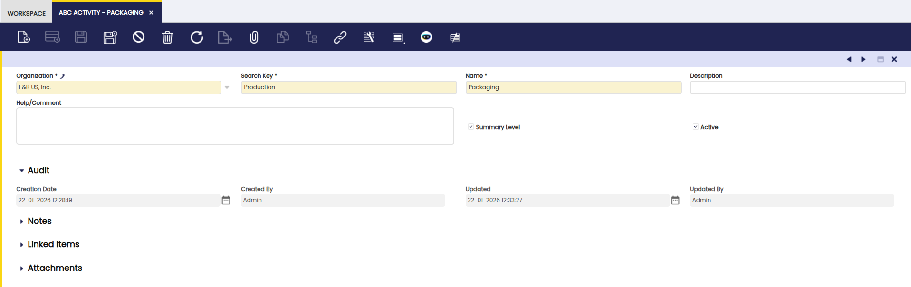

# ABC Activity

:material-menu: `Application` > `Financial Management` > `Accounting` > `Setup` > `ABC Activity`

## Overview

ABC Activity is part of **Etendo's Activity-Based Costing (ABC)** functionality. It is an [**accounting dimension**](general-ledger-configuration.md#dimension-tab) which can be set up for a given general ledger configuration allowing organizations to analyze costs based on the activities that generate them, instead of relying only on traditional accounting dimensions.

In Etendo, an Activity represents a type of work, process, or operation within an organization. Activities can be enabled in a General Ledger configuration and later used in accounting entries to improve **cost analysis**.

!!!note
    Activity and [Cost Center](./cost-center.md) are both analytical accounting dimensions used for cost analysis, but they serve different purposes. Activity tracks costs by *what work was done* (a process or operation), while Cost Center tracks costs by *which department or unit* incurred them. Both dimensions can be used together for more detailed cost breakdowns.

## Prerequisites

Before activities can be selected on transactions, the **Activity dimension must be enabled** in the organization's General Ledger Configuration.

Go to :material-menu: `Application` > `Financial Management` > `Accounting` > `Setup` > `General Ledger Configuration`. Open the [**Dimension**](general-ledger-configuration.md#dimension-tab) tab, add **Activity** as a dimension for the relevant general ledger, and optionally mark it as mandatory if every transaction must include an activity. Save the record. Once saved, the Activity field appears on transaction forms for that organization.

If the Activity field does not appear after completing the step above, a developer may need to perform additional configuration.

!!!info "For Developers"
    Enabling the Activity dimension in the General Ledger Configuration is not enough on its own for the field to appear in transaction windows. A developer must also configure the Activity column in the **Application Dictionary** for each window tab where the field should be visible. This involves setting the column as displayed and, if needed, adding display logic so the field only appears when the Activity dimension is active for the organization's general ledger. After any Application Dictionary changes, a smartbuild must be run to compile and apply the updates to the system.

    For reference, see [How to Add a Field to a Window Tab](../../../../../../developer-guide/etendo-classic/how-to-guides/how-to-add-a-field-to-a-window-tab.md) and [How to Define Display Logic Evaluated at Server Level](../../../../../../developer-guide/etendo-classic/how-to-guides/how-to-define-display-logic-evaluated-at-server-level.md).

## Managing Activities

The **ABC Activity** window allows users to define and manage activities per organization.

Using this window, it is possible to:

- Create **multiple activities** for an organization.

- Define **summary activities** to build a hierarchical structure.

- Group **related activities** to simplify reporting and cost analysis.

This structure helps organizations understand how costs are distributed across different operational areas.

Some fields to note to create as many activities as required:

- **Organization**: Organizational entity within client.
- **Search Key**: A short code used to quickly find this activity in search boxes and dropdowns. For example, enter *ASSEM* for an Assembly activity.
- **Name**: The full name of the activity as it appears in reports and transaction forms. For example, *Assembly* or *Packaging*.
- **Description**: Optional. A brief explanation of what this activity covers, for internal reference.
- **Help/Comment**: Optional. Additional guidance for other users who work with this activity.
- **Summary Level**: When enabled, this activity acts as a parent container to group sub-activities. Summary activities cannot be assigned directly to transactions — only their child activities can.
- **Active**: When checked, this activity is available for selection on transactions. Uncheck it to retire an activity without deleting it — it no longer appears in dropdowns but its historical data is preserved.

## Using Activities in Transactions

Once the Activity dimension is enabled in the General Ledger Configuration and activities are created, the **Activity** field appears in the **Dimensions** section when posting transactions — such as invoices, journal entries, and other accounting documents. Select the applicable activity from the dropdown to tag that transaction for cost tracking purposes.

## Example

A manufacturing company wants to analyze its operational costs in more detail so it defines the following ABC Activities:

- **Production** (Summary Activity)

    - **Assembly**

    - **Packaging**

- **Logistics** (Summary Activity)

    - **Warehousing**

    - **Shipping**

When invoices, expenses, or other accounting entries are posted, users can assign an **Activity** to each entry.

Later, the company can easily report on how much cost was generated by Production versus Logistics, or drill down into specific activities such as Assembly or Shipping.

This approach provides better cost visibility, supports more informed decision-making, and enhances financial analysis within Etendo ERP.

## Viewing Cost Reports by Activity

Once activities are assigned to posted transactions, costs can be filtered and analyzed by activity using the accounting analysis tools:

- [Accounting Transaction Details](../analysis-tools.md#accounting-transaction-details): A detailed list of every ledger entry, filterable by Activity and other dimensions.
- [General Ledger Report](../analysis-tools.md#general-ledger-report): A summary view of posted transactions that supports filtering by accounting dimensions including Activity.

---

This work is a derivative of [ABC Activity](https://wiki.openbravo.com/wiki/ABC_Activity){target="\_blank"} by [Openbravo Wiki](http://wiki.openbravo.com/wiki/Welcome_to_Openbravo){target="\_blank"}, used under [CC BY-SA 2.5 ES](https://creativecommons.org/licenses/by-sa/2.5/es/){target="\_blank"}. This work is licensed under [CC BY-SA 2.5](https://creativecommons.org/licenses/by-sa/2.5/){target="\_blank"} by [Etendo](https://etendo.software){target="\_blank"}.
