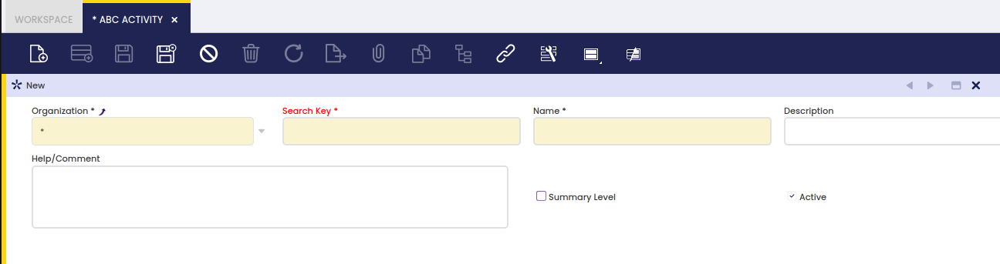

# ABC Activity

:material-menu: `Application` > `Financial Management` > `Accounting` > `Setup` > `ABC Activity`

## Overview

Activity based costing (ABC) is a special costing model that identifies activities in an organization for which managing cost is required.

"*Activity*" is one of the dimensions which can be set up for a given general ledger configuration.

### Activity

ABC Activity window allows the user to create as many activities as required per each organization.

As shown in the screen above, it is possible to define summary activities which support a hierarchical structure or activities within an organization.

---

This work is a derivative of [ABC Activity](https://wiki.openbravo.com/wiki/ABC_Activity){target="\_blank"} by [Openbravo Wiki](http://wiki.openbravo.com/wiki/Welcome_to_Openbravo){target="\_blank"}, used under [CC BY-SA 2.5 ES](https://creativecommons.org/licenses/by-sa/2.5/es/){target="\_blank"}. This work is licensed under [CC BY-SA 2.5](https://creativecommons.org/licenses/by-sa/2.5/){target="\_blank"} by [Etendo](https://etendo.software){target="\_blank"}.