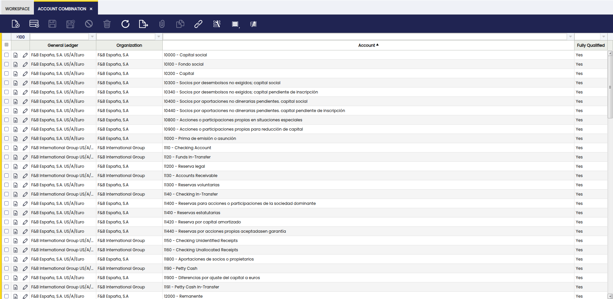
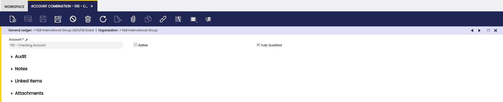

# Account Combination

:material-menu: `Application` > `Financial Management` > `Accounting` > `Setup` > `Account Combination`

## Overview

An account combination represents **a General Ledger account as used by a specific organization**. This window lets you review which GL accounts are available to an organization and see basic details about each account combination.

The main purpose of this window is to **view and manage, all at once, these valid combinations of accounting dimensions** so Etendo knows exactly where and how to post financial transactions.

!!!info
    The user cannot create account combinations directly from this window. They are generated automatically when you create accounts (or subaccounts) in an Account Tree for a General Ledger. To add or edit the underlying accounts, use the [Account Tree](account-tree.md) window.

!!! warning
    The **Account Combination** window allows the user to delete accounts. This action implies that they are removed from this window, but not from the Account Tree window.

## Header

In this window, the user is able to view all account combinations for the selected *General Ledger* and *Organization*, filter and search combinations to find specific accounts quickly.

Fields to note:

- **General Ledger**: the ledger the account belongs to.
- **Organization**: the organization that will use the account.
- **Account**: the account (from the Account Tree) associated with this combination.
- **Active**: whether this account combination is enabled for posting.
- **Fully Qualified**: This checkbox indicates that all required elements for an account combination are present.

!!!note

    - One account in the Account Tree can produce multiple account combinations if the account is used across multiple organizations or ledgers.
    - Account combinations are required for posting: if a needed combination is missing, create or adjust the account in the Account Tree and the combination will be created automatically.
    - Use this window to verify that an organization has the correct GL accounts before posting transactions.

## Example

Let's review an example to understand this functionality better.
Assume a company has the following setup:

- **General Ledger:** F&B International Group US/A/US Dollar  
- **Organizations:**  
    - F&B International Group 1  
    - F&B International Group 2 
- **Account Tree:**  
    - **4100 – Revenue - Product**

When the **Revenue - Product** account is created in the Account Tree, Etendo automatically generates **account combinations** for each organization that uses the ledger:

| General Ledger | Organization | Account | Active |
|---------------|-------------|---------|--------|
| F&B International Group US/A/US Dollar   | F&B International Group 1            | 4100 – Revenue - Product | Yes |
| F&B International Group US/A/US Dollar   | F&B International Group 2      | 4100 – Revenue - Product | Yes |

Each row represents a **different account combination**, even though they reference the same account in the Account Tree.

### Posting a Transaction

When a sales invoice is posted for **F&B International Group 2**, Etendo:

1. Identifies the **Organization** of the transaction (F&B International Group 2)
2. Uses the **F&B International Group US/A/US Dollar** General Ledger
3. Searches for a **fully qualified account combination** that includes:
    - F&B International Group US/A/US Dollar General Ledger
    - F&B International Group 2
    - Revenue - Product account

If the corresponding account combination exists and is active, the transaction is posted successfully.

### Missing Combinations

If the **Revenue - Product** account was not properly defined for **F&B International Group 2** in the Account Tree:

- The required account combination does **not exist**
- The transaction **cannot be posted**
- The user must update the **Account Tree**
- Once corrected, Etendo automatically **creates the missing account combination**

### Why Account Combinations are Important

This example shows how account combinations act as a **bridge** between:

- The account structure (Account Tree)
- The organizational structure
- The posting of financial transactions

By validating account combinations in advance, Etendo ensures that transactions are always posted to the **correct account and organization**, maintaining accuracy and consistency in financial reporting.

As a conclusion, the Account Combination window defines the accounting identity of a transaction. It tells Etendo which account and which analytical dimensions should be used together when posting to the general ledger, ensuring accuracy, consistency, and meaningful financial reporting.

---
This work is a derivative of [Account Combination](https://wiki.openbravo.com/wiki/Account_Combination){target="\_blank"} by [Openbravo Wiki](http://wiki.openbravo.com/wiki/Welcome_to_Openbravo){target="\_blank"}, used under [CC BY-SA 2.5 ES](https://creativecommons.org/licenses/by-sa/2.5/es/){target="\_blank"}. This work is licensed under [CC BY-SA 2.5](https://creativecommons.org/licenses/by-sa/2.5/){target="\_blank"} by [Etendo](https://etendo.software){target="\_blank"}.